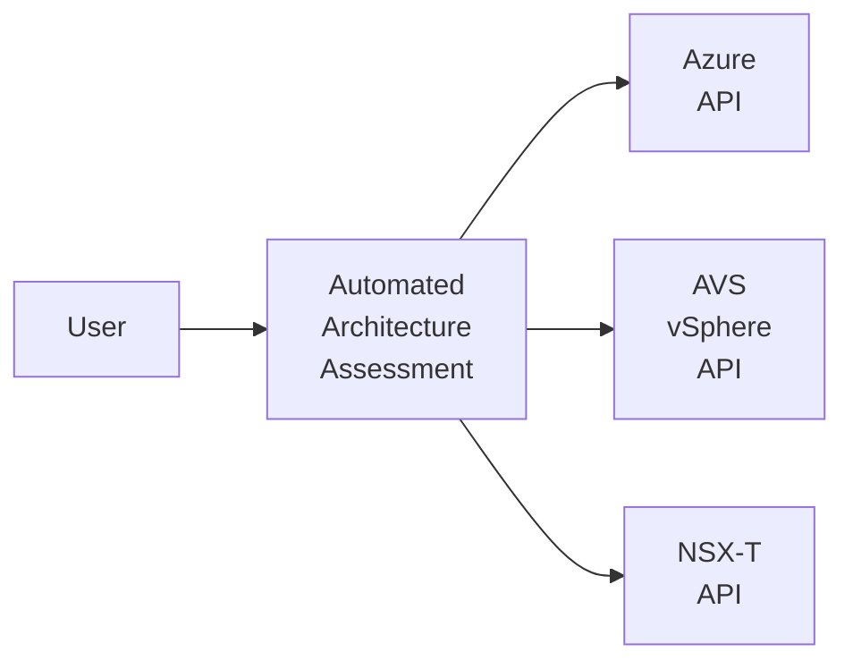

# Automated Architecture Assessment for Azure VMware Solution (AVS)

[Azure VMware Solution (AVS) Landing Zone Accelerator](https://github.com/Azure/Enterprise-Scale-for-AVS) provides comprehensive guidance on deploying an AVS SDDC in an enterprise environment. It provides design considerations and recommendations across following key design areas.

* [Identity](https://learn.microsoft.com/azure/cloud-adoption-framework/scenarios/azure-vmware/eslz-identity-and-access-management)
* [Networking](https://learn.microsoft.com/azure/cloud-adoption-framework/scenarios/azure-vmware/network-get-started)
* [Security, Governance and compliance](https://learn.microsoft.com/azure/cloud-adoption-framework/scenarios/azure-vmware/eslz-security-governance-and-compliance)
* [Managament and monitoring](https://learn.microsoft.com/azure/cloud-adoption-framework/scenarios/azure-vmware/eslz-management-and-monitoring)
* [Business Conitnuity and Disaster recovery](https://learn.microsoft.com/azure/cloud-adoption-framework/scenarios/azure-vmware/eslz-business-continuity-and-disaster-recovery)
* [Automation and DevOps](https://learn.microsoft.com/azure/cloud-adoption-framework/scenarios/azure-vmware/eslz-platform-automation-and-devops)

## Assessing AVS Architecture

Along with scripts for automated deployment for both - [Greenfield](../GreenField/readme.md) and [Brownfield](../../BrownField/readme.md) - scenarios, there are following interactive questionnaires.

* [AVS Landing Zone Assessment Review](https://learn.microsoft.com/assessments/43a1998e-2cb9-403c-b257-dffa8ceafd63/)
* [AVS Well-Architected Framework (WAF) Assessment Review](https://learn.microsoft.com/assessments/2d85e883-bdc4-4854-aaf0-df72c4bcee15/)

These questionnaires are useful to validate the quality of a deployed AVS Architecture against Cloud Adoption Framework (CAF) and Well-Architected Framework (WAF) principles. Both questionnaires provide a quantitative score for current architecture, a set of actionable recommendations and references to improve the current score further.

## Automated Architecture Assessment

Automated Architecture Assessment builds on interactive questionnaires. It uses a script-based approach to assess the current architecture. High-level approach implemented in Automated Architecture Assessment is as shown below.

Automated Architecture Assessment uses specific APIs to evaluate complaince against a design area. APIs are used across following key buidling blocks on an AVS SDDC.

* Azure
* AVS vSphere
* AVS NSX-T

### Benefits
Below are key benefits of using Automated Architecture Assessment.

* Reduced time in gathering quality of an AVS deployment. Because it takes script-based approach, assessment can be completed in few minutes.
* Avoid dependence on manual processes. In an enterprise environment, multiple teams manage different design areas. Script-based approach ensures that all design areas regardless of teams managing them are evaluated.
* Remove cross-organizational boundaries. A typical assessment review needs people/resources from multiple organizations (e.g. Networking, Security, etc.). It may not be possible to have all of them available at the same time which may lead to incomplete assessment. Automated Architecture Assessment removes this barrier.

## Next Steps

Use the guidance below on getting started with next steps.

[Run Automated Architecture Assessment](run.md)