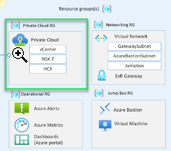

# Private Cloud Design

## Objective

Deploy the required Software Defined Datacentre (SDDC).

[Deploy with Powershell](deploy.ps1)  
[Monitor deployment](deploymentcheck.ps1), the script takes a while to deploy and this makes it easier to monitor and ensure your deployment is continuing as expected.  

## File Variables for advanced options

Most, if not all optional elements will have a variable like *$deploy*Technology, for example *$deployVpn*. These are set of **$false** by default and this is by design for cost optimization and deploying only what is actually needed. Please look for these and change as needed.  

### Private Cloud

1. $deployHCX
1. $deploySRM  
1. $deployVRS
