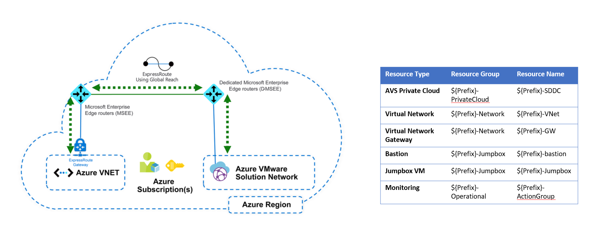

| ARM (Portal Experience)                                      |
| ------------------------------------------------------------ |
|  |

 

# AVS Landing Zone: Single Region Deployment

The following is a reference implementation to deploy an AVS Landing Zone in a single region. This reference implementation is ideal for customers that have started their journey with an Enterprise-Scale foundation implementation and are looking to extend this with an AVS landing zone.

## Prerequisites

To deploy this landing zone, ensure you have followed all the required steps from the [Getting Started](../../GettingStarted.md) section.

## What will be deployed?

This reference implementation is designed in a way to deploy a full AVS Private Cloud and necessary components to allow for feature add-ins, connectivity and monitoring as per operational best practices. The intention is to deploy this into a new subscription to be considered as the AVS landing zone, adhering to the Azure Landing Zone guidance. However, this can also be deployed to an existing subscription if required.

The following components will be deployed:

| **Resource Type**                | **Resource Group**     | **Resource Name**     |
| :------------------------------- | :--------------------- | :-------------------- |
| **AVS Private Cloud**            | ${Prefix}-PrivateCloud | ${Prefix}-SDDC        |
| **Virtual Network**              | ${Prefix}-Network      | ${Prefix}-VNet        |
| **Virtual** **Network  Gateway** | ${Prefix}-Network      | ${Prefix}-GW          |
| **Bastion**                      | ${Prefix}-Jumpbox      | ${Prefix}-bastion     |
| **Jumpbox VM**                   | ${Prefix}-Jumpbox      | ${Prefix}-Jumpbox     |
| **Monitoring**                   | ${Prefix}-Operational  | ${Prefix}-ActionGroup |

###### Note:  The deployment will ask for a "Prefix" which will be used to name all of the deployed resources. The naming of resources is hard coded in the templates, however this can be modified as required prior to deployment.

 

## How to deploy this reference implementation

We have a few options available to deploy this AVS Landing zone:

- [ARM (Portal)](https://portal.azure.com/#create/Microsoft.Template/uri/https%3A%2F%2Fraw.githubusercontent.com%2FAzure%2FEnterprise-Scale-for-AVS%2Fmain%2FAVS-Landing-Zone%2FSingleRegion%2FARM%2FESLZDeploy.deploy.json)
- [ARM (Template)](ARM)
- [Bicep (Template)](Bicep)

 
