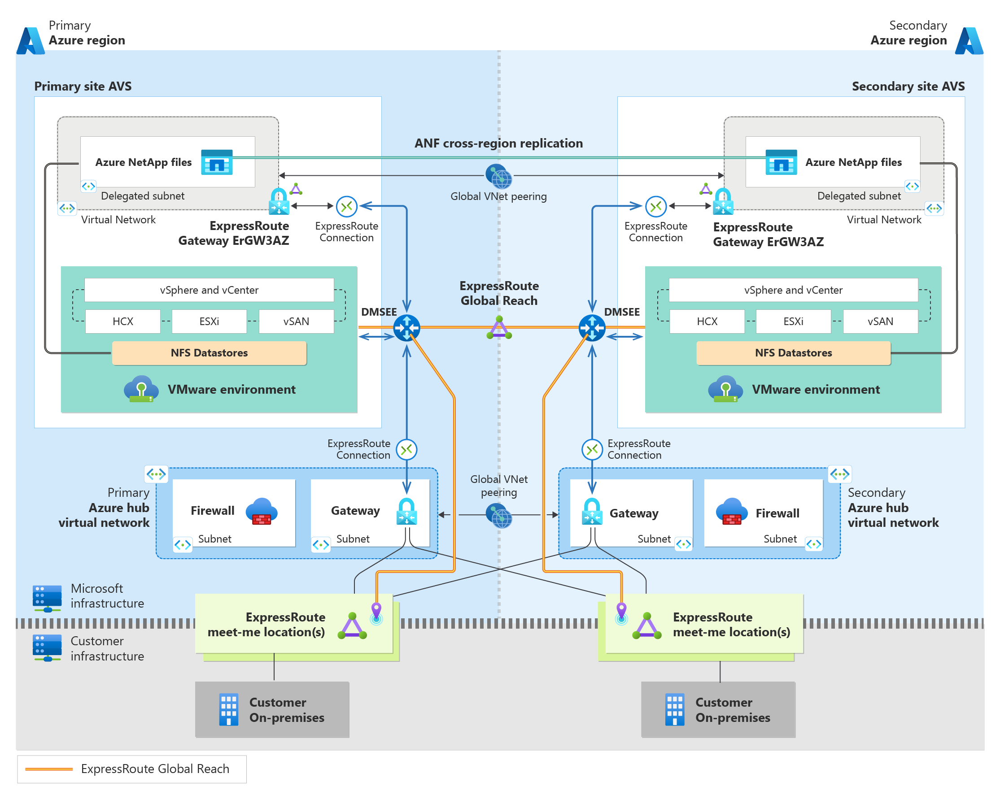

## Steps for Achieving Resiliency in the Azure VMware Solution

### Multi-homed AVS Circuits with cross-region connectivity to Azure

ExpressRoute from on-premises should connect to two meet-me locations. You can add weights to the circuits. They should connect two gateways in separate regions. To test a loss of connectivity to Azure in one region, [disconnect the circuit](https://learn.microsoft.com/en-us/azure/expressroute/expressroute-howto-reset-peering-portal) and test.

#### Optional - Global Reach on-premises environments

You can also force tunnel back to on-premises for a route to Azure regions. This is a longer path, but it can help if you need connectivity back through Azure. You can create a [Global Reach](https://learn.microsoft.com/en-us/azure/expressroute/expressroute-global-reach) connection to the two on-premises circuits. Also make a Global Reach connection to the [AVS environments](../../BrownField/Networking/AVS-to-OnPremises-ExpressRoute-GlobalReach)

### Globally Peered Regional Hubs

Enable Global peering so that each VNET is learned by each ExpressRoute circuit. 

### Connect Primary and Secondary AVS Sites with Global Reach

Connecting both primary and secondary AVS sites using Global Reach, as seen [here](../../BrownField/Networking/AVS-to-AVS-CrossRegion-GlobalReach), will enable replication of your VSAN datastores using a Disaster Recovery tool. If you lose an edge router, the edge router in the secondary region will be learned, providing a path back to Azure and, ultimately, on-premises. 

### Connect AVS to the Primary and Secondary Hub Virtual Networks in Azure
Create connections to Azure Virtual Networks as seen [here](../../BrownField/Networking/AVS-to-VNet-NewVNet) in both the Primary and Secondary AVS sites. The sites should also have connections to Hubs in both the Primary and Secondary regions to create a cross-connection. A direct Expressroute connection to the secondary hub will create an alternate path back to Azure during a disaster. 

To test this scenario, disable the Global Reach connection and validate that you can still access the secondary hub, the AVS environment, and on-premises.  

### Enable cross-region replication with ANF datastores

Enable cross-region replication of your ANF datastores to have a copy of your data. This will also provide ANF datastores to your secondary AVS site. For performance, ANF data stores should be kept in the same region as AVS. In a disaster, failover to the secondary AVS site and ANF datastore. 

### Additional information 

Make sure all the Expressroute Gateways are of zone redundant SKUs. Review the best practices for ExpressRoute Gateways and connections found in the [AVS APRL guidance](https://azure.github.io/Azure-Proactive-Resiliency-Library-v2/azure-specialized-workloads/avs/)

