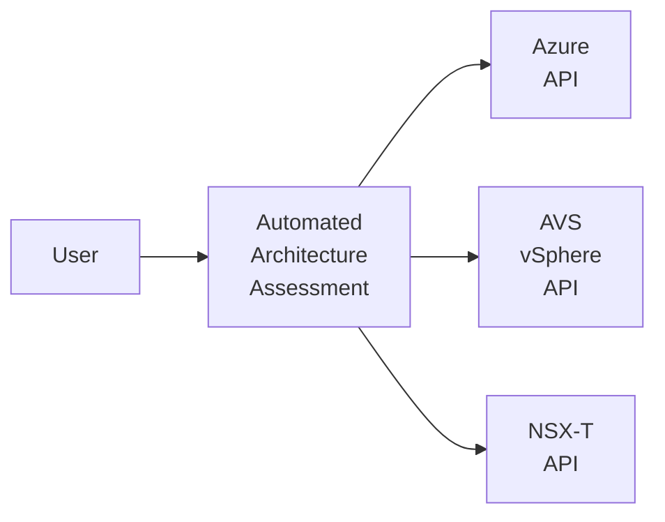

# Automated Architecture Assessment for Azure VMware Solution (AVS)

[Azure VMware Solution (AVS) Landing Zone Accelerator](https://github.com/Azure/Enterprise-Scale-for-AVS) provides comprehensive guidance on deploying an AVS SDDC in an enterprise environment. It provides design considerations and recommendations across following key design areas.

* [Identity](https://learn.microsoft.com/azure/cloud-adoption-framework/scenarios/azure-vmware/eslz-identity-and-access-management)
* [Networking](https://learn.microsoft.com/azure/cloud-adoption-framework/scenarios/azure-vmware/network-get-started)
* [Security, Governance and compliance](https://learn.microsoft.com/azure/cloud-adoption-framework/scenarios/azure-vmware/eslz-security-governance-and-compliance)
* [Managament and monitoring](https://learn.microsoft.com/azure/cloud-adoption-framework/scenarios/azure-vmware/eslz-management-and-monitoring)
* [Business Conitnuity and Disaster recovery](https://learn.microsoft.com/azure/cloud-adoption-framework/scenarios/azure-vmware/eslz-business-continuity-and-disaster-recovery)
* [Automation and DevOps](https://learn.microsoft.com/azure/cloud-adoption-framework/scenarios/azure-vmware/eslz-platform-automation-and-devops)

## Assessing AVS Architecture

Along with scripts for automated deployment for both - [Greenfield](../GreenField/readme.md) and [Brownfield](../../BrownField/readme.md) - scenarios, there are following interactive questionnaires.

* [AVS Landing Zone Assessment Review](https://learn.microsoft.com/assessments/43a1998e-2cb9-403c-b257-dffa8ceafd63/)
* [AVS Well-Architected Framework (WAF) Assessment Review](https://learn.microsoft.com/assessments/2d85e883-bdc4-4854-aaf0-df72c4bcee15/)

These questionnaires are useful to validate the quality of a deployed AVS Architecture against Cloud Adoption Framework (CAF) and Well-Architected Framework (WAF) principles. Both questionnaires provide a quantitative score for current architecture, a set of actionable recommendations and references to improve the current score further.

## Automated Architecture Assessment

Automated Architecture Assessment builds on interactive questionnaires. It uses a script-based approach to assess the current architecture. High-level approach implemented in Automated Architecture Assessment is as shown below.

Automated Architecture Assessment uses specific APIs to evaluate complaince against a design area. APIs are used across following key buidling blocks of an AVS SDDC.

* Azure
* AVS vSphere
* AVS NSX-T

Each builidng block is queried through API calls for evaluating key design areas. Some of important validations perofrmed are as discussed below.

* Azure
    * ExpressRoute Global Reach connectivity
    * AVS SDDC Metric and related alerts
    * ExpressRoute connections and their utilization

* AVS vSphere
    * vSAN encryption status
    * Storage Policies
    * Guest VM Domain Join

* AVS NSX-T
    * Distributed/Gatway Firewall policies
    * DHCP

There are muliple other evaluations across each building block.

### Benefits
Below are key benefits of using Automated Architecture Assessment.

* **Time:** Because of script-based approach, assessment can be completed in few minutes. If needed, it can be used to target only a specific SDDC (e.g. Prod vs. Dev-Test) or a specific design area (e.g. Only Security). 
* **Cost:** Automated Architecture Assessment is a free service. It is offered as a Open-source software. Access to source code for further inspection as well as further enhancement is provided be default.
* **Quality:** The assessment relies on output returned by API calls. This takes out guesswork from a typical dialogue-based interaction. Precise and accurate information can be then discussed with multiple stakeholders - inproving the quality further.

## Next Steps

Use the guidance below on getting started with next steps.

[Run Automated Architecture Assessment](run.md)