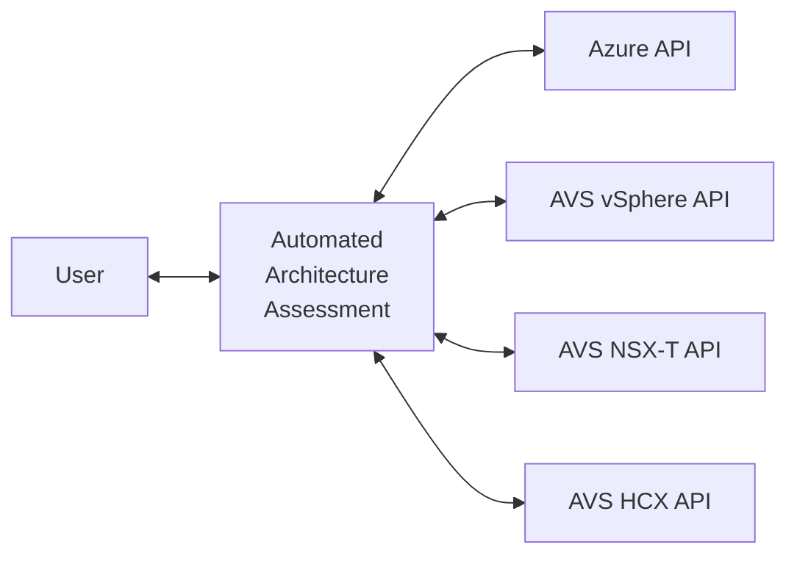

# Automated Architecture Assessment for Azure VMware Solution (AVS)

[Azure VMware Solution (AVS) Landing Zone Accelerator](https://github.com/Azure/Enterprise-Scale-for-AVS) provides comprehensive guidance on deploying an AVS Software Defined Data Center (SDDC) in an enterprise environment. It offers deployment scripts for automated deployment for both - [Greenfield](../GreenField/readme.md) and [Brownfield](../../BrownField/readme.md) - scenarios. It also provides design considerations and recommendations across following key design areas.

* [Identity](https://learn.microsoft.com/azure/cloud-adoption-framework/scenarios/azure-vmware/eslz-identity-and-access-management)
* [Networking](https://learn.microsoft.com/azure/cloud-adoption-framework/scenarios/azure-vmware/network-get-started)
* [Security, Governance and compliance](https://learn.microsoft.com/azure/cloud-adoption-framework/scenarios/azure-vmware/eslz-security-governance-and-compliance)
* [Managament and monitoring](https://learn.microsoft.com/azure/cloud-adoption-framework/scenarios/azure-vmware/eslz-management-and-monitoring)
* [Business Conitnuity and Disaster recovery](https://learn.microsoft.com/azure/cloud-adoption-framework/scenarios/azure-vmware/eslz-business-continuity-and-disaster-recovery)
* [Automation and DevOps](https://learn.microsoft.com/azure/cloud-adoption-framework/scenarios/azure-vmware/eslz-platform-automation-and-devops)

Actionable design considerations and recommendation help in deploying AVS SDDC with high quality architecture.

## Assessing AVS Architecture

Determining whether all the design consideration and recommendation were implemented in an AVS SDDC helps in ascertaining it's architectual quality. Following interactive questionnaires helps to review and validate implementations of design considerations and recommendations.

* [AVS Landing Zone Assessment Review](https://learn.microsoft.com/assessments/43a1998e-2cb9-403c-b257-dffa8ceafd63/)
* [AVS Well-Architected Framework (WAF) Assessment Review](https://learn.microsoft.com/assessments/2d85e883-bdc4-4854-aaf0-df72c4bcee15/)

These questionnaires are useful to validate the quality of a deployed AVS Architecture against [Cloud Adoption Framework (CAF)](https://learn.microsoft.com/azure/cloud-adoption-framework/scenarios/azure-vmware/) and [Well-Architected Framework (WAF)](https://learn.microsoft.com/azure/well-architected/azure-vmware/) principles. Both questionnaires provide a quantitative score for current architecture, a set of actionable recommendations and references to improve the current score further.

## Automated Architecture Assessment

Automated Architecture Assessment is an evolution of the process to ascertain architectural quality of an AVS SDDC. It uses a script-based approach to assess the current architecture. High-level approach implemented in Automated Architecture Assessment is as shown below.

Each of the component is discussed at a high-level below.

* User
    * User clones this repository to get access to documentation as well as scripts.
    * Parameter values are changed to reflect the AVS SDDC to be assessed.
    * User runs the assessment. Assessment produces an output based on API call results.

* Automated Architecture Assessment
    * It is a collection of scripts which queries a specific API endpoint.
    * Outcome of each script is evaluated against a set of recommendation for a given design area.
    * Based on outcome, a list of observations and recommendations is returned to user. 

* Azure API
    * Each AVS SDDC is deployed in an Azure subscription and tenant.
    * A specific Azure `Resource Provider (RP)` is registered in the subscription.
    * This `RP` is queried through [documented APIs](https://learn.microsoft.com/en-us/rest/api/avs/operation-groups).

* AVS vSphere API
    * An AVS SDDC provisioning creates an instance of vSphere Automation API endpoint.
    * Automated Architecture Assessment queries this API endpoint.
    * Depending upon the the vSphere version, API documentation is avaialble [here](
    https://developer.broadcom.com/xapis/vsphere-automation-api/latest/).

* AVS NSX-T API
    * Similar to vSphere API endpoint, NSX-T API endpoint is also auto-provisioned as part of AVS SDDC deployment.
    * Automated Architecture Assesment queries these APIs which are documented [here](https://developer.broadcom.com/xapis/nsx-t-data-center-rest-api/latest/).

* AVS HCX API
    * HCX API endpoint is also auto-provisioned as part of AVS SDDC deployment.
    * Automated Architecture Assessment queries these APIs which are documented at [`https://<REPLACE-WITH-YOUR-vCENTER-SERVER-URL>/hybridity/docs/index.html`](https://<REPLACE-WITH-YOUR-vCENTER-SERVER-URL>/hybridity/docs/index.html)

Querying APIs enable evaluating status of some of the important design areas as discussed below.

* Azure
    * ExpressRoute Global Reach connectivity
    * AVS SDDC Metric and related alerts
    * ExpressRoute connections and their utilization

* AVS vSphere
    * vSAN encryption status
    * Storage Policies
    * Guest VM Domain Join

* AVS NSX-T
    * Distributed/Gatway Firewall policies
    * DHCP

* AVS HCX
    * HCX Network Extension High Availability
    * HCX Stretched VLANs

There are multiple such design area evaluations implemented in Automated Architecture Assessment.

### Benefits
Below are key benefits of using Automated Architecture Assessment.

* **Time:** Because of script-based approach, assessment can be completed in few seconds. If needed, it can be used to target only a specific SDDC (e.g. Prod vs. Dev-Test) or a specific design area (e.g. Only Security). 

* **Cost:** Automated Architecture Assessment is a free service. It is offered as a Open-source software. Access to source code for further inspection as well as enhancements is provided by default.

* **Quality:** The assessment relies on output returned by API calls. This takes out guesswork from a verbal architectual discussion. Precise and accurate outcomes can be then discussed with multiple stakeholders - improving the quality further.

## Next Steps

Use the guidance below on getting started with next steps.

[Run Automated Architecture Assessment](run.md)