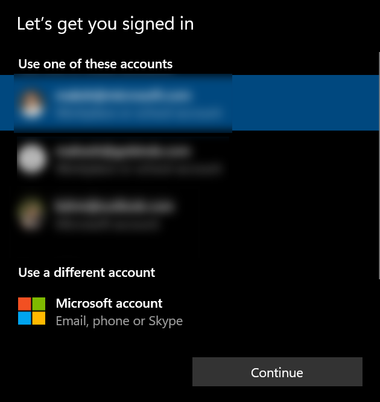
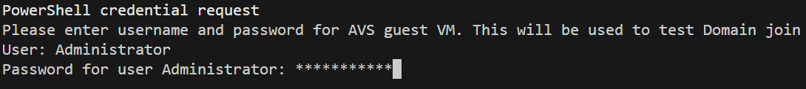
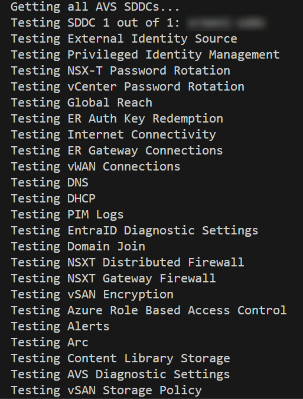
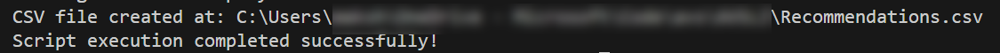
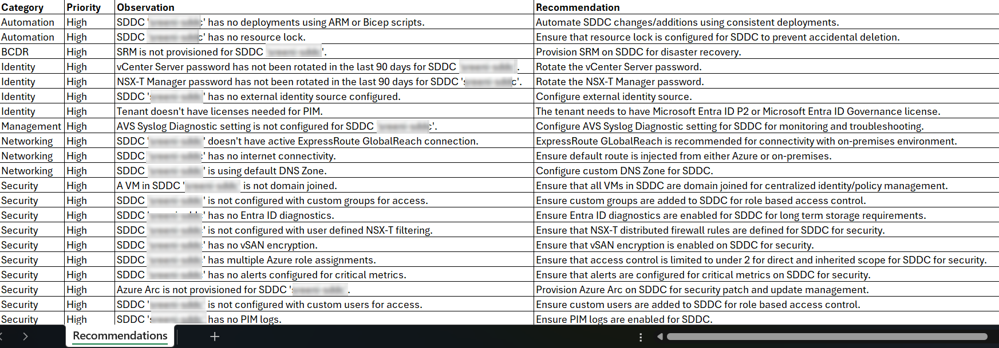

# Run Automated Architecture Assessment

Use the guidance below to run the Automated Architecture Assessment. Refer to [Automated Architecture Assessment](readme.md) to learn more before running the script. 

## Prerequisites

* Azure subscription to be used for Azure VMware Solution private cloud depployment or already running private cloud.
* `Contributor` or higher level access to Azure subscription hosing AVS SDDC.
* Access to a jumpbox which has access to Azure, vSphere and NSX-T APIs. This can run either in Azure or with on-premises environment.
* PowerShell 7 installed on the jumpbox.
* Clone of this repository on the jumpbox.

## Deployment Steps

* Navigate to `BrownField\Auto-assessment\scripts` folder
* Update the parameter values in `Main.ps1` as discussed below.
    * `$tenantId` = `"<Provide your Azure tenant ID.>"`
    * `$subscriptionId` = `"<Provide the Azure subscription ID which has AVS SDDC deployed in it.>"`
    * `$namesofSddcsToTest` = `@("<Provide the names of AVS SDDCs to be assessed in comma-separated format(e.g. @("Prod-SDDC", "Dev-SDDC"). Leave it blank for assessing all the AVS SDDCs in a given subscription.>")`
    * `$designAreasToTest` = `@("<Provide names of design areas to be evaluated in comma-separated format(e.g. "Networking", "Security"). Leave it blank for assessing all design areas.>")`
    
    
* Run the script `Main.ps1` using following option.

### PowerShell

>[!NOTE]
>  Run the assessment script from either a jumpbox in Azure or on an on-premises machine which has network connectivity with Azure, vSphere and NSX-T APIs.
>

```pwsh

cd BrownField\Auto-assessment\scripts

./Main.ps1
```

* A prompt displaying Account to be used for assessment is shown. Select the Account. Account needs to have `Contributor` or higher level of access to AVS SDDC.

    

* If assessment is run for `Security` or `all` desgin areas then another prompt asking for AVS guest VM credentials is displayed. These credentials are used for tests like validating if a VM is domain joined or not.

    

* Assessent will run displaying the progess on console

    

* When the assessment is successfully completed, path to results in a CSV file is displayed.

    

## Post-execution Steps

* Open the CSV file from the Path shown after successful completion of the assessment.

    

* Assess the recommendation against each observation. Use Reference link provided as part of the assessment to learn more and implement the recommendation 

## Next Steps

[Implement recommendations](../../BrownField/readme.md)
