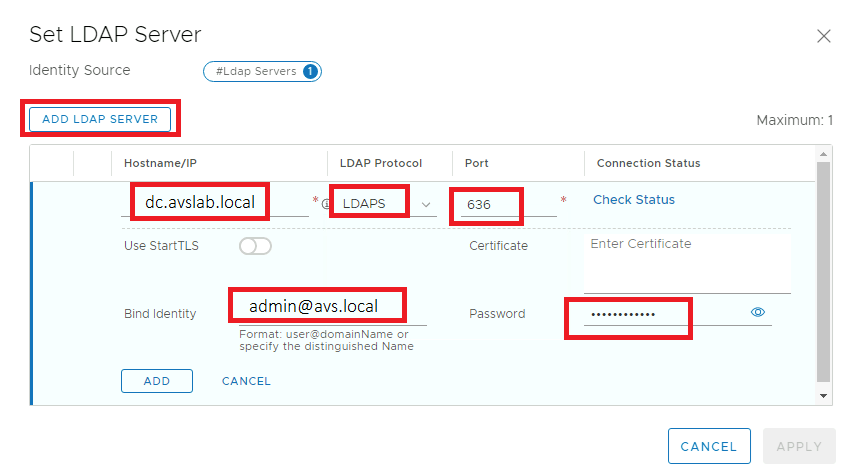
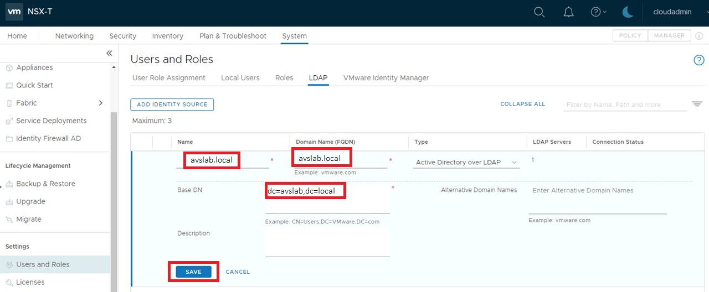
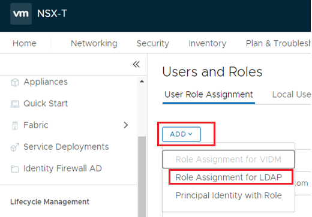
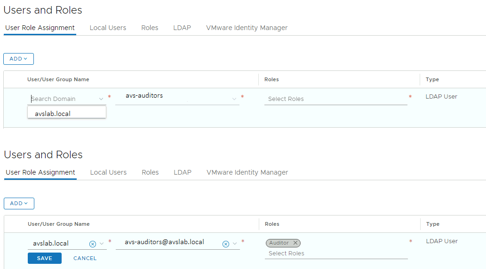
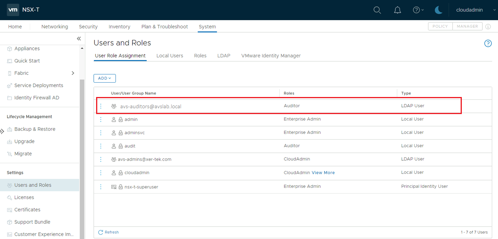

# Configure external identity source for NSX-T

In this how-to, you learn how to:

> [!div class="checklist"]
> * Add Active Directory over LDAPS in NSX-T
> * Assign NSX-T Roles to external identity

## Prerequisites

- Connectivity from your Active Directory network to your AVS private cloud must be operational.

- If you require AD authentication with LDAPS:

    - You will need access to the Active Directory Domain Controller(s) with Administrator permissions
    - Your Active Directory Domain Controller(s) must have LDAPS enabled and should be using a valid certificate. The certificate could be issued by an [Active Directory Certificate Services Certificate Authority (CA)](https://social.technet.microsoft.com/wiki/contents/articles/2980.ldap-over-ssl-ldaps-certificate.aspx) or [third-party CA](https://docs.microsoft.com/troubleshoot/windows-server/identity/enable-ldap-over-ssl-3rd-certification-authority). **Note**: Self-sign certificates are not recommended for production environments.  

- Ensure AVS has DNS resolution configured to your on-premises AD. Enable DNS Forwarder from Azure portal. See [Configure NSX-T DNS for resolution to your Active Directory Domain](/BrownField/Identity/configure-identity-source-vcenter.md/#configuring-nsx-t-dns-for-resolution-to-your-active-directory-domain) and [Configure DNS forwarder for Azure VMware Solution](https://docs.microsoft.com/azure/azure-vmware/configure-dns-azure-vmware-solution) for  further information.

>[!NOTE]
>For further information about LDAPS and certificate issuance, consult with your security or identity management team.

## Add Active Directory as LDAPS Identity Source

1. Sign-in to NSX-T and Navigate to **System > Users and Roles > LDAP**.
1. Click on the **Add Identity Source**.
1. Enter a **name** for the identity source. For example, **avslab.local**. 
1. Enter a **domain name**. This must correspond to the domain name of your Active Directory server, if using Active Directory. For example, **avslab.local**. 
1. Select the type **Active Directory over LDAP**, if using Active Directory.
1. Enter the  **Base DN**. Base DN is the starting point that an LDAP server uses when searching for users authentication within an Active Directory domain. For example: **DC=avslab,DC=local**. 

    >[!NOTE]
    >All of the user and group entries you intend to use to control access to NSX-T Data Center must be contained within the LDAP directory tree rooted at the specified Base DN. If the Base DN is set to something too specific, such as an Organizational Unit deeper in your LDAP tree, NSX may not be able to find the entries it needs to locate users and determine group membership. Selecting a broad Base DN is a best practice if you are unsure.
1. After filling in the required fields the you can click **Set** to configure LDAP servers. **One LDAP server is supported for each domain.**
   | **Field** | **Value** |
   | --- | --- |
   | **Hostname/IP**  | The hostname or IP address of your LDAP server. For example, **dc.avslab.local**.  |
   | **LDAP Protocol** | Select **LDAPS** (LDAP is unsecured).  |
   | **Port**  | The default port is populated based on the selected protocol 636 for LDAPS and 389 for LDAP. If your LDAP server is running on a non-standard port, you can edit this text box to give the port number. |
   | **Connection Status**  | After filling in the mandatory text boxes, including the LDAP server information, you can click Connection Status to test the connection. |
   | **Use StartTLS**  |  If selected, the LDAPv3 StartTLS extension is used to upgrade the connection to use encryption. To determine if you should use this option, consult your LDAP server administrator. This option can only be used if LDAP protocol is selected..  |
   | **Certificate**  | If you are using LDAPS or LDAP + StartTLS, this text box should contain the PEM-encoded X.509 certificate of the server. If you leave this text box blank and click the **Check Status** link, NSX connects to the LDAP server. NSX then retrieves the LDAP server's certificate, and asks if you want to trust that certificate. If you have verified that the certificate is correct, click **OK**, and the certificate text box will be populated with the retrieved certificate.  |
   | **Bind Identity**  | The format is user@domainName, or you can specify the distinguished name. For Active Directory, you can use either the userPrincipalName (user@domainName) or the distinguished name. For OpenLDAP, you must supply a distinguished name. This text box is required unless your LDAP server supports anonymous bind, then it is optional. Consult your LDAP server administrator if you are not sure. |
   | **Password**  | Enter a password for the LDAP server. This text box is required unless your LDAP server supports anonymous bind, then it is optional. Consult your LDAP server administrator  |

1. Click **Add**.
  
  

1. Click **Save** to complete the changes.
  
## Assign additional NSX-T Roles to Active Directory Identities
Once you added an external identity you can assign NSX-T Roles to Active Directory security groups based on your organization's security controls.

1. Sign-in to NSX-T and Navigate to **System > Users and Roles**
1. Select Add > **Role Assignment for LDAP**. 
    
    1. Select a **domain**.
    1. Enter the first few characters of the user's name, login ID, or a group name to search the LDAP directory, then select a user or group from the list that appears.
    1. Select a **Role**. 
    1. Click **Save**.
    
1. Verify the permission assignment was added under **Users and Roles**.

1. Users should now be able to sign in to NSX-T using their Active Directory credentials.

## Next steps

Now that you've learned about how to configure LDAP and LDAPS, you can learn more about:

- [How to configure storage policy](configure-storage-policy.md) - Each VM deployed to a vSAN datastore is assigned at least one VM storage policy. You can assign a VM storage policy in an initial deployment of a VM or when you do other VM operations, such as cloning or migrating.

- [Azure VMware Solution identity concepts](concepts-identity.md) - Use vCenter Server to manage virtual machine (VM) workloads and NSX-T Manager to manage and extend the private cloud. Access and identity management use the CloudAdmin role for vCenter Server and restricted administrator rights for NSX-T Manager. 

