# Configure external identity source for vCenter Server

>[!NOTE]
>Run commands are executed one at a time in the order submitted.

In this how-to, you learn how to:

> [!div class="checklist"]
> * Export the certificate for LDAPS authentication
> * Add Active Directory over LDAP, with or without SSL
> * Add existing AD group to cloudadmin group
> * List all existing external identity sources integrated with vCenter Server SSO
> * Assign vCenter Server Roles to external identity
> * Remove AD group from the cloudadmin role
> * Remove existing external identity sources

## Prerequisites/Steps

- Established connectivity from your Active Directory network to your private cloud.

- If you require AD authentication with LDAPS:

    - You will need access to the Active Directory Domain Controller(s) with Administrator permissions
    - You will to verify your Active Directory Domain Controller(s) have LDAPS enabled and a valid certificate. The certificate could be issued by an [Active Directory Certificate Services Certificate Authority (CA)](https://social.technet.microsoft.com/wiki/contents/articles/2980.ldap-over-ssl-ldaps-certificate.aspx) or [third-party CA](https://docs.microsoft.com/troubleshoot/windows-server/identity/enable-ldap-over-ssl-3rd-certification-authority). **Note**: Self-sign certificates are not recommended for production environments.  
    - [Export the certificate for LDAPS authentication](#export-the-certificate-for-ldaps-authentication) and upload it to an Azure Storage account as blob storage. Then, you'll need to [grant access to Azure Storage resources using shared access signature (SAS)](../storage/common/storage-sas-overview.md).  

- Ensure AVS has DNS resolution configured to your on-premises AD. Enable DNS Forwarder from Azure portal. See [Configure DNS forwarder for Azure VMware Solution](https://docs.microsoft.com/azure/azure-vmware/configure-dns-azure-vmware-solution) for further information.
- In the DNS service tab, ensure there is a DNS Service similar to the image below[ This is sample image]

>[!NOTE]
>For further information about LDAPS and certificate issuance, consult with your security or identity management team.

## Export the certificate for LDAPS authentication

First, verify that the certificate used for LDAPS is valid.

1. Sign in to a domain controller with administrator permissions where LDAPS is enabled.

1. Open the **Run command**, then type **mmc** and click the **OK** button.
   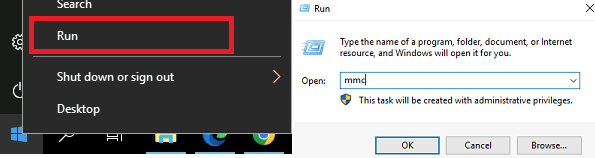
 
1. Click the **File** menu option then **Add/Remove Snap-in**.
    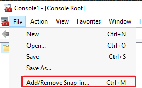
   
1. Select the **Certificates** in the list of Snap-ins and click in the **Add>** button.
    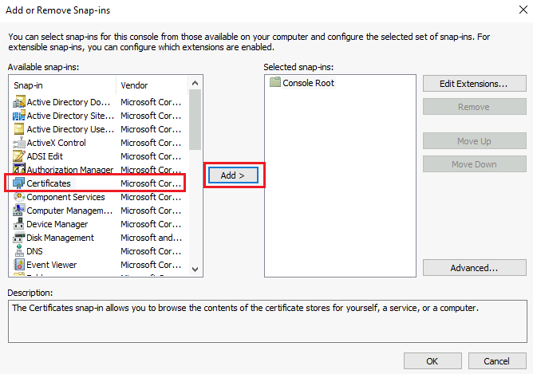

1. In the **Certificates snap-in** window, select **Computer account** then click  **Next**.
    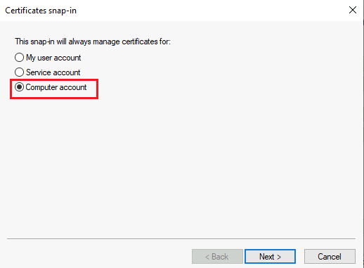

1. Keep the first option selected **Local computer...** , and click  **Finish** then **OK**.
   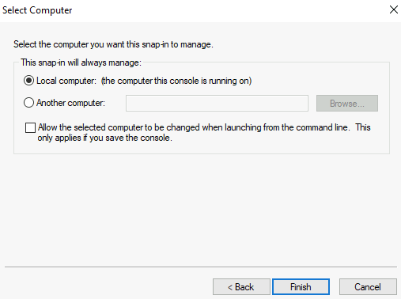
    
1. Expand the **Personal** folder under the **Certificates (Local Computer)** management console and select the **Certificates** folder to list the installed certificates.
   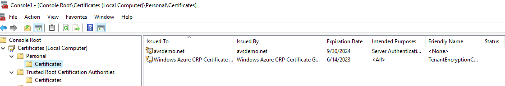
    
1. Double click on the certificate for LDAPS purposes. The **Certificate** General properties will display. Ensure the certificate date **Valid from** and **to** is current and the certificate has a **private key** that correspond to the certificate.
   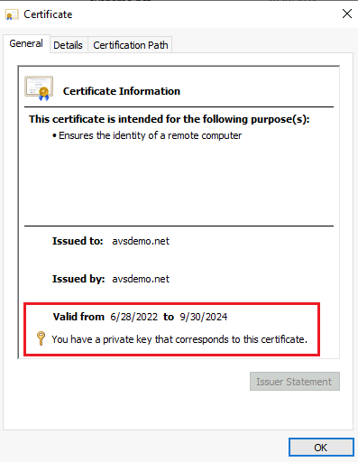

1. On the same windows, click on the **Certification Path** tab and verify the **Certification path** is valid, which it should include the certificate chain of root CA and optionally intermediate certificates and the **Certificate Status** is OK. Close the window.
   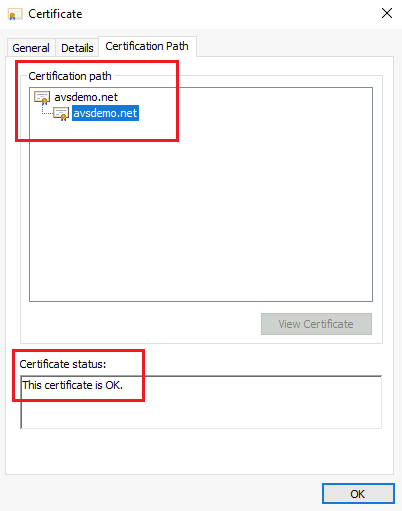

Now proceed to export the certificate.

1. Right click on the LDAPS certificate and click on **All Tasks** > **Export**. The Certificate Export Wizard will prompt then click on **Next** button.  
   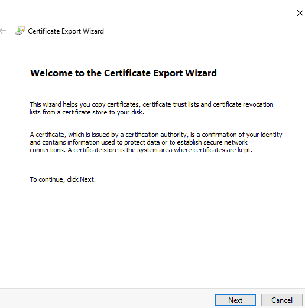

1. In the **Export Private Key** section, select the 2nd option, **No, do not export the private key** and click on the **Next** button.
   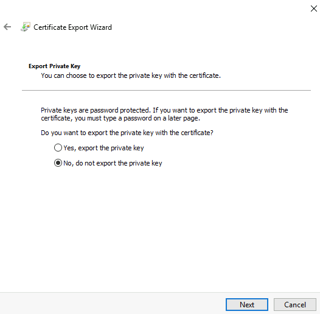

1. In the **Export File Format** section, select the 2nd option, **Base-64 encoded X.509(.CER)** and click on the **Next** button.
   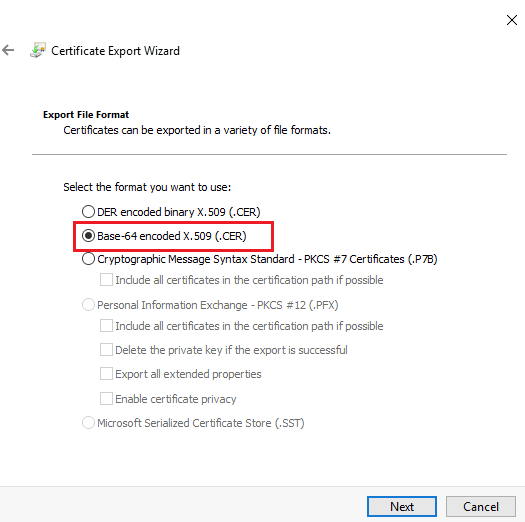

1. In the **File to Export** section, click on the **Browse...** button and select a folder location where to export the certificate, enter a name click on the **Save** button.
   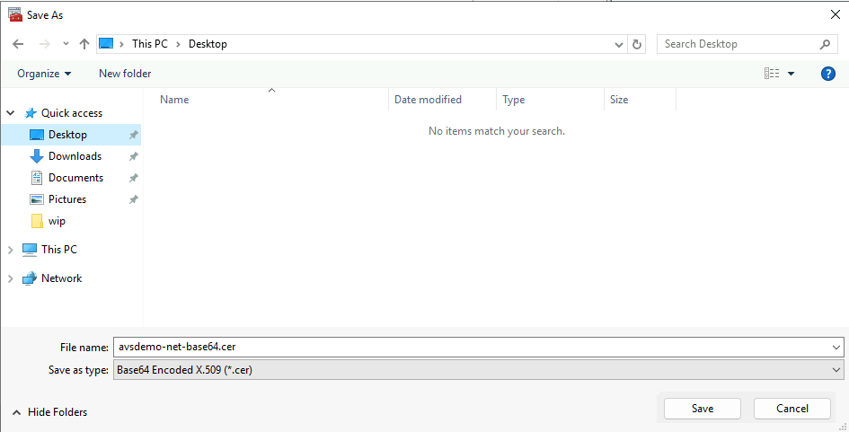

>[!NOTE]
>If more than one domain controller is LDAPS enabled, repeat the export procedure in the additional domain controller(s) to also export the corresponding certificate(s). Be aware that you can only reference two LDAPS server in the `New-LDAPSIdentitySource` Run Command. If the certificate is a wildcard certificate, for example ***.avsdemo.net** you only need to export the certificate from one of the domain controllers.

Now you can continue with the next step [Add Active Directory over LDAP with SSL](#add-active-directory-over-ldap-with-ssl).

## Configuring NSX-T DNS
DNS Zone Configuration

In the DNS Zone tab, click add
Under Type, select FQDN zone
Fill in the remaining fields
DNS zone name - User friendly name
Domain - FQDN that the customer would like to resolve
DNS server IP - DNS Servers that would be used to resolve the domain FQDN
Source IP - Can leave blank
Click OK to create the DNS Zone.

DNS Service Configuration

After the DNS Zone has been created (may take a few minutes), navigate to the DNS Service tab
Click Edit.
From the FQDN Zones drop down, select the FQDN Zone that was created in the previous step.
Ensure the default DNS Zone is selected, similar to the photo below.
Click OK to configure the DNS Service.

## Add Active Directory over LDAP with SSL

You'll run the `New-LDAPSIdentitySource` cmdlet to add an AD over LDAP with SSL as an external identity source to use with SSO into vCenter Server. 

1. Now that you have exported the certificate (.cer) to an Azure Storage account as blob storage, [grant access to Azure Storage resources using shared access signature (SAS)](../storage/common/storage-sas-overview.md). If multiple certificates are required, upload each certificate individually.  

1. For each certificate, [Grant access to Azure Storage resources using shared access signature (SAS)](../storage/common/storage-sas-overview.md). These SAS strings are supplied to the cmdlet as a parameter.

1. An alternative method for consolidating certificates is saving the certificate chains in a single file as mentioned in [this VMware KB article](https://kb.vmware.com/s/article/2041378).

   >[!IMPORTANT]
   >Make sure to copy each SAS URL string(s), because they will no longer be available once you leave the page.  
   
1. Select **Run command** > **Packages** > **New-LDAPSIdentitySource**.

1. Provide the required values or change the default values, and then select **Run**.

   | **Field** | **Value** |
   | --- | --- |
   | **GroupName**  | The group in the external identity source that gives the cloudadmin access. For example, **avs-admins**.  |
   | **CertificateSAS** | Path to SAS strings with the certificates for authentication to the AD source. If you're using multiple certificates, separate each SAS string with a comma. For example, **pathtocert1,pathtocert2**.  |
   | **Credential**  | The domain username and password used for authentication with the AD source (not cloudadmin). The user must be in the **username@avslab.local** format. |
   | **BaseDNGroups**  | Where to look for groups, for example, **CN=group1, DC=avsldap,DC=local**. Base DN is needed to use LDAP Authentication.  |
   | **BaseDNUsers**  |  Where to look for valid users, for example, **CN=users,DC=avsldap,DC=local**.  Base DN is needed to use LDAP Authentication.  |
   | **PrimaryUrl**  | Primary URL of the external identity source, for example, **ldaps://yourserver.avslab.local.:636**.  |
   | **SecondaryURL**  | Secondary fall-back URL if there's primary failure. For example, **ldaps://yourbackupldapserver.avslab.local.:636**. |
   | **DomainAlias**  | For Active Directory identity sources, the domain's NetBIOS name. Add the NetBIOS name of the AD domain as an alias of the identity source. Typically the **avsldap\** format.    |
   | **DomainName**  | The FQDN of the domain, for example **avslab.local**.  |
   | **Name**  | User-friendly name of the external identity source, for example, **avslab.local**. This is how it will be displayed in vCenter. |
   | **Retain up to**  | Retention period of the cmdlet output. The default value is 60 days.   |
   | **Specify name for execution**  | Alphanumeric name, for example, **addexternalIdentity**.  |
   | **Timeout**  |  The period after which a cmdlet exits if taking too long to finish.  |

1. Check **Notifications** or the **Run Execution Status** pane to see the progress and successful completion.

## Add Active Directory over LDAP

>[!NOTE]
>LDAP is less secure, instead, use the [Add Active Directory over LDAP with SSL](#add-active-directory-over-ldap-with-ssl) option.

You'll run the `New-LDAPIdentitySource` cmdlet to add AD over LDAP as an external identity source to use with SSO into vCenter Server. 

1. Select **Run command** > **Packages** > **New-LDAPIdentitySource**.

1. Provide the required values or change the default values, and then select **Run**.
   
   | **Field** | **Value** |
   | --- | --- |
   | **Name**  | User-friendly name of the external identity source, for example, **avslab.local**. This is how it will be displayed in vCenter.  |
   | **DomainName**  | The FQDN of the domain, for example **avslab.local**.  |
   | **DomainAlias**  | For Active Directory identity sources, the domain's NetBIOS name. Add the NetBIOS name of the AD domain as an alias of the identity source. Typically the **avsldap\** format.      |
   | **PrimaryUrl**  | Primary URL of the external identity source, for example, **ldap://yourserver.avslab.local:389**.  |
   | **SecondaryURL**  | Secondary fall-back URL if there's primary failure.  |
   | **BaseDNUsers**  |  Where to look for valid users, for example, **CN=users,DC=avsldap,DC=local**.  Base DN is needed to use LDAP Authentication.  |
   | **BaseDNGroups**  | Where to look for groups, for example, **CN=group1, DC=avsldap,DC=local**. Base DN is needed to use LDAP Authentication.  |
   | **Credential**  | The domain username and password used for authentication with the AD source (not cloudadmin). The user must be in the **username@avslab.local** format.  |
   | **GroupName**  | The group to give cloud admin access in your external identity source, for example, **avs-admins**.  |
   | **Retain up to**  | Retention period of the cmdlet output. The default value is 60 days.   |
   | **Specify name for execution**  | Alphanumeric name, for example, **addexternalIdentity**.  |
   | **Timeout**  |  The period after which a cmdlet exits if taking too long to finish.  |

1. Check **Notifications** or the **Run Execution Status** pane to see the progress.

## Add existing AD group to cloudadmin group

You'll run the `Add-GroupToCloudAdmins` cmdlet to add an existing AD group to cloudadmin group. The users in this group have privileges equal to the cloudadmin (cloudadmin@vsphere.local) role defined in vCenter Server SSO.

1. Select **Run command** > **Packages** > **Add-GroupToCloudAdmins**.

1. Provide the required values or change the default values, and then select **Run**.

   | **Field** | **Value** |
   | --- | --- |
   | **GroupName**  | Name of the group to add, for example, **VcAdminGroup**.  |
   | **Retain up to**  | Retention period of the cmdlet output. The default value is 60 days.   |
   | **Specify name for execution**  | Alphanumeric name, for example, **addADgroup**.  |
   | **Timeout**  |  The period after which a cmdlet exits if taking too long to finish.  |

1. Check **Notifications** or the **Run Execution Status** pane to see the progress.

## List external identity

You'll run the `Get-ExternalIdentitySources` cmdlet to list all external identity sources already integrated with vCenter Server SSO.

1. Sign in to the [Azure portal](https://portal.azure.com).

1. Select **Run command** > **Packages** > **Get-ExternalIdentitySources**.

   :::image type="content" source="media/run-command/run-command-overview.png" alt-text="Screenshot showing how to access the run commands available." lightbox="media/run-command/run-command-overview.png":::

1. Provide the required values or change the default values, and then select **Run**.

   :::image type="content" source="media/run-command/run-command-get-external-identity-sources.png" alt-text="Screenshot showing how to list external identity source. ":::
   
   | **Field** | **Value** |
   | --- | --- |
   | **Retain up to**  |Retention period of the cmdlet output. The default value is 60 days.   |
   | **Specify name for execution**  | Alphanumeric name, for example, **getExternalIdentity**.  |
   | **Timeout**  |  The period after which a cmdlet exits if taking too long to finish.  |

1. Check **Notifications** or the **Run Execution Status** pane to see the progress.
    
    :::image type="content" source="media/run-command/run-packages-execution-command-status.png" alt-text="Screenshot showing how to check the run commands notification or status." lightbox="media/run-command/run-packages-execution-command-status.png":::

## Assign additional vCenter Server Roles to Active Directory Identities
Once you added an external identity over LDAP or LDAPS you can assign vCenter Server Roles to Active Directory security groups based on your organization's security controls.

1. After you sign in to vCenter Server as a cloud admin role. You can select an item from the inventory click ACTIONS menu and select Add Permission.
   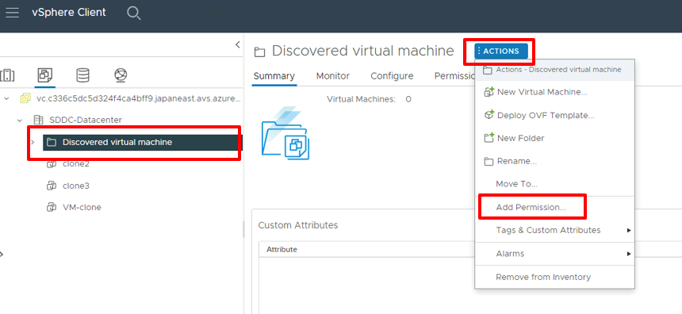

1. In the Add Permission prompt:
    1. *Domain*. Select the Active Directory that was added previously.
    1. *User/Group*. Enter the name of the desired user or group to find then select once is found.
    1. *Role*. Select the desired role to assign.
    1. *Propagate to children*. Optionally select the checkbox if permissions should be propagated down to children resources.
    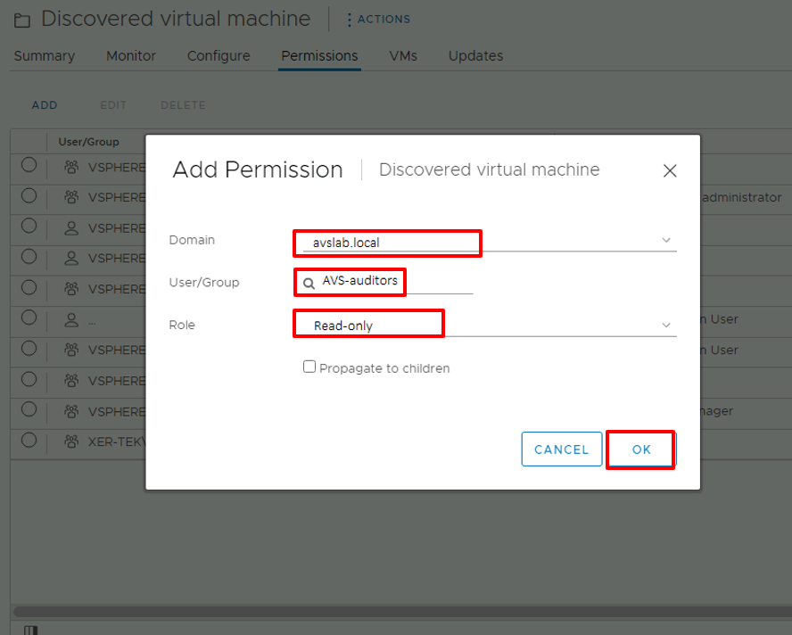
1. Switch to the Permissions tab and verify the permission assignment was added.
    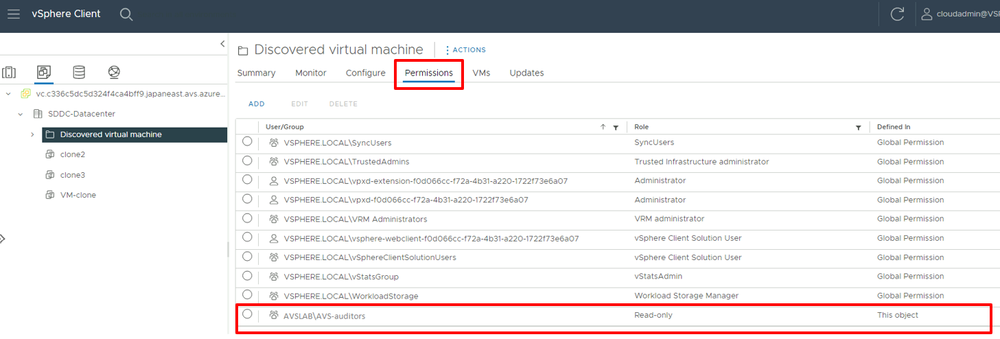
1. Users should now be able to sign in to vCenter Server using their Active Directory credentials.
## Remove AD group from the cloudadmin role

You'll run the `Remove-GroupFromCloudAdmins` cmdlet to remove a specified AD group from the cloudadmin role. 

1. Select **Run command** > **Packages** > **Remove-GroupFromCloudAdmins**.

1. Provide the required values or change the default values, and then select **Run**.

   | **Field** | **Value** |
   | --- | --- |
   | **GroupName**  | Name of the group to remove, for example, **VcAdminGroup**.  |
   | **Retain up to**  | Retention period of the cmdlet output. The default value is 60 days.   |
   | **Specify name for execution**  | Alphanumeric name, for example, **removeADgroup**.  |
   | **Timeout**  |  The period after which a cmdlet exits if taking too long to finish.  |

1. Check **Notifications** or the **Run Execution Status** pane to see the progress.

## Remove existing external identity sources

You'll run the `Remove-ExternalIdentitySources` cmdlet to remove all existing external identity sources in bulk. 

1. Select **Run command** > **Packages** > **Remove-ExternalIdentitySources**.

1. Provide the required values or change the default values, and then select **Run**.

   | **Field** | **Value** |
   | --- | --- |
   | **Retain up to**  | Retention period of the cmdlet output. The default value is 60 days.   |
   | **Specify name for execution**  | Alphanumeric name, for example, **remove_externalIdentity**.  |
   | **Timeout**  |  The period after which a cmdlet exits if taking too long to finish.  |

1. Check **Notifications** or the **Run Execution Status** pane to see the progress.

## Next steps

Now that you've learned about how to configure LDAP and LDAPS, you can learn more about:

- [How to configure storage policy](configure-storage-policy.md) - Each VM deployed to a vSAN datastore is assigned at least one VM storage policy. You can assign a VM storage policy in an initial deployment of a VM or when you do other VM operations, such as cloning or migrating.

- [Azure VMware Solution identity concepts](concepts-identity.md) - Use vCenter Server to manage virtual machine (VM) workloads and NSX-T Manager to manage and extend the private cloud. Access and identity management use the CloudAdmin role for vCenter Server and restricted administrator rights for NSX-T Manager. 

