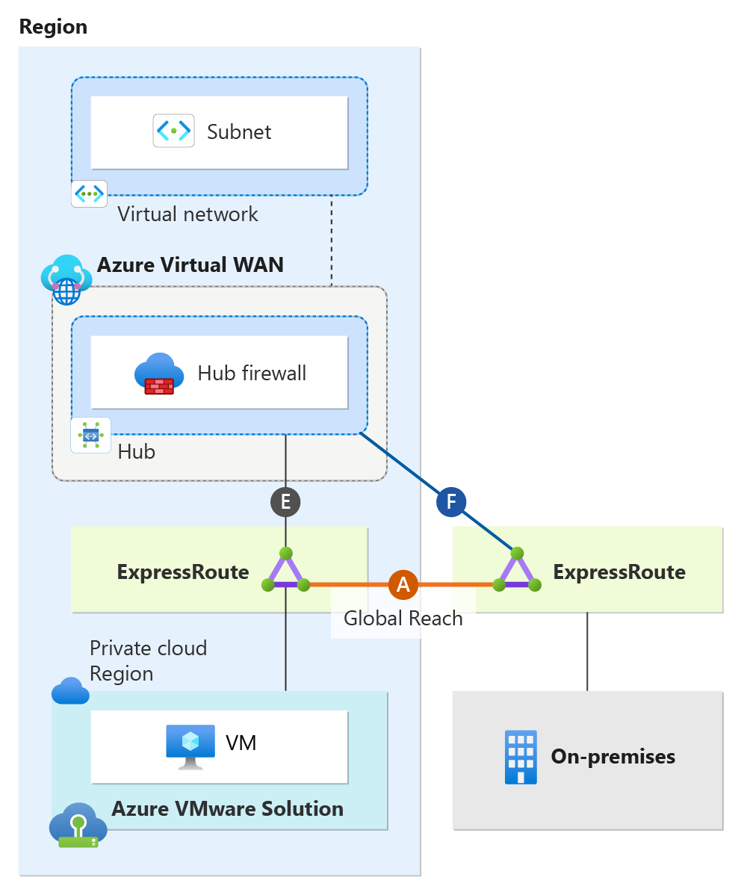
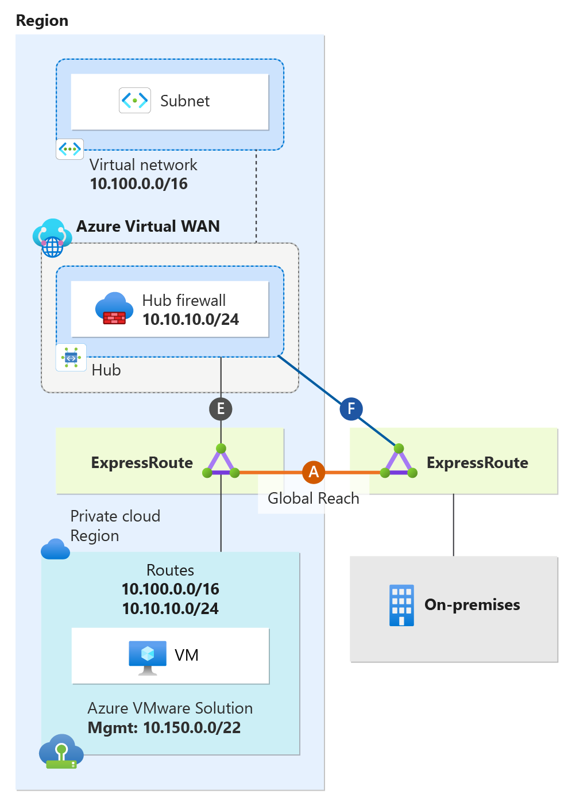
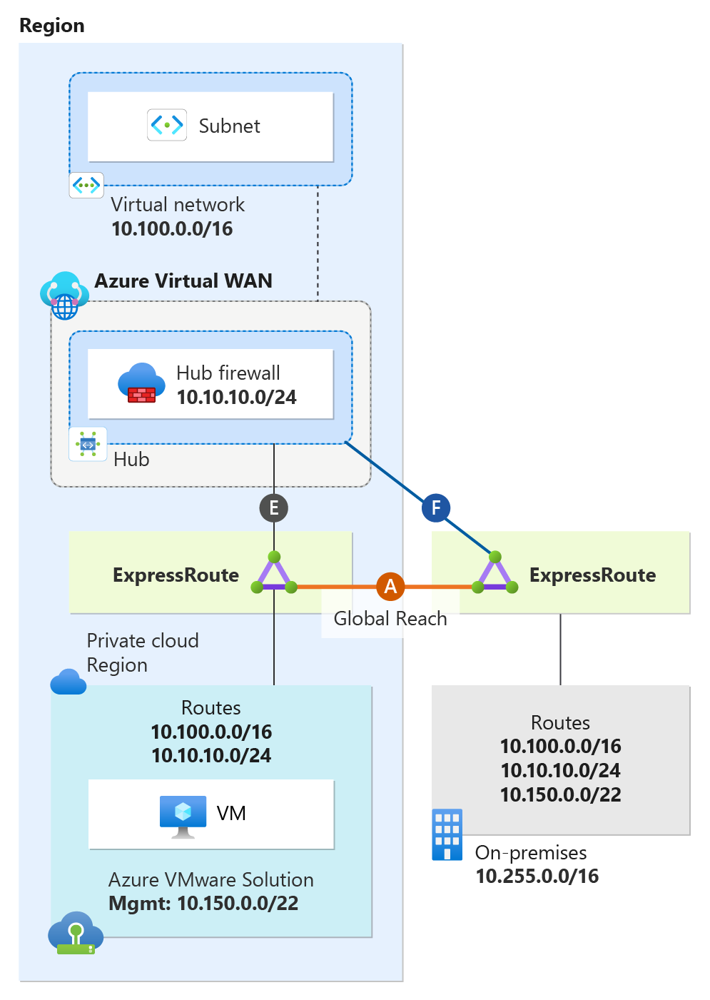
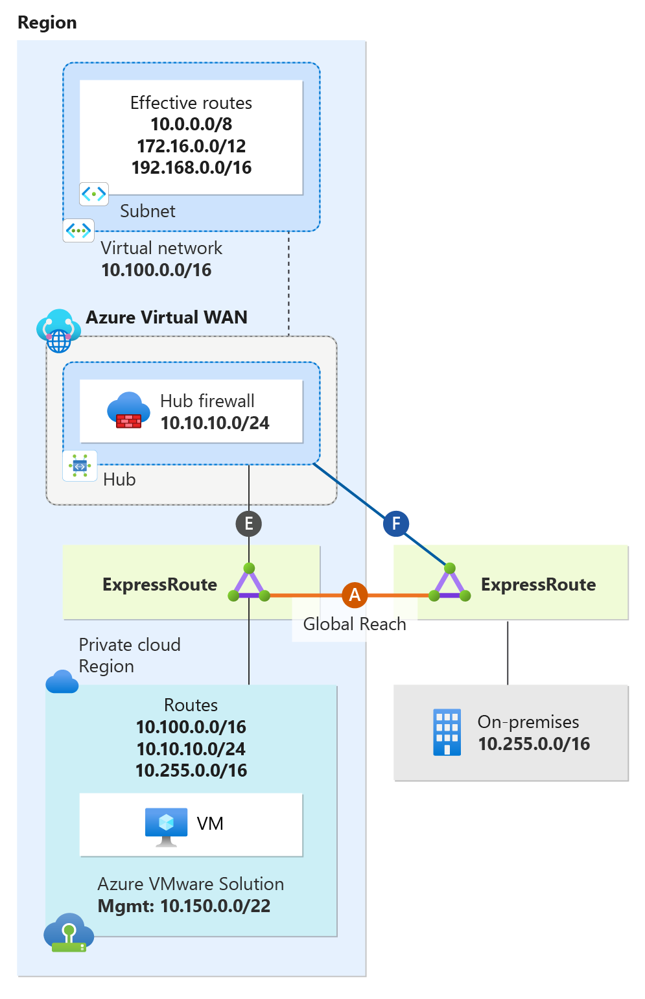
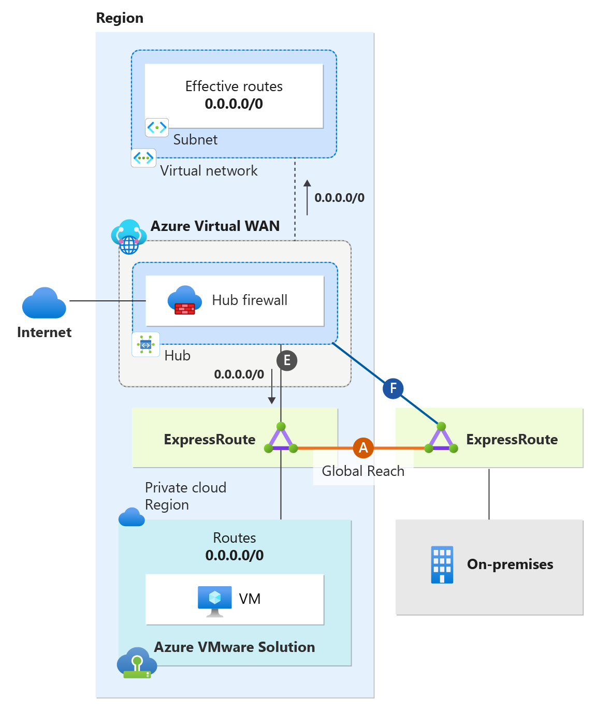

# Single-region deployment using Secure Virtual WAN Hub with Routing-Intent

This article describes the best practices for connectivity, traffic flows, and high availability of single-region Azure VMware Solution when using Azure Secure Virtual WAN with Routing Intent. You will learn the design details of using Secure Virtual WAN with Routing-Intent, when you use Global Reach. This article breaks down Virtual WAN with Routing Intent topology from the perspective of an Azure VMware Solution private cloud, on-premises sites, and Azure native. The implementation and configuration of Secure Virtual WAN with Routing Intent are beyond the scope and are not discussed in this document.

>[!NOTE]
>  When configuring Azure VMware Solution with Secure Virtual WAN Hubs, ensure optimal routing results on the hub by setting the Hub Routing Preference option to "AS Path." - see [Virtual hub routing preference](/azure/virtual-wan/about-virtual-hub-routing-preference)
>

## Single-region with Secure Virtual WAN scenario  
Secure Virtual WAN with Routing Intent is only supported with Virtual WAN Standard SKU. Secure Virtual WAN with Routing Intent provides the capability to send all Internet traffic and Private network traffic (RFC 1918) to a security solution like Azure Firewall, a third-party Network Virtual Appliance (NVA), or SaaS solution. In the scenario, we have a network topology that spans a single region. There is one Virtual WAN with a single hub(Hub1) located in the Region. The Hub has its own instance of an Azure Firewall deployed(Hub1Fw), essentially making it a Secure Virtual WAN Hub. Having a Secure Virtual WAN hub is a technical prerequisite to Routing Intent. Secure Virtual WAN Hub1 have Routing Intent enabled.    

The single region also has an Azure VMware Solution Private Cloud and an Azure Virtual Network. There is also an on-premises site connecting to the region, which we review in more detail later in this document. 

### Understanding Topology Connectivity 

| Connection | Description  |
|:-------------------- |:--------------------  |
| Connections (E) | Azure VMware Solution private cloud managed ExpressRoute connection to the hub.  |
| Connection (A) | Azure VMware Solution Global Reach connection back to on-premises.  |
| Connections (F) | on-premises ExpressRoute connection to the hub.  |

## Single-region Secure Virtual WAN Traffic Flows

The following sections cover traffic flows and connectivity for Azure VMware Solution, on-premises, Azure Virtual Networks, and the Internet.

### Azure VMware Solution connectivity & traffic flows

This section focuses on only the Azure VMware Solution private cloud. The Azure VMware Solution private cloud has an ExpressRoute connection to the hub (connections labeled as "E").

Azure VMware Solution Cloud Region connects back to an on-premises via ExpressRoute Global Reach. Azure VMware Solution Global Reach connection is shown as "Global Reach (A)". Keep in mind that Global Reach traffic will never transit any hub firewalls. See traffic flow section for more information. 

The diagram illustrates the Route Table as seen from the perspective of Azure VMware Solution.

  
**Traffic Flow**  

| From |   To |  Virtual Network | on-premises |
| -------------- | -------- | ---------- | ---|
| Azure VMware Solution Cloud    | &#8594;| HubFw>Virtual Network|  GlobalReach(A)>on-premises   | 

### on-premises connectivity & traffic flow

This section focuses only on the on-premises site. As shown in the diagram, the on-premises site has an ExpressRoute connection to the hub (connection labeled as "F").

On-premises systems can communicate to Azure VMware Solution via connection "Global Reach (A)".

The diagram illustrates the Route Table as seen from the perspective of on-premises and Azure VMware Solution.

  
**Traffic Flow**  

| From |   To |  Virtual Network  | Azure VMware Solution |
| -------------- | -------- | ---------- | ---| 
| on-premises    | &#8594;| HubFw>Virtual Network| Global Reach(A)>Azure VMware Solution Cloud | 

> [!NOTE]
> When utilizing Global Reach, traffic between these locations bypasses the Secure Virtual WAN and the Hub Firewall. To ensure optimal security, we recommend inspecting traffic within the Azure VMware Solution environment's NSX-T or using an on-premises firewall between these locations.
>

### Azure Virtual Network connectivity & traffic flow

This section focuses only on connectivity from an Azure Virtual Network perspective. As depicted in the diagram, the Virtual Network has a Virtual Network peering directly to the hub.

The diagram illustrates how all Azure native resources in the Virtual Network learn routes under their "Effective Routes". A Secure Hub with enabled Routing Intent always sends the default RFC 1918 addresses (10.0.0.0/8, 172.16.0.0/12, 192.168.0.0/16) to peered Virtual Networks, plus any other prefixes that have been added as "Private Traffic Prefixes" - see [Routing Intent Private Address Prefixes](/azure/virtual-wan/how-to-routing-policies#azurefirewall). In our scenario, with Routing Intent enabled, all resources in the Virtual Network currently possess the default RFC 1918 address and use the hub firewall as the next hop. All traffic ingressing and egressing the Virtual Networks will always transit the Hub Firewall. For more information, see the traffic flow section for more detailed information.

The diagram illustrates the Route Table as seen from the perspective of the Azure Virtual Network and Azure VMware Solution. 

  
**Traffic Flow**  

| From |   To |  on-premises | Azure VMware Solution | 
| -------------- | -------- | ---------- | ---|
| Virtual Network    | &#8594;| HubFw>on-premises|  Hub1Fw>Azure VMware Solution  |

### Internet connectivity

This section focuses only on how internet connectivity is provided for Azure native resources in Virtual Networks and Azure VMware Solution Private Clouds in a single region. There are several options to provide internet connectivity to Azure VMware Solution. - see [Internet Access Concepts for Azure VMware Solution](/azure/azure-VMware/concepts-design-public-internet-access)

Option 1: Internet Service hosted in Azure  
Option 2: VMware Solution Managed SNAT  
Option 3: Azure Public IPv4 address to NSX-T Data Center Edge  

Although you can use all three options with Single Region Secure Virtual WAN with Routing Intent,  "Option 1: Internet Service hosted in Azure" is the best option when using Secure Virtual WAN with Routing Intent and is the option that is used to provide internet connectivity in the scenario.  

As mentioned earlier, when you enable Routing Intent on the Secure Hub, it advertises RFC 1918 to all peered Virtual Networks. However, you can also advertise a default route 0.0.0.0/0 for internet connectivity to downstream resources. The default route is advertised via connection "E".

Virtual networks peered to the Hub will use the hub firewall to access the internet.  
 
Another important point is that with Routing Intent, you can choose to not advertise the default route over specific ExpressRoute connections. We recommend not to advertise the default route to your on-premises ExpressRoute connections. 

See traffic flow section more information.

The diagram illustrates the Route Table as seen from the perspective of Azure VMware Solution and the Azure Virtual Network.

  
**Traffic Flow**  

| From |   To |  Primary Internet Route | 
| -------------- | -------- | ---------- |
| Virtual Network    | &#8594;| HubFw>Internet|
| Azure VMware Solution    | &#8594;| HubFw>Internet|

### Connectivity between Azure NetApp Files and Azure VMware Solution with Virtual WAN
If you use Azure NetApp Files as external storage for Azure VMware Solution, it is recommended use ExpressRoute FastPath. FastPath improves the data path performance between Azure VMware Solution and your Azure NetApp File virtual network by bypassing the gateway. However, Virtual WAN does not support FastPath at the time of this writing; so, you need to create an ExpressRoute Gateway that supports FastPath in the same Virtual Network as Azure NetApp Files - see [ExpressRoute Gateways that support FastPath](/azure/expressroute/about-fastpath#gateways). Then, you can connect the Azure VMware Solution managed ExpressRoute circuit to the gateway.

## Next steps

- For more information on Virtual WAN hub configuration, see [About virtual hub settings](/azure/virtual-wan/hub-settings).
- For more information on how to configure Azure Firewall in a Virtual Hub, see [Configure Azure Firewall in a Virtual WAN hub](/azure/virtual-wan/howto-firewall).
- For more information on how to configure the Palo Alto Next Generation SAAS firewall on Virtual WAN, see [Configure Palo Alto Networks Cloud NGFW in Virtual WAN](/azure/virtual-wan/how-to-palo-alto-cloud-ngfw).
- For more information on Virtual WAN hub routing intent configuration, see [Configure routing intent and policies through Virtual WAN portal](/azure/virtual-wan/how-to-routing-policies#nva).

