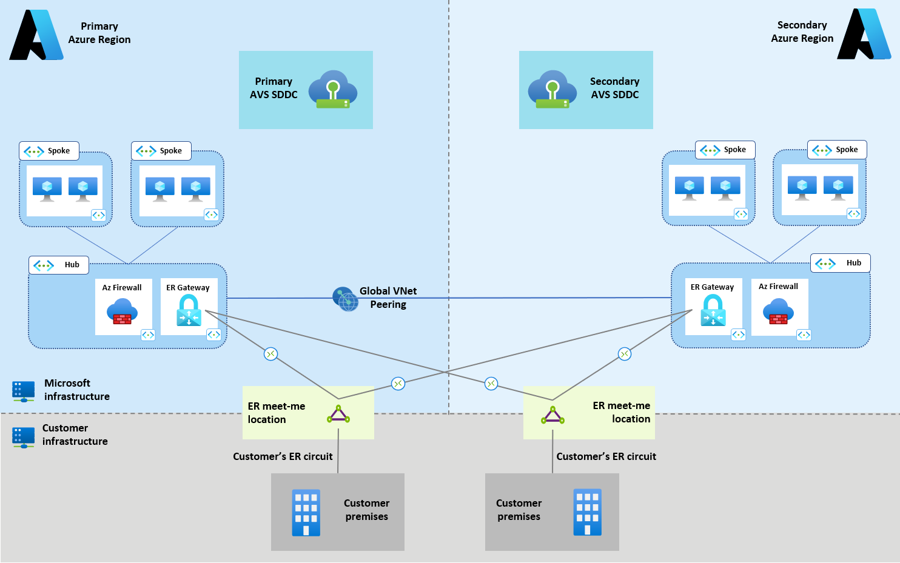
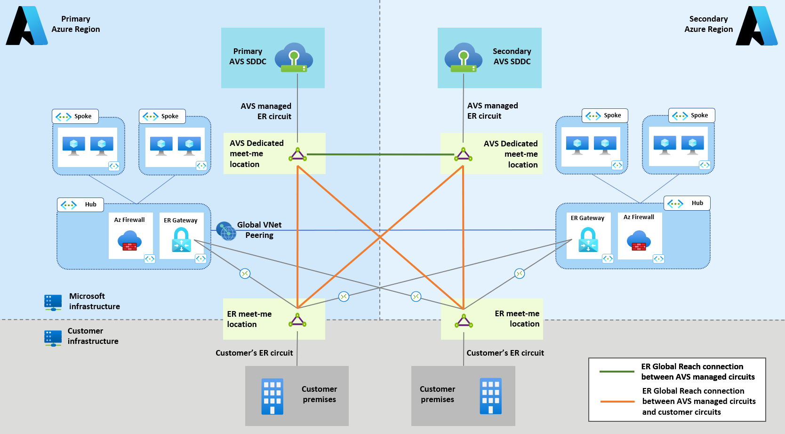
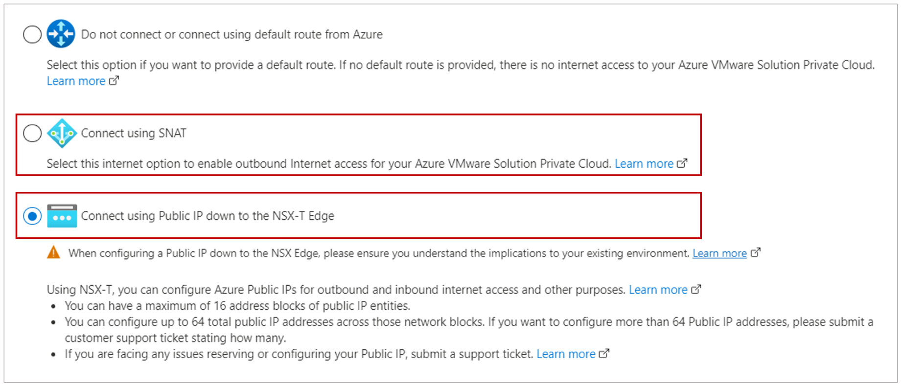
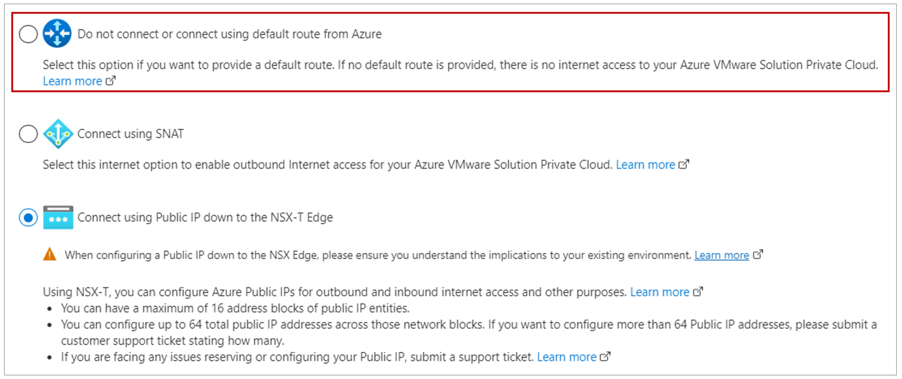
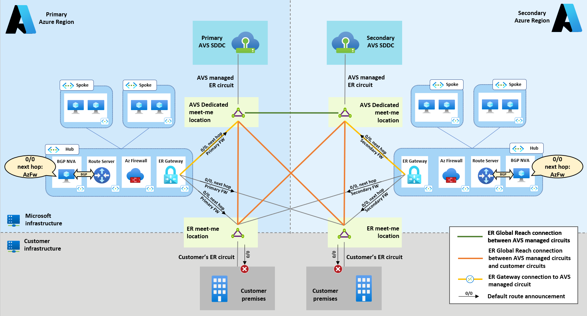

# Network considerations for AVS dual-region deployments

## Introduction
This article describes how to configure network connectivity when AVS (Azure VMware Solution) private clouds are deployed in two Azure regions, for disaster resilience purposes. In case of partial or complete regional outages, the network topology presented here allows the surviving components (AVS private clouds, Azure-native resources, on-prem sites) to maintain connectivity with each other and with the internet.

The dual-region setup to which this article applies is described in the section “Dual-region reference architecture”, which sets the context for the following sections. The section “AVS cross-region connectivity” covers how to enable the two AVS private clouds to route traffic to each other. The section “Hybrid connectivity” covers how to connect the AVS private clouds to on-prem sites, using Expressroute circuits. The section “Azure Virtual Networks connectivity” covers how to connect AVS private clouds and Virtual Networks across the two regions. The section “Internet connectivity” covers resilient internet access for AVS private clouds and how to control cross-region propagation of default routes announced to AVS by NVAs in Azure VNets.

## Dual-region reference architecture
This article focuses on a typical dual-region scenario, shown in Figure 1 below. It assumes that:
- An Azure hub and spoke network exists in each region.
- A disaster-resilient configuration for Expressroute (two circuits in two different peering locations, with each circuit connected to hub VNets in both regions) has been deployed. The guidance provided in the following sections stays the same in case [fall-back VPN connectivity](https://learn.microsoft.com/en-us/azure/expressroute/expressroute-howto-coexist-resource-manager#configure-a-site-to-site-vpn-as-a-failover-path-for-expressroute) is configured.
- An AVS private cloud has been deployed in each region.

 
*Figure 1. Dual-region scenario. This article discusses options for connecting AVS private clouds to Azure VNets, on-prem sites and the internet in such a way that, in case of partial or complete regional disasters, the surviving components (AVS private clouds, Azure-native resources, on-prem sites) to maintain connectivity with each other and the internet.*

In the scenario of Figure 1, a global VNet peering connection between the two regional hubs is shown. While not strictly required (traffic between Azure VNets in the two regions could be routed over Expressroute connections), this configuration is strongly recommended. Private Peering minimizes latency and maximizes throughput, as it removes the need to hairpin traffic through the Expressroute meet-me edge routers. 
It should be noted that many of concepts discussed in the context of the dual-region scenario can be extrapolated to more complex cases with AVS private clouds deployed in more than two regions.

## AVS cross-region connectivity
When multiple AVS private clouds exist, layer-3 connectivity among them is often a requirement, for example to support data replication. 
AVS natively supports direct connectivity between two private clouds deployed in different Azure regions. Private clouds connect to the Azure network in their own region through Expressroute circuits, managed by the platform and terminated on dedicated ER meet-me locations. Throughout this article, these circuits are referred to as “AVS-managed circuits”. They should not be confused with the normal circuits that customers deploy to connect their on-prem sites to Azure which will be referred to as “customer-managed circuits” (see Figure 2). 
Direct connectivity between private clouds is based on [Expressroute Global Reach](https://learn.microsoft.com/en-us/azure/expressroute/expressroute-global-reach) connections between AVS managed circuits, as shown by the green line in the diagram below. Please refer to the [official documentation](https://learn.microsoft.com/en-us/azure/azure-vmware/tutorial-expressroute-global-reach-private-cloud) for more information on how to configure Global Reach connectivity between two private clouds.

*Figure 2. AVS private clouds in different regions directly connected to each other by establishing a Global Reach connection (green line) between the private clouds’ managed ER circuits. In each Azure region where AVS is available, network infrastructure that terminates the AVS-side of the AVS managed circuits is present. It is referred to as “Dedicated ER meet-me routers” in the picture.*

## Hybrid connectivity 
The recommended option for connecting AVS private clouds to on-prem sites is Expressroute Global Reach. Global Reach connections can be established between customer-managed Expressroute circuits and AVS-managed Expressroute circuits. Global Reach connections are not transitive, therefore a full mesh (each AVS-managed circuit connected to each customer-managed circuit) is required for disaster resiliency, as shown in Figure 3 below (orange lines).

 
*Figure 3. Global Reach connections (orange lines) can be established between the customer-managed Expressroute circuits and the AVS-managed Expressroute circuits.* 

## Azure Virtual Networks connectivity
Azure VNets can be connected to AVS private clouds through connections between Expressroute Gateways and AVS-managed circuits (i.e. exactly in the same way Azure VNets can be connected to on-prem sites over customer-managed Expressroute circuits). Please review the [AVS official documentation](https://learn.microsoft.com/en-us/azure/azure-vmware/tutorial-configure-networking#connect-to-the-private-cloud-manually) for configuration instructions. 
In dual-region scenarios, a full mesh is recommended for the ER connections between the two regional hub VNets and private clouds, as shown in Figure 4 (yellow lines).

 
*Figure 4. By connecting each hub VNet’s Expressroute Gateway to each AVS private cloud’s managed Expressroute circuit (yellow lines), Azure native resources in each region have direct L3 connectivity to AVS private clouds.*

## Internet connectivity
When deploying AVS private clouds in multiple regions, native options (managed SNAT or Public IPs down to the NSX-T) are recommended. Either option can be configured through the Azure portal (or via PowerShell, CLI or ARM/Bicep templates) at deployment time, as shown in Figure 5 below. 

 
*Figure 5. AVS native options for outbound internet connectivity in the Azure portal.*

Both the options highlighted in Figure 5 provide each private cloud with a direct internet breakout in its own region. The following considerations should inform the decision as to which native internet connectivity option to use:
- Managed SNAT should be used in scenarios with basic and outbound-only requirements (low volumes of outbound connections and no need for granular control over the SNAT pool). 
- Public IPs down to the NSX-T edge should be preferred in scenarios with large volumes of outbound connections or when granular control over NAT IP addresses (i.e. which AVS VMs get SNAT’ted behind which IP addresses) is required. Public IPs down to the NSX-T edge also support inbound connectivity via DNAT. Inbound internet connectivity is not covered in this article.

Changing a private cloud’s internet connectivity configuration after initial deployment is possible, but the private cloud will lose connectivity to internet, Azure VNets and on-prem sites while the configuration is being updated. When either one of the native internet connectivity options above (Figure 5) is used, no additional configuration is required in dual-region scenarios (the topology stays the same as the one shown in Figure 4). For more information on internet connectivity for AVS, please review the [AVS official documentation](https://learn.microsoft.com/en-us/azure/azure-vmware/concepts-design-public-internet-access).

### Azure-native internet breakout
If a secure internet edge was built in Azure VNets prior to AVS adoption, it may be required (centralized management of network security policies, cost optimization, …) to leverage it for internet access for private clouds. Internet security edges in Azure VNets can be implemented using Azure Firewall or third-party firewall/proxy NVAs available on the Azure Marketplace.
AVS allows customers to attract internet-bound traffic emitted by virtual machines running on AVS, by originating a default route from the Azure VNet and announcing it, over BGP, to the private cloud’s managed ER circuit. This internet connectivity option can be configured through the Azure portal (or via PowerShell, CLI or ARM/Bicep templates) at deployment time, as shown in Figure 6 below.

*Figure 6. AVS configuration to enable internet connectivity via internet edges hosted in Azure VNets.* 

The default route can be originated by the internet edge NVAs, if they support BGP. If not, additional BGP-capable NVAs must be deployed. Detailed instructions on how to implement internet outbound connectivity for AVS in a single region are available here. In the dual-region scenario discussed in this article, the same configuration must be applied to both regions. 
The key consideration in dual-region scenarios is that the default route originated in each region should be propagated, over ER, only to the AVS private cloud in same region, to allow AVS workloads to access the internet through a local (in-region) breakout. However, if the topology shown in Figure 4 is used, each AVS private cloud also receives an equal-cost default route from the remote region over the cross-region ER connections. This unwanted cross-region default route propagation is shown by the red, dashed lines in Figure 7.

*Figure 7. The cross-region connections between Expressroute Gateways and AVS-managed Expressroute circuits (red dashed lines) must be removed to avoid cross-region propagation of the default route.*   

Removing the cross-region ER connections achieves the goal of injecting, in each private cloud, a default route to forward internet-bound connections to the Azure internet edge in the local region. 

It should be noted that, if the cross-region ER connections (red, dashed lines in Figure 7) are removed, cross-region propagation of the default route will still occur over Global Reach. However, routes propagated over Global Reach have a longer AS Path than the locally originated ones and get discarded by the BGP route selection process. The cross-region propagation over Global Reach of a less preferred default route provides resiliency against faults of the local internet edge. If a region’s internet edge goes offline, it stops originating the default route, in which case the less-preferred default route learned from the remote region gets installed in the AVS private cloud, so that internet-bound traffic is routed via the remote region’s breakout.

The recommended topology for dual-region deployments with internet breakouts in Azure VNets is shown in  Figure 8 below.

*Figure 8. Recommended topology for dual region AVS deployments with internet outbound access through internet edges in Azure VNets. Cross-region connections between Expressroute Gateways and AVS managed circuits must not be established, to prevent unwanted cross-region propagation of the default route.*

When originating default routes in Azure, special care must be taken to avoid propagation to on-prem sites (unless there is a requirement to provide internet access to on-prem sites via an internet edge in Azure). The customer-operated devices that terminate the customer managed Expressroute circuits must be configured to filter default routes received from Azure, as shown in Figure 9. This configuration is required to avoid disrupting internet access for the on-prem sites.

*Figure 9. Default routes originated by Azure NVAs must be filtered out by the BGP speakers that terminate the customer-managed ER circuits.*
