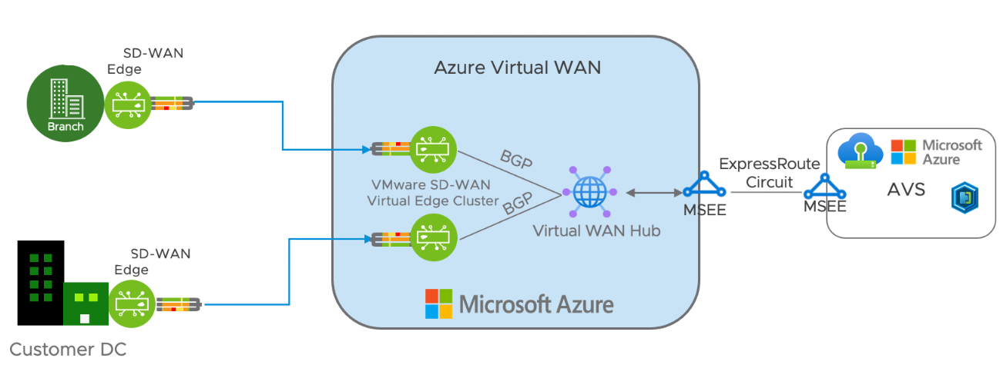

# Introduction

AVS has many options for connectivity. This includes AVS native services like Managed SNAT, Public IP, and Azure native services such as Azure VWAN Hub and Azure Firewall for default route advertisement. Traversing back to on-prem is also an option for establishing internet connectivity from AVS. 

This article will discuss the different tools and servies available to implement internet traffic from AVS in a hybrid environment. Also, this document also discuss how to increase network security, resiliency, and design for scale using Azure Landing Zone best practices.  

## Default Route from On-Premises
Lets first look at a basic setup. In AVS, you create a segment(s) and under that segment, you have some VM's that you want to install some packages on from the internet. 

Your segments are attached to the default tier 1 router which as a direct path out to the tier-0 edge router. 

In order to access the internet, default route, 0.0.0.0/0 must be configured.

The AVS Portal shows that you have 3 options. 

One option is to enable the default route from on-premises over a VPN connection. In this scenario, you enable the first option to configure your own default route from on-premises, and have the vpn gateway terminate in an Azure vnet. That same vnet will also have the AVS Expressroute circuit gateway as seen below. From there, you enable Azure Route Server to dynamically transit from the vpn to expressroute. This is done by enabling Branch to Branch. See: https://learn.microsoft.com/en-us/azure/route-server/expressroute-vpn-support

In this design, there are several hops required before reaching the internet. To simplify this architecture, rather that a VPN from On-Premises, consider Expressroute. The Expressroute circuit peers with AVS's Expressroute circuit using Global Reach https://learn.microsoft.com/en-us/azure/azure-vmware/concepts-networking

This however still is not the most direct, low latent option. 

## Managed SNAT
If traversing back to on-prem is not a requirement. Consider using Managed SNAT directly from AVS itself. As the name suggest, this is an AVS managed mechanism to give your Private workloads a Public IP to access the internet for outbound traffic. 

See:https://learn.microsoft.com/en-us/azure/azure-vmware/enable-managed-snat-for-workloads

## Limitations

Please note that this service is for outbound, egress traffic only. Here are some of the additional limitations:

1.) No DNAT: You may have services that require DNAT - For example, if there is a service in Azure that needs to access  AVS as it's destination, it won't know how to receive that address

2.) Can't natively handle L7: The Managed SNAT has no concepts of HTTP/HTTPS. In order to have this functionality, you will need use a load balancer

3.) Logging: The connection has no concept of logging. No way to see malicious activity, bad actors, or network congestion. 

4.) No Firewall: You can't secure the traffic with Managed SNAT. You can't control TCP/UDP without rules to configure

Consideration: Use Managed SNAT for POC or workloads that don't have these requirements. 
Recommendation: Use Public IP at the NSX edge for a native, scalable, secure solution 

## Public IP at the NSX Edge 

This option gives you more flexibility as it can scale up to over thousands of public IP's and can be used down to the tier 1. This means the public IP can sit
	- At the Virtual Machine
	- At the Load Balancer 
	- At a Network Virtual appliance at the NSX Edge

Which gives you flexibility in your design patterns.

### Design Considerations:

Use this option to have a low-latent connection to Azure and need to scale number of outbound connections
Leverage firewall for granular rule creation, URL filtering, and TLS Inspection  
Consider using loadbalancer to evenly distribute traffic to workloads 
Enable DDOS protoection 

## Secured VWAN HUB

Now that simpler use cases for integrating AVS with Azure and enabling workloads to have internet connectivity are covered, here are some ways to integrate WAN and Hub & Spoke topologies. First, lets take the example of a WAN topology. 

A WAN creates connections between P2P/S2S VPN, ER circuits, mobile devices, amongst other spokes to a centralized location. AVS then because another spoke off that design and will integrate with the Secure VWAN Hub because it speaks BGP. 
Existing vnets in Azure will not be able to peer directly to the VWAN hub, so in order to communicate securely between AVS and workloads, create a hub vnet where you can deploy azure Firewall. 

In this scenario, if you want HTTP/HTTPS traffic to go through this hub and out the internet, you will need to do two things

	1) Enable WAF/App GW in the hub vnet
	2) Enable a Network virtual appliance 

In the diagram above, L7 can occur either with the NSX-T loadbalancer or using WAF/App Gateway in Azure.

**Note:** Azure Firewall is not a BGP capable device, so you can't route traffic to it through AVS natively. 

### Design Consideration: 
Use VWAN for existing workloads, Hub/Spoke VNET's for Azure traffic, and deploy Public IP at the NSX-Edge for Internet traffic for AVS workloads 

If you don't need a WAN and can use a third party, BGP capable device in a central hub network topology, that then brings us to our next architecture. If you want all connectivity going through Secured Hub, advertising the default route from Azure Firewall is also an option. 

## Hub & Spoke with Next-Gen Firewall 

This architecture uses a centralized hub virtual network in Azure with a network virtual appliance. Consider using this architecture  when an existing internet edge device is already configured in Azure which can extend to provide outbound internet to AVS workloads. 
Use ARS to dynamically populate segments from AVS to the Hub network and spokes that are peered to it. 

https://learn.microsoft.com/en-us/azure/architecture/reference-architectures/dmz/nva-ha?tabs=cli

### DDOS Protection
Consider using WAF w/ App Gateway for Layer 7 communication and DDOS protection for the hub and spoke networks

