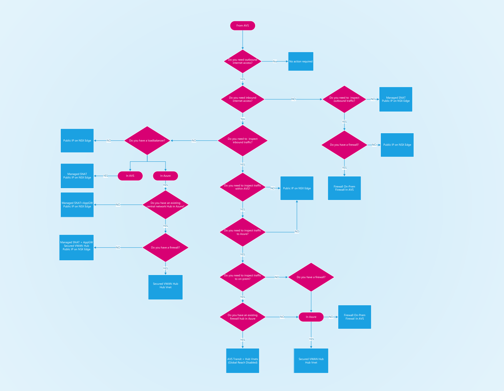

# Connectivity Options for AVS

Enterprise-scale for Azure VMware Solution (AVS) is a consistent set of design considerations for establishing connectivity to, from, and within the software design center. This page covers reference architectures based on the most common scenarios to consider when designing for network-at-scale. While this is not an exhaustive list of design patterns, the diagrams are examples on how to achieve commonly used traffic patterns. Take advantage of the best practices described in landing zone connectivity design area to build a strong topology. You can then extend the foundation by implementing processes related to network security, and traffic monitoring.

The following decision tree shows the various options for landing on a network topology.  
 

**Start with the AVS Azure landing zone accelerator:** If your business requirements call for a rich initial implementation of landing zones with fully integrated governance, security, and operations from the start. If you need to, you can modify using Infrastructure-as-Code (IaC) to set up and configure an environment per your requirements. For IaC, your organization will require skills in Azure Resource Manager templates and GitHub.

[!CAUTION]
> The best practices used for customization will ultimately be aligned with the [Azure landing zone](./index.md). However, there's added investment in time and effort which might be justified to fit specific business requirements.

# Implementation Options 

## AVS Connectivity Options 
Below is an automated ways to establish connectivity

| Deploy                                                       | Description                                                  | Deploy                                                       | More Info                                                    |
| ------------------------------------------------------------ | ------------------------------------------------------------ | ------------------------------------------------------------ | ------------------------------------------------------------ |
| Connect AVS to a new virtual network                         | This example will create a new virtual network, new gateway in desired resource group and will connect this new network to AVS Private Cloud | | [Link](Networking/AVS-to-VNet-NewVNet/readme.md) 
| Connect AVS to On-premises ExpressRoute Circuit via Global Reach | This example will connect AVS Private Cloud to on-premises ExpressRoute Gateway |  | [Link](Networking/AVS-to-OnPremises-ExpressRoute-GlobalReach/readme.md) 
| Connect AVS to AVS in the same region via AVS Interconnect   | This example will connect 2 AVS Private Clouds in same region using the AVS Interconnect feature |  | [Link](Networking/AVS-to-AVS-SameRegion/readme.md) |

For additional options to connect to an existing Azure environment, see the full list of implementation options [here](https://github.com/Azure/Enterprise-Scale-for-AVS/blob/main/BrownField/readme.md)

## Reference Architectures ### 
| Deploy                                                       | Description                                                  | Deploy                                                       | More Info                                                    |
| ------------------------------------------------------------ | ------------------------------------------------------------ | ------------------------------------------------------------ | ------------------------------------------------------------ |
| AVS Landing Zone - Hub & Spoke in Azure with Global Reach                          | This example connects AVS to on-premises with Global Reach, and creates a Hub network with  a VNET Gateway and Azure Bastion. Default Route advertisement from AVS .  | | [Link](Networking/AVS-to-VNet-NewVNet/readme.md) 
| AVS Landing Zone - Hub & Spoke in Azure with VPN transitivity| This example will connect AVS Private Cloud to on-premises by connecting AVS ExpressRoute Gateway to on-premises vpn with Azure Route Server. Enables connectivity from AVS |  | [Link](Networking/AVS-to-OnPremises-ExpressRoute-GlobalReach/readme.md) 
| AVS Landing Zone - Secured VWAN Hub in Azure   | Transitivity from AVS to on-prem via Global Reach. Default route advertisement from Secured VWAN Hub with Azure Firewall |  | [Link](Networking/AVS-to-AVS-SameRegion/readme.md) |

## Additional Traffic Patterns
### Default Route Advertisement in Azure

If you have an existing firewall in Azure, this can be used to advertise the default route from AVS as long as it's
- BGP capable 
- Is peered to Azure Route Server

In this configuration, user is responsible for configuring high availability and resiliency around the device. For more information on this use case see [here](https://learn.microsoft.com/en-us/azure/cloud-adoption-framework/scenarios/azure-vmware/eslz-network-topology-connectivity#scenario-5-a-third-party-nva-in-the-hub-vnet-inspects-traffic-between-avs-and-the-internet-and-between-avs-and-azure-vnets)

Note: If you are in a region where Global Reach is unavailable, consider using a multi-vnet hub and transit implmenentation https://learn.microsoft.com/en-us/azure/azure-vmware/concepts-network-design-considerations#use-a-default-route-to-azure-vmware-solution-for-internet-traffic-inspection or [Route Intent](https://learn.microsoft.com/en-us/azure/virtual-wan/how-to-routing-policies)(Preview) policies in Azure VWAN

### Default Route Advertisement in AVS using 3rd party firewall (Not supported)
Third party firewall usage is possible in AVS, must be used with discretion
- Firewall insertion can only occur at the tier 1 router. If you need to filter traffic East / West, 
- User is responsible for managing resiliency for each firewall 
 
The solution is not supported when used with Layer 2 Extension or Mobility Optimized Networking (MON) our using Gateway Firewall in AVS. 

For traffic filtering between on-premises and AVS, consider advertising the default route on-prem

### AVS to AVS communication
- AVS workloads on the same segment can talk natively to each other
- AVS workloads across segments communicate by configuring NSX
- Workloads in different SDDC's can talk using AnyConnect
- For workload cross-region communication, use Global Reach. See [Multi-Region Connectivity]() 

 

