## Introduction

This document talks about using 3rd party NVA (Network Virtual Appliance) as a firewall in an AVS (Azure VMware Solution) environment.

Most customers are comfortable using a certain firewall product/brand based on their previous experience or other factors. In this document, we elaborate this pattern and provide implementation details based. Here we are using a Linux based firewall/NVA as an example.

The intention of this document is NOT to elaborate on all the different scenarios. The focus is on proving the validity of the pattern with a sample setup.

## Problem Statement

Enterprises exclusively on Azure VMware Solutions environment, with no or minimal footprint on Azure, requiring firewalling capability to inspect east-west or north-south traffic. NSX-T does support "Distributed Firewall and Gateway Firewall", which are native capabilities. However, in this scenario the customer wants to use a 3rd party next generation firewall in AVS.


## Business Scenario

Most of the enterprise customers are familiar with using a specific security product (Firewall) from a particular vendor. As such, they prefer using the same firewalls/tools/services that they have been working on for years. This helps them leverage the existing skill set and avoid upskilling.

It also enables them to continue with the organization's existing risk and security posture.

This can be achieved by injecting a 3rd party firewall for North-South (and East-West) traffic inspection between workload segments and default Tier-1 gateway. The firewall can be deployed in active/active, active/standby or standalone depending on the high availability and resiliency requirements.

The firewall could be any NVA device from any vendor of choice. In this case, we are using Ubuntu Linux based NVA as a firewall appliance to inspect traffic.

_Note: This architecture doesn't cater for inspecting intra isolated Tier-1 gateway traffic._


## Prerequisites

- AVS private cloud environment.
- Public IPs for AVS private cloud.
- Source NAT on default Tier-1 gateway for AVS deployment.
- Jump-box on Azure to login to AVS vSphere environment.
- Connectivity between Azure and AVS.
- DHCP profiles for each Tier-1 gateway. In this case you would need four DHCP profiles (Red Tier-1, Green Tier-1, Blue Tier-1, and default Tier-1 gateways). Refer DHCP Profiles table in configuration section.
- Administrative skills of NSX-T.
- Administrative skills of vSphere.
- Administrative skills of AVS.
- Administrative skills in the 3rd party firewall/NVA (Optional).

_Note: This document provides an example of Linux VM as a NVA/firewall._


## Security Solutions for Traffic Inspection

In this section we elaborate on different firewall inspection options in AVS.

_Note: This document does NOT talk about patterns involving Azure based firewalls._

#### Built in security solutions within NSX-T
In this section we list down the built in security solutions within NSX-T.
###### Distributed Firewall

Software-defined layer-7 stateful firewall mainly used to secure east-west traffic. More details can be found here:
[Distributed Firewall (vmware.com)](https://docs.vmware.com/en/VMware-NSX-T-Data-Center/3.2/administration/GUID-6AB240DB-949C-4E95-A9A7-4AC6EF5E3036.html)

###### Gateway Firewall

Software-defined layer-7 firewall mainly used to secure north-south traffic. More details can be found here:
[Gateway Firewall (vmware.com)](https://docs.vmware.com/en/VMware-NSX-T-Data-Center/3.2/administration/GUID-A52E1A6F-F27D-41D9-9493-E3A75EC35481.html)

#### 3rd Party security solutions

In this section we discuss about different security patterns for traffic inspection using 3rd party firewall/NVA based solutions.

###### Source Network Address Translation:

Source NATting on the following patterns can be performed at different layers. Following are the options:

1. Source NAT on default Tier-1 gateway.
   1. In this scenario the default Tier-1 gateway has static routes for each of the segments pointing to NVAs virtual IP address.
2. Source NAT on NVA/firewall.
   1. In this scenario default Tier-1 gateway has static routes for the source NATted virtual IP of the NVA. This is the scenario we are going to discuss in this document.

##### Security pattern #1

**Description** :

In this security pattern 3rd party firewall/NVA intercepts all north-south and east-west traffic between workload segments and internet/on-premises. NVA is directly connected to transit segment (linked to default Tier-1 gateway) and workload segments as show in figure 1.

Default routes on workload VMs has next hop as the virtual IP address of NVA and NVAs default route has next hop as default Tier-1 gateway.

**Limitations** :

- Scalability is the main issue with this pattern. The number of vNICs that can be connected to a VM is limited to nine. This limits the number of segments NVA/Firewall can inspect.
- Firewall/NVA support requirements. 3rd party firewalls are supported by the respective vendor contracts and outside of Microsoft remit.
- No east-west traffic inspection between segments attached to the same isolated Tier-1 gateway.

**Solutions Diagram:**


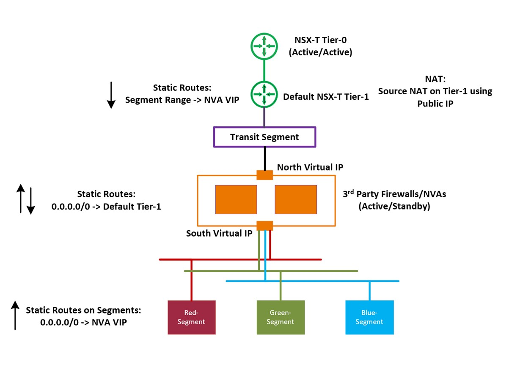

_Figure 1.0: The above figure shows an example of AVS environment with default NSX gateways (Tier-0 and Tier-1), a 3__rd_ _party firewall / NVA and three isolated segments. NVA is directly connected to the three workload segments (App, Web and DB) and transit segment (default Tier-1 gateway). Source NATting is done on the default Tier-1 Gateway._


_Figure 1.1: The above figure shows an example of AVS environment with default NSX gateways (Tier-0 and Tier-1), a 3__rd_ _party firewall / NVA and three isolated segments. NVA is directly connected to the three workload segments (App, Web, and DB) and transit segment (default Tier-1 gateway). Source NATting is done on the NVA._

##### Security pattern #2

**Description:**

In this security pattern a 3rd party firewall/NVA intercepts all north-south (optionally east-west) traffic between workload segments and internet/on-premises. NVA is connected to transit segment of the respective isolated Tier-1 gateway (Red, Green, and Blue) and a default Tier-1 gateway segment. Each isolated Tier-1 gateway has its own transit segment used to route traffic.

Default routes on isolated Tier-1 gateways have a next hop as virtual IP address of NVA. NVAs default route has next hop as default Tier-1 gateway and default Tier-1 gateway has static routes for each of the segments pointing to NVAs IP address.

In this pattern, default Tier-1 gateway performs source NAT. Please note that some customers like to NAT on the Firewall/NVA. A variant of this pattern would be NATting on the NVA/firewall.

_P.S: This is the pattern we are going to elaborate on in this document. For simplicity, we are going to use single NVA instead of a redundant pair. The rest of the sections in this document provide details on setting up security pattern #2._

**Limitations** :

- Firewall/NVA support requirements. 3rd party firewalls are supported by the respective vendor contracts and outside of Microsoft remit.
- No east-west traffic inspection between segments attached to the same isolated Tier-1 gateway.

**Solutions Diagram:**

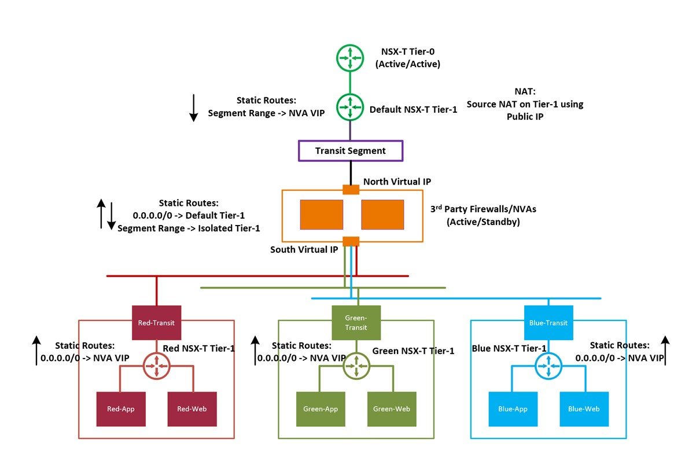

_Figure 2.0: The above figure shows an example of AVS environment with default NSX gateways (Tier-0 and Tier-1), a 3__rd_ _party firewall / NVA and three completely isolated Tier-1 gateways with respective segments (Transit and workload). NVA is connected to transit segments. Each Tier-1 gateway has its own transit segment. Source NAT is on default Tier-1 Gateway._

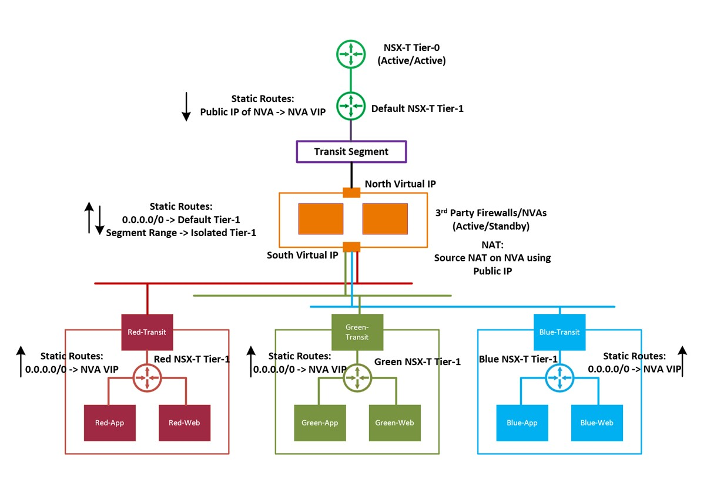


_Figure 2.1: The above figure shows an example of AVS environment with default NSX gateways (Tier-0 and Tier-1), a 3__rd_ _party firewall / NVA and three completely isolated Tier-1 gateways with respective segments (Transit and workload). NVA is connected to transit segments. Each Tier-1 gateway has its own transit segment. Source NAT is on NVA._


## Configuration

In this section configuration details for setup pattern #2 option #2 are summarized. In this pattern firewall/NVA is connected to default Tier-1 gateway on one end and isolated Tier-1 gateways on the other. Please refer to figure 2.1 for a visual depiction.

Source NATting can be done at either default Tier-1 gateway or NVA. This document explicitly focuses on source NAT on NVA/firewall.


#### Setup details for security pattern #2

- Red, Green, and Blue Tier-1 gateways are isolated. Meaning, they are not connected to default Tier-0 gateway.
- Each of the Isolated gateways has two workload segments (Web, and App) and a transit segment.
- The default route next hop for all the three isolated Tier-1 gateway is NVA's virtual IP address.
- A highly available pair of NVA/firewall in Active/Standby configuration with source NAT to public IP. NATting can also be performed using public IP range, but this configuration is not elaborated here.
- Static route on default Tier-1 gateway for traffic travelling towards the public IP (used for NATting) with next hop as the IP address of NVA/firewall.
- The default router for NVA is the default Tier-1 gateway.
- Azure allocated public IP addresses are used for NATting on the NVA/firewall.


#### NSX-T Segment details

Here are the details for NSX-T segments to be created later in the document.

| **Segments**           | **IPv4 Address Range** | **Tier-1 Gateway**          |
| ---------------------- | ---------------------- | --------------------------- |
| Red-Web                | 10.0.1.0/24            | Red-T1-Gateway (Isolated)   |
| Red-App                | 10.0.2.0/24            | Red-T1-Gateway (Isolated)   |
| Red-Transit            | 10.0.3.0/24            | Red-T1-Gateway (Isolated)   |
| Green-Web              | 10.0.4.0/24            | Green-T1-Gateway (Isolated) |
| Green-App              | 10.0.5.0/24            | Green-T1-Gateway (Isolated) |
| Green-Transit          | 10.0.6.0/24            | Green-T1-Gateway (Isolated) |
| Blue-Web               | 10.0.7.0/24            | Blue-T1-Gateway (Isolated)  |
| Blue-App               | 10.0.8.0/24            | Blue-T1-Gateway (Isolated)  |
| Blue-Transit           | 10.0.9.0/24            | Blue-T1-Gateway (Isolated)  |
| Default Tier-1 transit | 192.168.0.0/24         | Default T1                  |


#### DHCP Profiles

Here are the details for DHCP profiles to be created later in the document.

| **DHCP Profile Name** | **IPv4 Range** |
| --------------------- | -------------- |
| Red-DHCP-Profile      | 10.0.20.0/24   |
| Green-DHCP-Profile    | 10.0.21.0/24   |
| Blue-DHCP-Profile     | 10.0.22.0/24   |
| Default-DHCP-Profile  | 192.168.0.0/24 |

_Note: You may use a smaller IPv4 range like /28 for DHCP. We are using /24 for simplicity. Please refer to Microsoft AVS documentation._


## Step by step implementation guide


#### Create isolated "Red" Tier-1 gateway

In this section you will create an isolated Tier-1 gateway. As per diagram in figure 2.1, there are 3 isolated Tier-1 gateways.
1. Click on "Networking -> Tier-1 Gateways."

 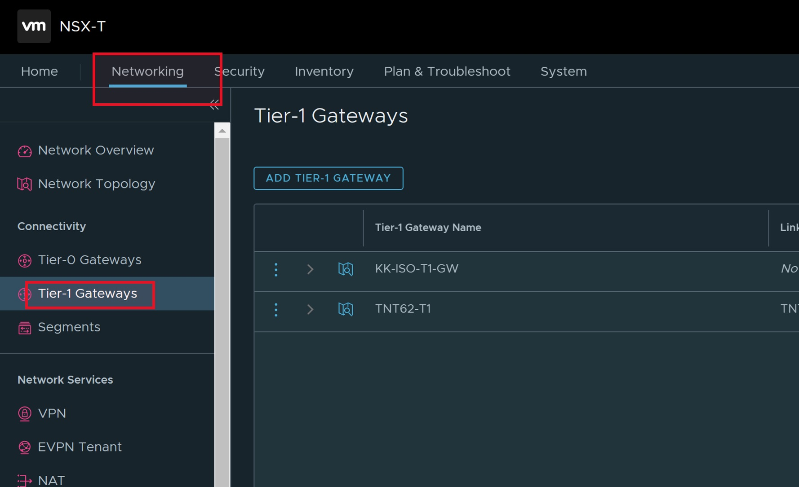
 1. Click on "ADD TIER-1 GATEWAY."
 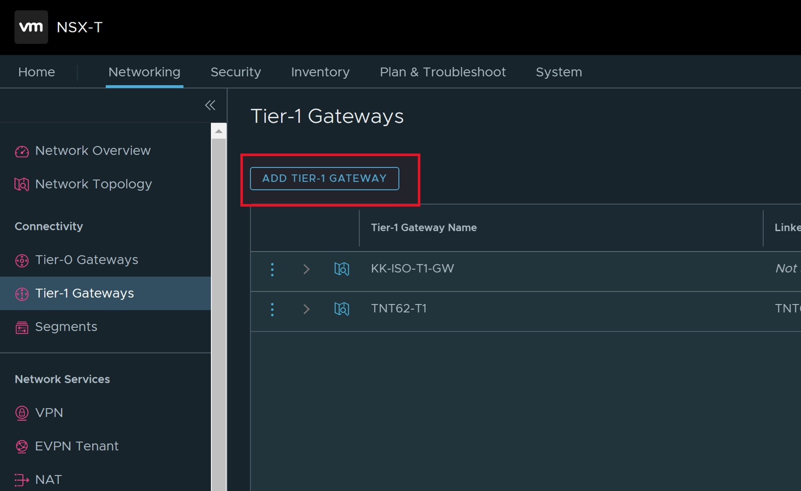
 1. Enter Tier-1 gateway name as "Red-T1-Gateway".
 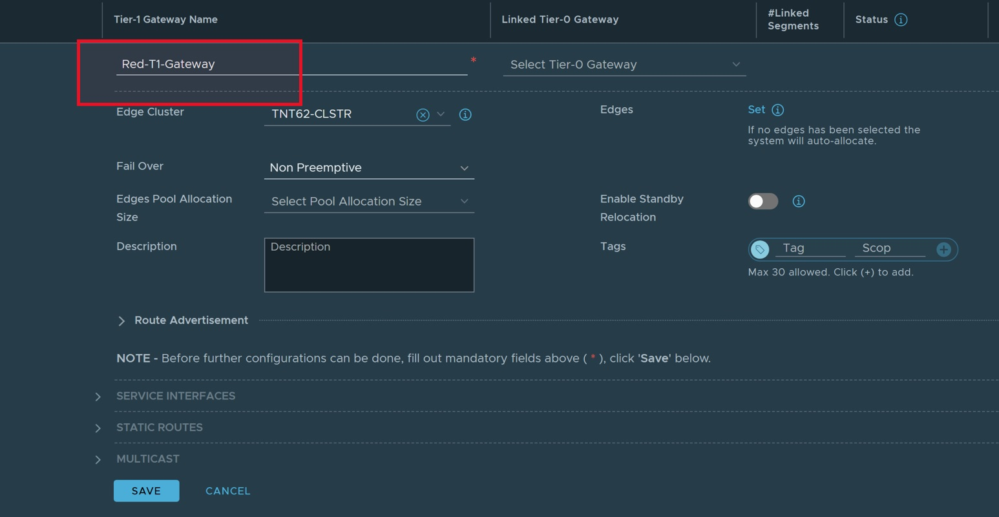
 1. Select allocated edge cluster.
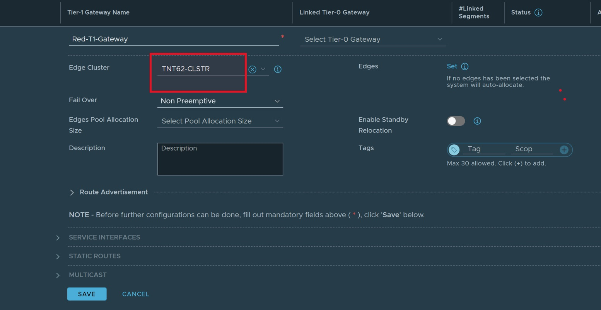
 1. Click "SAVE."
 2. Click on three dots next to the newly created Tier-1 Gateway to edit it.
 3. Click "Set DHCP Configuration" and select appropriate DHCP configuration.
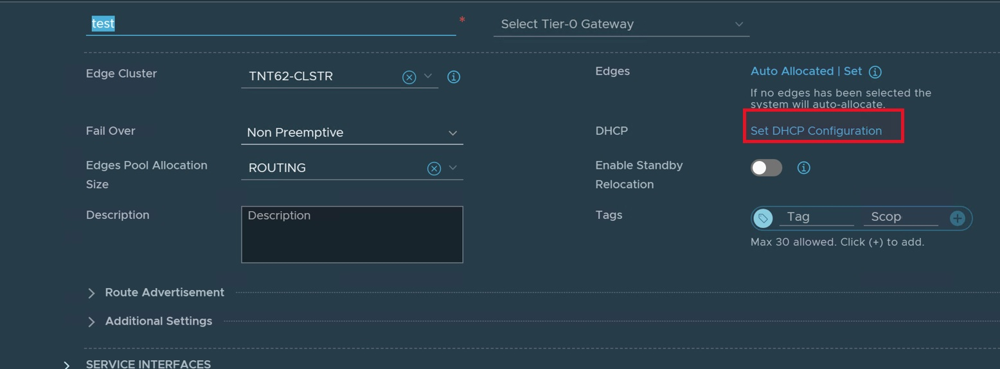
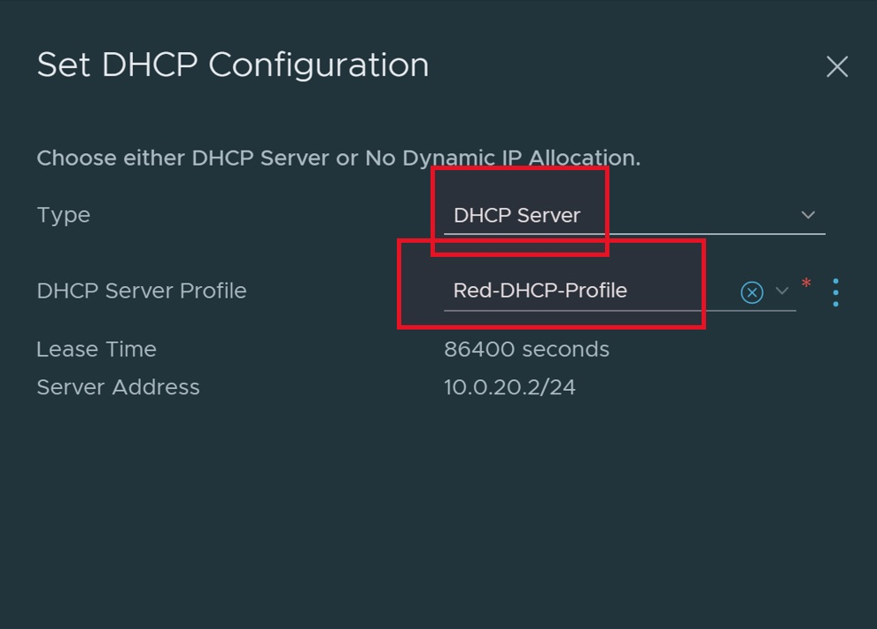

 1. Click "SAVE" to save the configuration.


#### Repeat the above steps for "Green" and "Blue" Tier-1 gateways

Please refer to the diagram in Figure 2.1 and section 6

#### Create segments for isolated Tier-1 gateways

In this section you will create two workloads and one transit segment as shown in figure 2.1.
1. [Tutorial - Add an NSX-T Data Center network segment in Azure VMware Solution - Azure VMware Solution | Microsoft Learn](https://learn.microsoft.com/en-us/azure/azure-vmware/tutorial-nsx-t-network-segment#use-nsx-t-manager-to-add-network-segment)
2. Refer to configuration details table (section 6) for IPv4 Range used.
3. Refer to figure 2.1, for architecture.


#### Create Firewall/NVA in Active/Standby configuration

In this section you will create a pair of highly available Linux based NVAs/firewalls. In this case Ubuntu Linux is used, but you can achieve the same with any Linux distribution (exact command will differ).

You can also replace it with the firewall of your choice.

1. Download Ubuntu ISO from following link on the jump host:
   1. [Get Ubuntu Server | Download | Ubuntu](https://ubuntu.com/download/server)
2. Login to "vSphere" client using your favorite browser.
3. Create Ubuntu Linux virtual machine. This VM will act as NVA/firewall device. Details on steps to create a VM can be found on VMware documentation here:
   1. [Create a Virtual Machine](https://docs.vmware.com/en/VMware-vSphere/7.0/com.vmware.vsphere.vm_admin.doc/GUID-AE8AFBF1-75D1-4172-988C-378C35C9FAF2.html)
   2. Make sure the NVA host has two network adaptors. First one connected to default Tier-1 gateway segment and second to the respective transit segments. 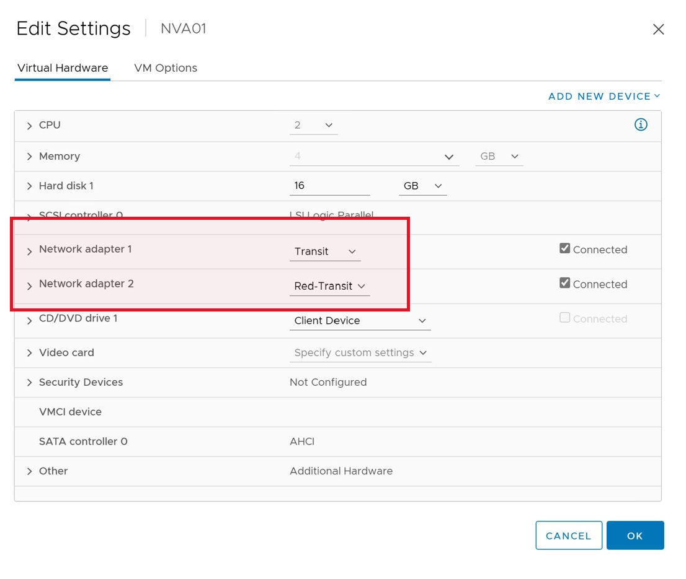
   3. Login to the newly created NVA host above using "WEB CONSOLE". 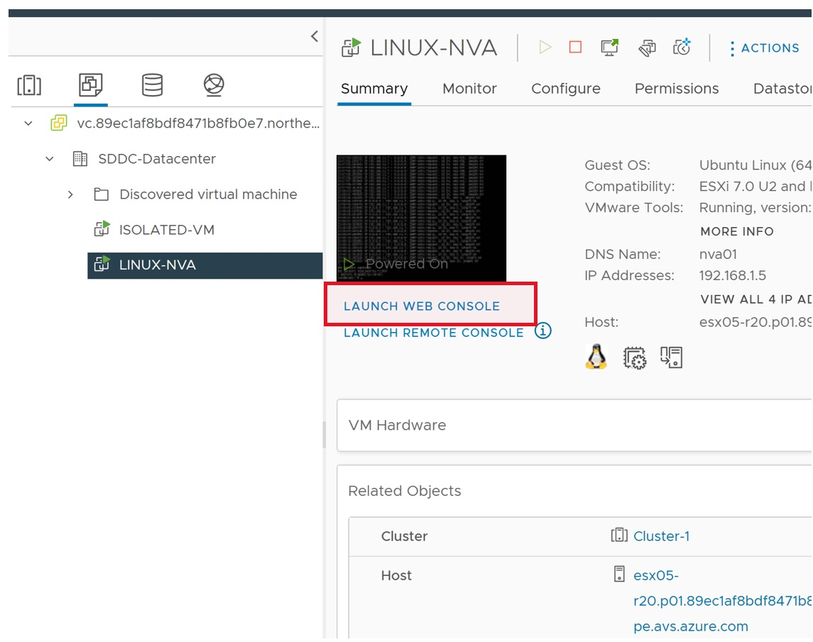

   4. Enable IP forwarding on the NVA
       1. Run
       ```
       sudo vi /etc/sysctl.conf
       ```
       2. Uncomment the line
       ```
       "net.ipv4.ip_forward=1"
       ```
       3. Validate
       4. Delete the second default route.
          1. List routes
          ```
          # sudo ip routes
          You will see two default routes.
          ```
       5. Delete the default route associated with southbound interface (segment connected to isolated Tier-1).
       ```
       # sudo ip routes del default via 10.0.3.1
       ```
       6. Verify
       ```
       # sudo ip routes
       ```
       7. Setup source NAT
          1. Run IPTables command to set source NAT.
          ```
          # sudo sysctl -p
          "net.ipv4.ip_forward = 1"
          # sudo iptables -t nat -A POSTROUTING -o <north-bound-interface> -s <Red-Segment-Prefix> -j SNAT - -to <Public-IPPublic-IP-Range>
          For example:
          # sudo iptables -t nat -A POSTROUTING -o ens160 -s 10.0.3.0/24 -j SNAT - -to 20.95.88.128
          ```
#### Repeat the above steps (d) for second NVA/firewall

#### Setup Firewall/NVAs in Active/Standby mode (VRRP)

In this section you will set up a pair of Ubuntu Linux VMs as our NVA/firewall. They will be in active/standby configuration. NVAs have one north bound and multiple south bound interfaces. In our case, there are three. One each for "Red-Transit, "Green-Transit" and "Blue-Transit" segments. Here we provide an example of how to configure VRRP for default transit and "Red-Transit" segments. **You will have to repeat the steps for "Green-Transit" and "Blue-Transit" segments.**
1. Install latest updates.
```
# sudo apt-get update
# sudo apt-get install linux-headers-$(uname -r)
```
2. Install VRRP implementation.
```
# sudo apt-get install keepalived
```
3. Allow non-local IP bind
```
# sudo sysctl -w net.ipv4.ip_nonlocal_bind=1
# sudo vi /etc/sysctl.conf
```
4. Add following line and save
```
net.ipv4.ip_nonlocal_bind=1
```
5. Validate
```
# sudo sysctl -p
```
6. Setup VRRP
   1. Edit keepalived configuration file.
   ```
   # sudo vi /etc/keepalived/keepalived.conf
   ```
   2. Add following configuration. Replace interface name, auth_pass and virtual_ipaddress with values relevant to your environment.
   ```
   vrrp_instance VI_SOUTH {
   state MASTER
   interface ens192
   virtual_router_id 10
   priority 100
   authentication {
      auth_type PASS
      auth_pass absc123456789
      }
   virtual_ipaddress {
      10.0.3.100
   }

   vrrp_instance VI_NORTH {
      state MASTER
      interface ens160
      virtual_router_id 20
      priority 100
      authentication {
          auth_type PASS
          auth_pass absc123456789
      }
      virtual_ipaddress {
          192.168.0.100
      }
   ```

   - _Interface - South or North interface of your NVA/Firewall_
   - _Auth_pass - Authentication password_
   - _virtual_ipaddress - Virtual IP address for your NVA/Firewall. This will be shared between the two NVAs. You can pick any un-used IP in the respective transit segment._
   - _Priority - The value decided the active node. The value should be smaller than the one assigned to active NVA, for standby NVA._


   _For more information, please refer to the following link:_
   [Configuration file for keepalived](https://manpages.ubuntu.com/manpages/xenial/man5/keepalived.conf.5.html)

   3. Stop VRRP
   ```
   # sudo systemctl stop keepalived
   ```
   4. Start VRRP
   ```
   # sudo systemctl start keepalived
   ```
   5. Verify
   ```
   # sudo systemctl status keepalived
   ```

#### Repeat the above steps for second NVA/firewall

#### Setup static route on default Tier-1 gateway

In this section you will set up a static route on default Tier-1 gateway to divert all traffic towards the source NATted public IP towards the NVA/firewalls IP.

1. Login to NSX-T manager.
2. Click on "Networking".

3. Click on the three dots just before the default Tier-1 gateway. 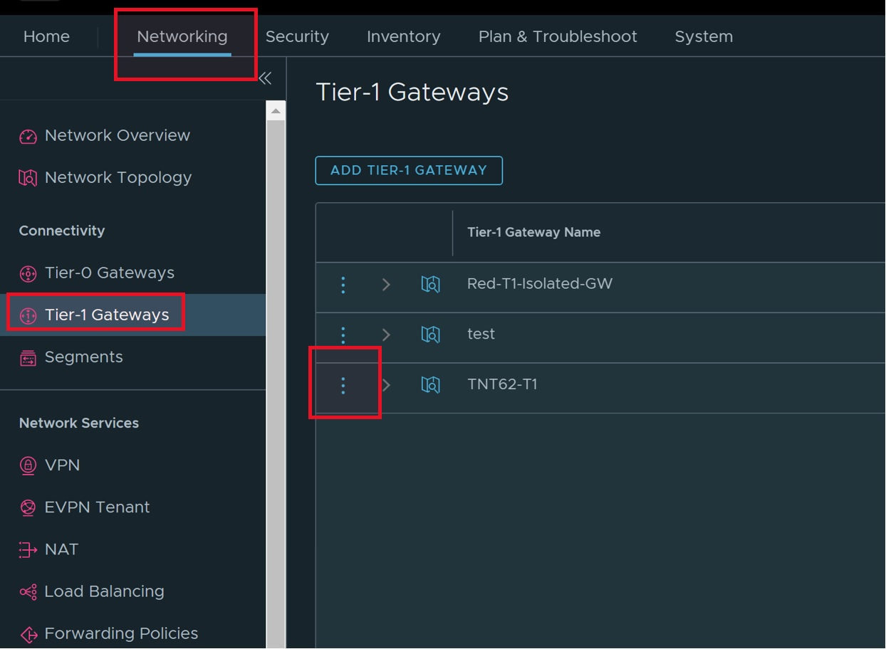
4. Click on "Edit" to modify the gateway.
5. Click on Static Route to expand the section. 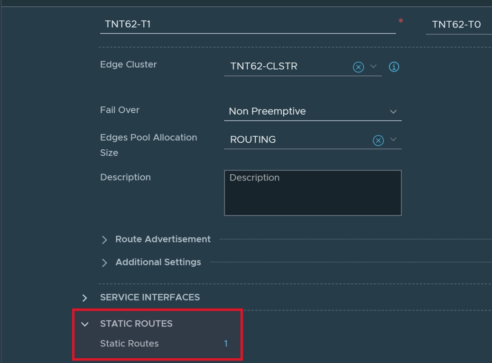
6. Click on "Set" to create a new static route.
7. Add a static route to divert southbound ingress traffic from default Tier-1 towards NVA virtual IP address (North VIP). 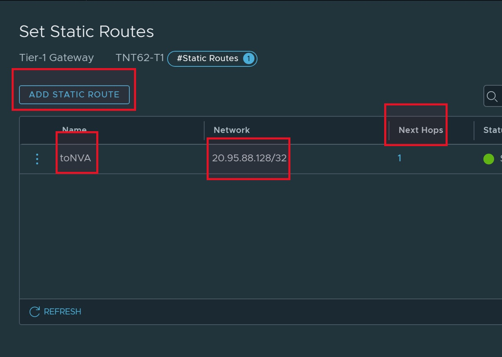


8. Save the configuration.


#### Setup static routes on isolated Tier-1 gateway for northbound traffic towards internet

In this section you will create static routes from isolated Tier-1 gateways to firewall/NVA. Due to the limitation of NSX-T, you will be breaking down the default route (0.0.0.0/0) into two sub networks (0.0.0.0/1 and 128.0.0.0/1)


1. Select "Tier-1 Gateways" blade on right. 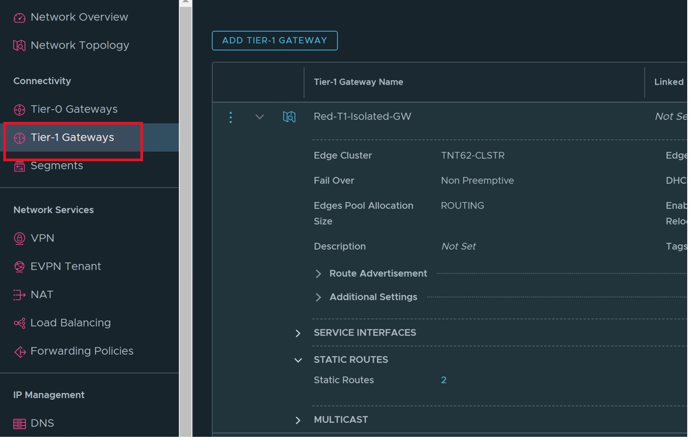
2. Click three dots on the left to edit the gateway.
3. Expand "STATIC ROUTES". 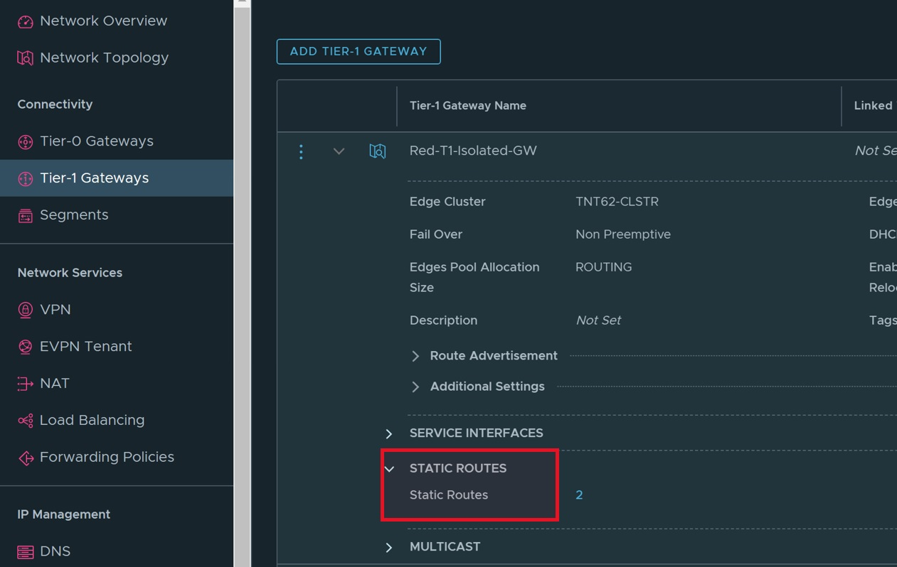
4. Click "ADD STATIC ROUTES". 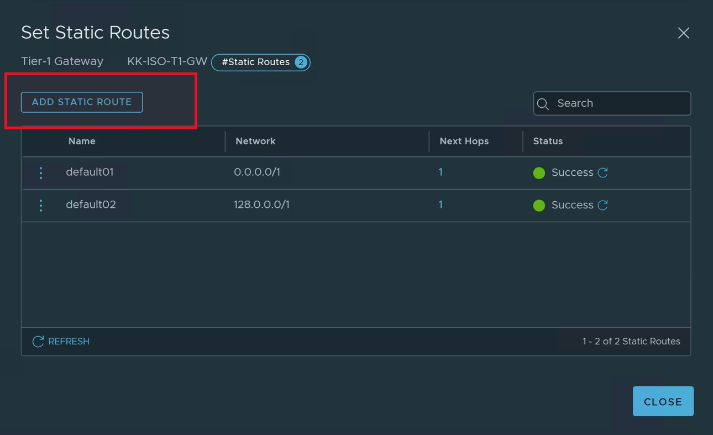
5. Create a default static route.
   1. Enter "default01" as the name.
   2. Enter "0.0.0.0/1" as the network.
   3. Click on "Next Hops" to add one. 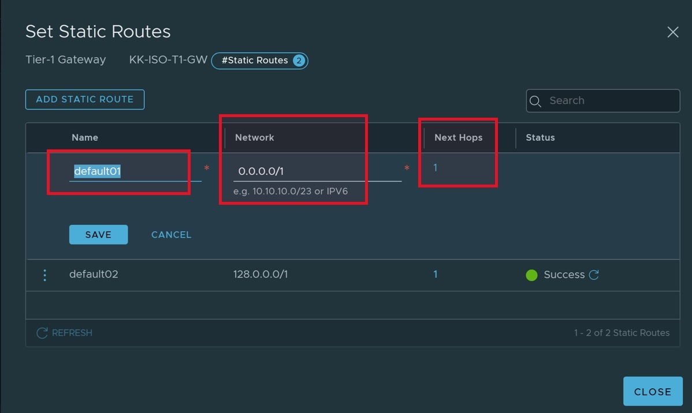
6. Set Virtual NVA IP Address as the next hop. 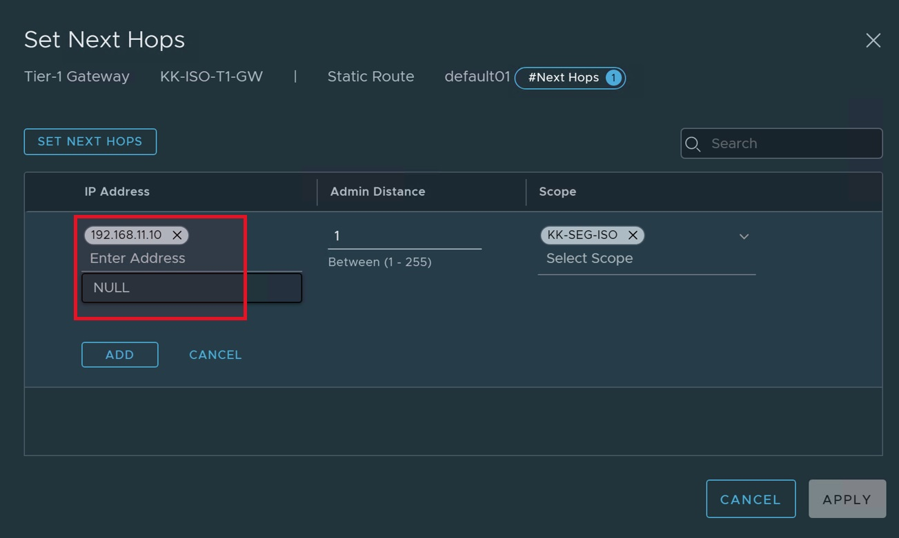
7. Save the changes.
8. Create one more default route like above. This time replace name with "default02" and network with "128.0.0.0/1". Save the configuration.
9. Final static routes should look like below: 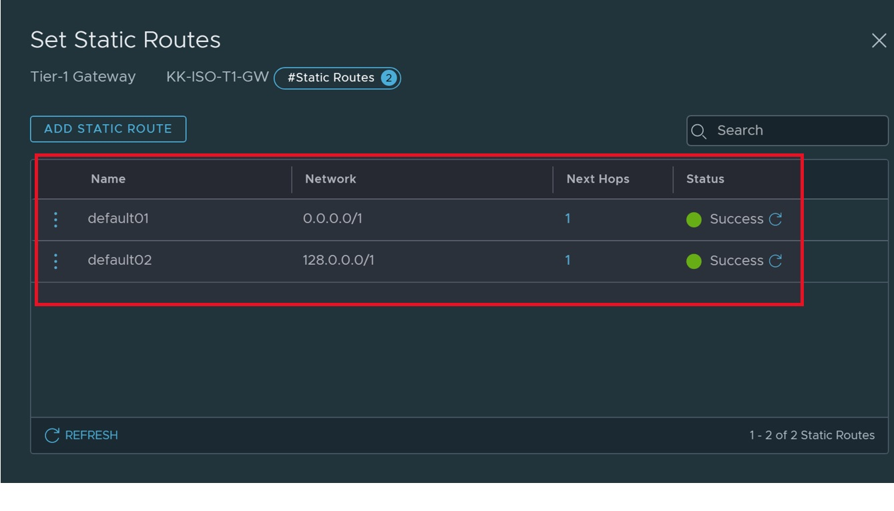


#### Repeat above steps for remaining isolated Tier-1 gateways

In this section, you will repeat the above steps for "Green-T1-Gateway" and "Blue-T1-Gateway."

#### Testing

In this section you will test your setup. You will ping to a server on internet from your VM in Red, Green and Blue segments. Refer to Microsoft documentation on how to create a VM in AVS environment.

1. Login to a VM in Red-App segment.
2. Run following command to check routing and source NATting. Make sure DNS is setup correctly on your client VM.
   1. Check HTTP connectivity and SNAT
   ```
   # curl ip.me
   ```
   2. Check ICMP connectivity
   ```
   # ping www.microsoft.com
   ```
3. Capture packets on NVA interface to validate.
```
# tcpdump -i ens192
# tcpdump -i ens160
```