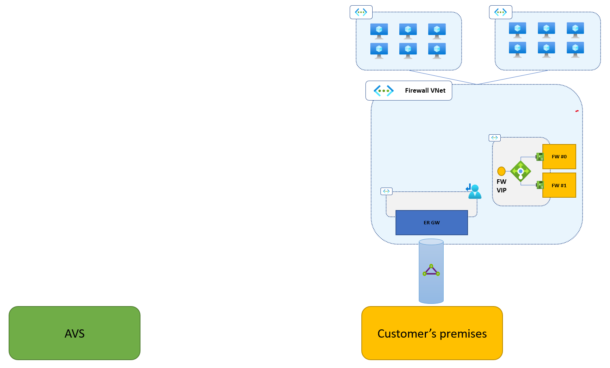
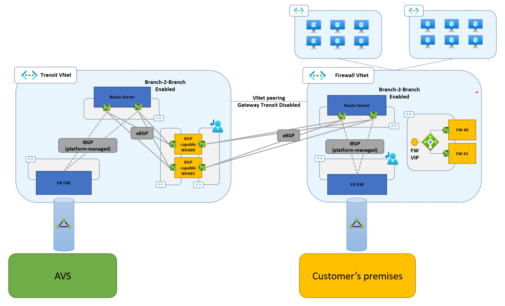
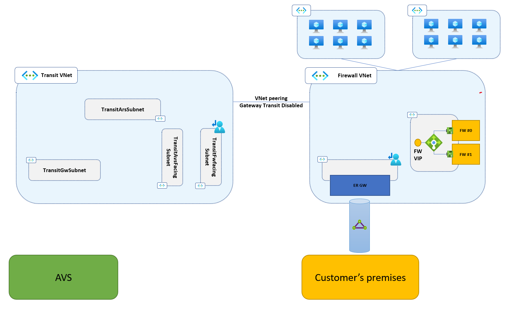
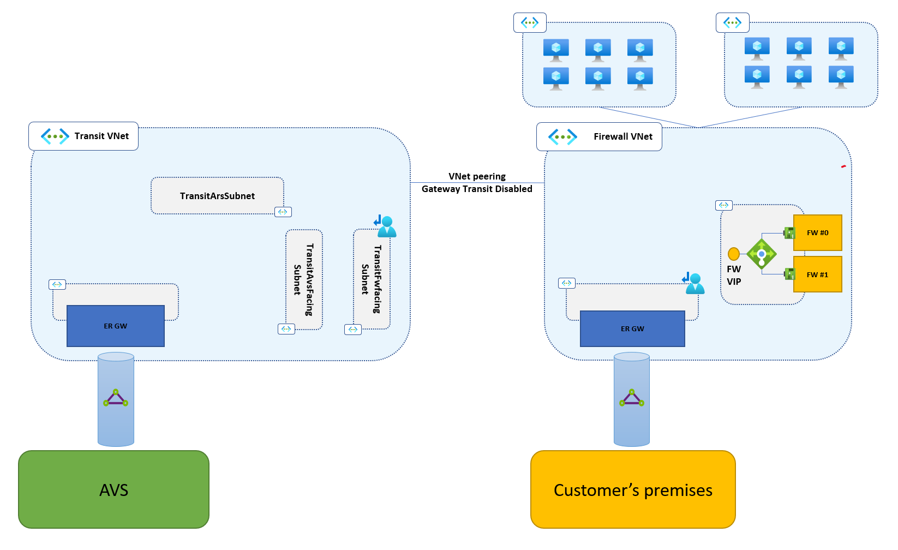
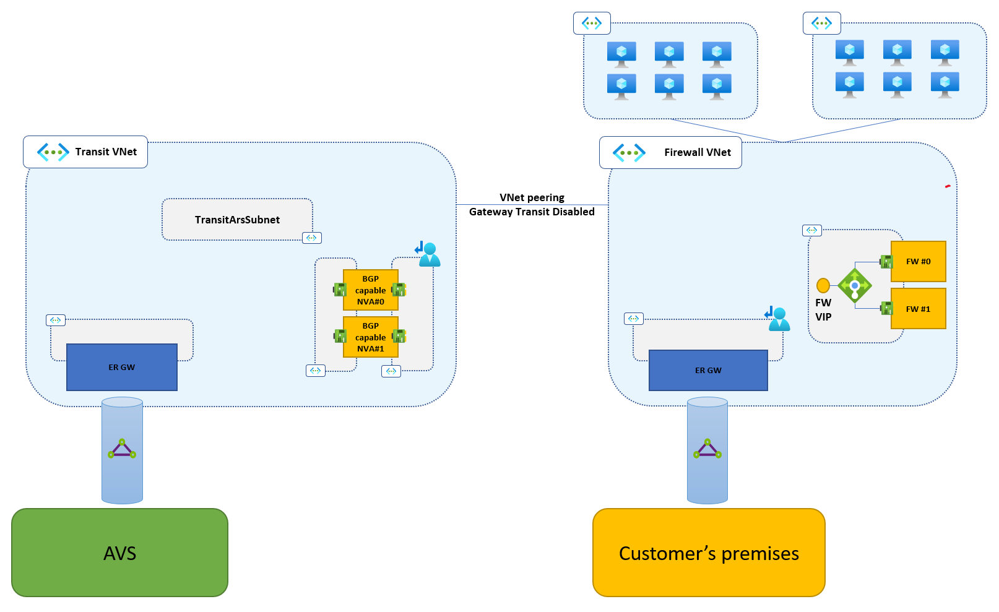
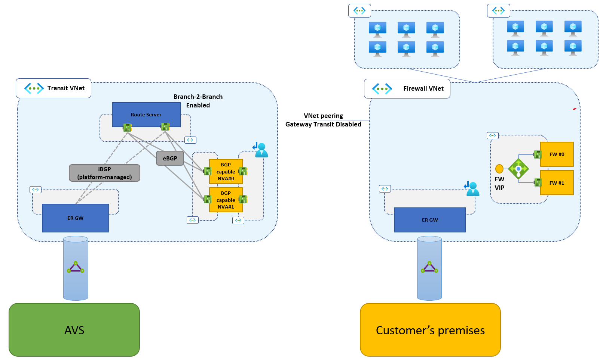
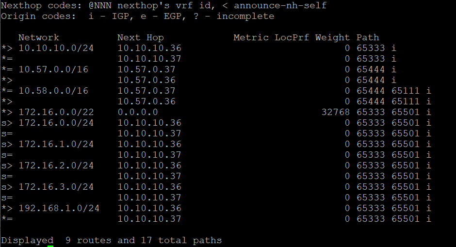

# Implement Expressroute connectivity for AVS without Global Reach
This article walks through the implementation of network connectivity between an AVS private cloud and on-prem sites connected to Azure over Expressroute, when Global Reach cannot be used. More information about this topology is available [here](./eslz-network-topology-connectivity.md). Typical cases where Global Reach is not applicable include, but are not limited to, the following:

- Traffic between AVS private clouds and on-prem sites must be inspected by a firewall running in an Azure VNet (typically, in the hub VNet of a hub&spoke network). 
- The Expressroute circuit that connects the on-prem site(s) with Azure has been deployed in a peering location that does not support Global Reach. For more information on Global Reach availability, please refer to the official [Expressroute documentation](https://docs.microsoft.com/en-us/azure/expressroute/expressroute-global-reach#availability).  

Azure Virtual WAN users should not implement the topology covered in this article and consider Virtual WAN's Routing Policy/Routing Intent features instead. For more details and feature availability see [the official Virtual WAN documentation](https://docs.microsoft.com/en-us/azure/virtual-wan/how-to-routing-policies). 

## Prerequisites
This step-by-step guide assumes that the following resources have been already deployed and configured:

- An AVS private cloud.
- An Azure VNet hosting an Expressroute gateway and a firewalling solution (Azure Firewall or third-party NVA clusters). The VNet is typically the hub VNet of an hub&spoke network deployed in a single Azure region. However, a fully-fledged hub&spoke topology is not required to successfully implement the solution described in this article. Hence, this VNet will be referred to as the "Firewall VNet" in the sections below.
- A fully provisioned Expressroute circuit, connected both to the on-prem site(s) and the Expressroute Gateway hosted in the Firewall VNet.

The picture below shows how your environment should look like before you execute the steps described in this article.



It is not required for the resources listed above to be in the same Azure subscription, nor in subscriptions associated to the same AAD tenant.

By following the steps in this article, the following new resources will be deployed:

- An Azure Virtual Network, referred to as "Transit VNet", peered to the Firewall VNet.
- An Azure Route Server hosted in the Transit VNet. 
- An Expressroute Gateway hosted in the Transit VNet.
- A Connection between the Expressroute Gateway in the Transit VNet and the AVS-provided Expressroute circuit.
- One or more third-party BGPv4-capable NVAs, with two NICs.
- A Custom Route Table, attached to one the NVAs subnets (more details provided below).
- An Azure Route Server hosted in the Firewall VNet.

At the end of this step-by-step guide, your environment will look like the one in the picture below.



Connectivity among the AVS private cloud, the Transit VNet, the Firewall VNet and the on-prem site(s) is entirely based on Expressroute and VNet peering, both of which  work cross-subscription and cross-tenant. Therefore, the resources listed above can be deployed across multiple subscriptions, if so mandated by security/billing/governance requirements. Also, it is not required for all the components listed above to be in same Azure region. However, the latency and cost implications of deploying across multiple regions must be carefully evaluated. Latency increases with the geographical distance travelled by traffic exchanged between the AVS private cloud and the on-prem sites. Cost is affected by the VNet peering type (intra-region vs. global) and by the SKU of the Expressroute circuit that connects the on-prem site(s). The Expressroute Premium SKU is needed if the circuit's peering location and the Firewall VNet are in different Azure Geographies. See [this article](https://docs.microsoft.com/en-us/azure/expressroute/expressroute-locations#locations) for more information. 

The following address prefixes must be allocated for the Transit VNet:
 - a /27 (or larger) prefix for the GatewaySubnet (the subnet that hosts the Expressroute Gateway).
 - a /27 (or larger) prefix for the RouteServerSubnet (the subnet that hosts Azure Route Server).
 - two /28 (or larger) prefixes for the two subnets to which the BGP-capable NVAs will be attached.
The Transit VNet's address space can be defined as the union of four non-contiguous prefixes (two /27 prefixes and two /28 prefixes) to minimize address space utilization. It is also possible to allocate a single /25 prefix for the Transit VNet, in which case a /27 prefix remains unused.

A /27 (or larger) prefix must be allocated for the RouteServerSubnet in the Firewall VNet. It can be carved out of unused ranges in the VNet's address space, or it can be added as a non-contiguous prefix. 

The table below summarizes the address allocation requirements. All the prefixes listed in the table *must not* overlap with any other prefixes used in the AVS private cloud, in the Firewall VNet (and its directly connected spokes, if any) or in the remote site(s) connected over Expressroute.

| Virtual Network | Subnet            | Netmask | Notes                                                                     | 
|-----------------|-------------------|---------|---------------------------------------------------------------------------|
| Transit VNet    | GatewaySubnet     | /27     | The subnet must be named "GatewaySubnet"                                  |
| Transit VNet    | RouteServerSubnet | /27     | The subnet must be named "RouteServerSubnet"                              |
| Transit VNet    | AvsFacingSubnet   | /28     | The subnet name can be customized to fit any applicable naming convention |
| Transit VNet    | FwFacingSubnet    | /28     | The subnet name can be customized to fit any applicable naming convention |
| Firewall VNet   | RouteServerSubnet | /27     | The subnet must be named "RouteServerSubnet"                              |

## Logging into Azure subscriptions
As mentioned in the previous section, it is possible to deploy the required resources across multiple subscriptions and/or multiple regions. As the allocation of resources to subscriptions may vary greatly across real-world environments, this article does not provide prescriptive guidance as to where to deploy each resource. It is the reader's responsibility to properly set the Azure context for executing the code snippets provided below. Please review the official documentation for instructions on how to log into Azure and select a subscription to work in (with[Azure PowerShell](https://docs.microsoft.com/en-us/powershell/azure/authenticate-azureps?view=azps-7.4.0) or [Azure CLI](https://docs.microsoft.com/en-us/cli/azure/manage-azure-subscriptions-azure-cli)). 

The code snippets below provide Az CLI commands and assume execution in a Bash shell. A Microsoft-managed interactive, authenticated, browser-accessible shell is provided by [Azure Cloud Shell](https://docs.microsoft.com/en-us/azure/cloud-shell/overview). It supports both Powershell and Bash. Follow the [instructions here](https://docs.microsoft.com/en-us/azure/cloud-shell/overview#choice-of-preferred-shell-experience) to log into Azure Cloud Shell and run a Bash shell.

## Step #0 - Define variables
The purpose of this section is to define in your Bash session the variables used in the Az CLI scripts for the subsequent steps. The variables MUST be set to values that fit your environment. Make sure that all variables are defined before running any snippet. If you close your shell between two steps, or you execute different steps in different shells, make sure to define the variables below in all shells.
Please note that some additional variables are used within a single snippet. Those variables are defined in the relevant code snippets. Instructions on how to set them are provided when needed.
In the code snippet below, change the example values provided for each variable to fit your environment. When done, open a Bash shell and run it.

```Azure CLI
#
# Name of the new resource group that will contain the Transit VNet. Set according to your naming convention. 
# A resource group with that name MUST NOT exist in your subscription.
#
transitRgName="TRANSITRG"

#
# Name on the Transit VNet. It MUST be unique within the Transit VNet's resource group.
#
transitVnetName="transit-vnet"

#
# Azure region where the Transit VNet will be deployed
#
transitLocation="westeurope"

#
# Address space of the Transit VNet. 
# It can be a single /25 (or larger) prefix), or an array of prefixes that meet the conditions listed in the Prerequisites section  
#
transitVnetPrefixes="10.10.10.0/24"

#
# Address prefix of the Transit VNet's GatewaySubnet. It must be /27, or larger.
#
transitGwSubnetPrefix="10.10.10.0/27"

#
# Address prefix of the Transit VNet's RouteServerSubnet. It must be /27, or larger.
#
transitArsSubnetPrefix="10.10.10.32/27"

#
# Address prefix of the AVS-facing subnet (in the Transit VNet). The BGP-capable NVAs will have a NIC attached to this subnet.   
# It must be /28, or larger.
#
transitAvsFacingSubnetPrefix="10.10.10.64/27"

#
# Address prefix of the firewall-facing subnet (in the Transit VNet). The BGP-capable NVAs will have a NIC attached to this subnet.   
# It must be /28, or larger.
#
transitFwFacingSubnetPrefix="10.10.10.96/27"

#
# Private IP address for the firewall-facing NIC of the first BGP-capable NVA instance. This article assumes that two NVA instances are deployed, for HA.
#
nva0FwFacingIp="10.10.10.100"

#
# Private IP address for the AVS-facing NIC of the first BGP-capable NVA instance. This article assumes that two NVA instances are deployed, for HA.
#
nva0AvsFacingIp="10.10.10.68"

#
# Private IP address for the firewall-facing NIC of the second BGP-capable NVA instance. This article assumes that two NVA instances are deployed, for HA.
#
nva1FwFacingIp="10.10.10.101"

#
# Private IP address for the AVS-facing NIC of the second BGP-capable NVA instance. This article assumes that two NVA instances are deployed, for HA.
#
nva1AvsFacingIp="10.10.10.69"

#
# ASN number announced by the BGP-capable NVAs. Choose any ASN not included in Azure's reserved range (65515-65520) and not used in your network.
#
nvaAsn="65111"

# 
# Name of the (existing) VNet where the firewall runs.
# Typically, it is the hub VNet of a hub&spoke network in an Azure region.
# 
fwVnetName="firewall-vnet"

#
# Name of the Firewall VNet's resource group.
# This is assumed to exist already in your environment.
#
fwRgName="HUBRG"

#
# Address space of the (existing) Firewall VNet. This variable is an array that can contain multiple prefixes. Example: ("prefix1" "prefix2" "prefix3")
#
firewallVnetPrefixes=("10.57.0.0/16")

#
# IP prefix for the Firewall VNet's RouteServerSubnet.
# It can be carved out of unused ranges in the VNet's address space, or it can be added as a non-contiguous prefix.
# In the latter case, you must add this prefix to the Firewall VNet's address space before moving to the next steps.
# 
fwArsSubnetPrefix="10.57.0.32/27"

#
# The internal IP address of the (existing) firewall running in the firewall VNet.
# If you are using Azure Firewall, this is your Firewall instance's private IP address.
# If you are running 3rd party firewall NVAs behind an Azure Internal Load Balancer, this is the Load Balancer's front-end IP.
#
firewallVip="10.57.0.70"
```

## Step #1 - Provision the Transit VNet
In this step, you will deploy the Transit VNet. If needed, set the context to the subscription where the Transit VNet must be deployed. Make sure that the required variables are set (Step #0) and run the code snippet below.

```Azure CLI
# Deploy Transit VNet and required subnets
az group create --name $transitRgName --location $transitLocation
az network vnet create \
        --name $transitVnetName \
        --address-prefixes $transitVnetPrefixes \
        --resource-group $transitRgName \
        --location $transitLocation
az network vnet subnet create \
        --name GatewaySubnet \
        --address-prefixes $transitGwSubnetPrefix \
        --resource-group $transitRgName \
        --vnet-name $transitVnetName     
az network vnet subnet create \
         --name AvsFacingSubnet \
        --address-prefixes $transitAvsFacingSubnetPrefix \
        --resource-group $transitRgName \
        --vnet-name $transitVnetName
az network vnet subnet create \
        --name FwFacingSubnet  \
        --address-prefixes $transitFwFacingSubnetPrefix \
        --resource-group $transitRgName \
        --vnet-name $transitVnetName
az network vnet subnet create \
        --name RouteServerSubnet \
        --address-prefixes $transitArsSubnetPrefix \
        --resource-group $transitRgName \
        --vnet-name $transitVnetName

# Deploy Custom Route Table for the FwFacingSubnet
az network route-table create \
        --name FwFacingRt \
        --resource-group $transitRgName \
        --disable-bgp-route-propagation true
az network route-table route create \
        --name defaultViaFirewall \
        --resource-group $transitRgName \
        --route-table-name FwFacingRt \
        --address-prefix 0.0.0.0/0 \
        --next-hop-type VirtualAppliance \
        --next-hop-ip-address $firewallVip
for i in ${!firewallVnetPrefixes[@]}; do
        az network route-table route create \
                --name "firewallVnetRoute$i" \
                --resource-group $transitRgName \
                --route-table-name FwFacingRt \
                --address-prefix ${firewallVnetPrefixes[$i]} \
                --next-hop-type VirtualAppliance \
                --next-hop-ip-address $firewallVip
done
az network vnet subnet update \
        --name FwFacingSubnet \
        --resource-group $transitRgName \
        --vnet-name $transitVnetName \
        --route-table FwFacingRt
```

When the Transit VNet is fully provisioned, peer it with the Firewall VNet. The peering relationship must be defined with the following settings:

- "Traffic to remote virtual network": Select "Allow (default)".
- "Traffic forwarded from remote virtual network": Select "Allow (default)".
- "Virtual network gateway or Route Server": Select "None (default)".

Different procedures exist to configure peering relationships between two VNets, depending whether they belong to the same subscription or two different subscriptions (and, potentially, AAD tenants). Please review [this article](https://docs.microsoft.com/en-us/azure/virtual-network/virtual-network-peering-overview#next-steps) for detailed instructions on how to peer the Firewall VNet and the Transit VNet in your environment. 

At the end of this step, your environment will look as shown in the figure below.



## Step #2 - Provision the Expressroute Gateway in the Transit VNet
In this step, you will provision an Expressroute Gateway in the Transit VNet and connect it to your AVS private cloud's managed circuit. Review [this article](https://docs.microsoft.com/en-us/azure/expressroute/expressroute-about-virtual-network-gateways#gwsku) to select the most Expressroute Gateway SKU based on the estimated AVS traffic throughput. In order to find the identifier of the managed Expressroute circuit associated to your AVS private cloud and generate an authorization key open the Azure portal, browse to the AVS private cloud and follow the instructions available [here](https://docs.microsoft.com/en-us/azure/azure-vmware/tutorial-configure-networking#connect-expressroute-to-the-virtual-network-gateway). Use the circuit identifier and the authorization key to set the variables in the code snippet below. 

Note: If you closed the shell used in the previous steps, you must set the variables again (see Step #0).

Note: Expressroute Gateways may take up to 40 minutes to deploy.

```Azure CLI
# Define additional variables (used in this snippet only)
ergwSku="Choose the appropriate SKU, e.g. HighPerformance"
avsManagedErCircuitId="AVS managed Expressroute circuit ID"
avsManagederCircuitAuthKey="AVS managed Expressroute authorization key"

# Deploy Expressroute Gateway
az network public-ip create \
        --name transit-ergw-pip \
        --resource-group $transitRgName \
        --sku Standard \
        --version IPv4 \
        --zone 1 2 3 \
        --location $transitLocation
az network vnet-gateway create \
        --name transit-ergw \
        --vnet $transitVnetName \
        --resource-group $transitRgName \
        --gateway-type Expressroute \
        --sku $ergwSku \
        --public-ip-addresses transit-ergw-pip

# Connect Expressroute Gateway to AVS managed Expressroute circuit
trErgwId=$(az network vnet-gateway show --name transit-ergw --resource-group $transitRgName --query id --output tsv)
az network vpn-connection create \
        --name transit-to-avs \
        --resource-group $transitRgName \
        --vnet-gateway1 $trErgwId \
        --express-route-circuit2 $avsManagedErCircuitId \
        --authorization-key $avsManagederCircuitAuthKey
```
At the end of this step, your environment will look as shown in the figure below.

 

## Step #3 - Provision the BGP-capable NVAs
In this step you will provision the BGP-capable NVAs in the Transit VNet. At least two NVAs are recommended for high-availability. In order to make the code snippets below aplicable to any Azure region, the two NVA instances are deployed in an availability set. It is possible to customize the code to deploy the instances in different availability zones, when working in regions that support them. High-throughput scenarios might require more than two NVAs. The approach presented in this article is horizontally-scalable up to the [maximum number of BGP peers supported by Azure Route Server](https://docs.microsoft.com/en-us/azure/route-server/route-server-faq#route-server-limits). 
Each NVA must have at least two NICs for traffic forwarding, attached to the FwFacingSubnet and the avsFacingSubnet. Additional interfaces, for example for management purposes, may be added, but are not required. 
In the code snippet below, define the static private IP addresses you want to assign to each interface. For each NVA instance, select an available IP addresses in the FwfacingSubnet and an availble IP address in the AvsFacingSubnet (created in Step #2). Please note that, in Azure, the first four IPs and the last IP in the subnet address prefix are reserved and cannot be assigned to VMs. Also, set the credentials and the VM size. Before running the code snippet, make sure the context is set to the subscription where you have deployed the Transit VNet.

Note: If you closed the shell used in the previous steps, you must set the variables again (see Step #0).

```Azure CLI
# Define username and password for the NVAs
nvaUser="bgpadmin"
nvaPassword="<choose password>"

# Define VM size for the NVAs
nvaSize="Standard_D1_v2"
nvaImage="OpenLogic:CentOS:8_5:8.5.2022012100"

# Deploy NICs
az network nic create --name nva0-fwfacing-nic \
        --resource-group $transitRgName \
        --location $transitLocation \
        --vnet $transitVnetName \
        --subnet FwFacingSubnet \
        --ip-forwarding true \
        --private-ip-address $nva0FwFacingIp

az network nic create --name nva0-avsfacing-nic \
        --resource-group $transitRgName \
        --location $transitLocation \
        --vnet $transitVnetName \
        --subnet AvsFacingSubnet \
        --ip-forwarding true \
        --private-ip-address $nva0AvsFacingIp      

az network nic create --name nva1-fwfacing-nic \
        --resource-group $transitRgName \
        --location $transitLocation \
        --vnet $transitVnetName \
        --subnet FwFacingSubnet \
        --ip-forwarding true \
        --private-ip-address $nva1FwFacingIp

az network nic create --name nva1-avsfacing-nic \
        --resource-group $transitRgName \
        --location $transitLocation \
        --vnet $transitVnetName \
        --subnet AvsFacingSubnet \
        --ip-forwarding true \
        --private-ip-address $nva1AvsFacingIp    

# Deploy NVAs in an availability set
az vm availability-set create --name bgp-nva-aset --resource-group $transitRgName --location $transitLocation
az vm create --name bgp-nva-0 \
        --resource-group $transitRgName \
        --location $transitLocation \
        --image $nvaImage \
        --size $nvaSize \
        --availability-set bgp-nva-aset \
        --authentication-type password \
        --admin-username $nvaUser \
        --admin-password $nvaPassword \
        --storage-sku Standard_LRS \
        --nics nva0-fwfacing-nic nva0-avsfacing-nic

az vm create --name bgp-nva-1 \
        --resource-group $transitRgName \
        --location $transitLocation \
        --image $nvaImage \
        --size $nvaSize \
        --availability-set bgp-nva-aset \
        --authentication-type password \
        --admin-username $nvaUser \
        --admin-password $nvaPassword \
        --storage-sku Standard_LRS \
        --nics nva1-fwfacing-nic nva1-avsfacing-nic
```
At the end of this step, your environment will look as shown in the figure below.

 

## Step #4 - Provision the Azure Route Server in the Transit VNet
In this step you will provision an Azure Route Server instance in the Transit VNet. Before starting this step, make sure that the Expressroute Gateway in the Transit VNet has been successfully provisioned (Step #2). If needed, set the Azure context in such a way to operate in the subscription that contains the Transit VNet and run the code snippet below.

Note: If you closed the shell used in the previous steps, you must set the variables again (see Step #0).

```Azure CLI
# Retrieve Id of the RouteServerSubnet
trArsSubnetId=$(az network vnet subnet show \
        --name RouteServerSubnet \
        --vnet-name $transitVnetName \
        --resource-group $transitRgName \
        --query id --output tsv)

# Deploy Azure Route Server
az network public-ip create --name transit-ars-pip --resource-group $transitRgName --version IPv4 --sku Standard --zone 1 2 3 --location $transitLocation
az network routeserver create \
        --hosted-subnet $trArsSubnetId \
        --name transit-ars \
        --resource-group $transitRgName \
        --location $transitLocation \
        --public-ip-address transit-ars-pip
az network routeserver update --name transit-ars --resource-group $transitRgName --allow-b2b-traffic

# Define peerings with the BGP-capable NVAs
az network routeserver peering create --name nva0 \
        --routeserver transit-ars \
        --resource-group $transitRgName \
        --peer-ip $nva0AvsFacingIp \
        --peer-asn $nvaAsn
az network routeserver peering create --name nva1 \
        --routeserver transit-ars \
        --resource-group $transitRgName \
        --peer-ip $nva1AvsFacingIp \
        --peer-asn $nvaAsn
```

At the end of this step, your environment will look as shown in the figure below.

 

## Step #5 - Deploy Azure Route Server in the Firewall VNet
In this step, you will deploy an Azure Route Server instance the Firewall VNet. The instructions below assume that a /27 (or larger) subnet can be added to the Firewall subnet, as described in the prerequsites section. 

Warning: Deploying a Route Server instance in a VNet that already contains an Expressroute Gateway will temporarily disrupt Expressroute connectivity. If you are working in a production environment, you need to perform this step during a scheduled maintenance window. More information is available [here](https://docs.microsoft.com/en-us/azure/route-server/troubleshoot-route-server#why-do-i-lose-connectivity-to-my-on-premises-network-over-expressroute-andor-azure-vpn-when-im-deploying-azure-route-server-to-a-virtual-network-that-already-has-expressroute-gateway-andor-azure-vpn-gateway).  

If needed, set the Azure context in such a way to operate in the subscription that contains the Firewall VNet. Then, run the code snippet below to create the RouteServerSubnet and deploy an Azure Route Server instance in the Firewall subnet. 

Note: If you closed the shell used in the previous steps, you must set the variables again (see Step #0).

Note: Azure Route Server takes about 20 minutes to deploy.

```Azure CLI
# Create RouteServerSubnet
fwArsSubnetId=$(az network vnet subnet create \
        --name RouteServerSubnet \
        --address-prefixes $fwArsSubnetPrefix \
        --resource-group $fwRgName \
        --vnet-name $fwVnetName \
        --query id --output tsv)

# Deploy Route Server
fwLocation=$(az network vnet show --name $fwVnetName --resource-group $fwRgName --query location --output tsv)
az network public-ip create --name fw-ars-pip --resource-group $fwRgName --version IPv4 --sku Standard --zone 1 2 3 --location $fwLocation
az network routeserver create \
        --hosted-subnet $fwArsSubnetId \
        --name fw-ars \
        --resource-group $fwRgName \
        --location $fwLocation \
        --public-ip-address fw-ars-pip
az network routeserver update --name fw-ars --resource-group $fwRgName --allow-b2b-traffic

# Define peerings with the BGP-capable NVAs
az network routeserver peering create --name nva0 \
        --routeserver fw-ars \
        --resource-group $fwRgName \
        --peer-ip $nva0FwFacingIp \
        --peer-asn $nvaAsn
az network routeserver peering create --name nva1 \
        --routeserver fw-ars \
        --resource-group $fwRgName \
        --peer-ip $nva1FwFacingIp \
        --peer-asn $nvaAsn

# Store Route Server's peer IPs
routeServerIps=($(az network routeserver show \
        --name fw-ars \
        --resource-group $fwRgName \
        --query virtualRouterIps --output tsv))
```
Without closing the shell where you executed the code snippet above, set the context to the Transit VNet's subscription and run the command below. 

```Azure CLI
for i in ${!routeServerIps[@]}; do \
        az network route-table route create \
                --name "fwArsPeerIpDirect"$[i] \
                --resource-group $transitRgName \
                --route-table-name FwFacingRt \
                --address-prefix "${routeServerIps[$i]}/32" \
                --next-hop-type VirtualAppliance \
                --next-hop-ip-address ${routeServerIps[$i]}
done
```

At the end of this step, your environment will look as shown in the figure below.

 

## Step #6 - Add AVS routes to the Firewall VNet's GatewaySubnet
In this step, you will configure the custom route table associated to the Firewall VNet's GatewaySubnet. This is needed to route traffic originating from the on-prem site(s) and destined to the AVS private cloud via the firewall hosted in the Firewall VNet. The custom route table must contain routes for the AVS private cloud /22 network block and for each IP subnet associated to NSX-T segments. The next hop must be the firewalling solution's IP (for Azure Firewall, this is the instance's private IP; For firewall clusters based on third-party NVAs, it is typically the front-end IP of the cluster's Azure Internal Load Balancer). These routes are meant to override the ones automatically injected in the Firewall VNet's route table by Route Server, in such a way to steer traffic destined to AVS to the firewall, instead of directly to the BGP-capable NVAs.

To retrieve the IP prefixes used in your AVS Private Cloud, set the context to the subscription that contain it and execute the following snippet.

Note: If you closed the shell used in the previous steps, you must set the variables again (see Step #0).

```Azure CLI
#
# Name of your (existing) AVS Private Cloud
#
avsPrivateCloudName="Name of your existing AVS Private Cloud"

#
# Resource group of your (existing) AVS Private Cloud
#
avsPrivateCloudRg="Name of your existing AVS Private Cloud's resource group"

avsPrivateCloudPrefixes=()
avsPrivateCloudPrefixes+=( $( az vmware private-cloud show \
        --name $avsPrivateCloudName \
        --resource-group $avsPrivateCloudRg \
        --query networkBlock --output tsv))
```

Without closing the shell where the previous code snippet was run, set the context to the subscription that contains the Firewall VNet and execute the following commands.

```Azure CLI
#
# Name of the custom route table to be associated to the Firewall VNet's GatewaySubnet, if none exists.
# If the GatewaySubnet has an existing custom route table associated to it, the script does not change its name and simply adds the required routes.
#
gwSubnetRtName="gwSubnetRt"

gwSubnetRtId=$(az network vnet subnet show --name GatewaySubnet --vnet-name $fwVnetName --resource-group $fwRgName --query routeTable.id -o tsv)
if [ -z "$gwSubnetRtId"]; then
        az network route-table create --name $gwSubnetRtName --resource-group $fwRgName --disable-bgp-route-propagation false
        az network vnet subnet update --name GatewaySubnet --resource-group $fwRgName --vnet-name $fwVnetName --route-table $gwSubnetRtName
else
        gwSubnetRtName=$(az network route-table show --ids $gwSubnetRtId --query name -o tsv)
fi      

for i in ${!avsPrivateCloudPrefixes[@]}; do
        az network route-table route create \
                --name "avsRoute$i" \
                --resource-group $fwRgName \
                --route-table-name $gwSubnetRtName \
                --address-prefix ${avsPrivateCloudPrefixes[$i]} \
                --next-hop-type VirtualAppliance \
                --next-hop-ip-address $firewallVip
done
```

Please note: As you add workload segments to your AVS Private cloud, make sure to add routes for those segments to the route table you just created. The next hop for each added route should be the firewall's IP address.

## Step #7 - Configure routing on the BGP-capable NVAs
In this step you will finalize the routing configuration of your BGP-capable NVAs. Configuration details may vary depending on which NVAs are used. 

### General routing requirements
Irrespective of what BGP-capable NVAs (Linux VMs vs. commercial routing products available in the Azure marketplace) you will deploy in your environment, the following configuration guidelines apply.

- Azure Route Servers always use the reserved ASN 65515. The BGP capable NVAs must use a different ASN (not included in the Azure-reserved range 65515-65520). As such, all sessions between NVAs and Route servers are external BGP (eBGP) sessions.
- Azure Route Servers are attached to dedicated subnets in their respective VNets. As such, BGP sessions with the BGP capable NVAs are established between interfaces that do not share a common subnet. Therefore, eBGP multi-hop must be supported and enabled on the NVAs.
- Static routes must be defined in the NVAs' guest OS route tables to ensure reachability of the Route Servers (which are non-directly-connected external BGP peers). It is recommended to define static routes for the entire prefix of the RouteServerSubnets.
- As Route Servers in both the Firewall and the Transit VNet use ASN 65515, propagating routes between AVS and the on-prem sites requires removing ASN 65515 from the AS Path - to prevent the BGP loop detection mechanisms to drop routes. Route maps can be used for this purpose on most commercially available BGP routing solutions. 
-  As ASN 65515 is removed, a different mechanism than the default BGP loop detection must be used to avoid reflecting routes learned by each Route Server instance to the same instance. BGP communities or AS Path manipulation can be used. See next section for an example.
- Route aggregation for the AVS /22 network block. As described in Step #6, routes for all prefixes used in the AVS private cloud must be manually added to the Firewall VNet's GatewaySubnet (see Step #6). To reduce overhead, the BGP-capable appliances should summarize all the routes for AVS management networks and advertise the entire /22 prefix instead of the smaller ones actually announced by AVS.  

### Linux NVA with FRRouting configuration
This section shows how to implement the general routing guidelines when using CentOS Linux boxes with [FRRouting](https://frrouting.org/).
To install FRR and configure the Linux NVAs as routers, log into each one of the Linux NVA boxes deployed in the previous steps and execute the following commands in a shell. Make sure to complete the configuration on all NVA instances.

```Bash
#
# IP prefix of the RouteServerSubnet in the Firewall VNet. This is the same variable used in the previous sections' Azure CLI scripts. 
# The Linux NVAs, if deployed as described in the previous sections attach to this subnet through their "eth0" device.
#  
fwArsSubnetPrefix="10.57.0.32/27"

#
# IP prefix of the RouteServerSubnet in the Transit VNet. his is the same variable used in the previous sections' Azure CLI scripts.
# The Linux NVAs, if deployed as described in the previous sections attach to this subnet through their "eth1" device.
#  
transitArsSubnetPrefix="10.10.10.32/27"

#
# The first IP address of the subnet to which the "eth0" device is attached.
# This subnet was referred to as the "firewall-facing" subnet in the previous sections.
#
transitFwFacingSubnetGateway="10.10.10.97"

#
# The first IP address of the subnet to which the "eth1" device is attached.
# This subnet was referred to as the "avs-facing" subnet in the previous sections.
#
transitAvsFacingSubnetGateway="10.10.10.65"

# Install FRR
sudo dnf install frr -y

# Configure FRR to run the bgpd daemon
sudo sed -i 's/bgpd=no/bgpd=yes/g' /etc/frr/daemons
sudo touch /etc/frr/bgpd.conf
sudo chown frr /etc/frr/bgpd.conf
sudo chmod 640 /etc/frr/bgpd.conf

# Start FRR daemons
sudo systemctl enable frr --now

# Enable IP forwarding on all interfaces. 
# Please note that this configuration is transient and will be lost if the VM is rebooted.
# On CentOS VMs, you can add this setting to your /etc/sysclt.d directory to make it persistent across reboots.
sudo sysctl -w net.ipv4.conf.all.forwarding=1

# Add static routes to ensure reachability for Route Servers (Route Server are not-directly-connected external BGP neighbours).
# Please note that this configuration is transient and will be lost if the VM is rebooted. 
# On CentOS VMs, you can add these routes to /etc/sysconfig/network-scripts/route-eth<X> to make them persistent across reboots. 
sudo ip route add $fwArsSubnetPrefix via $transitFwFacingSubnetGateway dev eth0
sudo ip route add $transitArsSubnetPrefix via $transitAvsFacingSubnetGateway dev eth1
```

### BGP configuration
The general routing requirements described in the previous section can be addressed, when running [FRRouting](https://frrouting.org/) on Linux VMs, with the following BGP configuration:

- Ingress route maps used to (1) remove ASN 65515 from the AS Path and (2) manipulate the AS Path in such a way to track where each route originates from (AVS private cloud or Azure native/on-prem sites). In the example below, two route maps (FROMAVS, FROMHUB) are used to prepend ASN 65444 to all routes learned from Azure/on-prem sites and ASN 65333 to all routes originated by AVS.
- Egress route maps used to prevent reflecting routes back to the speakers from which they were received. In the example below, two route maps (BLOCKAVSROUTE and BLOCKHUBROUTE) are used to prevent routes with ASN 65444 in their AS Path (i.e. routes learned from Azure native/on-prem sites) to be re-advertised to the Route Server instance in the Firewall VNet; and to prevent routes with ASN 65333 in their AS Path (i.e. routes learned from AVS) to be re-advertised to the Route Server instance in the Transit VNet.
- Routes for prefixes included in the AVS Private Cloud's network block are suppressed. A single route for the entire /22 prefix is announced instead.

To configure FRR accordingly, edit the configuration script below to fit your environment. More specifically, replace all occurrences of

- ```<BGP-capable NVA's ASN>``` with the ASN used in steps #4 and #5 to define the BGP peerings with Route Servers.
- ```<IP address of Transit VNet Route Server instance #1>``` with the second IP address of the Transit VNet's Route Server.
- ```<IP address of Firewall VNet Route Server instance #0>``` with the first IP address of the Transit VNet's Route Server.
- ```<IP address of Firewall VNet Route Server instance #1>``` with the second IP address of the Transit VNet's Route Server.
- ```</22 block allocated to your AVS private cloud>``` with the /22 prefix associated to your AVS Private Cloud.
- ```<avs routes ASN>``` with a private ASN (not used in your network and not included in the Azure reserved range 65515-65520. Please note the trailing underscore character in the access list definitions. Make sure to preserve it when editing the script below.
- ```<firewall routes ASN>``` with a different private ASN (not used in your network and not included in the Azure reserved range 65515-65520. Please note the trailing underscore character in the access list definitions. Make sure to preserve it when editing the script below.

Note: To avoid typos and ensure consistent replacements across the entire script, consider using the Bash command "[sed](https://www.gnu.org/software/sed/manual/sed.html)".

```
conf term
!
router bgp <BGP-capable NVA's ASN>
neighbor <IP address of Transit VNet Route Server instance #0> remote-as 65515  
neighbor <IP address of Transit VNet Route Server instance #0> ebgp-multihop 2
neighbor <IP address of Transit VNet Route Server instance #1> remote-as 65515 
neighbor <IP address of Transit VNet Route Server instance #1> ebgp-multihop 2
neighbor <IP address of Firewall VNet Route Server instance #0> remote-as 65515
neighbor <IP address of Firewall VNet Route Server instance #0> ebgp-multihop 2
neighbor <IP address of Firewall VNet Route Server instance #1> remote-as 65515
neighbor <IP address of Firewall VNet Route Server instance #1> ebgp-multihop 2
!
address-family ipv4 unicast
  aggregate-address </22 block allocated to your AVS private cloud> as-set summary-only
  neighbor <IP address of Transit VNet Route Server instance #0> route-map FROMAVS in
  neighbor <IP address of Transit VNet Route Server instance #0> route-map BLOCKAVSROUTE out
  neighbor <IP address of Transit VNet Route Server instance #1> route-map FROMAVS in
  neighbor <IP address of Transit VNet Route Server instance #1> route-map BLOCKAVSROUTE out
  neighbor <IP address of Firewall VNet Route Server instance #0> route-map FROMHUB in
  neighbor <IP address of Firewall VNet Route Server instance #0> route-map BLOCKHUBROUTE out
  neighbor <IP address of Firewall VNet Route Server instance #1> route-map FROMHUB in
  neighbor <IP address of Firewall VNet Route Server instance #1> route-map BLOCKHUBROUTE out
exit-address-family
!
bgp as-path access-list AVSROUTE permit <avs routes ASN>_
bgp as-path access-list CONTAINS-ER-RESERVED-ASN permit _65515_
bgp as-path access-list CONTAINS-ER-RESERVED-ASN permit 65515_
bgp as-path access-list CONTAINS-ER-RESERVED-ASN permit _65515 12076
bgp as-path access-list CONTAINS-ER-RESERVED-ASN permit _65515 12076_
bgp as-path access-list CONTAINS-ER-RESERVED-ASN permit _65515 12076 398656
bgp as-path access-list CONTAINS-ER-RESERVED-ASN permit _65515 12076 398656_
bgp as-path access-list HUBROUTE permit <firewall routes ASN>_
!
route-map FROMHUB permit 10
match as-path CONTAINS-ER-RESERVED-ASN
set as-path exclude 65515 12076 398656
set as-path prepend <firewall routes ASN>
!
route-map FROMAVS permit 10
match as-path CONTAINS-ER-RESERVED-ASN
set as-path exclude 65515 12076 398656
set as-path prepend <avs routes ASN>
!
route-map BLOCKHUBROUTE deny 10
match as-path HUBROUTE
!
route-map BLOCKHUBROUTE permit 20
!
route-map BLOCKAVSROUTE deny 10
match as-path AVSROUTE
!
route-map BLOCKAVSROUTE permit 20
!
exit
!
exit
!
write file
!
```

After updating the commands with the addresses and ASNs that fit your environment, log into FRR's CLI by running

```Bash
sudo vtysh
```

You can now paste all the commands in the vtysh shell to apply the configuration and save it to configuration files. This will make your configuration persistent across VM reboots.

## Verification
To verify that your environment has been properly configured, check that both the control plane (BGP route propagation) and the data plane (actual traffic forwarding via the firewall in the Firewall VNet) work as expected.

To check the control plane configuration, log into each one of the BGP-capable NVAs and launch the FRR CLI, by running:

```Bash
sudo vtysh
```

In vtysh, run:

```vtysh
show ip bgp
```

to display the routes learned over BGP by the NVA. Confirm that you see routes for both the on-prem sites connected over Expressroute and routes for the AVS network segments. An example output is shown in the picture below. 



The screenshot shows the BGP route table on an NVA-capable device in an environment where:

- the on-prem sites connected over Expressroute announce 10.58.0.0/16 and use ASN 65111
- the Firewall VNet has address space 10.57.0.0/16
- the Transit VNet has address space 10.10.10.0/24
- the AVS private cloud uses the /22 prefix 172.16.0.0/22 and ASN 65501
- a workload segment with IP subnet 192.168.1.0/24 has been defined in AVS
- ASN 65444 is prepended to routes originated by on-prem site(s)
- ASN 65333 is prepended to routes originated by AVS

To check the data plane configuration, make sure that the firewall in the Firewall VNet is properly configured with rules that allow connections from on-prem sites to the AVS Private Cloud. Then try and establish a connection from an on-prem host to the AVS vCenter Server. Inspect the firewall logs to confirm that the connection is routed via the firewall.