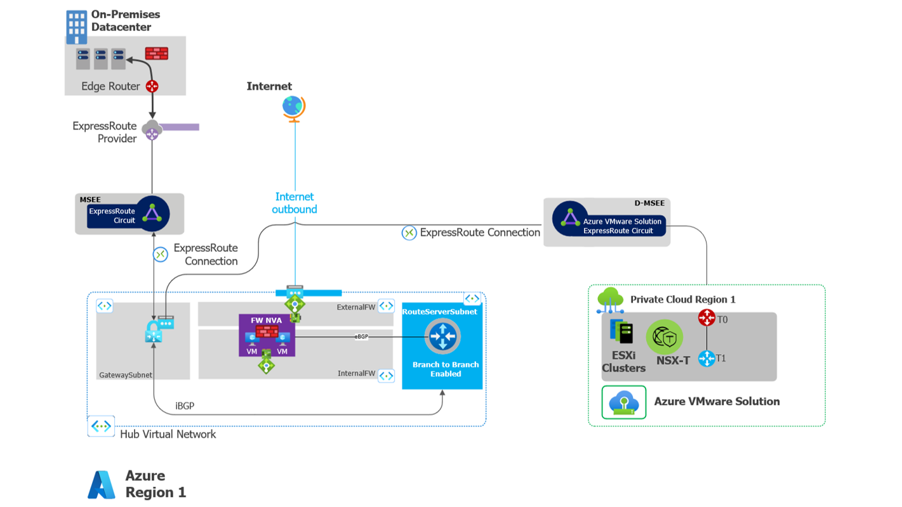

## Reduce overhead of sending multiple AVS routes to Azure with Azure Route Server
This blog post will discuss one of Azure’s latest offerings, Azure Route Server, and how it natively aligns key landing zone principles of cloud-scale connectivity and security while reducing administrative overhead for AVS hybrid network topologies. 

Users will often extend their AVS environments to connect with Azure networks. Common network topologies include Hub & Spoke and SD-WAN. From your AVS environment, you want to securely inspect traffic from your AVS workloads to a workload in a spoke network. Reasons for wanting to filter traffic include but are not limited to prevention of data exfiltration from egress traffic exiting paas and iaas services to the internet, or cross VNET ingress/egress traffic. A conceptual design of a Hub & Spoke topology with connectivity to Azure VMWare Solution is referenced below:


 
In this design, ingress/egress traffic flows from the AVS Tier-0 router, hits the Dedicated Microsoft Edge over the Expressroute connection via BGP and terminates at the Expressroute gateway. Where this gets interesting is what happens after the traffic enters the VNET’s. How will the AVS workload segments know how to reach the internet or communicate with a workload that lives in the peered spoke?
It’s important to note that in Azure:
1)	The AVS environment may have several segments and each segment will need a specific route advertised
2)	Azure VNET under the hood is a router and will not forward packets unless a route is specified
Therefore each vnet has a route table allocated. To influence routes from AVS over the ExpressRoute connection to force traffic to an NVA device for traffic inspection before it reaches its final destination, you will need User Defined Routes (UDR’s). 

Each time you add a new segment within AVS, you will need to manually update that route table with a new static entry creating some management overhead. This is where Azure Route Server has  advantages. 

## Adding Azure Route Server to your Network Architecture
Azure Route Server is a highly available, zone redundant appliance that programmatically injects learned routes into a VNET. Rather than leveraging the UDR API’s, Azure Route Server has a unique path in the control plane which allows it do Equal Cost Multi Path-ing (ECMP). Your BGP devices should be highly available and leverage SNAT to take advantage of ECMP. By doing so, this means that routes going to the same destination have equal costs by choosing which NVA to send the traffic. 

ARS is not a router but can be looked at as a route reflector. Using BGP, it tells which device is the next hop, but Route Server itself is not a hop. This device is peered with your NVA(s) ensuring that they are the next hop. 
Devices that can peer with Azure Route Server
Azure Route Server supports SD-WAN and BGP. When selecting an NVA device, it should be BGP capable, preferably BGPv4 which supports two different types of peering sessions: 

- IBGP (Internal BGP) that’s used within the same AS
- EBGP (External BGP) which is used between neighboring autonomous systems.

Your NVA device must have an “AVS facing” internal NIC, and an External Facing NIC. 

 

Azure Route Server supports traffic entering and leaving the VNET. For intra-vnet traffic between subnets, you will still need to use UDR’s to override a route and  send traffic between subnets within the same vnet. 

**Plan for IP Address** – ARS can support up to 8 peers with each peer supporting 1K routes. Please note this for wide-scale networks and or when there is extensive microsegmentation of CIDR ranges. There are also high-throughput scenarios might requiring more than two NVAs. The approach presented in this article is horizontally-scalable up to the maximum number of BGP peers supported by Azure Route Server
Deploying a Route Server instance in a VNET that already contains an Expressroute Gateway will temporarily disrupt Expressroute connectivity. If you are working in a production environment, you need to perform this step during a scheduled maintenance window. Detailed information on why this occurs is available here.

On-Premises environments connected to AVS with Global Reach will also advertise the default route 0.0.0.0/0.  Implement a route filter on-premises to prevent default route 0.0.0.0/0 learning.


#Step 1 Open the Azure Shell and set your subscription 
````az account set -s ````

#Step 2 - Create a resource group 

````RG=${testHubRg2}````

````az group create --location centralus --name $RG````

#Step 3 Create your hub Virtual Network 

````az network vnet create \
  --resource-group $RG \
  --name testHubVnet \
  --address-prefixes 10.10.10.0/24 \
  --subnet-name NVA \
  --subnet-prefixes 10.10.10.64/28


````  az network vnet subnet create \
  --resource-group $RG \
  --vnet-name testHubVnet\
  --name Internal \
  --address-prefixes 10.10.10.80/28


  ````az network vnet subnet create \
  --resource-group $RG \
  --vnet-name testHubVnet \
  --name RouteServerSubnet \
  --address-prefix 10.10.10.32/27

````

#Step 4 Create your NVA appliance and Backend VM
````
  az vm create \
 --resource-group $RG \
 --name NVA_1 \
 --tags role=NVA \
 --image UbuntuLTS \
 --vnet-name testHubVnet \
 --subnet NVA \
 --admin-username azure \
 --ssh-key-value ~/.ssh/id_rsa.pub \
 --public-ip-address NVA_1_Public

az vm create \
 --resource-group $RG \
 --name Backend \
 --image UbuntuLTS \
 --vnet-name testHubVnet \
 --subnet Internal \
 --admin-username azure \
 --ssh-key-value ~/.ssh/id_rsa.pub \
 --public-ip-address Backend_Public
````


#Step 5 - Install Azure Route Server
````
subnet_id=$(az network vnet subnet show \
  --name RouteServerSubnet \
  --vnet-name testHubVnet \
  --resource-group $RG \
  --query id -o tsv)

echo "Subnet ID: $subnet_id"

Get the RouteServerSubnet Id

az network routeserver create \
  --name RouteServer \
  --resource-group $RG \
  --hosted-subnet $subnet_id
````
Step 6: Create Azure Route Server Peer

````
az network routeserver peering create \
  --routeserver RouteServer \
  --resource-group $RG \
  --peer-ip $10.10.10.68 --peer-asn 65001 \
  --name NVA_1
````
SSH into the machine and install quagga

Next, ssh into the box and install quagga: https://raw.githubusercontent.com/Azure/azure-quickstart-templates/master/quickstarts/microsoft.network/route-server-quagga/scripts/quaggadeploy.sh

Step 8 - Check learned routes
````
az network routeserver peering list-learned-routes \
  --resource-group $RG \
  --routeserver RouteServer \
  --name NVA1

az network nic show-effective-route-table \
  --resource-group $RG --name BackendVMNic -o table
````

##Summary 

•	Azure Route server reduces administrative overhead by dynamically populating routes from AVS to your Azure VNET’s
•	In this design, outbound public IP addresses reside with NVAs in the Azure VNet.
•	Third-party NVAs in the virtual network hub BGP are peered with Azure Route Server (ECMP) and advertise the default route) 0.0.0.0/0 to Azure VMware Solution.
•	Traffic between Azure VMware Solution and your on-premises network flows through the ExpressRoute Global Reach, as described in Peer on-premises environments to Azure VMware Solution. Traffic inspection between on-premises and Azure VMware Solution is performed by your on-premises third-party NVA, not your third-party NVAs in Azure Virtual Network hub.


More information about this topology and integration with on-premises environments is detailed at ALZ connectivity scenarios