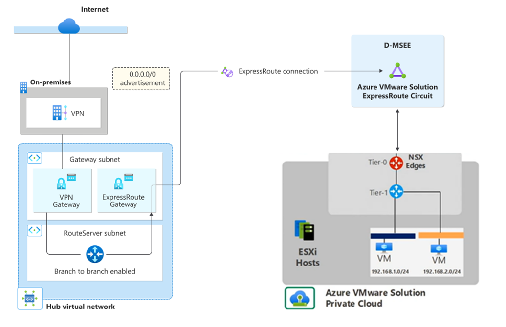
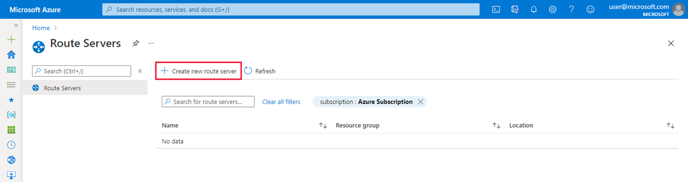
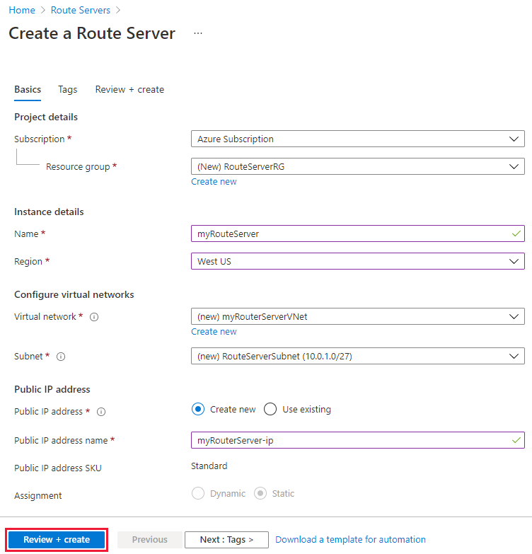
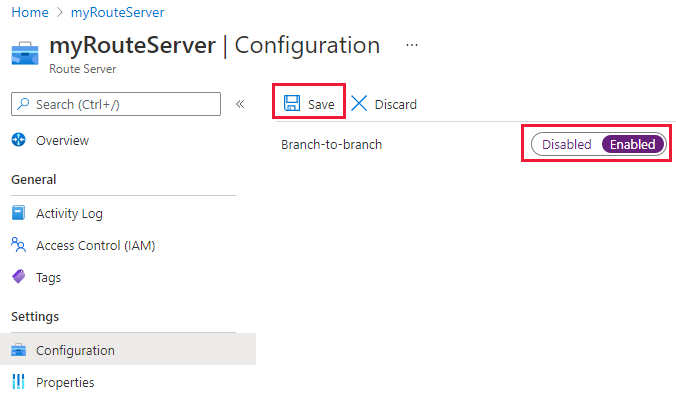
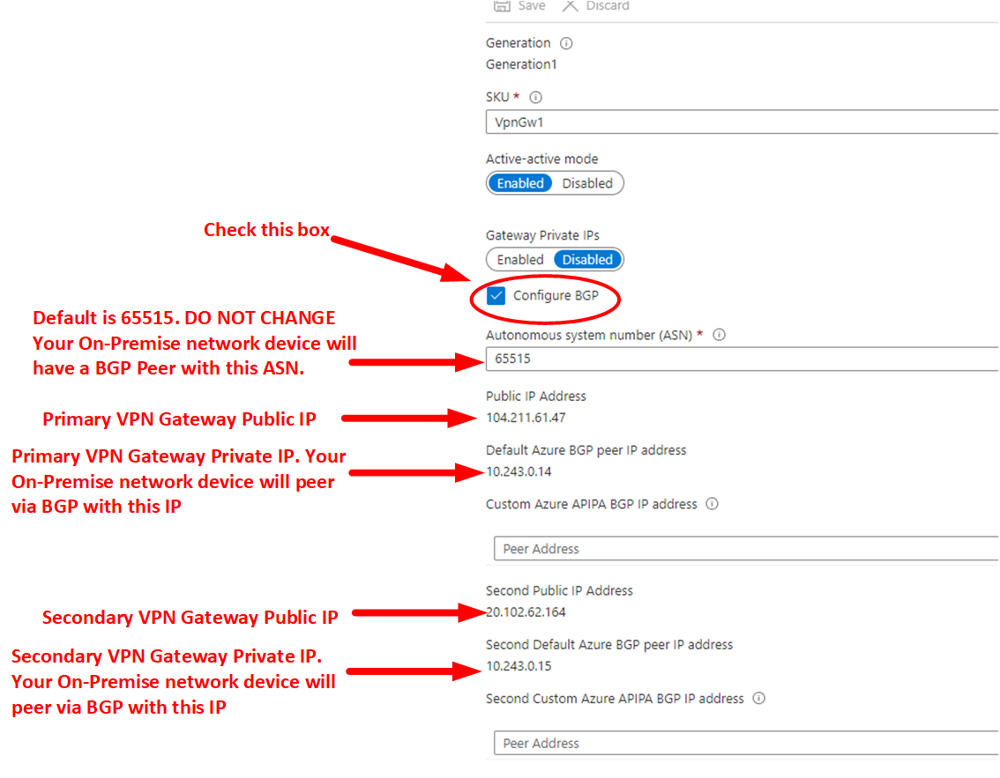
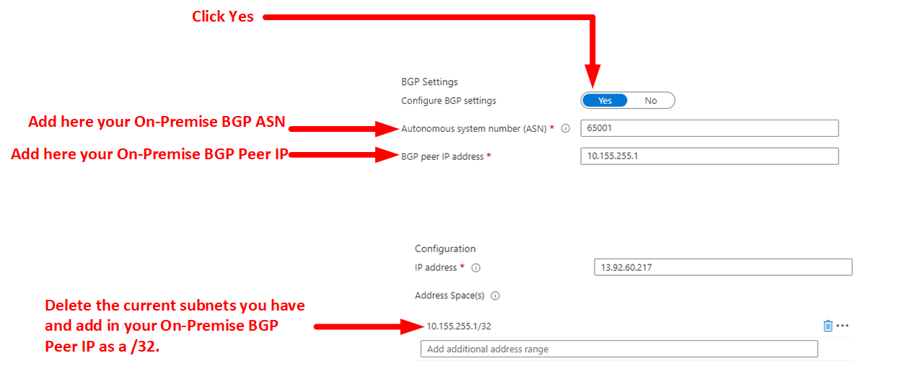
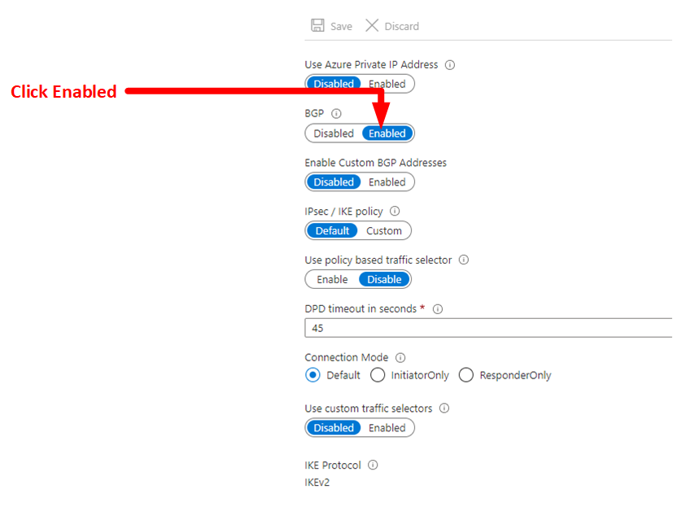

# Azure VMWare Solution: VPN GW to ExpressRoute GW Transitivity

## Description
This design scenario is only intended for customers who do not have ExpressRoute and only use a Site to Site VPN connection back to Azure. AVS only uses an Azure managed ExpressRoute to connect back to Azure. This is a step-by-step guide on how to connect On-Premise to the AVS private cloud transiting a Site to Site VPN to an AVS managed ExpressRoute and vice versa.

## Prerequisites  
1. Already have an existing Site-to-Site VPN Connection back to Azure  
https://learn.microsoft.com/en-us/azure/vpn-gateway/tutorial-site-to-site-portal

## Step 1: Create ExpressRoute Gateway
Deploy a new ExpressRoute Gateway in the same vNET where your current VPN Gateway is located. This new ExpressRoute Gateway will live in the same "GatewaySubnet" as your VPN Gateway.  

**Configure a virtual network gateway for ExpressRoute using the Azure portal**  
https://learn.microsoft.com/en-us/azure/expressroute/expressroute-howto-add-gateway-portal-resource-manager  

## Step 2: Deploy Active/Active VPN Gateway
- Go to your VPN Gateway under Settings>Configuration. 
- Under "Active-Active mode" click "Enabled" 
- Please create a new Second Public IP address that will be assigned to the secondary VPN GW.	
- Click Save 
- Do not move onto the next step until Active-Active mode configuration has completed. This change can take up to 45 minutes to complete. 

		
## Step 3: Create RouteServerSubnet for Azure Route Server
Create a subnet with the exact name of RouteServerSubnet. The minimum size of this subnet needs to be a /27. 

## Step 4: Deploy Azure Route Server
- Create an Azure Route Server in the RouteServerSubnet  

**Create a Route Server**   
https://learn.microsoft.com/en-us/azure/route-server/quickstart-configure-route-server-portal#create-a-route-server-1  

	
## Step 5: Enable Azure Route Server Branch-to-Branch
On Azure Enable Branch-To-Branch  

**Configure Route Exchange**  
https://learn.microsoft.com/en-us/azure/route-server/quickstart-configure-route-server-portal#configure-route-exchange  

	
## Step 6:Configure BGP on VPN Gateway	
- Go to your VPN Gateway and under Settings>Configuration. 
- Click "Configure BGP"
- Do not change the default VPN GW BGP AS 65515
- Click Save

## Step 7: Configure BGP on Local Network Gateway
- Local Network Gateway and click Yes "Configure BGP Settings"
- ASN: On-Premise ASN
- BGP Peer IP Address: On-Premise BGP Peer Address
- Address Space: Delete all subnets and add /32 of BGP On-Premise Peer Address
- Click save

## Step 8: Enable BGP on VPN Connection
Under VPN Gateway Settings>Connections. Double Click on your VPN Connection. 
Go Under Settings>Configuration Enable BGP. 
Click Save

## Step 9: Configure On-Premise BGP
- Configure BGP On-Premise and confirm BGP neighbor is up. 
- Make sure to advertise via BGP your on-premise routes back to Azure. Use BGP Route Summarization when advertising routes to Azure because as of the date of this writing there is currently a 200 route limit exchange between ExpressRoute and VPN Gateway. If exceeded, BGP peerings on Route Server will go into a down state.  

## Step 10: Connect AVS back to vNET
Connect AVS Managed ExpressRoute back to your ExpressRoute GW. 

**Use an existing virtual network gateway**   
https://learn.microsoft.com/en-us/azure/azure-vmware/deploy-azure-vmware-solution?tabs=azure-portal#use-an-existing-virtual-network-gateway  

## Notes
When using HCX with a Site to Site VPN connection, please take into the account the IPSEC overhead. The Uplink Network Profiles MTU should be set to 1350 or lower. This change needs to be completed on both the HCX on-premise and HCX Cloud Uplink Network Profiles. 

https://learn.microsoft.com/en-us/azure/azure-vmware/configure-vmware-hcx#create-network-profiles