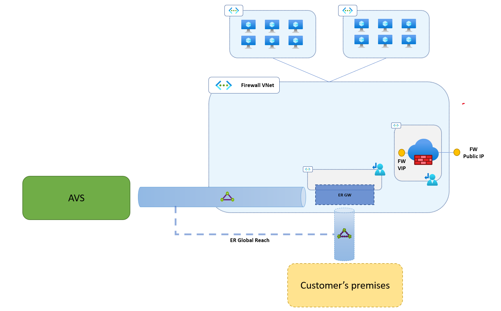
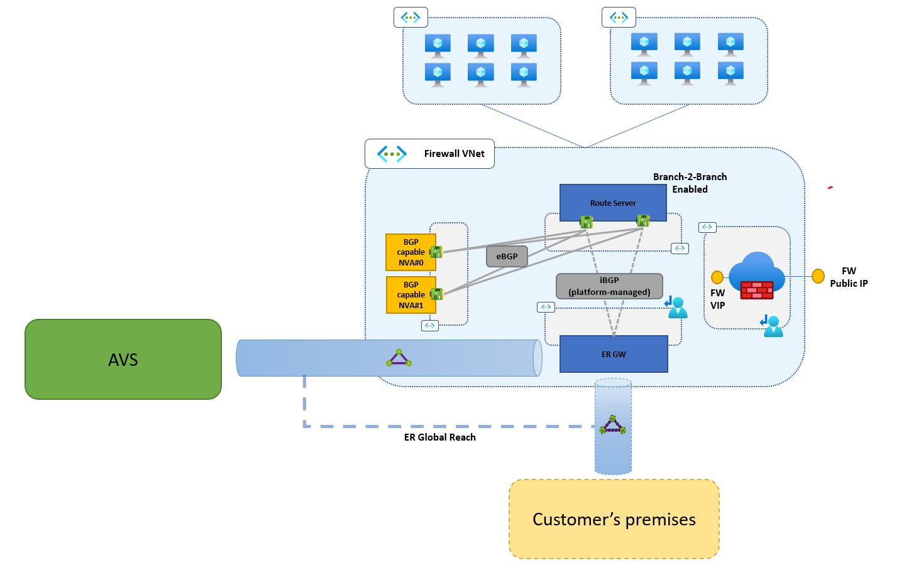
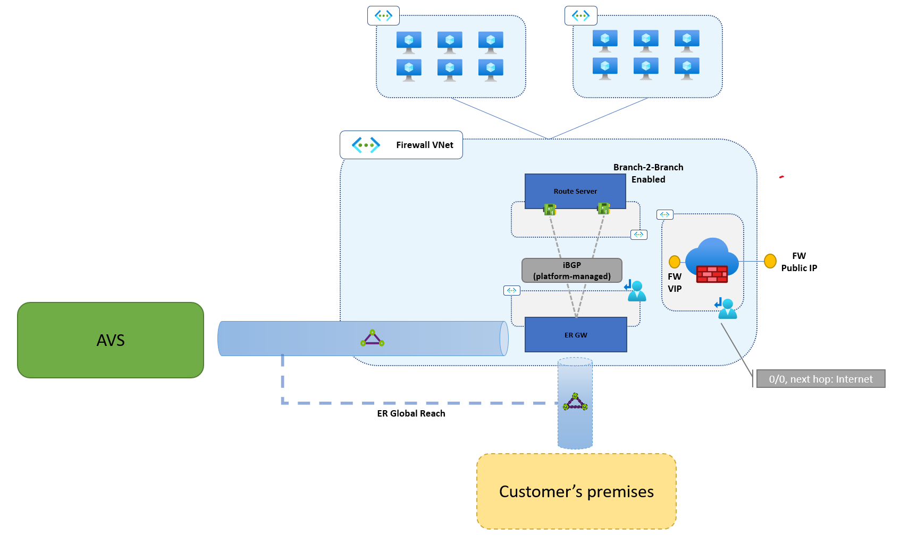
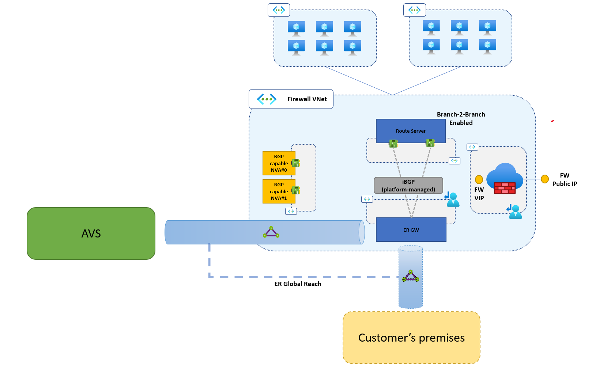

# Implementing internet connectivity for AVS with Azure NVAs
This article walks through the implementation of internet connectivity for AVS using NVAs (Network Virtual Appliances) running in an Azure Virtual Network. This approach is recommended for customers that have an existing internet edge in Azure and want to leverage it for their AVS workloads, both to optimize costs and to enforce consistent network policies.

Inbound internet access, i.e. the ability to expose applications running in AVS behind Public IPs associated with Azure NVAs, only requires connecting the AVS private cloud to the Azure VNet, using the private cloud's managed Expressroute circuit. No other configuration is required in Azure or AVS. The NVAs that expose the Public IPs must be configured to NAT (Destination-NAT + Source-NAT) inbound connections. While very basic and mostly dependent on the specific NVAs being used, this article provides guidance for configuring inbound internet access.

Outbound internet access requires announcing a default (0.0.0.0/0) route from Azure to AVS over the managed Expressroute circuit, in order for the private cloud T0 gateways to send internet-bound traffic to the Azure VNet. If the internet edge NVAs in Azure support BGP, then they can be used as BGP speakers to originate the default route. If the NVAs do not support BGP (or cannot be used as BGP speakers due to security-related constraints), additional NVAs can be deployed to act as BGP speakers. A typical scenario that requires additional BGP-capable NVAs is when the Azure internet edge is Azure Firewall. This article provides configuration guidance for the latter case. 

## Prerequisites
This step-by-step guide assumes that the following resources have been already deployed and configured:

- An AVS private cloud.
- An Azure VNet hosting an Expressroute gateway and the internet edge (Azure Firewall or third-party NVAs). The VNet is typically the hub VNet of an hub&spoke network deployed in a single Azure region. However, a fully-fledged hub and spoke topology is not required to successfully implement the solution described in this article. Hence, this VNet will be referred to as the "Firewall VNet" in the sections below.

 The network architecture for internet access described in this guide is compatible and can work side-by-side with a connection to a customer-managed Expressroute circuit that provides access to remote, on-prem locations. If such a circuit is available, it can also be connected to the AVS private cloud's managed circuit using Global Reach. This configuration allows routing traffic directly between AVS and the on-prem locations, bypassing the firewall running in Azure. A customer-managed Expressroute circuit that provides connectivity to on-prem locations is not a prerequisite for completing this step-by step guide.  

The picture below shows how your environment should look like before you execute the steps described in this article.



It is not required for the resources listed above to be in the same Azure subscription, nor in subscriptions associated to the same AAD tenant.

By following the steps in this article, the following new resources will be deployed:

- An Azure Route Server hosted in the Firewall VNet. 
- Two BGPv4-capable Linux NVAs.

At the end of this step-by-step guide, your environemnt will look like the one in the picture below.



Connectivity among the AVS private cloud, the Firewall VNet and the spoke VNet(s), if any, is entirely based on Expressroute and VNet peering, both of which  work cross-subscription and cross-tenant. Therefore, the resources listed above can be deployed across multiple subscriptions, if so mandated by security/billing/governance requirements. Also, it is not required for Firewall VNet and the AVS private cloud to be in same Azure region. However, the latency implications of deploying across multiple regions must be carefully evaluated. Latency increases with the geographical distance travelled by traffic exchanged between the AVS private cloud and the firewall VNet. Cost is affected by the VNet peering type (intra-region vs. global) and by the SKU of the Expressroute circuit that connects the on-prem site(s).  

The following address prefixes must be allocated for the Firewall VNet:
 - a /27 (or larger) prefix for the RouteServerSubnet (the subnet that hosts Azure Route Server)
 - a /28 (or larger) prefix for the subnet to which the BGP-capable NVAs will be attached.

The table below summarizes the address allocation requirements. All the prefixes listed in the table *must not* overlap with any other prefixes used in the AVS private cloud, in the Firewall VNet (and its directly connected spokes, if any) or in the remote site(s) connected over Expressroute.

| Virtual Network | Subnet              | Netmask | Notes                                                    |
| --------------- | ------------------- | ------- | -------------------------------------------------------- |
| Firewall VNet   | Route Server Subnet | /27     | The subnet must be named "RouteServerSubnet"             |
| Firewall VNet   | BGP NVA subnet      | /28     | Only needed if the firewalling solution does not run BGP |

## Logging into Azure subscriptions
As mentioned in the previous section, it is possible to deploy the required resources across multiple subscriptions and/or multiple regions. As the allocation of resources to subscriptions may vary greatly across real-world environments, this article does not provide prescriptive guidance as to where to deploy each resource. It is the reader's responsibility to properly set the Azure context for executing the code snippets provided below. Please review the official documentation for instructions on how to log into Azure and select a subscription to work in (with [Azure PowerShell](https://docs.microsoft.com/en-us/powershell/azure/authenticate-azureps?view=azps-7.4.0) or [Azure CLI](https://docs.microsoft.com/en-us/cli/azure/manage-azure-subscriptions-azure-cli)). 

The code snippets below provide Az CLI commands and assume execution in a Bash shell. A Microsoft-managed, interactive, authenticated, browser-accessible shell is provided by [Azure Cloud Shell](https://docs.microsoft.com/en-us/azure/cloud-shell/overview). It supports both Powershell and Bash. Follow the [instructions here](https://docs.microsoft.com/en-us/azure/cloud-shell/overview#choice-of-preferred-shell-experience) to log into Azure Cloud Shell and run a Bash shell.

## Step #0 - Define variables
The purpose of this section is to define in your Bash session the variables used in the Az CLI scripts for the subsequent steps. The variables MUST be set to values that fit the pre-existing environment described in the "Prerequisites" section. Make sure that all variables are defined before running any snippet. If you close your shell between two steps, or you execute different steps in different shells, make sure to define the variables below in all shells.
Please note that some additional variables are used within a single snippet. Those variables are defined in the relevant code snippets. Instructions on how to set them are provided when needed.
In the code snippet below, change the example values provided for each variable to fit your environment. When done, open a Bash shell and run it.

```Azure CLI
# 
# Name of the (existing) VNet where the internet edge/firewall NVA's run.
# Typically, it is the hub VNet of a hub&spoke network in an Azure region.
# 
fwVnetName="firewall-vnet"

#
# Name of the Firewall VNet's resource gruop.
# This is assumed to exist already in your environemnt.
#
fwRgName="HUBRG"

#
# Address space of the (existing) Firewall VNet. This variable is an array that can contain multiple prefixes. Example: ("prefix1" "prefix2" "prefix3")
#
firewallVnetPrefixes=("10.57.0.0/16")


#
# Name of the new resource group that will contain the BGP-capable NVAs. 
# Set according to your naming convention. 
# A resource group with this name MUST NOT exist in your subscription.
#
bgpNvaRgName="BGPNVARG"

#
# Name of the new resource group that will contain the Route Server. 
# Set according to your naming convention. 
# A resource group with this name MUST NOT exist in your subscription.
#
arsRgName="ARSRG"

#
# Address prefix of the RouteServerSubnet. 
# It must be /27, or larger, and included in the pre-existing Firewall VNet's address space.
# It can be carved out of unused ranges in the VNet's address space, 
# or it can be added as a non-contigous prefix.
# In the latter case, you must add this prefix to the Firewall VNet's address space 
# before moving to the next steps.
#
routeServerSubnetPrefix="10.57.10.0/27"

#
# ASN number announced by the internet edge devices (if they run BGP) or by the BGP-capable NVA's (if they are deployed becasue the pre-existing internet edge devices do not run BGP) . Choose any ASN not included in Azure's reserved range (65515-65520) and not used in your network.
#
nvaAsn="65111"

#
# The internal IP address of the (existing) firewall running in the firewall VNet.
# If you are using Azure Firewall, this is your Firewall instance's private IP address.
# If you are running 3rd party firewall NVAs behind an Azure Internal Load Balancer, this is the Load Balanacer's frontend IP.
#
firewallVip="10.57.0.70"

#
# Name of the BGP-capable NVA subnet. It must be /28, or larger, and included 
# in the pre-existing Firewall VNet's address space.
#
bgpNvaSubnetName="BgpNvaSubnet"

#
# Address prefix ot the BGP-capable NVA subnet. It must be /28, or larger, and included 
# in the pre-existing Firewall VNet's address space.
#
bgpNvaSubnetPrefix="10.57.11.0/27"

#
# Private IP address of the first BGP-capable NVA instance.
# Select an IP address in the "bgpNvaSubnetPrefix" defined above.
# Please note that, in Azure, the first four IPs and the last IP in the subnet address prefix 
# are reserved and cannot be assigned to VMs. 
# This article assumes that two NVA instances are deployed, for HA.
#
bgpNva0Ip="10.57.11.4"

#
# Private IP address of the first BGP-capable NVA instance. 
# Select an IP address in the "bgpNvaSubnetPrefix" defined above.
# Please note that, in Azure, the first four IPs and the last IP in the subnet address prefix 
# are reserved and cannot be assigned to VMs. 
# This article assumes that two NVA instances are deployed, for HA.
#
bgpNva1Ip="10.57.11.5"
```


## Step #1 - Deploy Azure Route Server in the Firewall VNet

In this step, you will deploy an Azure Route Server instance the Firewall VNet. The instructions below assume that a /27 (or larger) subnet can be added to the Firewall subnet, as described in the prerequisites section. 

Warning: Deploying a Route Server instance in a VNet that already contains an Expressroute Gateway will temporarily disrupt Expressroute connectivity. If you are working in a production environment, you need to perform this step during a scheduled maintenance window. More information is available [here](https://docs.microsoft.com/en-us/azure/route-server/troubleshoot-route-server#why-do-i-lose-connectivity-to-my-on-premises-network-over-expressroute-andor-azure-vpn-when-im-deploying-azure-route-server-to-a-virtual-network-that-already-has-expressroute-gateway-andor-azure-vpn-gateway).  

If needed, set the Azure context in such a way to operate in the subscription that contains the Firewall VNet. Then, run the code snippet below to create the RouteServerSubnet and deploy an Azure Route Server instance in the Firewall subnet. 

Note: Azure Route Server takes about 20 minutes to deploy.

```Azure CLI
# Create RouteServerSubnet
routeServerSubnetId=$(az network vnet subnet create \
        --name RouteServerSubnet \
        --address-prefixes $routeServerSubnetPrefix \
        --resource-group $fwRgName \
        --vnet-name $fwVnetName \
        --query id --output tsv)

# Deploy Route Server
fwLocation=$(az network vnet show --name $fwVnetName --resource-group $fwRgName --query location --output tsv)
az network public-ip create --name fw-ars-pip --resource-group $fwRgName --version IPv4 --sku Standard --zone 1 2 3 --location $fwLocation
az network routeserver create \
        --hosted-subnet $routeServerSubnetId \
        --name fw-ars \
        --resource-group $fwRgName \
        --location $fwLocation \
        --public-ip-address fw-ars-pip
az network routeserver update --name fw-ars --resource-group $fwRgName --allow-b2b-traffic

# Define peerings with the BGP-capable NVAs
az network routeserver peering create --name nva0 \
        --routeserver fw-ars \
        --resource-group $fwRgName \
        --peer-ip $bgpNva0Ip \
        --peer-asn $nvaAsn
az network routeserver peering create --name nva1 \
        --routeserver fw-ars \
        --resource-group $fwRgName \
        --peer-ip $bgpNva1Ip \
        --peer-asn $nvaAsn

# Store Route Server's peer IPs
routeServerIps=($(az network routeserver show \
        --name fw-ars \
        --resource-group $fwRgName \
        --query virtualRouterIps --output tsv))
```

If in your environment there is no custom route table associated with the "AzureFirewall" subnet, create one. The custom route table must contain a default route (0.0.0.0/0) with next hop type set to "Internet"

```
# Deploy Custom Route Table for the Azure Firewall Subnet
az network route-table create \
        --name AzureFirewallRt \
        --resource-group $fwRgName

# Add default route with next hop "Internet" to override default route announced by BGP-capable NVAs
az network route-table route create \
        --name defaultToInternet \
        --resource-group $fwRgName \
        --route-table-name AzureFirewallRt \
        --address-prefix 0.0.0.0/0 \
        --next-hop-type Internet
        
# Associate route table with AzureFirewallSubnet
az network vnet subnet update \
        --name AzureFirewallSubnet \
        --resource-group $fwRgName \
        --vnet-name $fwVnetName \
        --route-table AzureFirewallRt

```

If a custom route table is already associated to the AzureFirewallSubnet in your environment, then make sure that it contains a default route (0.0.0.0/0) with next hop type set to "Internet".

At the end of this step, your environment will look as shown in the figure below.

 

## Step #2 - Provision the BGP-capable NVAs

In this step you will provision the BGP-capable NVAs in the Firewall VNet. At least two NVAs are recommended for high-availability. In order to make the code snippets below applicable to any Azure region, the two NVA instances are deployed in an availability set. It is possible to customize the code to deploy the instances in different availability zones, when working in regions that support them. 
Before running the code snippet, make sure the context is set to the subscription where you have deployed the Transit VNet.

Note: If you closed the shell used in the previous steps, you must set the variables again (see Step #0).

```Azure CLI
# Define username and password for the NVAs
nvaUser="bgpadmin"
nvaPassword="<choose password>"

# Define VM size for the NVAs
nvaSize="Standard_D1_v2"
nvaImage="OpenLogic:CentOS:8_5:8.5.2022012100"

# Location of the Firewall VNet
fwLocation=$(az network vnet show --name $fwVnetName --resource-group $fwRgName --query location --output tsv)

# Create resource group for BGP-capable NVAs
az group create --name $bgpNvaRgName --location $fwLocation

# Create subnet for BGP-capable NVA's 
bgpNvaSubnetId=$(az network vnet subnet create \
        --name $bgpNvaSubnetName \
        --address-prefixes $bgpNvaSubnetPrefix \
        --resource-group $fwRgName \
        --vnet-name $fwVnetName \
        --query id --output tsv)

# Deploy NICs
az network nic create --name nva0-nic \
        --resource-group $bgpNvaRgName \
        --location $fwLocation \
        --subnet $bgpNvaSubnetId \
        --private-ip-address $bgpNva0Ip

az network nic create --name nva1-nic \
        --resource-group $bgpNvaRgName \
        --location $fwLocation \
        --subnet $bgpNvaSubnetId \
        --private-ip-address $bgpNva1Ip   

# Deploy NVAs in an availability set
az vm availability-set create --name bgp-nva-aset --resource-group $bgpNvaRgName --location $fwLocation
az vm create --name bgp-nva-0 \
        --resource-group $bgpNvaRgName \
        --location $fwLocation \
        --image $nvaImage \
        --size $nvaSize \
        --availability-set bgp-nva-aset \
        --authentication-type password \
        --admin-username $nvaUser \
        --admin-password $nvaPassword \
        --storage-sku Standard_LRS \
        --nics nva0-nic

az vm create --name bgp-nva-1 \
        --resource-group $bgpNvaRgName \
        --location $fwLocation \
        --image $nvaImage \
        --size $nvaSize \
        --availability-set bgp-nva-aset \
        --authentication-type password \
        --admin-username $nvaUser \
        --admin-password $nvaPassword \
        --storage-sku Standard_LRS \
        --nics nva1-nic
```

At the end of this step, your environment will look as shown in the figure below.

 

## Step #3 - Configure BGP-capable NVAs
In this step you will finalize the routing configuration of your BGP-capable NVAs. Configuration details may vary depending on which NVAs are used. 

### General routing requirements
Irrespective of what BGP-capable NVAs (Linux VMs vs. commercial routing products available in the Azure marketplace) you will deploy in your environment, the following configuration guidelines apply.

- Azure Route Servers always use the reserved ASN 65515. The BGP capable NVAs must use a different ASN (not included in the Azure-reserved range 65515-65520). As such, all sessions between NVAs and Route servers are external BGP (eBGP) sessions.
- Azure Route Servers are attached to dedicated subnets in their respective VNets. As such, BGP sessions with the BGP capable NVAs are established between interfaces that do not share a common subnet. Therefore, eBGP multihop must be supported and enabled on the NVAs.
- Static routes must be defined in the NVAs' guest OS route tables to ensure reachability of the Route Servers (which are non-directly-connected external BGP peers). It is recommended to define static routes for the entire prefix of the RouteServerSubnets.

### Linux NVA with FRRouting configuration
This section shows how to implement the general routing guidelines when using CentOS Linux boxes with [FRRouting](https://frrouting.org/).
To install FRR and configure the Linux NVAs as routers, log into each one of the Linux NVA boxes deployed in the previous steps and execute the following commands in a shell. Make sure to complete the configuration on all NVA instances.

```Bash
#
# IP prefix of the RouteServerSubnet in the Firewall VNet. This is the same variable used in the previous sections' Azure CLI scripts. 
# The Linux NVAs, if deployed as described in the previous sections attach to this subnet through their "eth0" device.
#  
routeServerSubnetPrefix="10.57.10.0/27"

#
# The first IP address of the subnet to which the "eth0" device is attached.
#
bgpNvaSubnetGateway="10.57.10.1"

# Install FRR
sudo dnf install frr -y

# Configure FRR to run the bgpd daemon
sudo sed -i 's/bgpd=no/bgpd=yes/g' /etc/frr/daemons
sudo touch /etc/frr/bgpd.conf
sudo chown frr /etc/frr/bgpd.conf
sudo chmod 640 /etc/frr/bgpd.conf

# Start FRR daemons
sudo systemctl enable frr --now


# Add static routes to ensure reachability for Route Servers (Route Server are not-directly-connected external BGP neighbours).
# Please note that this configuration is transient and will be lost if the VM is rebooted. 
# On CentOS VMs, you can add these routes to /etc/sysconfig/network-scripts/route-eth<X> to make them persistent across reboots. 
sudo ip route add $routeServerSubnetPrefix via $bgpNvaSubnetGateway dev eth0
```

### BGP configuration
The general routing requirements described in the previous section can be addressed, when running [FRRouting](https://frrouting.org/) on Linux VMs, with the following BGP configuration:

- Azure Route Server BGP endpoints configured as neighbors in ASN 65515
- Originate default route via ```network``` statement
- Set next hop to the firewall VIP

To configure FRR accordingly, edit the configuration script below to fit your environment. More specifically, replace all occurrences of

- ```<BGP-capable NVA's ASN>``` with the ASN used in steps #4 and #5 to define the BGP peerings with Route Servers.
- ```<IP address of Route Server instance #0>``` with the first IP address of the Route Server.
- ```<IP address of Route Server instance #1>``` with the first IP address of the Route Server.
- ```<Firewall VIP>``` with the Azure Firewall's private IP address.

Note: To avoid typos and ensure consistent replacements across the entire script, consider using the Bash command "[sed](https://www.gnu.org/software/sed/manual/sed.html)".

```
conf term
!
router bgp <BGP-capable NVA's ASN>
no bgp ebgp-requires-policy
neighbor <IP address of Route Server instance #0> remote-as 65515  
neighbor <IP address of Route Server instance #0> ebgp-multihop 2
neighbor <IP address of Route Server instance #1> remote-as 65515 
neighbor <IP address of Route Server instance #1> ebgp-multihop 2
network 0.0.0.0/0
!
address-family ipv4 unicast
  neighbor <IP address of Route Server instance #0> route-map SET-NEXT-HOP-FW out
  neighbor <IP address of Route Server instance #1> route-map SET-NEXT-HOP-FW out
exit-address-family
!
route-map SET-NEXT-HOP-FW permit 10
set ip next-hop <Firewall VIP>
!
exit
!
exit
!
write file
!
```

After updating the commands with the addresses and ASN's that fit your environment, lon into FRR's CLI y running

```Bash
sudo vtysh
```

You can now paste all the commands in the vtysh shell to apply the configuration and save it to configuration files. This will make your configuration persistent across VM reboots.

## Step #4 - Configure Azure Firewall to allow internet access from AVS segments

In the Azure portal, create Azure Firewall rules to allow access to the internet (0.0.0.0/0) from the AVS segments that exist in your private cloud.

## Verification

To verify that your environment has been properly configured, log into each one of the BGP-capable NVAs and lanch the FRR CLI, by running:

```Bash
sudo vtysh
```

In vtysh, run:

```vtysh
show ip bgp neighbor <IP address of Route Server instance #0> advertised-routes
```

and confirm that the default route is advertised to Azure Route Server with the next hop IP set to your Azure Firewall's private IP. Repeat the test for the Route Server's second IP address:

```vtysh
show ip bgp neighbor <IP address of Route Server instance #1> advertised-routes
```

Log onto one of your AVS VMs, attached to a segment for which Azure Firewall allows outbound internet access, and confirm that you can reach internet destinations. Confirm that the outbound connections initiated from the AVS VMs get Source-NATted behind your Azure Firewall's public IP address, by running

```vtysh
curl ipinfo.io
```

