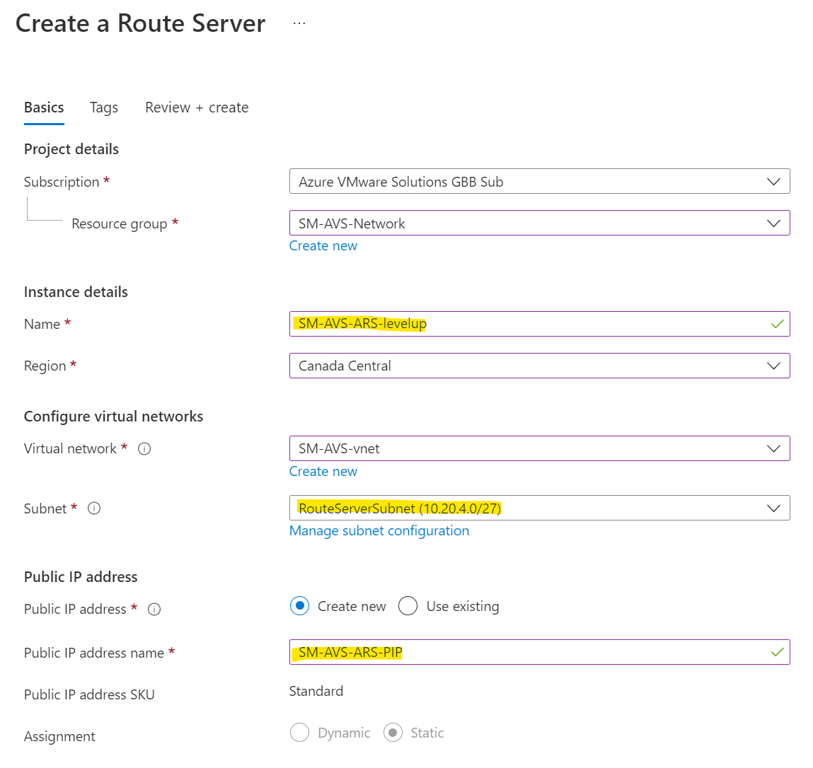

# AVS Advanced Networking Hands-on Lab [70 mins] - _Work in Progress_


### Recommended reading prerequisites for this Level Up Workshop:

1. [Concept - Internet connectivity design considerations - Azure VMware Solution | Microsoft Learn](https://learn.microsoft.com/en-us/azure/azure-vmware/concepts-design-public-internet-access)
1. [Enterprise-scale network topology and connectivity for Azure VMware Solution - Cloud Adoption Framework | Microsoft Learn](https://learn.microsoft.com/en-us/azure/cloud-adoption-framework/scenarios/azure-vmware/eslz-network-topology-connectivity)
1. [Enterprise-Scale-for-AVS/BrownField/Networking/Step-By-Step-Guides/Implementing internet connectivity for AVS with Azure NVAs at main · Azure/Enterprise-Scale-for-AVS (github.com)](https://github.com/Azure/Enterprise-Scale-for-AVS/tree/main/BrownField/Networking/Step-By-Step-Guides/Implementing%20internet%20connectivity%20for%20AVS%20with%20Azure%20NVAs)
1. [What is Azure Route Server? | Microsoft Learn](https://learn.microsoft.com/en-us/azure/route-server/overview)
1. [Tutorial: Deploy & configure Azure Firewall and policy using the Azure portal | Microsoft Learn](https://learn.microsoft.com/en-us/azure/firewall/tutorial-firewall-deploy-portal-policy)
1. [Autonomous system (Internet) - Wikipedia](https://en.wikipedia.org/wiki/Autonomous_system_(Internet))
1. [Border Gateway Protocol](https://en.wikipedia.org/wiki/Border_Gateway_Protocol)
1. [Configure networking for your VMware private cloud in Azure](https://learn.microsoft.com/en-us/azure/azure-vmware/tutorial-configure-networking)
1. [Add a network segment in Azure VMware Solution](https://learn.microsoft.com/en-us/azure/azure-vmware/tutorial-nsx-t-network-segment?source=recommendations)
1. [Configure DHCP profile for AVS](https://learn.microsoft.com/en-us/azure/azure-vmware/configure-dhcp-azure-vmware-solution)


## Customer Use Case scenario

[Customer wants to leverage Next-Gen firewalls in a hub VNet to inspects traffic between AVS, the internet and Azure spoke VNets](https://learn.microsoft.com/en-us/azure/cloud-adoption-framework/scenarios/azure-vmware/eslz-network-topology-connectivity#scenario-5-a-third-party-nva-in-the-hub-vnet-inspects-traffic-between-avs-and-the-internet-and-between-avs-and-azure-vnets)


**This lab demonstrates that secure traffic flows are possible with both Azure Native Firewalls and/or BGP-capable NVAs.**

### [Implementing Outbound internet connectivity for AVS with Azure NVAs](https://github.com/Azure/Enterprise-Scale-for-AVS/tree/main/BrownField/Networking/Step-By-Step-Guides/Implementing%20internet%20connectivity%20for%20AVS%20with%20Azure%20NVAs) 

This article walks through the implementation of internet connectivity for AVS using NVAs (Network Virtual Appliances) running in an Azure Virtual Network. This approach is recommended for customers that have an existing internet edge in Azure and want to leverage it for their AVS workloads, both to optimize costs and to enforce consistent network policies.

Inbound internet access, i.e. the ability to expose applications running in AVS behind Public IPs associated with Azure NVAs, only requires connecting the AVS private cloud to the Azure VNet, using the private cloud's managed Expressroute circuit. No other configuration is required in Azure or AVS. The NVAs that expose the Public IPs must be configured to NAT (Destination-NAT + Source-NAT) inbound connections.

Outbound internet access requires announcing a default (0.0.0.0/0) route from Azure to AVS over the managed Expressroute circuit, in order for the private cloud T0 gateways to send internet-bound traffic to the Azure VNet. If the internet edge NVAs in Azure support BGP, then they can be used as BGP speakers to originate the default route. If the NVAs do not support BGP (or cannot be used as BGP speakers due to security-related constraints), additional NVAs can be deployed to act as BGP speakers. A typical scenario that requires additional BGP-capable NVAs is when the Azure internet edge is Azure Firewall. This article provides configuration guidance for the latter case.


- **Core Infra setup** 
We leveraged AVS ALZ Accelerator to deploy the Greenfield environment. This automation code deploys the following core Azure and AVS resources and enables express route connectivity between Azure VNet and AVS SDDC:
   - AVS Private Cloud
   - Hub VNet consisting of:
      -    Express Route Gateway
      -    Jumpbox
      -    Bastion Host

  - For this lab, following additional resources are also required and already deployed for you: 
     - Azure Firewall
     - Azure Route Server
     - Linux VM for NVA
     - Spoke VNet with an Azure VM

**Agenda for next 70 mins:** 

**Before breaking out in to Groups and start hands-on lab, we will spend initial 15 mins to understand the lab scenario and networking concepts in detail.**

|**S.No**|**Action Plan**|**Time Required**| **Status** |
|--|--|--|--|
| 1 |Deploy and prepare AVS SDDC| varies | Preprovisioned |
| 2. | Hub VNet in Azure with ER GW, Jumpbox and Bastion Host |1 hour  | Preprovisioned |
| 3. | Azure Firewall as a Security device | 10 mins | Preprovisioned  |
| 4. |Confgure rules in Azure Firewall | 10 mins | **Participants** |
| 5. |Create Azure Route Server  |20 mins  | Preprovisioned|
| 6. |Configure B2B flag and Add peers in Azure Route Server  |10 mins | **Participants**|
| 7. |Deploy Linux VMs for NVA  |10 mins  | Preprovisioned|
| 8. |Configure FRRouting and BGP for NVA |15 mins |  **Participants**|
| 9. |Add custom default route to internet for Azure Firewall |5 mins | **Participants**|
| 10. |Create UDR for ERGW |5 mins | **Participants**|
| 11. |Test - Outbound internet connectivity for AVS VM through Firewall in Azure |5 mins | **Participants**|
| 12. |Test - Connectivity between AVS VM and Azure VM in spoke virtual network |5 mins | **Participants**|


### **Let's get started with steps to implement this networking scenario for AVS**

As mentioned above, all the Azure resources are already pre-provisioned for this lab to save on time and our focus area is network and routing configuration.


## Module 1. Create Azure Route Server (Takes 15 minutes) - Already created.

    Note: A /27 (or larger) prefix is required for dedicated "RouteServerSubnet"



Once the validation is passed click on Create button. The deployment of route server will take about 15-20 mins.

### 1.a Configure Route Server - Enable branch to branch flag in ARS (takes 2 mins) -Already created


Select the Enable option and save it.

### 1.b Next, we will add BGP peers (NVAs) to Azure route server. Click on Add button on the top and furnish the ASN and Private IP address of NVA to create peering.


Wait for few mins and refresh to ensure peerings are in succeeded state. Your route server configuration is complete now.

## Module 2. Create Standard Azure Firewall **with classic rules and no Force Tunneling**. (Takes 10-15 mins) - Already created.

     Note: The required size of the AzureFirewallSubnet subnet is /26.       
   


### 2.a Create a Route Table for Azure Firewall.

Provide your resource group name, region, route table name. Ensure you provide the same region as your Azure Firewall. Also, select propagate gateway routes as YES. Click on Review + Create.


### Once route table has been created we will add the route. The route table must contain a default route (0.0.0.0/0) with next hop type set to "Internet"


### Associate firewall subnet to this route in the Route table


### 2.b Configure network rules in Azure firewall to allow internet access to AVS.
Source = AVS Test VM
Destination = Internet


### 2.c Configure network rule in Azure firewall to allow AVS VM to communicate with Azure VM.
Source = AVS VM
Destination = Azure VM


### 2.d This step is for enabling connectivity from AVS VM to Spoke VM in Azure. Create User defined route and associate with Express route gateway subnet

Name: ToAzureVM
Address Prefix: Spoke Vnet CIDR
Next Hop type: Azure firewall (Virtual Appliance)
Next Hop IP: Firewall private IP address


## Module 3. Deploy BGP capable NVAs and configure them to exchange routes with ARS. 

Note: Choose any ASN not included in Azure's reserved range (65515-65520) and not used in your network.
Here we have used NVA ASN=65111

### 3.a To configure NVA, we will create two linux virtual machines with CentOS 8.5 as the OS image and place them in an Availability set for High Availability (Takes 10 mins) - Already created.


Select the Virtual Network and subnet designated for NVAs.


After providing all the required information, select Review + create and then Create after validation passes. The deployment of the VM will take 5-10 minutes.

### 3.b Configure BGP-capable NVAs (15 mins)

General routing requirements
- Irrespective of what BGP-capable NVAs (Linux VMs vs. commercial routing products available in the Azure marketplace) you will deploy in your environment, the following configuration guidelines apply.

- Azure Route Servers always use the reserved ASN 65515. The BGP capable NVAs must use a different ASN (not included in the Azure-reserved range 65515-65520). As such, all sessions between NVAs and Route servers are external BGP (eBGP) sessions.
- Azure Route Servers are attached to dedicated subnets in their respective VNets. As such, BGP sessions with the BGP capable NVAs are established between interfaces that do not share a common subnet. Therefore, eBGP multihop must be supported and enabled on the NVAs.
- Static routes must be defined in the NVAs' guest OS route tables to ensure reachability of the Route Servers (which are non-directly-connected external BGP peers). It is recommended to define static routes for the entire prefix of the RouteServerSubnets.


 **Step#1.  Configure Linux virtual machine as an NVA with FRRouting configuration**

Using Bastion, log into each one of the Linux NVA boxes deployed in the previous steps and execute the following commands in a shell. Make sure to complete the configuration on both NVA instances.


|username|password  |
|--|--|
| bgpadmin | xx  |


After logging in, On the command prompt we will create a file `vi frroutingconfig.sh` and paste the below commands. 
Now update the variables with correct values as per your networking environment. Once the script is ready, run it on the VM using `sh frroutingconfig.sh` command.

```BASH
#
# IP prefix of the RouteServerSubnet in the Firewall VNet. This is the same variable used in the previous sections' Azure CLI scripts. 
# The Linux NVAs, if deployed as described in the previous sections attach to this subnet through their "eth0" device.
#  
routeServerSubnetPrefix="10.20.4.0/27"

#
# The first IP address of the subnet (NVA subnet) to which the "eth0" device is attached.
#
bgpNvaSubnetGateway="10.20.6.1"

# Install FRR
sudo dnf install frr -y

# Configure FRR to run the bgpd daemon
sudo sed -i 's/bgpd=no/bgpd=yes/g' /etc/frr/daemons
sudo touch /etc/frr/bgpd.conf
sudo chown frr /etc/frr/bgpd.conf
sudo chmod 640 /etc/frr/bgpd.conf

# Start FRR daemons
sudo systemctl enable frr --now


# Add static routes to ensure reachability for Route Servers (Route Server are not-directly-connected external BGP neighbours).
# Please note that this configuration is transient and will be lost if the VM is rebooted. 
# On CentOS VMs, you can add these routes to /etc/sysconfig/network-scripts/route-eth<X> to make them persistent across reboots. 
sudo ip route add $routeServerSubnetPrefix via $bgpNvaSubnetGateway dev eth0
```

The script will take few seconds to complete. You can optionally check the routes using `ip route show` command.

**Step#2. In this step, we will do BGP configuration on the NVA**

The general routing requirements described in the previous section can be addressed, when running FRRouting on Linux VMs, with the following BGP configuration:

- Azure Route Server BGP endpoints configured as neighbors in ASN 65515
- Originate default route via network statement
- Set next hop to the firewall VIP (Private IP)


To configure FRR accordingly, edit the configuration script below. Ensure to replace all the <variables> to suit your networking environment.

**You will require following values to replace the variables in the script below:**
- BGP-capable NVA's ASN=65111 (for lab purposes)
- IP addresses of both the instances of Route Server
- Private IP addresses of Azure Firewall


```
conf term
!
router bgp <BGP-capable NVA's ASN>
no bgp ebgp-requires-policy
neighbor <IP address of Route Server instance #0> remote-as 65515  
neighbor <IP address of Route Server instance #0> ebgp-multihop 2
neighbor <IP address of Route Server instance #1> remote-as 65515 
neighbor <IP address of Route Server instance #1> ebgp-multihop 2
network 0.0.0.0/0
!
address-family ipv4 unicast
  neighbor <IP address of Route Server instance #0> route-map SET-NEXT-HOP-FW out
  neighbor <IP address of Route Server instance #1> route-map SET-NEXT-HOP-FW out
exit-address-family
!
route-map SET-NEXT-HOP-FW permit 10
set ip next-hop <Firewall Private IP address>
!
exit
!
exit
!
write file
!
```
Once script is ready, Enter `sudo vtysh` on the FRR NVA command prompt to enter the shell for FRR daemons. You can now paste all the commands in the vtysh shell to apply the configuration and save it to configuration files. This will make your configuration persistent across VM reboots.

This will complete your BGP Configuration. You can validate routes by running the `show ip bgp` command. It should look similar to this:


**[OPTIONAL]** To see the routes learned by Azure Route Server you can run this command in to cloud shell by updating the variables `az network routeserver peering list-learned-routes -g $Resource-Groud-Name --name $PeerName --routeserver $RouteServerName`. Output should look like below:


This completes your NVA setup.

## Module 4. In this module we will create a spoke virtual network and peer it with HUB Vnet. We will also create a virtual machine and place it in the spoke Vnet. This is to test the connectivity from AVS to Azure via Azure Firewall.


Task 4.a Create a new Virtual Network and subnet.


Task 4.b Create a basic Windows virtual machine without Public IP for testing. 


Once VM is created. Check for **effective routes** in VM network interface.

At this point, Vnet peering between spoke and hub vnet is not enabled hence you will not see any hub vnet or AVS routes. 


Task 4.c Create bidirectional peerings between HUB and SPOKE Vnet 


Create Route table. Add a route and associate with spoke VM subnet.


After peering and adding custom route. Check the Effective routes again on spoke VM NIC. Now you will see the AVS management network and nsx-t segment in the routes.


## Module 5. Prepare AVS environment [Already configured through automation script]. These steps are for your understanding purposes and for configuring any new lab in future. **(Already created)**

Task 1. Login to AVS SDDC through Azure Jumpbox VM. 

Go to Jumpbox VM in Azure jumpbox resource group. Click on Connect dropdown and select Bastion to login to Jumpbox. Use below Credentials.

|Username|Password  |
|--|--|
| avsadmin | xx |


In the Azure Portal, go to the Azure VMWare Solution. Select your AVS private cloud. In the left-hand navigation, select Manage -> VMware Credentials

You will now see the Login Credentials for both vCenter and NSX-T manager. You will need these credentials for login.


Once logged into Jumpbox. Go to the Edge browser and login to AVS SDDC using above vCenter credentials.


Similarly, Login to NSX-T manager using the NSX-T manager credentials.


Task 2. Configure NSX-T to establish connectivity within AVS


NSX-T comes pre-provisioned by default with an NSX-T Tier-0 gateway in Active/Active mode and a default NSX-T Tier-1 gateway in Active/Standby mode. These gateways let you connect the segments (logical switches) and provide East-West and North-South connectivity. Machines will not have IP addresses until statically or dynamically assigned from a DHCP server or DHCP relay.  

In NSX-T manager, 

Step1: Create DHCP server profile in NSX-T manager.

A DHCP profile specifies a DHCP server type and configuration. In the NSX-T Networking page, Go to DHCP in the left hand side panel. Click on Add DHCP Profile. Provide all the details and click on save to create the profile.


Step2: Next we will add the DHCP profile to T1-gateway. Go to T1-gateway and click on vertical ellipses to edit it. 


Select DHCP Server and select the DHCP Profile you created in the previous step and click SAVE. 


Task 2. Create NSX-T network segment for workload VM

In NSX-T Manager, select Networking > Segments, and then select Add Segment. 

a. Enter WEB-NET in the Segment Name field 
b. Select the Tier-1 Gateway (TNTxx-T1) as the Connected Gateway 
c. Select the pre-configured overlay Transport Zone (TNTxx-OVERLAY-TZ) 
d. In the Subnets column, you will enter the IP Address for the Gateway of the Subnet that you are creating, which is the first valid IP of the Address Space.


e. Set DHCP Config and provide the details.


Click on Apply to save DHCP changes and finally click on SAVE to create new segment.


### Note: The IP address needs to be on a non-overlapping RFC1918 address block than AVS Private cloud (/22) range.

Task 3. Create local library and import OVA
Task 4. Create VM from the ova template

For Task 3 & 4, steps are available in [AVSHUB.io](https://avshub.io/workshop-guide/module-1/module-1-task-3/)

### This will complete your AVS private cloud configuration required for this lab.

### Success Criteria 1: VM in AVS SDDC is able to reach internet via Azure Firewall

1. Log in to your AVS Private cloud by grabbing vCenter credentials from your SDDC in Azure Portal.
2. Once logged in, you will see a VM already available in vSphere UI.
3. Login to this VM to test the outbound internet connectivity using below credentials.

| Username |Password  |
|--|--|
| root | xx |


4. Once logged into VM successfully. On the command prompt type `curl ipinfo.io`. You should get the response. 

Reference output:


Yay!!! You have done a great job.