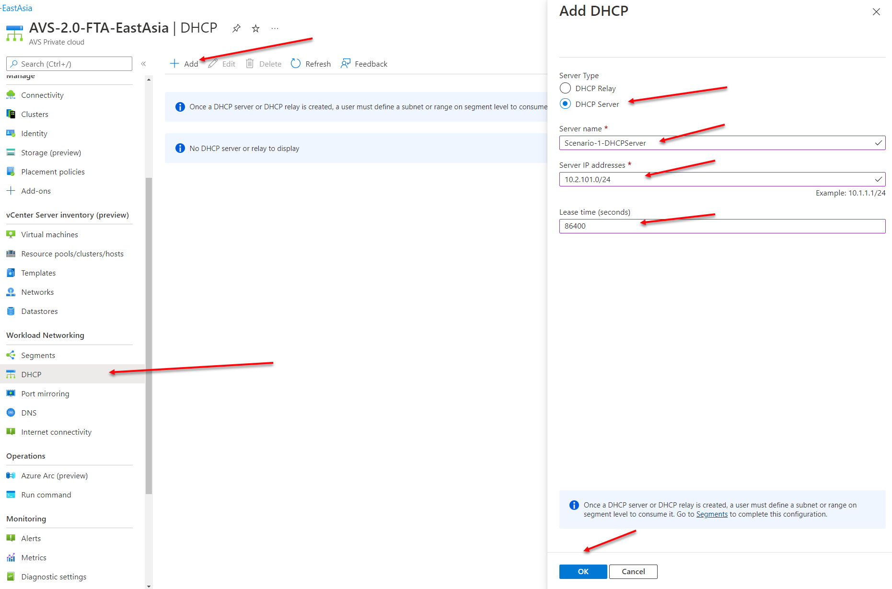
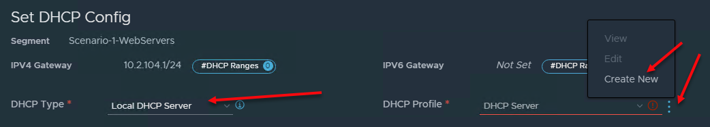
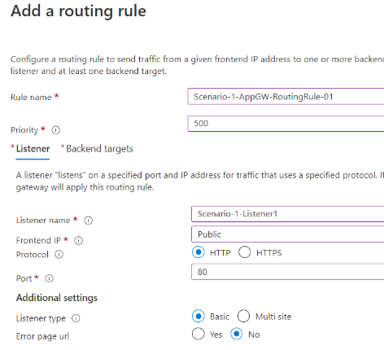

# AVS Networking Secured Virtual WAN hub with default route propagation

This lab shows you how to build out **Scenario 1: Secured Virtual WAN hub
with default route propagation** as described in the Microsoft Cloud Adoption Framework [here](https://docs.microsoft.com/en-us/azure/cloud-adoption-framework/scenarios/azure-vmware/eslz-network-topology-connectivity#scenario-1-secured-virtual-wan-hub-with-default-route-propagation).

Scenario 1 Connectivity: ExpressRoute & Global Reach

Names and IP ranges used in this guide are examples, and you may need to customize for your environment. The following network address assignments are used in this guide:

| Item | Assigned Name | IP Range |
|------|---------------|----------|
| Virtual Network | Scenario-1-Jumpbox-vNet | 10.40.218.0/23 |
| Subnet for Servers | Servers | 10.40.218.0/24 |
| Subnet for Gateway | GatewaySubnet | 10.40.219.0/26 |
| Subnet for Bastion | AzureBastionSubnet | 10.40.219.64/26 |
| Subnet for AppGateway | AppGW-Subnet | 10.40.219.128/26 |
| vWAN Hub | Scenario-1-vWAN-Hub | 10.40.216.0/23 |
| Segment for Web Server VMs | Scenario-1-WebServers | 10.2.104.1/24 |
| NSX DHCP Server | Scenario-1-DHCP | 10.2.107.2/24 |
| DHCP Range for Web Servers | N/A | 10.2.104.100-10.2.104.200 |

## Required Infrastructure - Step by Step

1. A virtual network with four subnets containing a jumpbox VM, Azure Bastion, Application Gateway, and (optionally) a virtual network gateway

2. A secured vWAN hub

3. An AVS environment with 2 servers running a web site (Instructions provided below)

4. A connection to on-premises network via ExpressRoute. Alternatively, this can be simulated with an ExpressRoute (ExR) connection from another vNet to
   the vWAN hub. This will use the optional virtual network gateway mentioned above.

5. For this lab, we will build all resources in the same region

## Part 1 - Virtual network with two subnets and a jumpbox.

1. Create a resource group (RG) called "AVS-Scenario-1" or a name of your choosing

   

   Click "Review + create" then click "Create"

2. Create a virtual network called "Scenario-1-Jumpbox-vNet"

    

    Once this is complete, click "Next : IP Addresses" at the bottom left of the portal window

3. Create a vNet with IP address 10.40.218.0/23. Next, create four subnets:

    1. Configure the "Servers" subnet with IP address range 10.40.218.0/24
    2. Configure the "GatewaySubnet" subnet with IP address range 10.40.219.0/26
    3. Configure the "AzureBastionSubnet" subnet with IP address range 10.40.219.64/26
    4. Configure the "AppGW-Subnet" subnet with IP address range 10.40.219.128/26

    

   Delete the existing (default) 10.0.0.0/16 entry and add the address space 10.40.218.0/23. Add the subnets, then click on "Review + create" then on "Create."

4. Create a jumpbox virtual machine on the "Servers" subnet defined above. Build it in the AVS-Scenario-1 resource group, select a Windows server (2016 or later). Choose an appropriate size (suggested is Standard_DS1_v2). Fill in the appropriate fields as shown, overriding the default Public inbound ports setting to "None," and then click on the "Next: Disks." Leave the defaults, then click on "Next : Networking"
    1. Select the virtual network we created above: "AVS-Scenario-1-Jumpbox-vNet"
    2. Select the subnet "Servers"
    3. Select the Public IP dropdown and select None
    4. Leave the reset of the defaults as shown:

    

    

    5. Click on "Review + create" then click on "Create" to complete the creation of the Scenario-1-Jumpbox

5. Deploy Azure Bastion

    1. In the Search bar, search for and select "Bastions"
    2. Click "+ Create"
    3. Fill in the appropriate fields as shown, selecting the appropriate resource group, virtual network, and subnet
    4. Click "Review + Create," then "Create"

    

      

6. Verify you can log into the Jumpbox via Bastion
   1. Go to the Scenario-1-Jumpbox resource
   2. From the Overview pane, click the Connect dropdown and select Bastion
   3. Enter the username and password specified when you created the virtual machine, then click Connect. If prompted about pop-ups being blocked, allow them and try again.

## Part 2 -- Create the vWAN and vWAN hub

1. Create a vWAN hub in the AVS-Scenario-1 resource group called "Scenario-1-vWAN." Leave the default type as "Standard." Click "Review + create" then click "Create."
    
    

2. Go to the Scenario-1-vWAN and select "Hubs" and then click on the "+ New Hub"
    
    

    Make sure the region is set to match the rest of your deployment.

    1. Add the name "Scenario-1-vWAN-Hub"

    2. Add hub private IP address of 10.40.216.0/23

    3. Set the Virtual hub capacity to "2 Routing Infrastructure Units"

    4. Click "Next : Site to site" (add nothing)

    5. Click "Next : Point to site" (add nothing)

    6. Click "Next : ExpressRoute"

    

    7. On the ExpressRoute tab, select "Yes" to create an ExpressRoute Gateway and select "1 scale unit -- 2 Gbps" for the "Gateway scale units" option

    

    Click "Review + create" then click on the "Create" button to complete the hub build

    This process will take between 15 and 30 minutes to complete. The ExpressRoute gateway is by default a fairly long build.

## Part 3 -- Connecting to the vWAN hub

In this section we will connect the Scenario-1-Jumpbox-vNet and AVS to the vWAN hub. The assumption is that there is an AVS environment available.

If no AVS environment is available, then you can (sort of) simulate the connection by adding an ExpressRoute gateway to the "GatewaySubnet" subnet created in part 1 and another vNet with two IIS (or other web servers) attached. See the appendix for a high level overview of the process.

There is a video on configuring AVS located on [YouTube](https://youtu.be/F6ZMsZHDTtE).

1. Connect the Scenario-1-Jumpbox-vNet to the vWAN Hub.

    1. Go to the vWAN configuration blade
    
    2. Select "Virtual Network Connections"
    
    3. Then from the top left, click on "+ Add connection"
    
    4. Provide a connection name, select the hub that was just created, select the appropriate subscription and resource group, and select the Scenario-1-Jumpbox-vNet virtual network
    
    5. Leave the defaults as shown
    
    6. Click on "Create"

    

    Now you have established a link (vNet peering) between the vWAN hub and the network with the Scenario-1-Jumpbox. When complete it will look like this:

    

2. Connect the AVS private cloud to vWAN hub.

    1. Open up your AVS instance
    
    2. Click on the "Connectivity" option
    
    3. Select ExpressRoute
    
    4. Click on the "+ Request Authorization Key"
    
    5. Provide a name for the key. It's a good idea to name the key with the name of the vWAN hub you will be connecting to. (Connect-Scenario-1-vWAN-Hub)
    
    6. Click "Create"

    

    Leave this browser tab/window open and open up another portal tab/window.

3. Now we will create the ExpressRoute connection between AVS and the vWAN
   hub.

    1. Select ExpressRoute

    2. Click on the "+ Redeem authorization key"

    3. Copy the key value from the other browser window

    4. Enter the Peer Circuit ID -- Note this is called the "Express Route ID" in the picture above, do not use the "Private Peering ID"

    5. Select "Automatically associate this ExpressRoute circuit with the hub"

    6. Click "Add"

       

    This connection can take up to 5 minutes to complete. Once the connection has been successfully established, it looks like this:

    

4. Connect your ExpressRoute circuit the same way, get the Authorization Key and Resource ID from the ExR circuit that connects your on-premise environment to Azure.

    

    Redeem the Auth Key and Resource ID in you vWAN hub/ExpressRoute connection tab.

    If you don't have one, then create a virtual network and an ExR virtual network gateway and connect via ExR. See the Appendix for more detailed instructions.

5. Testing connectivity

    1. On the AVS page, click on the "VMware credentials" option and bring up the screen with the login credentials.

    

    2. Next, use Bastion to access the Scenario-1-Jumpbox VM. Turn off IE Enhanced Security for Administrators (Server Manager/Local Server).

    3. Open up the browser and enter the Web client URL listed on the VMware credentials tab. This should take you to the vCenter logon page.
        
    4. You will see a "Your connection isn't private" message. Click through the logon pages until you can see the login screen for AVS
            
    
        
    5. Login using the <cloudadmin@vsphere.local> and the password copied from the VMware credentials panel

    Connectivity through the vWAN hub has now been established.

## Part 4 -- Setting up AVS

We need to add two machines with web services installed in the AVS environment. To do this, we will add a network segment to the existing default Tier-1 gateway, configure DHCP for that subnet, and then build two virtual machines and add IIS.

1. Create a VMware network segment, either through the Azure portal, or through the NSX-T interface

   **Portal**

   1. From the portal, click on "Segments" then click "+ Add" to create a new segment
        
   2. Add the name Scenario-1-VMware-Subnet
        
   3. Add the gateway subnet 10.2.100.1/24 (this is correct, this is how VMware adds address space)
        
   4. Add a DHCP range (This is optional, but simplifies addressing. The first server will have IP an address of 10.2.100.100 and second server will have IP an address of 10.2.100.101.)
        
   5. Click "OK" and wait until provisioning has completed (check using the notification icon)

   

   6. Select DHCP from the portal and click "+ Add"
        
   7. Server name "Scenario-1-DHCPServer"
        
   8. Server IP addresses 10.2.101.0/24
        
   9. Lease time 86400 seconds
        
   10. Click "OK" and wait for it to complete

   

   **NSX-T Interface**

   1. Log into the NSX-T interface using the IP address and credentials shown under the VMware credentials tab

   

   2. On the NSX-T management page, select the Networking tab

   
    
   3. Select "Segments" and then select "ADD SEGMENT" and complete the following as shown below
    
   4. Segment name: "Scenario-1-WebServers"
    
   5. Connected gateway: Choose the default Tier1 gateway, it will always have the format TNT##-T1
    
   6. Transport zone: choose TNT##-Overlay-TZ
    
   7. Subnets: Enter IP address 10.2.104.1/24

   

   8. Click on the "SET DHCP CONFIG" on the right hand side (see screenshot above bottom right)
    
   9. Set the DHCP type to "Local DHCP Server"
    
   10. On the right-hand side, select the three vertical dots next to the DHCP profile and click "Create New"

   

   11. Add the DHCP server name "Scenario-1-DHCP" and the IP address range for the DHCP server 10.2.107.2/24 (Range does not need to be this large--we're just using /24s for simplicity)
    
   12. Add the Edge cluster, choose TNT##-CLSTR

   

   13. Click "Save" in the bottom right-hand corner
    
   14. Back on the "Set DHCP Config" screen, enable the DHCP Config
    
   15. Add in the address of the DHCP server created above 10.2.107.2/24
    
   16. DHCP range 10.2.104.100-10.2.104.200
    
   17. DNS server enter the default Azure DNS IP 168.63.129.16

   

   18. In the bottom right corner, click "APPLY"
    
   19. Back on the Segments/ADD SEGMENT page, click "SAVE" in the bottom left hand corner. You should see the following confirmation -- select No to continue editing

   

2. Create a virtual machine attached to the VMware segment configured above. 

   > Note: We assume that the user knows how to create a VM, so we will only cover key steps. In this process, we use a Content data store and load Windows Server 2019. Alternatively, an ISO can be uploaded to a data store if this is a new AVS build (Ref: [Example-How to upload an ISO to a datastore](https://www.youtube.com/watch?v=kO2BV1pMQtc&t=15s))

   1. Log into the vCenter console as shown above

   2. Right click on the Cluster-1 and select "New Virtual Machine"
        
      1. Create a new virtual machine > Next
      2.  Select a name and folder Virtual Machine Name: Scenario-1-Web01, leave the default location as SDDC-Datacenter > Next
      3. Select a compute resource: Cluster-1 > Next
      4. Select storage (default): vsanDatastore > Next
      5. Select compatibility (default): ESXi 6.7 and later > Next
      6. Select a guest OS, Guest OS family: Windows Guest OS version Microsoft Windows Server 2016 or later (64 bit) > Next
      7. Customize hardware, leave defaults except:
         1. Under New Network, browse and select "Scenario-1-Webservers"
         2. Under "New CD/DVD Drive" select "Content Library or Datastore" (wherever the ISO files are stored)
         3. Select the Windows server ISO to be used for the OS installation
         4. Click the "Connect" radio button and confirm:

      

      8. Click Next

      9. Verify the configuration and click FINISH

   3. Power on the new server Scenario-1-Web01 and go through the Windows setup process. (Note you may have to issue a reboot from the console to see the "Press to boot from CD" option -- if you see "EFI Network -- unsuccessful.", reboot using the command prompt in the top right hand corner of the console.)

      1. Select language and keyboard settings (default for most)
        
      2. Select "Desktop Experience" when choosing the OS
        
      3. Select "Custom: Install Windows only (advanced)"
        
      4. Leave the default Drive 0 Unallocated Space, click Next
        
      5. Enter your administrator password and click "Finish"

   4. Log into the Scenario-1-Web01 server

      1. Set the IE Enhanced Security Configuration for Administrators to
            "Off"
        
      2. Set the Remote desktop to "Enabled"
        
      3. Optional -- change the firewall inbound to allow ICMP on IPv4
        
      4.  Launch IE and record your Internet IP address using <https://www.ipconfig.com>. If you don't get an IP address, that's fine, if you do, it likely means that the Internet access setting in the Azure AVS portal / Workload Networking / Internet Connectivity has been enabled. Check that the setting has been changed to "Do not connect or connect using default route from Azure".

    

      5. RDP from the Scenario-1-Jumpbox to the Scenario-1-Web01 server and install IIS on the Scenario-1-Web01 server. (Server manager, add roles, select IIS)

      6. Repeat step three of this section (Part 3) to create the Scenario-1-Web02 server

## Part 5 -- Configure vWAN Secure Hub & Push default route (0.0.0.0/0)

In this section, the secure vWAN hub Azure Firewall is deployed and a Firewall policy is applied to enable traffic flow to and from the Internet. 
  
1. Adding the Azure Firewall

   1. In the Azure portal, select vWAN

   2. Select on the Scenario-1-vWAN

   3. Select Scenario-1-vWAN-Hub

   4. Select Azure Firewall and Firewall Manger

   5. Make sure the checkbox next to Scenario-1-vWAN-Hub is selected

   

        
   6. Click on "Next : AzureFirewall"

   7. Select Azure Firewall "Enabled" (default)

   8. Azure Firewall tier -- Standard (default) (Select Premium if you want the additional features [Azure Firewall Premium features \| Microsoft Docs](https://docs.microsoft.com/en-us/azure/firewall/premium-features))

   9. Change the number of public IP addresses to 2

   10. Leave the Default Deny Policy

   

   11. Leave security partner provider "Disabled", click "Next : Review and confirm"

   12. Click "Confirm"

   > Note: This deployment takes under 10 minutes to complete.

2. Create the Azure Firewall Policy

   1. In the blue search bar at the top of the portal window, search for "Firewall Policies" then click on "+ Create"

      

   2. Under the basics tab enter the following information:
    
      1. Resource group "AVS-Scenario-1"
    
      2. Name "Scenario-1-FWPolicy"
    
      3. Region (wherever you are building, for this demo it is in East Asia)
    
      4. Policy Tier -- Standard (This must match the Firewall Tier above)
    
      5. Parent policy None (default)
    
      6. Select "Next : DNS Settings"

         

   At this point you can select "Review + create" and then "Create". Then skip forward to 3. below.

   If you would prefer to look through the other options, follow the instructions below.

   3. Leave the DNS 'Disabled'

   4. Select 'Next : TLS Inspection'

   5. TLS inspection is disabled because this is a Standard Azure Firewall

   6. Select 'Next : Rules'

   7. Don't add rules here, select 'Next :IDPS'

   8. IDPS is disabled because this is a Standard Azure Firewall

   9. Select 'Next : Threat Intelligence'

   10. No changes on the 'Threat Intelligence screen

   11. Click 'Review and Create' in the bottom right hand corner of the portal

   12. After Validation is complete, select 'Create'

3. Configure Firewall Policy Rules

   **RDP Access From Home Office**

   1. In the blue search bar at the top of the portal window, search for "Firewall Policies" then select Scenario-1-FWPolicy
        
   2. Select "DNAT rules" and click on the "+ Add a rule collection"
        
      1. Name: Scenario-1-DNAT-Rule-Collection
        
      2. Rule collection type: DNAT
        
      3. Priority: 300
   
      4. Rule collection action: Allow
        
      5. Rule collection group: DefaultDnatRuleCollectionGroup

         

   3. Under the Rules section enter the following

      1. Name: Allow-Home-Office (any appropriate descriptor)
        
      2. Source type: IP Address
        
      3. Source: Your internet IP address (eg. 24.68.78.190)
        
      4. Protocol: TCP
        
      5. Destination port: 3389

      6. Destination type: IP address
        
      7. Destination: IP address of the Azure Firewall
        
      8. Translated address: IP address of Scenario-1-Web01
        
      9. Translated port: 3389

      

      Repeat this rule for Scenario-1-Web02, but use the second IP address assigned to the Azure Firewall, and set the "Translated address" to the IP address of Scenario-1-Web02. (10.2.104.101)

   4. Click "Add" to create the rule collection and rules.

   **Application (HTTP, HTTPS) Access for Azure/AVS Servers**

   1. Select "Application rules"

   2. Click on "+ Add a rule collection"

      1. Name: Scenario-1-Application-Rule-Collection
        
      2. Rule collection type: Application
        
      3. Priority: 150
        
      4. Rule collection action: Allow
        
      5. Rule collection group: DefaultApplicationRuleCollectionGroup

         

   3. Under the Rules section enter the following

      1. Name: Allow-IPAddress.com

      2. Source type: IP Address

      3. Source: \*

      4. Protocol: Http:80,Https:443

      5. Destination type: FQDN

      6. Destination: \*.ipaddress.com

   4. Click "Add" to save the rule collection.

   **Network Rule to Allow AVS DNS Resolution**

   Create a network rule to allow the NSX DNS service to resolve external names.

   1. Select "Network rules"

   2. Click on "+ Add a rule collection"

      1. Name: Scenario-1-Network-Rule-Collection
        
      2. Rule collection type: Network
        
      3. Priority: 150
        
      4. Rule collection action: Allow
        
      5. Rule collection group: DefaultApplicationRuleCollectionGroup

   3. Under the Rules section enter the following

      1. Name: AllowDNS

      2. Source Type: IP Address

      3. Source: Enter the address of the AVS DNS Service. This can be found in the AVS Private cloud object. Under Workload networking, click DNS, then DNS service

      4. Protocol: UDP
    
      5. Destination Ports: 53

      6. Destination Type: IP Address

      7. Destination: 1.1.1.1, 1.0.0.1

   4. Click "Add" to save the rule collection.

4. Associate the policy to the secure Scenario-1-vWAN-Hub

   Use the Search bar to search for and select Firewall Manager

   1. Select Azure Firewall Policies
        
   2. Select "Scenario-1-FWPolicy"
        
   3. Click on Manage Associations
        
   4. Select the Scenario-1-vWAN hub
        
   5. Click "Add" at the bottom of the page to complete the association.

   

   The result in should look like this:

   

5. Enable the default route to send outbound Internet traffic through the Firewall

   Go to the Firewall Manager portal screen.

   1. Select "Virtual Hubs"

   

   2. Select the "Scenario-1-vWAN-Hub" and click on it. This will launch the "Security configuration" portal page (below).
    
   3. Select "Security configuration"

   

   4. Under Internet traffic, change to "Azure Firewall"
        
   5. Leave "Private traffic" as "Bypass Azure Firewall" (we are not inspecting traffic that stays inside Azure)
        
   6. Select both connections:
        
      * Connect-Scenario-1-Jumpbox-vNet
        
      * ExRConnection-eastasia-#######
        
   7. Click on Save, you will see a warning message, read it, and acknowledge it.

   > Note: This update takes about 5 minutes to complete.

## Part 6 -- Enable Global Routing

From the AVS environment, select the "Connectivity" tab, then select "ExpressRoute Global Reach" from the top menu options. Click on the "+ Add" to open the "On-prem cloud connections" screen.

   

Next, select the Azure ExpressRoute circuit and click on "Authorizations"

Enter a name for this connection, then click "Save." Now copy the Resource ID, and paste in into the screen above. Follow up by copying the "Authorization Key" and pasting it in the "Authorization Key" box shown above. Then click on "Create" at the bottom of the page.

This establishes a GlobalReach connection between the AVS network and the network used to connect back to on-premises.

## Part 7 -- Testing Routing On-Premises & Internet Traffic Routing

1. Confirm the default route 0.0.0.0/0 has been propagated to the Scenario-1-Jumpbox.

   1. Use Bastion to access the Jumpbox VM

   2. Launch IE or Edge and type in [www.ipaddress.com](http://www.ipaddress.com). Check the IP address against the one your recorded in Step 5 of Part 1 (above).

   3. The IP address should have change to the IP address of the Azure Firewall. In our case it is 20.239.194.252. This should be different from the IP address associated with the Scenario-1-Jumpbox 20.205.60.208

2. From the Scenario-1-Jumpbox, check you can RDP to the Scenario-1-Web01 and Scenario-1-Web02 servers.

   1. RDP to Scenario-1-Web01 (10.2.104.100) from the Jumpbox

   2. Launch IE or Edge and type in [www.ipaddress.com](http://www.ipaddress.com)

   3. You should see the same IP address you get from the Jumpbox, 10.239.194.252, this is the public IP address of the Azure Firewall.

   4. Repeat for Scenario-1-Web02 (10.2.104.101)
    

## Part 8 -- Configuring Application Gateway

In this section, an Application Gateway is installed into the existing Scenario-1-Jumpbox-vNet. The AppGateway will then front-end the two web servers running in AVS.

1. Deploy Application Gateway

   1. Use the Search bar to search for and select "Application Gateway"

   2. Select "+ Create"

   3. Resource Group: AVS-Scenario-1

   4. Application GW name: Scenario-1-AppGW

   5. Region: East Asia (or wherever you are building the lab)

   6. Tier: Standard v2

   7. Enable autoscaling: Yes (default)

   8. Minimum instance count: 0 (default)

   9. Maximum instance count: 10 (default)

   10. Availability zone: None (default)

   11. HTTP2: Disabled (default)

   12. Virtual Network: Scenario-1-Jumpbox-vNet

   13. Subnet: AppGW-Subnet

   14. Click "Next : Frontends"

   15. Frontend IP address: Public

   16. Add new Public IP address with a name such as Scenario-1-AppGW-PIP and click "OK"

   17. Click "Next : Backends"

   18. Select "Add a backend pool"

   19. Name: Scenario-1-AppGW-BackEndPool

   20. Add backend pool w/t targets: No

   21. Target type: IP Address or FQDN

      1. Enter IP address for Scenario-1-Web01 (10.2.104.100)
    
      2. Enter IP address For Scenario-1-Web02 (10.2.104.101)

   22.Click 'Add' in the bottom left corner of the 'Add a backend pool' blade.

   23. Click "Next : Configuration"

   24. Rule name: Scenario-1-AppGW-RoutingRule-01

   25. Priority: 500
   
   

2. Configuring the App Gateway "Listener"

   1. Listener name: Scenario-1-Listener1

   2. FrontEnd IP: Public
   
   3. Protocol: Http

   4. Listener type Basic

   5. Error page URL No

   6. Click "Add"

3. Configuring the App Gateway "Backend targets"

   1. Backend Pool: Scenario-1-AggGW-BackEndPool

   2. Backend target: Add new

      1. Settings name: Scenario-1-BackEndSettings
            
      2. Backend protocol: HTTP

      3. Backend port: 80
            
      4. Leave everything else default
            
      5. Click "Add"

   3. Click "Add" on the "Add a routing" rule page. This takes you back to the "Create application gateway" page.

   4. Click "Next : Tags" then click "Next : Review + create"

   5. Click "Create"

4. Create a Route table for the Application Gateway subnet

    Because we created an Application Gateway subnet on a VNet that is protected by Azure Firewall, we need to create a custom route table with a next hop of "Internet" and apply it to the AppGateway subnet to allow AppGateway traffic to bypass the Azure Firewall.

   1. In the Search bar, search for and select Route tables

   2. Click "+ Create"

   3. Select the appropriate Resource Group and Region

   4. Enter a name, such as Scenario-1-AppGW-RouteTable

   5. Leave the Propagate gateway routes as 'Yes'

   6. Click 'Review + create' then click 'Create'

   

    When the route table build is complete, go to the resource, select "Routes" then "+ Add"

   1. Enter a route name, such as "BypassFirewall"

   2. Destination address prefix: IP Addresses

   3. Destination IP addresses/CIDR ranges: 0.0.0.0/0

   4. Next hop type: Internet

   5. Click "Add"

   

    Next, select "Subnets" and click "+ Associate."

    Select the Scenario-1-Jumpbox-vNet Virtual Network, the AppGW-Subnet subnet, and click "OK"

5. Test the Application Gateway

Navigate to the Application Gateway (Scenario-1-AppGW), and note the Frontend public IP address listed on the Overview panel.

Open a new browser tab and enter the Application Gateway frontend IP address. The default IIS start page should load, served by one of the Webserver VMs.

## Appendix -- Testing without AVS.

1. Create another vnet

2. Create an ExpressRoute virtual gateway

3. Connect the ExpressRoute virtual gateway via an ExR connection to
    the vWAN hub

4. Change the Security configuration and add the new ExpressRoute
    connection so that it shows up as 'Secured by the Azure Firewall'

   
