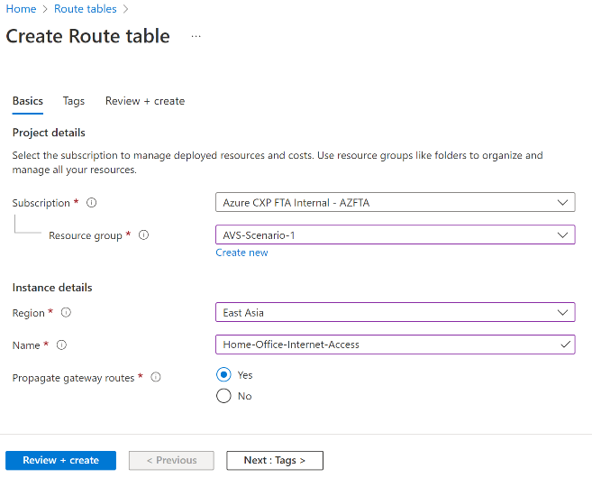
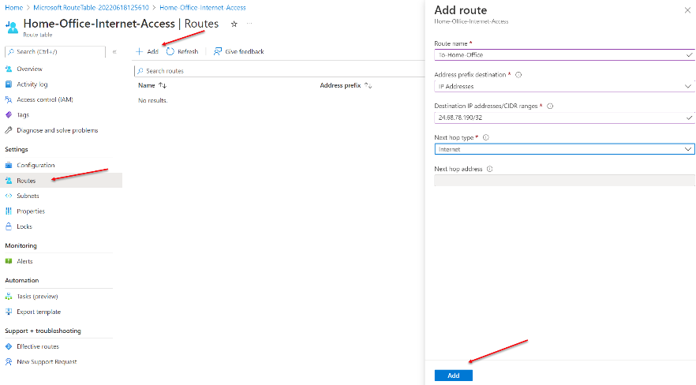
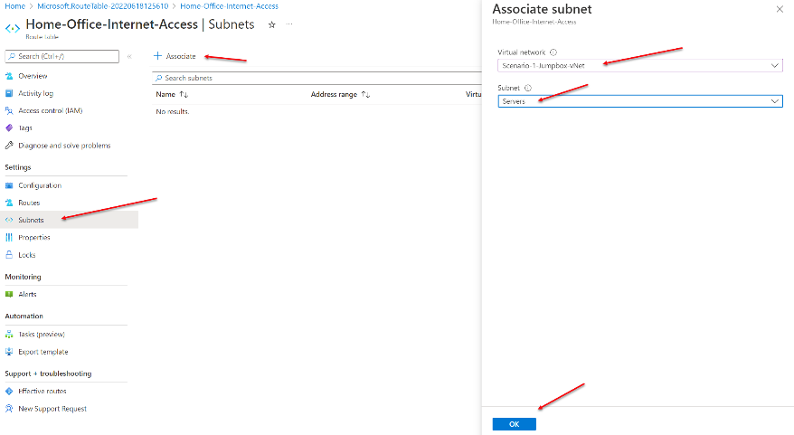
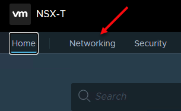
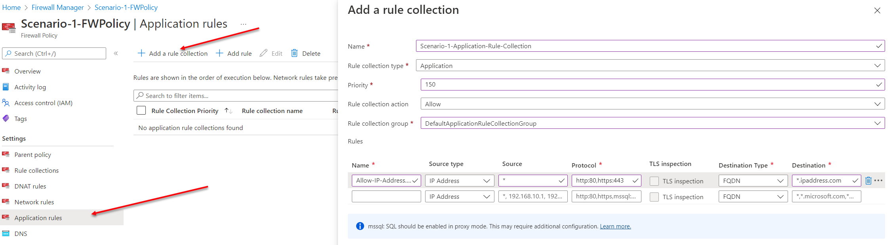

**AVS Networking Secured Virtual WAN hub with default route propagation**

This lab shows you how to build out "Scenario 1: Secured Virtual WAN hub
with default route propagation" [Click here](https://docs.microsoft.com/en-us/azure/cloud-adoption-framework/scenarios/azure-vmware/eslz-network-topology-connectivity#scenario-1-secured-virtual-wan-hub-with-default-route-propagation)

How its all connected: ExpressRoute & Global Reach  

   

**Require infrastructure - Step by Step **

1. A virtual network with 3 subnets containing a jumpbox and application gateway and (optional) a virtual network gateway.
2. A secured vWAN hub

3. An AVS environment with 2 servers running a web site (We will walkthrough 
   how to create a vNet and add two servers running IIS).

4. A connection to on-premises network via ExpressRoute, otherwise you can
   simulate this with an ExpressRoute (ExR) connection from another vNet to
   the vWAN hub (this is using the optional virtual network gateway mentioned in 1. above).

5. For this lab, we will build all resources in the same region.

## Part 1 - Virtual network with 2 subnets and a jumpbox.

1. Create a resource group (RG) called
   "AVS-Scenario-1" or your choice of the name

      
   Click 'Review + create' then click 'Create'

2. Create a virtual network called 'Scenario-1-Jumpbox-vNet'

   

> Once this is complete, click 'Next : IP Addresses' at the bottom left
> of the portal window

3)  Create a vNet with IP address 10.40.218.0/23. Next, create two subnets, one called 'Servers' the other called 'GatewaySubnet'

> Configure the 'Servers' subnet with IP address range 10.40.218.0/24
>
> Configure the 'GatewaySubnet' with IP address range 10.40.219.0/24
>
>    
>
> Delete the existing (default) 10.0.0.0/16 and add the address space
> 10.40.218.0/23.
>
> Add the subnets
>
> Servers 10.40.218.0/24
>
> GatewaySubnet 10.40.219.0/24
>
> Then click on 'Review + create' then on 'Create'. We are not adding
> changing Security or adding Tags.

4)  Create a jumpbox virtual machine on the 'Servers' subnet defined above. Build it in the\AVS-Scenario-1 resource group, select a Windows server (2016 or later). Choose an appropriate size (suggested is Standard_DS1_v2). Fill in the appropriate fields as shown, then click on the 'Next: Disks' . Leave the defaults, then click on 'Next : Networking'
    

        a.  Select the virtual network we created above 'AVS-Scenario-1-Jumpbox-vNet'

        b.  Select the subnet 'Servers'

        c.  Leave the reset of the defaults as shown.

  

  

        d.  Click on 'Review + create' then click on 'Create' to complete the
            creation of the Scenario-1-Jumpbox
  

5)  Create a route table called 'Home-Office-Internet-Access'   

   

        a.  Create the route table, be sure to create it in the correct region.

        b.  Leave the Propagate gateway routes as 'Yes'

        c.  Click 'Review + create' then click 'Create'

> When the route table build is complete, go to the resource, select
> Routes and + Add

   

>Next select subnets and associate the
route table to the 'Servers' subnet. This will enable you to RDP to the
Scenario-1-Jumpbox after we enable the default route on the secured
vWAN. If you don't do this, you will have to create a rule on the secure
hub firewall to enable RDP.

   

6)  Test your RDP connection to the Scenario-1-Jumpbox and make sure you
    can connect.

   

Open up IE or Edge, use [www.ipaddress.com](http://www.ipaddress.com)
and **record your public IP address**.
 
 

## Part 2 -- Create the vWAN and vWAN hub

1)  Create a vWAN hub in the
    AVS-Scenario-1 resource group called 'Scenario-1-vWAN'. Leave the
    default type as 'Standard'. Click 'Review + create' then click
    'Create'.
       

> Go to the Scenario-1-vWAN and select 'Hubs' and then click on the '+
> New Hub'
   

Make sure the region is set to wherever you
are creating your build.

        a.  Add the name 'Scenario-1-vWAN-Hub'

        b.  Add hub private IP address of 10.40.216.0/23

        c.  Set the Virtual hub capacity to '2 Routing Infrastructure Units.

        d.  Click "Next : Site to site", (add nothing)

        e.  Click "Next : Point to site", (add nothing)

        f.  Click "Next : ExpressRoute"

   

        g.  On the ExpressRoute tab, select 'Yes' to create an ExpressRoute
            Gateway and select '1 scale unit -- 2 Gbps' for the 'Gateway scale
            units' option.

   

> Click 'Review + create' then click on the 'Create' button to complete
> the hub build.

This process will take between 15 and 30 minutes to complete. The
ExpressRoute gateway is by default a fairly long build.
  

## Part 3 -- Connecting to the vWAN hub

In this section we will connect the Scenario-1-Jumpbox-vNet and AVS to
the vWAN hub. The assumption is that there is an AVS environment
available.

If there isn't an AVS environment, then you can (sort of) simulate the
connection by adding an ExpressRoute gateway to the 'GatewaySubnet'
subnet created in part 1 and another vNet with two IIS (or other web
servers) attached. See the appendix for a high level overview of the
process.

There is a video on configuring AVS located here:
<https://youtu.be/F6ZMsZHDTtE>.

1.  Connect the Scenario-1-Jumpbox-vNet to the vWAN Hub.

    a.  Go to the vWAN configuration blade
    
    b.  Select 'Virtual Network Connections'.
    
    c.  Then from the top left, click on '+ Add connection'.
    
    d.  Create a connection name\

        Select the hub that was just created (Scenario-1-vWAN-Hub)\
        Make sure the correct subscription has been selected\
        Choose the virtual network were the jumpbox was instantiated.
    
    e.  Leave the defaults as shown
    
    f.  Click on 'Create'

   

Now you have established a link (vNet
peering) between the vWAN hub and the network with the
Scenario-1-Jumpbox. When it's complete it will look like this.

   

2.  Connect the AVS private cloud to vWAN hub.

    a.  Open up your AVS instance
    
    b.  Click on the 'Connectivity' option
    
    c.  Select ExpressRoute.
    
    d.  Click on the '+ Request Authorization Key'
    
    e.  Provide a name for the key. It's a good idea to name the key with
    the name of the vWAN hub you will be connecting to. (Connect-
    Scenario-1-vWAN-Hub)
    
    f.  Click 'Create'

   

Leave this browse tab/window open and open up another portal tab/window.

3. Now we will create the ExpressRoute connection between AVS and the vWAN
   hub.

    a.  Select ExpressRoute

    b.  Click on the '+ Redeem authorization key'

    c.  Copy the key value from the other browser window

    d.  Enter the Peer Circuit ID -note this is called the "Express Route ID
        in the picture above, do not use the 'Private Peering ID'

    e.  Select 'Automatically associate this ExpressRoute circuit with the
        hub

    f.  Click 'Add'

   

> This connection can take up to 5 minutes to complete. Once the
> connection has been successfully established, it looks like this:

   

4.  Connect your ExpressRoute circuit the same way, get the
    Authorization Key and Resource ID from the ExR circuit that connects
    your on-premise environment to Azure.

>    

Redeem the Auth Key and Resource ID in you vWAN hub/ExpressRoute
connection tab.

If you don't have one, then create a virtual network and an ExR virtual
network gateway and connect via ExR. It's not quite the same......see
the Appendix for more detailed instructions.

5.  Testing connectivity

        a.  On the AVS page, click on the 'Identity' option and bring up the
            screen with the Login Credential.
            
       

        b.  Next, RDP into the Scenario-1-Jumpbox. Turn off IE Enhanced Security
            for Administrators (Server Manager/Local Server)
        
        c.  Open up the browser and enter the IP address of vCenter, you need to
            use Https://10.250.176.2 (in this lab demo.) This should take you to
            the vCenter logon page.
        
        d.   You will see a 'Your connection isn't
            private'. Click through the logon pages until you can see the login
            screen for AVS
            
      
        
        e.  Login using the <cloudadmin@vsphere.local> and the password copied
            from the Identity portal screen (shown above).

> Connectivity through the vWAN's hub has now been established.

 

## Part 3 -- Setting up AVS

We need to add two machines with web services installed in the AVS
environment. To do this, we will add a network segment to an existing
(default) Tier1 gateway, configure DHCP for that subnet, and then build
two virtual machines and add IIS.

1)  Creating a VMware network segment through the portal, or through the
    NSX-T interface. You can either use the Portal or NSX-T.

**Portal**

        a.  From the portal, click on 'Segments' then click '+ Add' to create a
            new segment
        
        b.  Add the name Scenario-1-VMware-Subnet
        
        c.  Add the gateway subnet 10.2.100.1/24 (this is correct, this is how
            VMware adds address space)
        
        d.  Add a DHCP range (don't have to do this, just makes is easy to see,
            first server will have IP an address of 10.2.100.100 and second
            server will have IP an address of 10.2.100.101)
        
        e.  Click 'OK' and wait until provisioning has completed (check using the notification icon).

   

        f.  Select DHCP from the portal and click '+ Add'.
        
        g.  Server name 'Scenario-1-DHCPServer
        
        h.  Server IP addresses 10.2.101.0/24
        
        i.  Lease time 86400 seconds
        
        j.  Click 'OK' and wait for it to complete.

   

**NSX-T Interface**

    a.  Log into the NSX-T interface using the
        IP address and credentials shown under the identity tab. (Same
        location as the vCenter login information).

   

    b.  On the NSX-T management page, select the Networking         tab 

   
    

    c.  Select 'Segments' and then select 'ADD SEGMENT' and complete the
        following as shown below.
    
    d.  Segment name 'Scenario-1-WebServers'
    
    e.  Connected gateway (choose the default Tier1 gateway, it will always
        have the format TNT##-T1
    
    f.  Transport zone (choose TNT##-Overlay-TZ)
    
    g.  Subnets, use IP address 10.2.104.1/24.

   

    h.  Click on the 'SET DHCP CONFIG' on the right hand side (see
        screenshot above bottom right)
    
    i.  Set the DCHP type to 'Local DHCP Server'
    
    j.  On the right-hand side, select the three vertical dots next to the
        DHCP profile and click 'Create New'

   

    k.  Add the DHCP server name 'Scenario-1-DHCP' and the IP address range
        for the DHCP server 10.2.107.2/24 (yes this is way to big, just easy
        to follow)
    
    l.  Add the Edge cluster, choose TNT##-CLSTR

   

    m.  Click 'Save in the bottom right-hand corner.
    
    n.  Back on the 'Set DHCP Config' screen, enable the DCHP Config.
    
    o.  Add in the address of the DCHP server created above 10.2.107.2/24
    
    p.  DCHP range 10.2.104.100-10.2.104.200
    
    q.  DNS server enter the default Azure DNS IP 168.63.129.16

   

    r.  In the bottom right corner, click 'APPLY'
    
    s.  Back on the Segments/ADD SEGMENT page, click 'SAVE' in the bottom
        left hand corner. You should see the following confirmation --
        select No to continue editing

   

2)  Creating a virtual machine attached to the VMware segment configured
    above. Assumption is that the user knows how to create a VM, so this
    will cover key steps. In this process, we use a Content data store
    and load Windows Server 2019. Alternatively, an ISO can be uploaded
    to a data store if this is a new AVS build (Ref: [Example-How to
    upload an ISO to a
    datastore](https://www.youtube.com/watch?v=kO2BV1pMQtc&t=15s))

    a.  Log into the vCenter console as shown in Part 3, #3, d. above.

    b.  Right click on the Cluster-1 and select 'New Virtual Machine'

        i.   Create a new virtual machine > Next
        ii.  Select a name and folder Virtual Machine Name: Scenario-1-Web01, leave the default location as SDDC-Datacenter > Next
        iii. Select a compute resource: Cluster-1 > Next
        iv.  Select storage (default): vsanDatastore > Next
        v.   Select compatibility (default): ESXi 6.7 and later > Next
        vi.  Select a guest OS, Guest OS family: Windows Guest OS version Microsoft Windows Server 2016 or later (64 bit) > Next
        vii.  Customize hardware, leave defaults except
            a.  Under New Network, browse and select 'Scenario-1-Webservers'
            b.  Under 'New CD/DVD Drive' select 'Content Library or Datastore' (wherever the ISO files are stored).
            c.  Select the Windows server ISO to be used for the OS installation.
            d.  Click the 'Connect' radio button and confirm, should look like
                this:

    >   

            e.  Click \> Next

        viii. Verify the configuration and click \> FINISH

    c.  Power on the new server Scenario-1-Web01 and go through the Windows
        setup process. (Note you may have to issue a reboot from the console
        to see the 'Press to boot from CD' option -- if you see 'EFI Network
        -- unsuccessful.', reboot using the command prompt in the top right
        hand corner of the console.)

        a.  Select language and keyboard settings (default for most)
        
        b.  Select 'Desktop Experience' when choosing the OS
        
        c.  Select 'Custom: Install Windows only (advanced)
        
        d.  Leave the default Drive 0 Unallocated Space, click Next
        
        e.  Enter your administrator password and click 'Finish'

    d.  Log into the Scenario-1-Web01 server

        a.  Set the IE Enhanced Security Configuration for Administrators to
            'Off'
        
        b.  Set the Remote desktop to 'Enabled'
        
        c.  Optional -- change the firewall inbound to allow ICMP on IPv4
        
        d.  Launch IE and record your Internet IP address using
            <https://www.ipconfig.com>. If you don't get an IP address,
            that's fine, if you do, it likely means that the Internet access
            setting in the Azure AVS portal / Workload Networking / Internet
            Connectivity has been enabled. Check that the setting has been
            changed to 'Do not connect or connect using default route from
            Azure'.

    >    

    e.  RDP from the Scenario-1-Jumpbox to the Scenario-1-Web01 server and
        install IIS on the Scenario-1-Web01 server. (Server manager, add
        roles, select IIS)

    f.  Repeat step "3)" of this section (Part 3) to create the Scenario-1-Web02 server

    ## Part 4 -- Configure vWAN Secure Hub & Push default route (0.0.0.0/0)

    In this section, the secure vWAN hub Azure Firewall is deployed and a
    Firewall policy is applied to enable traffic flow to and from the
    Internet. If you did not add the "Home-Office-Internet-Access" route
    table to the 'Servers' subnet, RDP access to the Scenario-1-Jumpbox will
    change.
      
    1)  Adding the Azure Firewall

        a.  In the Azure portal, select vWAN

        b.  Select on the Scenario-1-vWAN

        c.  Select Scenario-1-vWAN-Hub

        d.  Select Azure Firewall and Firewall Manger

        e.  Make sure the checkbox next to Scenario-1-vWAN-Hub is selected

          

        
        f.  Click on 'Next : AzureFirewall'

        g.  Select Azure Firewall 'Enabled' (default)

        h.  Azure Firewall tier -- Standard (default) (Select Premium if you
            want the additional features [Azure Firewall Premium features \|
            Microsoft
            Docs](https://docs.microsoft.com/en-us/azure/firewall/premium-features))

        i.  Change the number or public IP address to 2

        j.  Leave the Default Deny Policy

           

        k.  Leave security partner provider 'Disabled', click 'Next : Review and
            confirm'

        l.  Click 'Confirm'

> Note: This deployment takes under 10 minutes to complete.

 

2)  Create the Azure Firewall Policy

    a.  In the blue search bar at the top of the portal window, search
        for 'Firewall Policies' then click on '+ Create'

       

    b.  Under the basics tab enter the following information
    
        i.  Resource group 'AVS-Scenario-1
    
        ii. Name 'Scenario-1-FWPolicy'
    
        iii. Region (wherever you are building, for this demo it is in East
            Asia)
    
        iv. Policy Tier -- Standard (This must match the Firewall Tier
            above)
    
        v.  Parent policy None (default)
    
        vi. Select 'Next : DNS Settings'

>      

> AT this point you can select 'Review + create' and then 'Create'. Then
> skip forward to 3) below.
>
> If you would prefer to look through the other options, follow the
> instructions below.

        c.  Leave the DNS 'Disabled'
    
        d.  Select 'Next : TLS Inspection'
    
        e.  TLS inspection is disabled because this is a Standard Azure Firewall
    
        f.  Select 'Next : Rules'
    
        g.  Don't add rules here, select 'Next :IDPS'
    
        h.  IDPS is disabled because this is a Standard Azure Firewall
    
        i.  Select 'Next : Threat Intelligence'
    
        j.  No changes on the 'Threat Intelligence screen
    
        k.  Click 'Review and Create' in the bottom right hand corner of the
            portal
    
        l.  After Validation is complete, select 'Create'

 

3)  Configure Firewall Policy Rules

[RDP Access From Home Office (Internet)]{.underline}

        a.  In the blue search bar at the top of the portal window, search for
            'Firewall Policies' then select Scenario-1-FWPolicy
        
        b.  Select 'DNAT rules' and click on the '+ Add a rule collection'
        
        c.  Name: Scenario-1-DNAT-Rule-Collection
        
        d.  Rule collection type: DNAT
        
        e.  Priority: 300
        
        f.  Rule collection action: Allow
        
        g.  Rule collection group: DefaultDnatRuleCollectionGroup

   

Under the Rules section enter the following

        h.  Name: Allow-Home-Office (any appropriate descriptor)
        
        i.  Source type: IP Address
        
        j.  Source: Your internet IP address (eg. 24.68.78.190)
        
        k.  Protocol: TCP
        
        l.  Destination port: 3389
        
        m.  Destination type: IP address
        
        n.  Destination: IP address of the Azure Firewall
        
        o.  Translated address: IP address of Scenario-1-Web01
        
        p.  Translated port: 3389

>    
Repeat this rule for Scenario-1-Web02,
> but use the second IP address assigned to the Azure Firewall, and set
> the 'Translated address' to the IP address of Scenario-1-Web02.
> (10.2.104.101)
>
> To find the second IP address, follow the breadcrumbs shown here:

        q.  Click 'Add' to create the rule collection and rules.
  

4. Application (HTTP, HTTPS) Access for Azure/AVS Servers

    a.  In the blue search bar at the top of the portal window, search for
        'Firewall Policies' then select Scenario-1-FWPolicy

    b.  Select on 'Application rules'

    c.  Click on '+ Add a rule collection'

        i.  Name: Scenario-1-Application-Rule-Collection
        
        ii.  Rule collection type: Application
        
        iii.  Priority: 150
        
        iv.  Rule collection action: Allow
        
        v.  Rule collection group: DefaultApplicationRuleCollectionGroup

   

Under the Rules section enter the following

        a.  Name: Allow-IPAddress.com

        b.  Source type: IP Address

        c.  Source: \*

        d.  Protocol: Http:80,Https:443

        e.  Destination type: FQDN

        f.  Destination: \*.ipaddress.com

> Click 'Add' to save the rule collection.

4)  Associate the policy to the secure Scenario-1-vWAN-Hub

Select Firewall Manager (search for it in the blue search bar in the
Azure portal)

        a.  Select Azure Firewall Policies
        
        b.  Select the "Scenario-1-FWPolicy
        
        c.  Click on Manage Associations
        
        d.  Select the Scenario-1-vWAN hub
        
        e.  Click 'Add' at the bottom of the page to complete the association.

   

The result in should look like this:

   

5)  Enable the default route to send outbound Internet traffic through
    the Firewall

> Go to the Firewall Manager portal screen.

        a.  Select 'Virtual Hubs'

   

        b.  Select the 'Scenario-1-vWAN-Hub' and click on it. This will launch
        the 'Security configuration' portal page (below).
    
        c.  Select 'Security configuration'

   

        d.  Under Internet traffic, change to 'Azure Firewall'
        
        e.  Leave 'Private traffic' as 'Bypass Azure Firewall' (we are not
            inspecting traffic that stays inside Azure)
        
        f.  Select both connections,
        
            i.  Connect-Scenario-1-Jumpbox-vNet
        
            ii. ExRConnection-eastasia-#######
        
        g.  Click on Save, you will see a warning message, read it, and
            acknowledge it.

> Note: This update takes about 5 minutes to complete.
 
 

## Part 5 -- Enable Global Routing

> From the AVS environment, select the 'Connectivity' tab, then select
> 'ExpressRoute Global Reach' from the top menu options. Click on the '+
> Add' to open the 'On-prem cloud connections' screen.

   

Next, select the Azure ExpressRoute circuit and click on
'Authorizations'.

> Enter a name for this connection, then click 'Save'. Now copy the
> Resource ID, and paste in into the screen above. Follow up by copying
> the 'Authorization Key' and pasting it in the 'Authorization Key' box
> shown above. Then click on 'Create' at the bottom of the page.
>
> This establishes a GlobalReach connection between the AVS network and
> the network used to connect back to on-premises.
  

## Part 6 -- Testing Routing On-Premises & Internet Traffic Routing

1.  Checking the default route, 0.0.0.0/0 has been propagated to the
    Scenario-1-Jumpbox.

        a.  RDP into the Jumpbox -- if you can no longer connect, go back
            and check the route table defined in part 1 has been applied to
            the Servers subnet.

        b.  Launch IE or Edge and type in
            [www.ipaddress.com](http://www.ipaddress.com). Check the IP
            address against the one your recorded in Step 5 of Part 1
            (above).

        c.  The IP address should have change to the IP address of the Azure
            Firewall. In our case it is 20.239.194.252. This should be
            different from the IP address associated with the
            Scenario-1-Jumpbox 20.205.60.208

2.  From the Scenario-1-Jumpbox, check you can RDP to the
    Scenario-1-Web01 and Scenario-1-Web02 servers.

        a.  RDP to 10.2.104.100 from the Jumbox

        b.  Launch IE or Edge and type in
            [www.ipaddress.com](http://www.ipaddress.com)

        c.  You should see the same IP address you get from the Jumpbox,
            10.239.194.252, this is the public IP address of the Azure
            Firewall.

        d.  Repeat for 10.2.104.101 for Scenario-1-Web02
      

## Part 7 -- Configuring Application Gateway

In this section, an application gateway is installed into the existing
Scenario-1-Jumpbox-vNet. The AppGw will then front-end the two web
servers running in AVS.

1.  Installing AppGW

        a.  Select the Scenario-1-Jumpbox-vNet

        b.  Select 'Subnets'

        c.  Select '+ Subnet'

        d.  Add a subnet

            i.  Name: AppGW-Subnet
            
            ii. Address range: 10.40.219.64/26
            
            iii. Click on Save

        e.  Search for and select 'Application Gateway' (use the blue search
            bar at the top of the portal screen.

        f.  Select '+ Create'

        g.  Resource Group: AVS-Scenario-1

        h.  Application GW name: Scenario-1-AppGW

        i.  Region: East Asia (or wherever you are building the lab)

        j.  Tier: Standard v2

        k.  Enable autoscaling: Yes (default)

        l.  Minimum instance count: 0 (default)

        m.  Maximum instance count: 10 (default)

        n.  Availability zone: None (default)

        o.  HTTP2: Disabled (default)

        p.  Virtual Network: Scenario-1-Jumpbox-vNet

        q.  Subnet: AppGW-Subnet

Click 'Next : Frontends'

        r.  Frontend IP address: Public
    
        s.  Add new Public IP address
    
            i.  Name: Scenario-1-AppGW-PIP
    
            ii. Click 'OK'

Click 'Next : Backends

        t.  Select 'Add a backend pool'
    
        u.  Name: Scenario-1-AppGW-BackEndPool
    
        v.  Add backend pool w/t targets: No
    
        w.  Target type -- IP Address or FQDN
    
            i.  For Scenario-1-Web01 10.2.104.100
    
            ii. For Scenario-1-Web02 10.2.104.101
    
        x.  Click 'Add' in the bottom left corner of the 'Add a backend pool'
            blade.

Click 'Next : Configuration'

        y. Rule name:     Scenario-1-AppGW-RoutingRule-01

    

        z.  Priority: 500

2. Configuring the App Gateway 'Listener'

        a.  Listener name: Scenario-1-Listner1

        b.  FrontEnd IP: Public

        c.  Protocol: Http

        d.  Listner type Basic

        e.  Error page URL No

        f.  Click 'Add'

3. Configuring the App Gateway 'Backend targets'

        a.  Backend Pool: Scenario-1-AggGW- BackEndPool

        b.  Backend target: Add new

            i.  Settings name: Scenario-1-BackEndSettings
            
            ii. Backend protocol: HTTP
            
            iii. Backend port: 80
            
            iv. Leave everything else default
            
            v.  Click 'Add'

        c.  Click 'Add' on the 'Add a routing' rule page

        > This takes you back to the 'Create application gateway' page,

        d.  Click 'Next : Tags', then click 'Next : Review + create'

        e.  Click 'Create'

  

Appendix -- Testing without AVS.

1.  Create another vnet

2.  Create an ExpressRoute virtual gateway

3.  Connect the ExpressRoute virtual gateway via an ExR connection to
    the vWAN hub

4.  Change the Security configuration and add the new ExpressRoute
    connection so that it shows up as 'Secured by the Azure Firewall'

   
