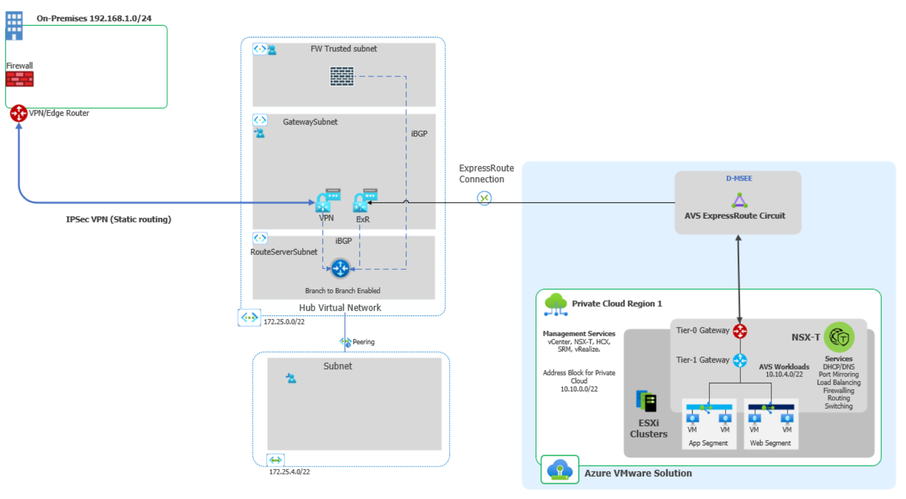
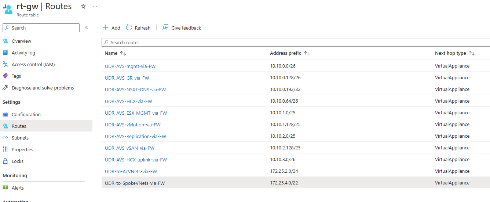

# Azure VMware Solution: On-premises access to AVS via VPN behind a FW/NVA in the Hub vNET

## Description
This design scenario is intended for customers who use SD-WAN or a Site to Site IPSec VPN connection (static routing, no BGP) to Azure using a Hub-spoke topology, have an NVA/Firewall device in the Hub VNet where traffic is use to inspect traffic between Azure VNets and desire to introduce and AVS Private Cloud into their environment. Customer still requires the same pattern where the NVA/Firewall must remain in between security zones, in other words, AVS traffic to Azure VNets (Hub and spokes), on-premises and the AVS Private Cloud, and AVS VM workloads have and the Internet.

This document is a step-by-step guide to assist you achieve this.

## Prerequisites  
1. Already have an existing Site-to-Site VPN Connection between on-premises and Azure.
https://learn.microsoft.com/en-us/azure/vpn-gateway/tutorial-site-to-site-portal
1. A route table associated to the GatewaySubnet with "Propagate gateway routes" enabled and the require route entries for sending traffic to the NVA/Firewall.
1. Customer already has The Gateway Subnet must have a /27 IP block space or bigger
1. The VPN Virtual Network Gateway must be in Active-Active mode.
1. An ExpressRoute Gateway must be created on the same Hub GatewaySubnet
1. A Route Server must be created on the same Hub VNet (RouteServerSubnet) /27 IP block or bigger.
1. Route Server Branch-2-Branch must be enabled.
1. The NVA/Firewall or another device with BGP capabilities and peered with Azure Route Server advertising the 0.0.0.0/0 with next-hop-ip the NVA/Firewall.
1. When using HCX with a Site to Site VPN connection, please take into the account the IPSec overhead. The Uplink and Replication Network Profiles MTU should be set to 1350 or lower. This change needs to be completed on both the HCX on-premise and HCX Cloud Uplink Network Profiles.
https://learn.microsoft.com/en-us/azure/azure-vmware/configure-vmware-hcx#create-network-profiles

## Step 1: Deploy Active-Active VPN Gateway
- Go to your VPN Gateway under Settings>Configuration. 
- Under "Active-Active mode" click "Enabled" 
- Please create a new Second Public IP address that will be assigned to the secondary VPN GW.	
- Click Save 
- Do not move onto the next step until Active-Active mode configuration has completed. This change can take up to 45 minutes to complete.
- https://learn.microsoft.com/en-us/azure/vpn-gateway/active-active-portal

		
## Step 2: Create ExpressRoute Gateway
Deploy a new ExpressRoute Gateway in the same vNET where your current VPN Gateway is located. This new ExpressRoute Gateway will live in the same "GatewaySubnet" as your VPN Gateway.  

**Configure a virtual network gateway for ExpressRoute using the Azure portal**  
https://learn.microsoft.com/en-us/azure/expressroute/expressroute-howto-add-gateway-portal-resource-manager

## Step 3: Create an Azure Route Server
- Create a subnet with the name of RouteServerSubnet. The minimum size of this subnet needs to be a /27.
- Create an Azure Route Server in the RouteServerSubnet  

https://learn.microsoft.com/en-us/azure/route-server/quickstart-configure-route-server-portal#create-a-route-server-1  

	
- Enable Azure Route Server Branch-to-Branch
On Route Server Enable Branch-To-Branch  

https://learn.microsoft.com/en-us/azure/route-server/quickstart-configure-route-server-portal#configure-route-exchange  

	
## Step 4: Verify static routing on VPN Gateway	
- On your VPN Gateway and under Settings>Configuration and verify BGP is not enabled.
- On your Local Network Gateway Address Space: Ensure the proper remote networks for on-premises are included

## Step 5: Update On-Premise VPN/routing configuration 
- Add the AVS subnets in your routing/VPN configuration to be define in your VPN tunnel. Here you can add the summary network if you have a contiguous address space that includes the required /22 address block for AVS management purposes and the VM Workloads like /20 or /22 and the VM workload address spaces like /24.
 
## Step 6: Add AVS route entries in your GatewaySubnet route table
In your existing route table for the GatewaySubnet you will need to route entries for all the specific subnets for AVS management purposes and AVS NSX-T segments created for the AVS VM workloads, e.g. /24. For AVS Management see the example /22 subnet breakdown https://learn.microsoft.com/en-us/azure/azure-vmware/tutorial-network-checklist#routing-and-subnet-considerations. 

Example route table and route entries: 

## Step 7: Connect AVS back to vNET
Connect AVS Managed ExpressRoute back to your ExpressRoute GW. 

**Use an existing virtual network gateway**   
https://learn.microsoft.com/en-us/azure/azure-vmware/deploy-azure-vmware-solution?tabs=azure-portal#use-an-existing-virtual-network-gateway  

