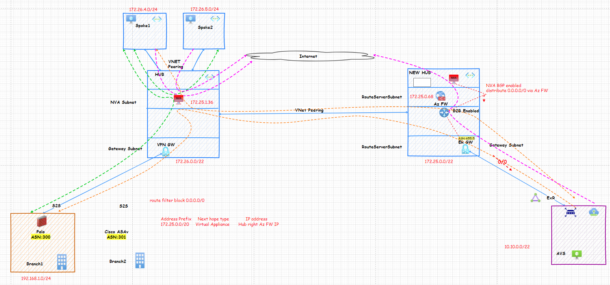
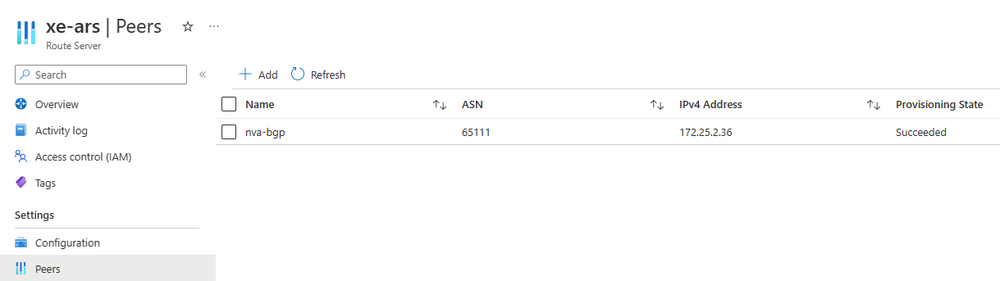
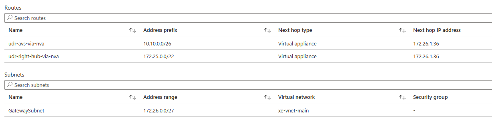
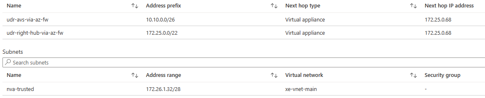
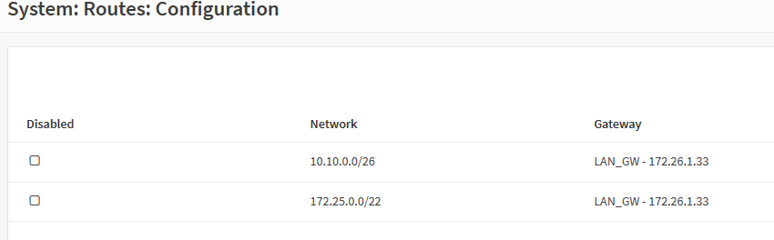
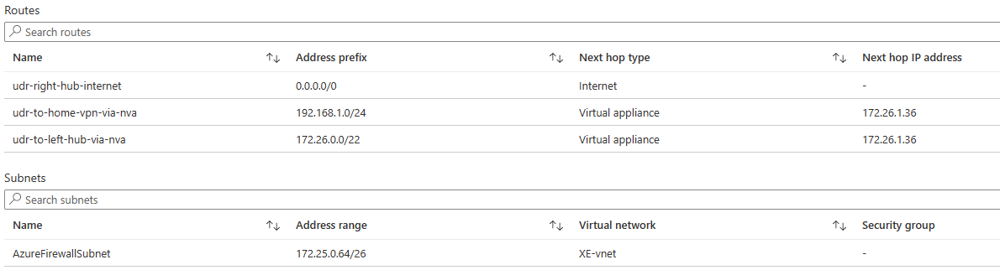
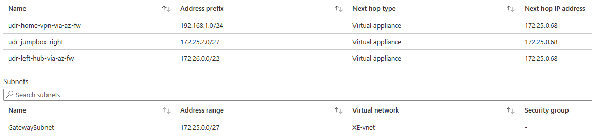
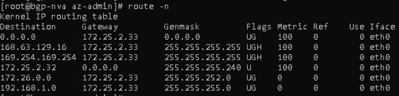
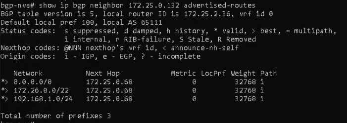
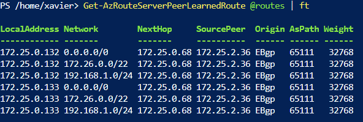

# Azure VMware Solution: On-premises access to AVS via VPN using a 2nd VNet Hub for transit



## Description

This design scenario is intended for customers that desire to introduce and AVS Private Cloud into their environment and use SD-WAN or a Site to Site IPSec VPN connection (Active/Standby Azure VPN GW and static routing, no BGP) from on-premises to Azure using a Hub-spoke topology, but want to minimize downtime and changes to their existing environment (e.g, Azure VPN Gateway Active-Active mode, Azure Route Server, ExpressRoute Gateway)
This is accomplished by deploying a 2nd VNet peered with their existing hub where they can deploy the required network components to connect to the AVS Private cloud. Customer uses an NVA/Firewall device in the original Hub VNet where traffic is use to inspect traffic between Azure VNets. Customer still requires the same pattern where the original NVA/Firewall must remain in between security zones, in other words, AVS traffic to Azure VNets (Hub and spokes), on-premises and the AVS Private Cloud, but AVS VM workloads can egress traffic to the Internet via a 2nd Firewall (Azure Firewall) on the 2nd VNet.

This document is a step-by-step guide to assist you achieve this.

## Prerequisites  

**Existing Hub**

1. Already have an existing Site-to-Site VPN Connection between on-premises and Azure.
<https://learn.microsoft.com/azure/vpn-gateway/tutorial-site-to-site-portal>
1. A route table associated to the GatewaySubnet with "Propagate gateway routes" enabled and the require route entries for sending traffic to the NVA/Firewall.
1. Customer already has The Gateway Subnet must have a /27 IP block space or bigger

**New VNet Hub**

1. VNet with enough IP address space and peered with the existing hub VNet. The RemoteGateway transit configuration option turned off on on both sides of the peering.
1. Create An ExpressRoute Gateway in a GatewaySubnet with /27 or bigger IP address space.
1. An Azure Route Server (ARS) created in a RouteServerSubnet with /27 or bigger IP address space.
1. Route Server Branch-2-Branch must be enabled.
1. Create an Azure Firewall in an AzureFirewallSubnet with /26 or bigger IP block.
1. Create a NVA or another device with BGP capabilities to advertise routes to the ARS.
1. When using HCX with a Site to Site VPN connection, please take into the account the IPSec overhead. The Uplink and Replication Network Profiles MTU should be set to 1350 or lower. This change needs to be completed on both the HCX on-premise and HCX Cloud Uplink Network Profiles.
<https://learn.microsoft.com/azure/azure-vmware/configure-vmware-hcx#create-network-profiles>

## Step 1: Create ExpressRoute Gateway

Deploy a new ExpressRoute Gateway using the previously create "GatewaySubnet".  

**Configure a virtual network gateway for ExpressRoute using the Azure portal**  
<https://learn.microsoft.com/azure/expressroute/expressroute-howto-add-gateway-portal-resource-manager>

## Step 2: Create a BGP capable NVA VM in your new Hub VNet

- Create a VM for BGP advertising purposes on its own Subnet (/28 or greater). We will be using a CentOS VM with single NIC and FRRRouting installed. The below commands will install the FRR in the CentOS VM. (Change to fit to your environment)

```
routeServerSubnetPrefix="172.25.0.128/27"
bgpNvaSubnetGateway="172.25.2.33"
sudo -s
dnf install frr -y 
sed -i 's/bgpd=no/bgpd=yes/g' /etc/frr/daemons 
touch /etc/frr/bgpd.conf 
chown frr /etc/frr/bgpd.conf 
chmod 640 /etc/frr/bgpd.conf 
systemctl enable frr --now 
ip route add $routeServerSubnetPrefix via $bgpNvaSubnetGateway dev eth0
``` 


## Step 3: Create an Azure Route Server (ARS) in the new Hub VNet

- Create a subnet with the name of RouteServerSubnet. The minimum size of this subnet needs to be a /27.
- Create the ARS in the RouteServerSubnet  

<https://learn.microsoft.com/azure/route-server/quickstart-configure-route-server-portal#create-a-route-server-1>  


- Enable Azure Route Server Branch-to-Branch

<https://learn.microsoft.com/azure/route-server/quickstart-configure-route-server-portal#configure-route-exchange>  


- Peer ARS with the BGP NVA. **Example. Peer ARS with a BGP NVA:**


## Step 3: Create an Azure Firewall in the new Hub VNet

- Create a subnet with the name of AzureFirewallSubnet. The minimum size of this subnet needs to be a /26.
- Create proper Azure Firewall network rules to allow all traffic
  - Between AVS networks to new hub VNet
  - Between AVS networks to existing hub and spoke VNets
  - Between AVS networks and the Internet
  - Between AVS and on-premises networks

## Step 4: Verify static routing on your existing VPN Gateway

- On your VPN Gateway, under Settings>Configuration verify BGP is not enabled.
- On your Local Network Gateway Address Space, ensure the proper on-premises networks are included.

## Step 4: Update On-Premises VPN/routing configuration

- Add the new Hub and AVS subnets in your routing/VPN tunnel configuration.
- You can add a summary network if you have a contiguous address space or specify address blocks  with each of the required new destinations:
  - The remote new Hub VNet address block.
  - The new AVS /22 address block for AVS management purposes
  - The new AVS VM Workload(s), like /24.

## Step 5: Add additional route entries in your existing Hub VNet

**Route Table: GatewaySubnet**

In your existing route table for the GatewaySubnet you will need to add route entries for the new Hub VNet address space and also all specific subnets for AVS management purposes and AVS NSX-T segments created for the AVS VM workloads, e.g. /24. For AVS Management see the example /22 subnet breakdown <https://learn.microsoft.com/azure/azure-vmware/tutorial-network-checklist#routing-and-subnet-considerations>.

**Example. Route entries:**


**Route Table: NVA Subnet**

You will need to add route entries to reach new remote networks via the Azure Firewall private IP address in the new VNet.

**Example. Route entries:**


In your existing NVA configuration (CLI or GUI) you will need to enter similar matching remote networks via the NVA Subnet's gateway. This will depend from vendor to vendor.

**Example. Route entries:**



## Step 6: Create new Route Tables for your New Hub VNet

Create 2 new route tables.

- Route table for the Azure Firewall subnet. This route table will be associated to the Azure Firewall subnet. (Propagate gateway routes: Yes)
Example. Route entries:


- Route table for the GatewaySubnet. This route table will be associated to the GatewaySubnet in the new Hub. (Propagate gateway routes: Yes)
**Example. Route entries:**



- In your existing BGP NVA configuration (CLI or GUI) you will need to enter similar matching remote networks (Existing Hub and On-premises) via the Azure Firewall. This will depend from vendor to vendor.

  - `route add -net 172.16.26.0/22 gw 172.25.2.33`

  - `route add -net 192.168.1.0/24 gw 172.25.2.33`

**Example. Route entries output:**



- Advertise with BGP the default route 0.0.0.0/0 and matching remote networks to the ARS via the Azure Firewall IP (next hop ip)

```
conf term
! 
route-map SET-NEXT-HOP-FW permit 10 
set ip next-hop 172.25.0.68 
exit 
! 
router bgp 65111 
no bgp ebgp-requires-policy 
neighbor 172.25.0.132 remote-as 65515   
neighbor 172.25.0.132 ebgp-multihop 2 
neighbor 172.25.0.133 remote-as 65515  
neighbor 172.25.0.133 ebgp-multihop 2 
network 0.0.0.0/0
network 172.26.0.0/22
network 192.168.1.0/24
! 
address-family ipv4 unicast 
  neighbor 172.25.0.132 route-map SET-NEXT-HOP-FW out 
  neighbor 172.25.0.133 route-map SET-NEXT-HOP-FW out 
exit-address-family 
! 
exit 
! 
exit 
! 
write file
```

**Example. Route entries output:**



## Step 6: Verify ARS learned routes from the BGP NVA

Use cloud shell PowerShell below to verify ARS is learning the the routes.

<code>
$routes = @{
    RouteServerName = 'route-server-name'
    ResourceGroupName = 'resource-group'
    PeerName = 'peer-name'
}
</code>
<code>

Get-AzRouteServerPeerLearnedRoute @routes | ft
</code>

**Example. Route entries:**



## Step 7: Connect AVS ExpressRoute Circuit to thew vNET ExpressRoute Gateway

Connect the AVS Managed ExpressRoute to the new ExpressRoute GW.

<https://learn.microsoft.com/azure/azure-vmware/deploy-azure-vmware-solution?tabs=azure-portal#use-an-existing-virtual-network-gateway>
