# Site to Site IPsec VPN to AVS using NSX-T Public IP

## Background

[NSX-T Public IP](https://learn.microsoft.com/azure/azure-vmware/enable-public-ip-nsx-edge) is a new option for connectivity to an AVS private cloud. It is important to review the [Internet connectivity design considerations to gain better understanding](https://learn.microsoft.com/azure/azure-vmware/concepts-design-public-internet-access).

The purpose of this writing is to explain how to connect to an AVS private cloud using a Site-to-Site IPSec VPN connection to NSX-T, unlike other connectivity options that rely on the ExpressRoute Circuit that is included with AVS.

### Sample architecture

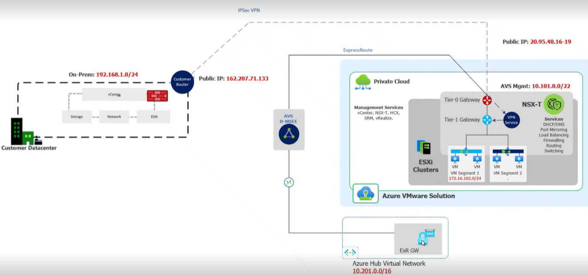

**Note:** In this context, the ExpressRoute connection to the Azure Hub VNet is used to test connectivity.  

## Prerequisites  

1. It is assumed the source site/on-premises location has an IPSec connection and parameters are ready (e.g., tunnel phase 1 and phase)
1. VPN routing can leverage static routing (VTI) or policy based routing. **Note:** BGP routing with NSX-T is not supported at this time.
1. NSX-T DNS and DHCP services and at least 1 Network Segment for AVS workloads  in  AVS are already configured.
1. IPSec VPN connections are established at the NSX-T T1-Gateway, therefore you will need to make sure your NSX-T segment is also configured to the same T1 Gateway where you will be establishing VPN connections.

## Steps

1. An AVS private cloud is by default created using the first option "Do not Connect or connect using default route from Azure", like the below image.
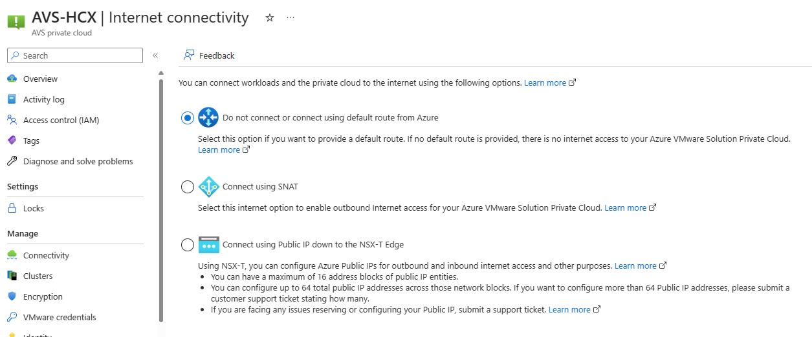
1. To enable NSX-T Public IP you will have to switch to the 3rd option "Connect using Public IP down to NSX-T Edge". **Note:** Before selecting this option important to know if you have already have a default route from Azure, this default route (0.0.0.0/0) will no longer be advertised to AVS and instead the default route will be advertised by NSX-T, which can affect your network connectivity.
1. Once you switch to the 3rd option you will have to create and configure Public IP(s) for NSX-T. Click the +Add button, create a name for the public IP and desired address space (1 or more Public IPs). This takes a few minutes.
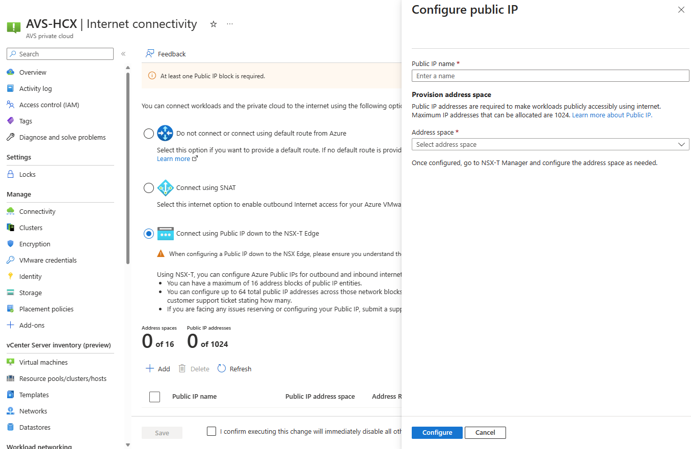
1. Once the process completes, you should see desired public IP address space allocated like below. **Note:** You will use later one of these IP address for establishing the VPN in NSX-T.
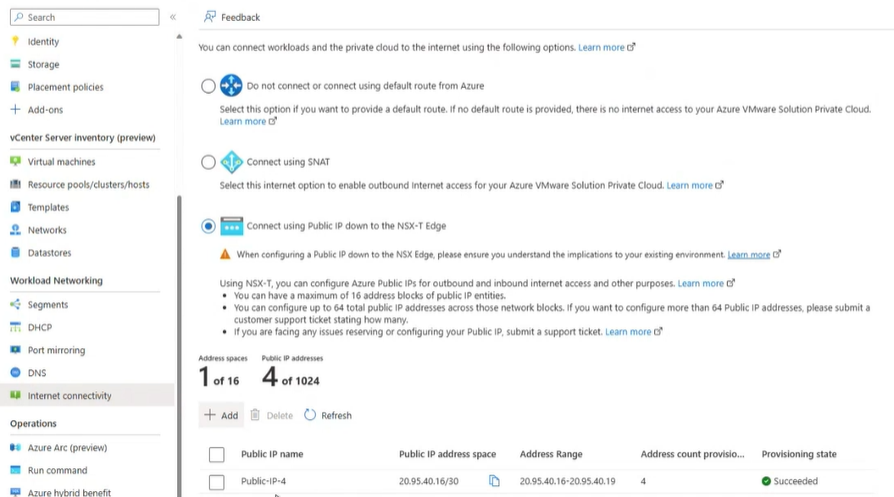
1. In NSX-T manager navigate to Networking>Tier-1 Gateways. Select and edit the desired T1 Gateway
1. Under Route Advertisement, make sure you enable:
    1. All Static Routes
    1. All DNS Forwarder Routes
    1. All Connected Segments & Service Ports
    1. All IPSec Local Endpoints
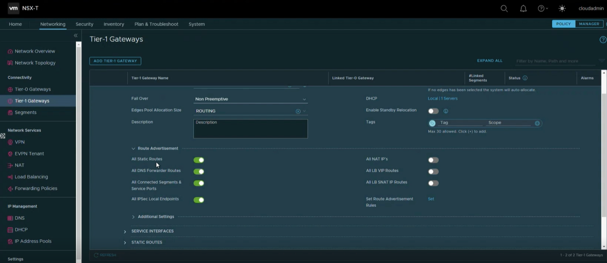
1. Next, create an IPSec Service. In NSX-T manager navigate to Networking>VPN and click on ADD SERVICE and select IPSec.
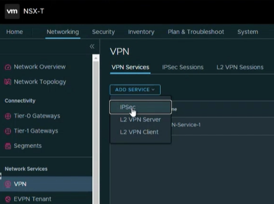
1. Configure the below and click save.
    1. Enter a name.
    1. Select the T1 Gateway where the IPSec service will be associated to, and also same that the NSX-T segment is associated to.
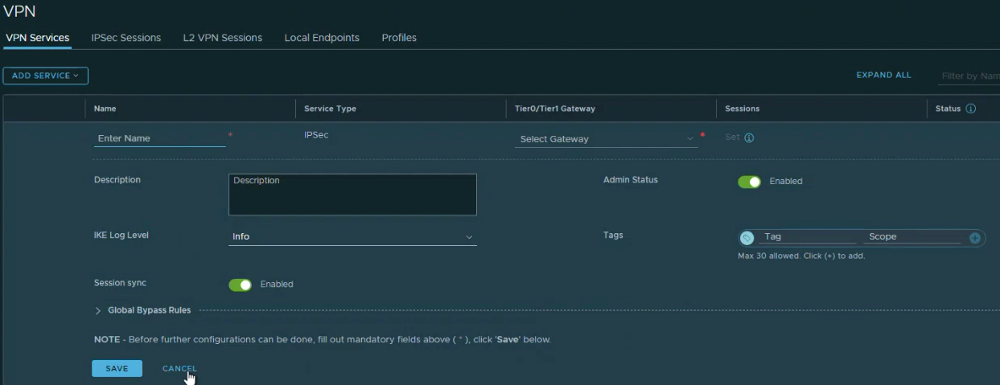
1. Next, navigate to Networking>VPN>Local EndPoints and click on ADD LOCAL ENDPOINT AND enter accordingly.
    1. **Name.** A name for the endpoint.
    1. **VPN Service.** Select the VPN Service created in previous step.
    1. **IP Address.** Enter an IP address from the previous created Public IPs in the Azure.
    1. **Local ID.** Typically you enter again the same Public IP address from the previous step. Click save to complete this step.
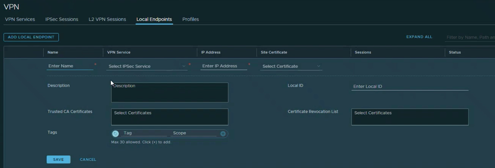
1. Optionally, you can create custom Profiles for IKE, IPSec and DPD that can be used for Phase 1 and Phase 2 to match your VPN device where you will be initiating the VPN connection to NSX-T, this will however, depend from vendor to vendor or security requirements.
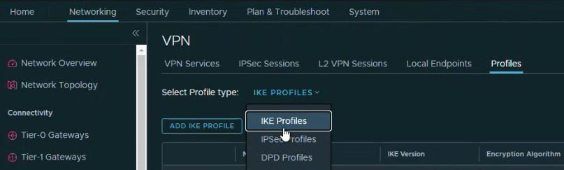
1. Now you can navigate to IPSec Sessions, and click on ADD IPSEC session, where you can select either Policy Based or Route Based IPSec sessions. 
1. If choose Route based, enter per below.
    1. **Name.** Name for the IPSec session.
    1. **Type.** The type of the IPSec session, in this case "Route Based".
    1. **VPN Service.** Select the previous created VPN Service.
    1. **Local Endpoint.** Select the previous created Local Endpoint.
    1. **Remote IP.** Enter the Remote Public IP of the other VPN peer that is establishing the IPSec session.
    1. **Authentication mode.** In this example, it is a pre-shared key, used for Phase 1.
    1. **Tunnel Interface.** Enter the VTI interface CIDR. Typically it is an /30 where each IP is used on each side of the VPN peer.
    1. **Remote ID.** This typically is the same IP as the Remote IP used for Phase 1.
    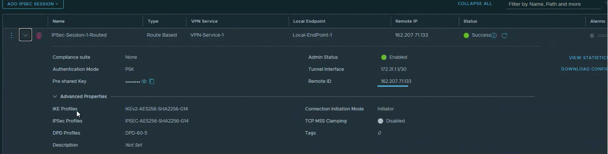
1. If you choose Policy base, enter per below.
    1. **Name.** Name for the IPSec session.
    1. **Type.** The type of the IPSec session, in this case "Policy Based".
    1. **VPN Service.** Select the previous created VPN Service.
    1. Local Endpoint. Select the previous created Local Endpoint.
    1. **Remote IP.** Enter the Remote Public IP of the other VPN peer that is establishing the IPSec session.
    1. **Authentication mode.** In this example, it is a pre-shared key, used for Phase 1.
    1. **Local Networks.** Enter local the desired NSX-T networks like for AVS management (/22) and the VM segment or segments, like /24.
    1. **Remote Networks.** Enter the remote network or networks that represent the other side of the VPN.
    1. **Remote ID.** This typically is the same IP as the Remote IP used for Phase 1.
    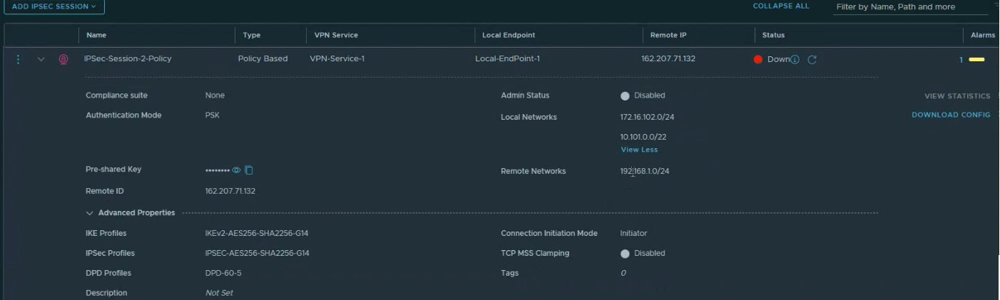
1. Optionally for either IPSec session, you can enter the default IKE, IPSEC and DPD profiles or custom ones that you may have created from previous steps.
1. After saving changes, assuming that your other VPN peer is configured properly to match the IPSec configuration in NSX-T, you should be able to establish connectivity.
1. Next, navigate to Networking>NAT and from the Gateway dropdown box, select the T1-Gateway where the VPN Service was associated to.
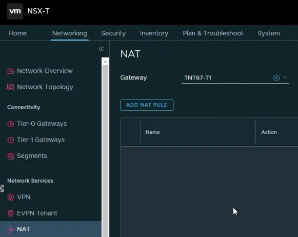
1. Here you will have to create multiple NAT rules. You will need to create at minimum a "SNAT" rule for AVS outbound Internet purposes to translate source IP address space destined to the Internet using a translated NSX-T Public IP from the ones that were created in early steps.
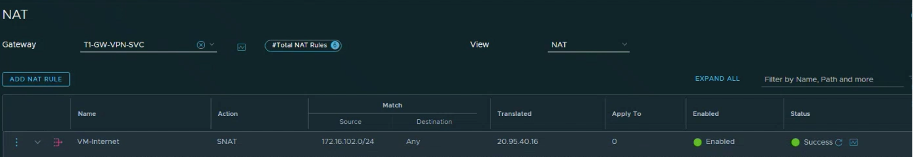
1. You will also create a "No NAT" rule or rules as needed for private to private connectivity to prevent translation of private IP address spaces using the NSX-T Public IP from the ones that were created in early steps.
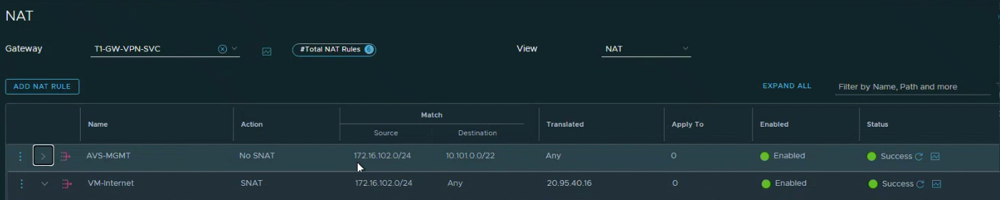
1. It is important to note that the SNAT rule will need to be processed after the No NAT rules. You accomplish this by adding a higher priority number to the Nat rule. The lowest value indicates higher weight of processing.
1. At the end your rules may look something like below.
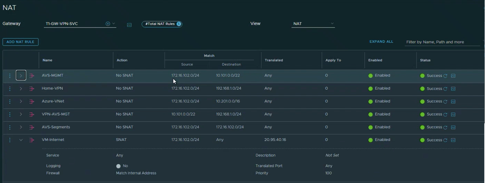
