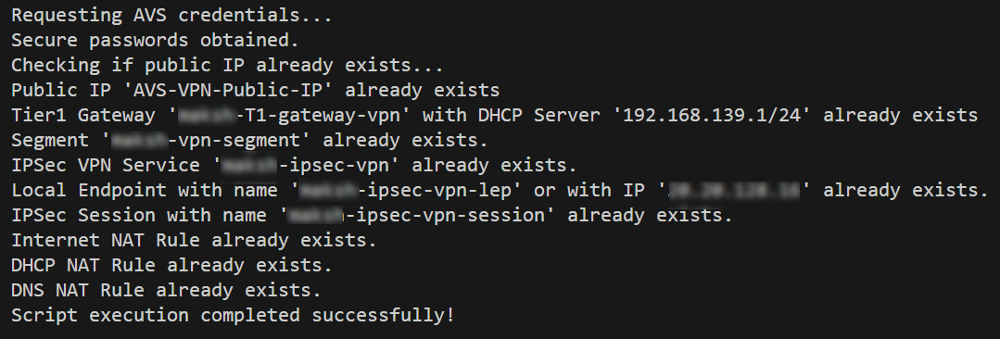

# Deploy IPSec VPN in AVS NSX-T

Use the guidance below to configure and run the automation script to set up IPSec VPN in AVS NSX-T. Refer to [Site to Site IPsec VPN to AVS using NSX-T Public IP](IPSec-VPN.md) for understanding of architecture and step by step instructions. 

## Prerequisites

* Azure subscription to be used for Azure VMware Solution private cloud depployment or already running private cloud.
* Clone of this regpository in either a jumpbox in Azure or on an on-premises machine which has network connectivity with vCenter and NSX-T servers.

## Deployment Steps

* Navigate to `BrownField\Networking\VPN-SDWAN\NSX-T\Scripts` folder
* Update the parameter values in `AVSIPSecVPN.ps1` as discussed below.
    * `$tenantId` = `"<Provide your Azure tenant ID.>"`
    * `$subscriptionId` = `"<Provide the Azure subscription ID which has AVS SDDC deployed in it.>"`
    * `$AVSSDDCresourceGroupName` = `"<Provide the Azure resource group name in which AVS SDDC is deployed.>"`
    * `$privateCloudName` = `"<Provide name of the ACS SDDC.>"`
    * `$publicIpName` = `"<Provide name of an existing or to be created as a new Public IP at NSX Edge.>"`
    * `$numberOfPublicIPs` = `<Provide a number of Public IPs to be created. 1 is enough in most cases.>`
    * `$tier1GatewayName` = `"<Provide name of an existing or to be created T1 gateway in AVS.>"`
    * `$dnsServiceName` = `"<Provide name of an existing or to be created DNS Service in AVS.>"`
    * `$dhcpProfileName` = `"<Provide name of an existing or to be created DHCP Service in AVS.>"`
    * `$segmentName` = `"<Provide name of an existing or to be created segment in AVS. It will be connected with T1 gateway provided earlier.>"`
    * `$ipSecVpnServiceName` = `"<Provide name of an existing or to be created VPN Service in AVS.>"`
    * `$ipSecVpnLocalEndpointName` = `"<Provide name of an existing or to be created Local Endpoint in AVS.>"`
    * `$ipSecVpnSessionName` = `"<Provide name of an existing or to be created VPN Session in AVS.>"`
    * `$remoteGatewayIP` = `"<Provide Public IP address of remote VPN router/firewall/gateway.>"`
    * `$remoteNetwork` = `"<Provide private IP address range of the remote network behind VPN router/firewall/gateway.>"`

* Run the script `AVSIPSecVPN.ps1` using any of the following option.

>[!NOTE]
>  Run the deployment script in following section from either a jumpbox in Azure or on an on-premises machine which has network connectivity with vCenter and NSX-T servers.
>

### CLI
```pwsh

cd BrownField\Networking\VPN-SDWAN\NSX-T\Scripts

./AVSIPSecVPN.ps1
```

## Post-deployment Steps

* Successful execution of the script will look like below and it will deploy necessary IPSec VPN components in AVS.
    
* You need to configure the other side (on-premises, DC, Azure, etc.) depending upon device, vendor and make. 

## Next Steps

[AVS Networking](../../../../BrownField/readme.md#avs-networking)
