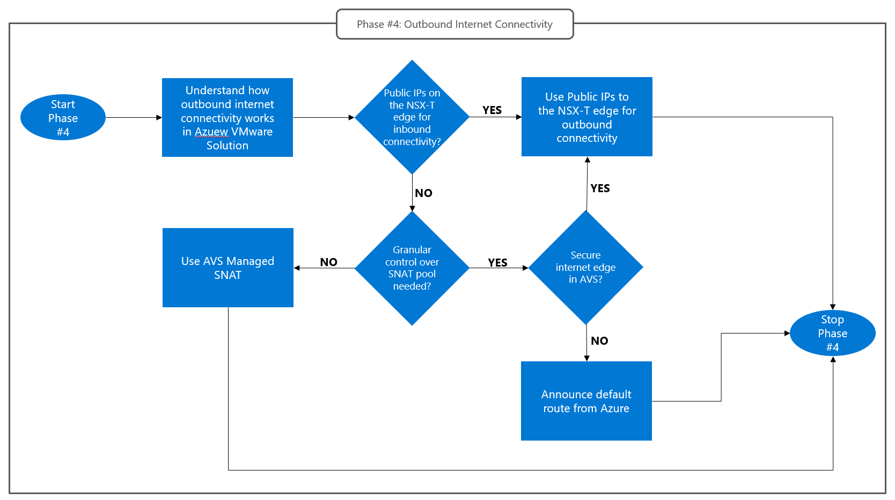

# Design phase #4: Internet outbound connectivity
Outbound Internet connectivity must be designed based on requirements set forth by the applications running on Azure VMware Solution. Such requirements may range from very basic Internet access (for example to allow Azure VMware Solution virtual machines to download software updates) to complex outbound scenarios that require granular control on which address pool is used for Source NAT (for example in B2B collaboration scenarios where access to a third party API is allowed only for connections originating from specific, whitelisted IP addresses) or on the number of supported Source-NAT sessions (for example in VDI scenarios). 
Almost invariably, outbound Internet access must be secured, by routing connections through a firewall or proxy devices. Azure VMware Solution supports deploying such devices on Azure VMware Solution itself, or in an Azure VNet connected to the private cloud. Choosing between these two options is the main goal of phase #4. The following considerations may help drive the decision:
- Azure VMware Solution customers with a pre-existing Azure footprint may have deployed NVA’s for secure Internet access in Azure, which should be used for Azure VMware Solution applications too (both for cost optimization and for consistency).
- Azure VMware Solution customers may want to leverage PaaS solutions available on Azure, to reduce management overhead. Azure Firewall (especially when the Premium SKU features are enabled) can be used for secure Internet access. 
- Azure VMware Solution customers that prefer to host the network infrastructure that supports their Azure VMware Solution applications entirely on Azure VMware Solution may want to deploy firewalls and/or proxy devices as Azure VMware Solution virtual machines, if supported by the NVA vendor.
- Design phase #4 has a dependency on Phase #3. If “Public IPs to the NSX-T edge” have been selected as the inbound Internet connectivity option, then the same approach must be used for outbound connectivity: All outbound connections initiated by Azure VMware Solution virtual machines will be managed on the NSX-T edge and Source-NATted behind addresses in the Azure Public IP Prefix associated with the Azure VMware Solution private cloud’s NSX-T edge.
The flow chart below describes how to approach design phase #4.
 
 
*Design Phase #4: Outbound Internet connectivity.*

## Default routes and outbound Internet connectivity in Azure VMware Solution
Default routes configured on a private cloud’s network segments determine how outbound Internet connections initiated within the private cloud are routed. Different default routes are used in different network segments.
The private cloud management network (which hosts vCenter Server and NSX-T Manager virtual machines) always uses a default route that provides direct Internet access through a platform-managed Internet breakout. This default route cannot be overridden. Source-NAT is managed by the platform. Users have no control over the public IP addresses in the Source-NAT pool. 
Workload segments can:
- Use a default route that provides Internet access through a platform-managed breakout. Source-NAT can be managed by the platform or by the user. In the former case, users have no control over the public IP addresses in the Source-NAT pool (see [this article](https://learn.microsoft.com/azure/azure-vmware/concepts-design-public-internet-access#azure-vmware-solution-managed-snat) for more information). In the latter case, users are responsible for provisioning Azure Public IP Prefixes for the Source-NAT pool and for defining NAT rules on the NSX-T edge (see [this article](https://learn.microsoft.com/en-us/azure/azure-vmware/concepts-design-public-internet-access#azure-public-ipv4-address-to-nsx-t-data-center-edge) for more information). 
- Use a custom default route announced over the private cloud’s Expressroute circuit. The custom default route can be originated in an Azure VNet or in an on-premises site. Source-NAT is the user’s responsibility and must be performed by network devices in Azure VNets or on-premises (see [this article]( https://learn.microsoft.com/en-us/azure/azure-vmware/concepts-design-public-internet-access#internet-service-hosted-in-azure) for more information).
All workload segments share the same default route configuration (platform-managed breakout with platform- or user-managed SNAT, or custom internet breakout in Azure VNets or on-premises sites). Outbound internet connectivity for workload segments can be configured through the Azure portal, as shown in the figure below.
 
 
*Outbound Internet connectivity options for workload segments. Option #1 disables the platform-managed Internet breakout. Use this option when a custom default route is announced over the Azure VMware Solution Expressroute circuit from Azure or on-premises sites. Option #2 provides a platform-managed Internet breakout with a managed NAT pool. Option #3 provides a platform-managed internet breakout with user-managed NAT pool.*

### Use Azure VMware Solution managed SNAT
Managed SNAT is the lowest complexity option for outbound Internet access in Azure VMware Solution. When enabled on a private cloud, a default route in installed on T0/T1 gateways that forwards Internet-bound traffic to a platform-managed edge. The platform managed edge perform Source-NAT. Users have no control on the SNAT pool. Managed SNAT can be used to provide direct Internet access to Azure VMware Solution virtual machines. It is however possible to define NSX-T topologies whereby Internet-bound connections initiated by Azure VMware Solution virtual machines are routed to secure Internet edge devices (firewall, forward proxies) deployed as virtual applicances in Azure VMware Solution. Typical reasons for discarding Azure VMware Solution managed SNAT for outbound connectivity are listed below:

- Granular control over the SNAT pool is a requirement. For example, specific Azure Public IPs must be used to SNAT connections initiated by specific virtual machines towards specific public endpoints, to meet  whitelisting requirements. In this case, Public IPs on the NSX-T edge, [covered in the next section](internet-outbound-connectivity.md#deploy-pips-at-the-nsx-t-edge) should be considered.
- Public IPs on the NSX-T edge have been selected for Internet inbound connectivity in [Design Phase #3](internet-inbound-connectivity.md). In this case, Public IPs on the NSX-T must also be used for outbound Internet connectivity. See next section.
- Outbound Internet connections should be routed via a secure Internet edge running in an Azure VNet (or in an onprem site). In this case, a default route must be originated from the Internet edge running in Azure and advertised to the Azure VMware Solution private cloud, which is covered in section [Originate default route from Azure](#originate-default-route-from-azure-customer-managed-vnet-or-vwan).

### Deploy PIPs at the NSX-T edge
When Public IPs to the NSX-T edge are configured, a default route that forwards traffic from T1/T0 gateways towards the Azure network's Internet edge exists in the private cloud. Outbound Internet connections must be Source-NATted on T1 gateways behind one of the Public IPs associated to the private cloud. Detailed instructions on how to configure NAT rules on T1 gateways are provided in the [official documentation](https://learn.microsoft.com/azure/azure-vmware/enable-public-ip-nsx-edge#outbound-internet-access-for-vms).This option can be used to provide direct Internet access to Azure VMware Solution virtual machines. It is however possible to define NSX-T topologies whereby Internet-bound connections initiated by Azure VMware Solution virtual machines are routed to secure Internet edge devices (firewall, forward proxies) deployed as virtual applicances in Azure VMware Solution. 

### Originate default route from Azure (customer-managed VNet or VWAN)
Internet-bound traffic emitted by Azure VMware Solution VMs can be routed to an Azure-native NVA by announcing a default route (0.0.0.0/0) over the Azure VMware Solution managed Expressroute circuit that connects the private cloud to the NVA's VNet. The Azure VMware Solution private cloud's T0 gateways will honor the default route received from Azure and will send Internet-bound traffic to the default route's next hop. If the Internet edge NVAs in Azure support BGP, then they can be used as BGP speakers to originate the default route. 
If the NVAs do not support BGP (or cannot be used as BGP speakers due to security-related constraints), additional NVAs can be deployed to act as BGP speakers. A typical scenario that requires additional BGP-capable NVAs is when the Azure Internet edge is Azure Firewall (Azure Firewall does not support BGP).

  
*Default route origination from Azure Virtual Networks.*

## Next Steps
- Go back to [Design Phase #3: Inbound Internet Connectivity](internet-inbound-connectivity.md)
- Go back to the Azure VMware Solution Network Design Guide [introduction](readme.md)
