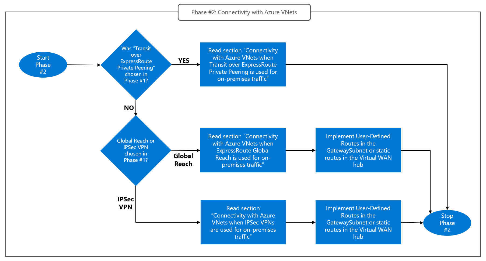

# Design phase #2: Connectivity with Azure Virtual Networks
Azure VMware Solution private clouds connect to Azure VNets via managed ExpressRoute circuits. See section [What is the role played by ExpressRoute](avs-networking-basics.md#what-is-the-role-played-by-expressroute) for more details. In typical hub and spoke networks (including Virtual WAN), connecting a private cloud's managed circuit to an ExpressRoute Gateway in the hub VNet (or Virtual WAN hub) provides direct, layer-3 connectivity between the private cloud and Azure virtual machines both in the hub VNet and in spoke VNets. However, it is often required to enforce security policies and selectively allow or deny connections between Azure resources and Azure VMware Solution virtual machines or management endpoints. While both Azure VNets and vSphere/NSX-T provide SDN functionalities for implementing Access Control Lists (ACL's), fully-fledged firewalling solutions deployed as NVAs in Azure VNets are the preferred option in enterprise-scale environments. Desing Phase #2 focuses on the VNet configuration that allows routing traffic between private clouds and Azure VNets through custom next hops, such as firewall NVAs.

While the primary function of managed ExpressRoute circuits is providing layer-3 connectivity between Azure VMware Solution virtual machines and native Azure virtual machines (or other Azure VNet-injected resources), they also enable connectivity between private clouds and an on-premises sites when the option “ExpressRoute transit” is selected in [Design Phase #1](onprem-connectivity.md). Therefore, the hybrid connectivity option selected in Design Phase#1 influences design decisions for Phase #2, as shown in the flow chart below.
  
 
Figure 15. Design Phase #2: Design connectivity with Azure VNets based on the hybrid connectivity option chosen in phase #1.

## Connectivity with Azure VNets when ExpressRoute Global Reach or IPSec VPN's are used for on-prem traffic
When Azure VMware Solution private clouds are connected to on-premises sites using [ExpressRoute Global Reach](onprem-connectivity.md#expressroute-global-reach) or [IPSec VPNs](onprem-connectivity.md#ipsec-vpns), Azure VMware Solution managed ExpressRoute circuits only carry traffic between Azure VMware Solution virtual machines and Azure VNets. That traffic can routed to NVAs running in Azure by means of UDR's in the GatewaySubnet's route table (for traditional hub and spoke networks with customer-managed hub VNets) or custom routes in Virtual WAN hubs. More specifically:

- For traditional hub and spoke networks, UDR's must be added to the hub VNet's GatewaySubnet for each set of destinatons (IP prefix) that must be reached through the NVAs from Azure VMware Solution. It should be noted that, if the same destinations must be reached through the NVAs from on-premises sites, the required UDRs have been already created as part of the hub and spoke network configuration process. For each such UDR, the next hop must be the NVA's VIP (in the case of Azure Firewall, the VIP is the Firewall's private IP address; in the case of clusters of third party NVA's, the VIP is the front-end IP address of the Azure Internal Load Balancer deployed in front of the NVAs.)    
- For hub and spoke networks based on Virtual WAN with hub-integrated NVAs (Azure Firewall or supported 3rd party security solutions), custom static routes must be added to the Virtual WAN hub's default route table for each set of destinatons (IP prefix) that must be reached through the NVAs from Azure VMware Solution. For each such UDR, the next hop must be the Firewall/NVA's VIP.

## Connectivity  with Azure VNets when "Transit over ExpressRoute Private Peering" is used for on-prem traffic 
When transit over ExpressRoute private peering is used, traffic between Azure VMware Solution private clouds and on-premises sites is routed through NVAs in Azure VNet (typically, firewalling solutions). The same configuration also applies to traffic between Azure VMware Solution and Azure resources. No additional configuration is neeeded (beyond firewall rules to allow/drop connections between Azure VMware Solution virtual machines and Azure resources). 

## Next Steps
- Go to the next section to learn about [inbound internet connectivity](internet-inbound-connectivity.md)
- Go back to [Design Phase #1: Connectivity between Azure VMware Solution and onprem sites](onprem-connectivity.md)
- Go back to the Azure VMware Solution Network Design Guide [introduction](readme.md)
