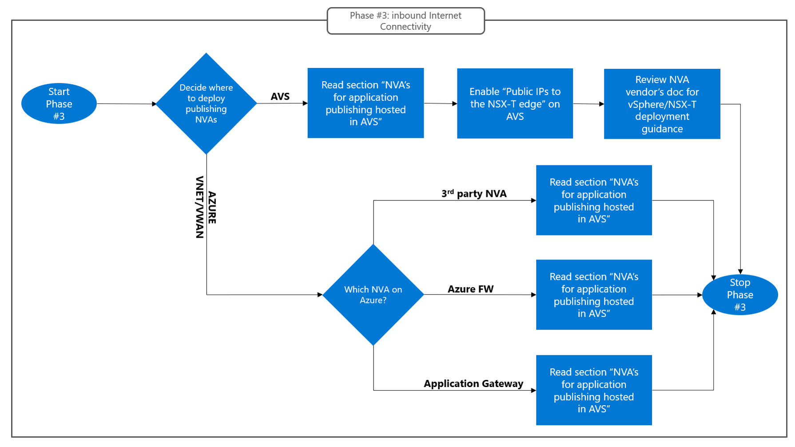

# Design phase #3: Internet inbound connectivity
Inbound internet connectivity for Azure VMware Solution must be designed based on the requirements set forth by applications running on Azure VMware Solution that must be reachable over public IP addresses. Almost invariably, internet-facing applications are published through network devices for security (next generation firewalls, web application firewalls) and load balancing (layer-3/layer-4 load balancers, application delivery controllers, …) purposes. Azure VMware Solution supports deploying devices that provide these network functions on Azure VMware Solution itself, or in an Azure VNet connected to the private cloud. Choosing between these two options is the main goal of phase #3. The following considerations may help drive the decision:

- Azure VMware Solution customers with a pre-existing Azure footprint may have deployed NVA’s for application delivery in Azure, which should be used for Azure VMware Solution applications too (both for cost optimization and for consistency).
- Azure VMware Solution customers may want to leverage PaaS solutions available on Azure, to reduce management overhead. Azure PaaS offerings for that can be used for publishing internet-facing applications include Azure Firewall (both when deployed in a customer managed VNet and when deployed in a Virtual WAN Hub) and Azure Application Gateway.
- Azure VMware Solution customers that prefer to host the network infrastructure that supports their Azure VMware Solution applications entirely on Azure VMware Solution may want to deploy firewalls and/or application delivery controllers as Azure VMware Solution virtual machines, if supported by the NVA vendor.

The flow chart below summarizes how to approach Phase #3:
 
 
Figure 16. Design Phase #3: Design outbound internet connectivity based on where NVAs for application publishing will be hosted (Azure VMware Solution or Azure VNet).

## NVA’s for application publishing hosted in an Azure VNet
Publising Azure VMware Solution applications via Azure first party services (Azure Firewall, Azure Application Gateway) or third party NVAs hosted in a VNet only requires connectivity between the VNet and the Azure VMware Solution private cloud (covered in section [Azure VNet connectivity](vnet-connectivity.md)). Azure VMware Solution applications are published behind Azure Public IP resources assigned to the first-party service or third-party NVAs. Standalone Public IPs, Public IPs from [Public Ip Prefixes](https://learn.microsoft.com/azure/virtual-network/ip-services/public-ip-address-prefix) or Public IPs from [Custom IP Prefixes (BYOIP)](https://learn.microsoft.com/azure/virtual-network/ip-services/custom-ip-address-prefix) can be used. The first-party services or the third-party NVAs can act either as layer 3/4 devices (i.e. route/NAT connections to the application server VMs on Azure VMware Solution) or as layer 7 devices (i.e. reverse-proxy connections). In both cases, the application server VMs on Azure VMware Solution receive traffic destined to their private IP and originating from the publishing service/NVA's private IP.  

### Considerations for Azure Firewall
[Azure Firewall](https://learn.microsoft.com/azure/firewall/overview) is the preferred option for exposing generic TCP or UDP endpoints through a first party layer-3/4 device. To publish an Azure VMware Solution application through Azure Firewall, a DNAT rule must be configured, which maps the one of the firewall's public IPs to the Azure VMware Solution application endpoint's private IP. Azure Firewall automatically Source-NATs inbound connections from the internet behind its private IP address. As a result, Azure VMware Solution virtual machines receive traffic whose source IP address is the Firewall's IP.
Please refer to the official documentation for instructions on [how to configure DNAT rules on Azure Firewall](https://learn.microsoft.com/azure/firewall/tutorial-firewall-dnat). 

### Considerations for Azure Application Gateway
[Azure Application Gateway](https://learn.microsoft.com/azure/application-gateway/overview-v2) is the preferred option for exposing HTTP(S) applications running on AVS through a first-party layer-7 device with HTTP request routing and WAF capabilities. Application Gateway is an HTTP reverse proxy. It terminates TCP connetions from the client and establishes upstream connections between itself and the target application servers. As a result, the application servers receive traffic whose source IP address is the Application Gateway's IP. It should be noted that the client's IP address can be carried in HTTP requests (typically, as a custom "X-Forwarded-For" header) if the application logic requires access to such information.
Please refer to the official documentation for instructions on [how to publish an Azure VMware Solution application through Application Gateway](https://learn.microsoft.com/azure/application-gateway/quick-create-portal)

### Considerations for third-party NVA’s
Third party NVAs can provide layer-3/4 firewalling capabilities or layer-7 reverse-proxying/WAF capabilities. Guidance from the NVA vendor should be followed for deployment in Azure VNets. The main consideration when using third party NVAs is that high availability is the user's responsibility. Detailed guidance on how to build highly avaialble clusters of NVAs in Azure is beyond the scope of this guide. The following high-level considerations are general enough to apply to any NVA technology:

- NVA clusters should be comprised of two or more **active** NVA instances (N-active HA model. Active/Passive HA should be avoided becasue it prevents horizontal scalability).
- Inbound internet connections should be distributed to all running instaces using a [Standard SKU Azure Load Balancer](https://learn.microsoft.com/azure/load-balancer/skus).  
- Layer-3/4 NVAs must be configured to Destination-NAT inbound internet connections to the private VPI of the Azure VMware Solution application(s) to be published.
- Layer-3/4 NVAs must be configured to Source-NAT inbound internet connections behind thier egress interface's private IP address, to preserve flow symmetry.  
- Layer-7 NVAs act as reverse-proxies and maintain two distinct TCP session for each internet inbound connection (one between the client and the NVA; one between the NVA and the upstream application server). As a result, they do not perform any network address transalation. HTTP(S) applications allow layer-7 NVAs to pass the client's public IP address to the application servers in HTTP request headers.

## NVA’s for application publishing hosted in Azure VMware Solution (Public IPs on the NSX-T edge)
Publising Azure VMware Solution applications via third party NVAs deployed on Azure VMware Solution requires enabling [Public IPs on the NSX-T edge](https://learn.microsoft.com/azure/azure-vmware/enable-public-ip-nsx-edge) for the private cloud. The functionality associates Azure Public IPs from an [Azure Public IP Prefix](https://learn.microsoft.com/azure/virtual-network/ip-services/public-ip-address-prefix) to the private clould and configures the Microsoft backbone to route internet traffic destined those IPs to the private cloud's NSX-T T0/T1 gateways. T1 gateways can then be configured to Destination-NAT inbound connections to the private IPs of NVAs attached to NSX-T segments. Detailed guidance for configuring Public IPs to the NSX-T edge and Destination-NAT rules for inbound internet connectivity is [available in the public doc](https://learn.microsoft.com/azure/azure-vmware/enable-public-ip-nsx-edge#inbound-internet-access-for-vms).
When using Azure VMware Solution with Public IPs to the NSX-T edge, the following considerations apply:

- NAT should be done on T1 gateways, not on T0 gateways. In Azure VMware Solution private clouds, T0 gateways are active/active device pairs and, as such, cannot handle stateful NAT sessions. 
- Public IPs must be associated to an Azure Public IP Prefix. It is currently unspported to use IPs from [Custom IP Prefixes (BYOIP)](https://learn.microsoft.com/azure/virtual-network/ip-services/custom-ip-address-prefix).
- When an Azure VMware Solution Private Cloud is configured with Public IPs to the NSX-T edge, a default route is installed in T0/T1 gateways, which routes outbound internet connections via the Microsoft backbone's edge. As a result, using Public IPs on the NSX-T edge for internet inbound connectivity also defines the implmenetation optiuon for outbound connectivity, covered in the [next section](internet-outbound-connectivity.md).

## Next Steps
- Go to the next section to learn about [outbound internet connectivity](internet-outbound-connectivity.md)
- Go back to [Design Phase #2: Connectivity between Azure VMware Solution and Azure Virtual Networks](vnet-connectivity.md)
- Go back to the Azure VMware Solution Network Design Guide [introduction](readme.md)
