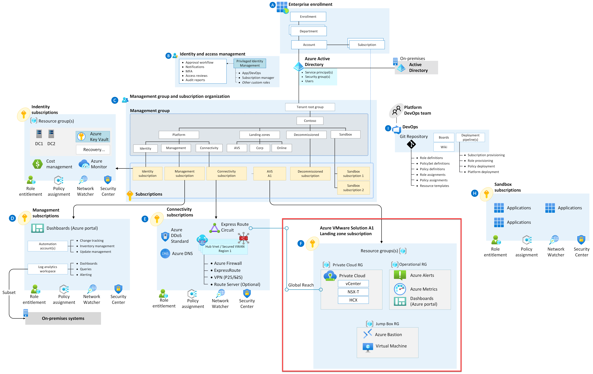

# Navigation Menu

* [Getting Started](GettingStarted.md)
* [Deployment Scenarios](Scenarios)
  * [AVS Landing Zone in a Single Region](AVS-Landing-Zone/SingleRegion)
  * [AVS Single Component Deployments](Scenarios)

---

# Enterprise-Scale for AVS

Welcome to the Enterprise Scale for Azure VMware Solution (AVS) repository

Enterprise-scale is an architectural approach and a reference implementation that enables effective construction and operationalization of landing zones on Azure, at scale. This approach aligns with the Azure roadmap and the Cloud Adoption Framework for Azure.

Enterprise-scale for AVS represents the strategic design path and target technical state for an Azure VMware Solution (AVS) deployment. This solution provides an architectural approach and reference implementation to prepare landing zone subscriptions for a scalable Azure VMware Solution (AVS) cluster. For the architectural guidance, check out [Enterprise-scale for AVS in Microsoft Docs](https://docs.microsoft.com/en-us/azure/cloud-adoption-framework/scenarios/azure-vmware/enterprise-scale-landing-zone).

 

 

The enterprise-scale for AVS only talks about with what gets deployed in the specific AVS landing zone subscription highlighted by the red box in the picture above. It is assumed that an appropriate platform foundation is already setup which may or may not be the official ESLZ platform foundation. This means that policies and governance should already be in place or should be setup after this implementation and are not a part of the scope this program. The policies applied to management groups in the hierarchy above the subscription will trickle down to the Enterprise-scale for AVS landing zone subscription.

This repository contains reference implementation scenarios based on a number of different scenarios. For each scenario, we have included both ARM and Bicep as the deployment languages
 

## This Repository

In this repository, you get access to various customer scenarios that can help accelerate the development and deployment of AVS clusters that conform with Enterprise-Scale for AVS best practices and guidelines. Each scenario aims to represent common customer experiences with the goal of accelerating the process of developing and deploying conforming AVS clusters using IaC as well as providing a step-by-step learning experience. Each scenario will eventually have an ARM, Bicep, PowerShell and CLI version to choose from.
 

# Next Steps

Next steps, head to [Getting Started](GettingStarted.md) to review prerequisites and deployment options
