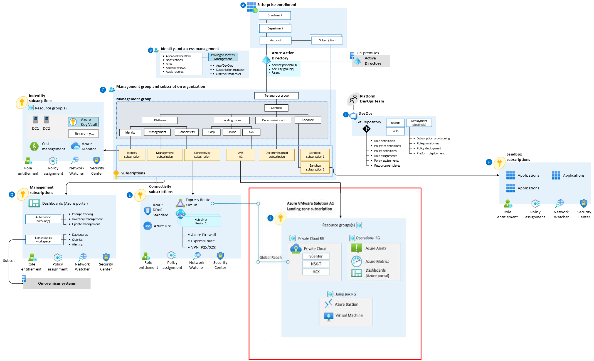

# Enterprise-Scale for AVS

Welcome to the Enterprise Scale for Azure VMWare Solution (AVS) repository

Enterprise-scale is an architectural approach and a reference implementation that enables effective construction and operationalization of landing zones on Azure, at scale. This approach aligns with the Azure roadmap and the Cloud Adoption Framework for Azure.

Enterprise-scale for AVS represents the strategic design path and target technical state for an Azure VMWare Solution (AVS) deployment. This solution provides an architectural approach and reference implementation to prepare landing zone subscriptions for a scalable Azure VMWare Solution (AVS) cluster. For the architectural guidance, check out Enterprise-scale for AVS in Microsoft Docs

The enterprise-scale for AVS only talks about with what gets deployed in the specific AVS landing zone subscription highlighted by the red box in the picture above. It is assumed that an appropriate platform foundation is already setup which may or may not be the official ESLZ platform foundation. This means that policies and governance should already be in place or should be setup after this implementation and are not a part of the scope this program. The policies applied to management groups in the hierarchy above the subscription will trickle down to the Enterprise-scale for AKS landing zone subscription.

This repo contains reference implantation examples based on a number of different scenarios. For each scenario, we have included both ARM and Bicep as the deployment languages

 

## This Repo

In this repo, you get access to various customer scenarios that can help accelerate the development and deployment of AVS clusters that conform with Enterprise-Scale for AVS best practices and guidelines. Each scenario aims to represent common customer experiences with the goal of accelerating the process of developing and deploying conforming AVS clusters using IaC as well as providing a step-by-step learning experience. Each scenario will eventually have an ARM, Bicep, PowerShell and CLI version to choose from.

 

### Steps to Implement Enterprise-Scale for AVS

A deployment of AVS Private Clouds would typically experience a separation of duties and lifecycle management in the area of prerequisites, the various networks, the cluster infrastructure, and finally the workload itself. This reference implementation is similar. Also, be aware our primary purpose is to illustrate the topology and decisions of an AVS cluster. We feel a "step-by-step" flow will help you learn the pieces of the solution and give you insight into the relationship between them. Ultimately, lifecycle/SDLC management of your cluster and its dependencies will depend on your situation (team roles, organizational standards, etc), and will be implemented as appropriate for your needs.

 

### Scenarios

Here are the scenarios available today. For more information, browse to the respective scenario

| Deploy                                             | Description                                                  | Deploy                                                       | More Info |
| -------------------------------------------------- | :----------------------------------------------------------- | ------------------------------------------------------------ | --------- |
| Enterprise Scale AVS Deployment to a Single Region | This deployment is all encompassing and will deploy an AVS Private Cloud in a selected region with a jumpbox in a new VNet for connectivity as well as monitoring, as per enterprise scale architecture |  | Link      |

*Note: Navigate to the scenario link to view detailed information and other IaC languages such as Bicep*

 

#### Single AVS Component deployment examples

In the event you would like to deploy single features or components of the AVS Enterprise Scale deployment, please see the various options below:

| Deploy                                                       | Description                                                  | Deploy                                                       | More Info |
| ------------------------------------------------------------ | ------------------------------------------------------------ | ------------------------------------------------------------ | --------- |
| Single AVS Private Cloud                                     | This example will help deploy a single private cloud within your selected resource group |  | Link      |
| Enable SRM for your AVS Private Cloud                        | This example will enable the VMWare Site Recovery Manger add-on to an existing AVS Private Cloud |  | Link      |
| Enable HCX for your AVS Private Cloud                        | This example will enable the VMWare HCX add-on to an existing AVS Private Cloud |  | Link      |
| New Virtual Network, Gateway, and Connectivity to existing AVS | This example will create a new virtual network, new gateway in your resource group and will connect this new network to your existing AVS Private Cloud |  | Link      |
| Generate new ExpressRoute authorization key and connect AVS to existing Gateway | This example will generate a new ExpressRoute Authorization key on your AVS dedicated gateway and add a connection to an existing Virtual Network Gateway |  | Link      |
| Use a pre-created ExpressRoute authorization key and connect AVS to existing Gateway | This example will allow an input of your AVS ExpressRoute authorization key to then add a connection to an existing Virtual Network Gateway |  | Link      |
| Connect AVS to ExpressRoute Circuit via Global Reach         | This example will connect your AVS Private Cloud to your on-premises ExpressRoute Gateway |  | Link      |
| Connect AVS to AVS in a different region via Global Reach    | This example will connect 2 AVS Private Clouds in 2 different regions using ExpressRoute Global Reach |  | Link      |
| Connect AVS to AVS in the same region via AVS Interconnect   | This example will connect 2 AVS Private Clouds in same region using the AVS Interconnect feature |  | Link      |

*Note: Navigate to the scenario link to view detailed information and other IaC languages such as Bicep*

 

## Getting Started

For more information on how to get started, please see [GettingStarted.md](GettingStarted.md)

