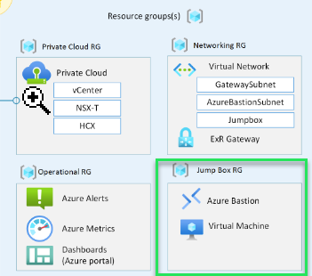

# Networking design Design

## Objective

Deploy the required jumpbox aspects for the SDDC.

[Deploy with Powershell](deploy.ps1)  

## File Variables for advanced options

Most, if not all optional elements will have a variable like *$deploy*Technology, for example *$deployVpn*. These are set of **$false** by default and this is by design for cost optimization and deploying only what is actually needed. Please look for these and change as needed.  

### Jumpbox design

1. $deployJumpbox
1. $deployVmBootDiagnostics