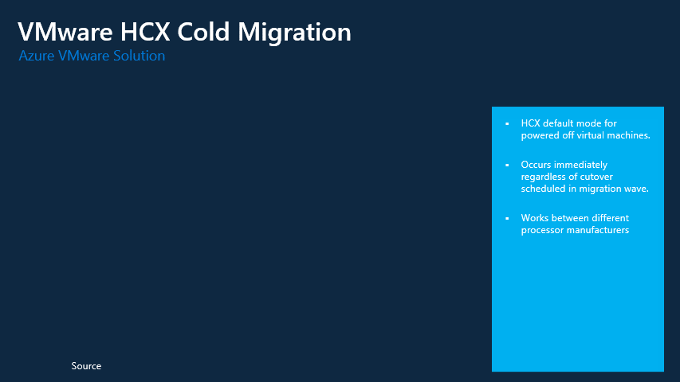

# HCX Cold Migration 
This is pretty self explainatory. Perfect for migrations where the VM is powered off. Quite possibly the fastest way to replicate data in Azure VMware Solution as there is no change to the VMs data during migration. Cutover of the VM occurs immediatly, no option to schedule when a Cold Migration will happen. 

### Cold Migration Steps
1. VM is powered off in the on-prem environment
2. Initiate repllication from the on-prem HCX Connector 
3. Replication occurs via VMware NFC (Network File Copy)
4. Once replication completes the VM is migrated over to Azure VMware Solution, there is no option to schedule or delay this type of migration. 

## When to use Cold Migration 
Perfect for VMS that are powered off and will remain off during the migration. 
