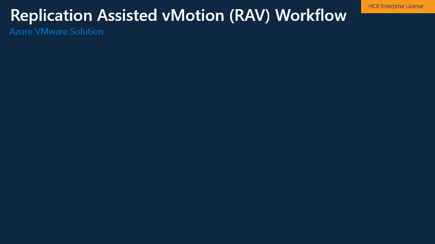

# HCX Replicated Assisted vMotion (RAV) 
Replicated Assisted vMotion is a combination of two types of HCX migrations, Bulk Migration and vMotion. RAV has the capability to replicate a large set of VMs concurrently to Azure VMware Solution. This option is helpful when customers do not want to tolerate any downtime for their VMs. 

## How RAV works 
RAV is a combination of Bulk migration and vMotion. Just like in bulk migrations, a large set of VMs can be identified for a migration wave into Azure VMware Solution. These migration waves can be scheduled have the cutover process happen at a predefined maintence windows of the customers choosing. During intial replication RAV uses the bulk migration process to replicate the VMs from on-prem into Azure VMware Solution. Once the VMs have been replicated and the predefined maintenance window has occurred a delta vMotion cycle is initiated to a live cutover of the VM. Similar to vMotion migrations, the cutover of the VM occurs in a serial fashion. 

## When to use RAV
RAV is great option for customers that are looking to migrate a large number of VMs quickly into Azure VMware Solution and without incurring any downtime. Please remember, that the repliction process of RAV occurs concurrently but the cutovers of the VMs happen serially. At the time of thie writing their is no way to select the order of when the VMs are cutover. 

>**Note:** RAV for no downtime will require Network Extension appliances in place, so the VM retains the IP address during the migration process. When cutting over of the Network from on-prem to Azure VMware Solution downtime will occur. 
