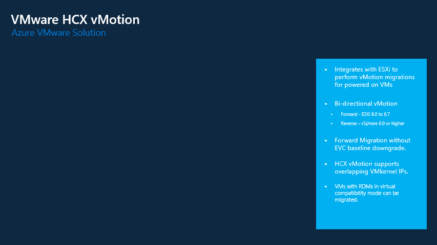

# HCX vMotion migrations

Perhaps the most popular HCX migration type is vMotion. HCX vMotion allows you to migrate an on-prem VM into the Azure VMware Solutions (AVS) environment without interuption to the VM itself. This type of migration should be reserved for workloads that cannot tolerate any downtime during its migration process. In most cases, this should just be a small subset of ones' workload. 

## vMotion limitations
As staed above, HCX vMotion is a great option for workloads that cannot tolerate any downtime. HCX vMotion does support concurrent migrations, up to the limit of vSphere, but each cutover occurs in a serial fashion. Parellel migration cutovers of vMotion is not supported. 

## When to use HCX vMotion migrations
Customers that have specific workloads that cannot tolerate any downtime can use vMotion as an option within HCX to migrate their workloads to AVS. Just be sure to understand, vMotion is not the best migration option in HCX for those looking to migrate a large number of VMs to AVS in relativily short period of time. Other options such as Bulk migration should be considered first. 

>**Note:** vMotions for no downtime will require Network Extension appliances in place, so the VM retains the IP address. Cutover of the Network from on-prem to AVS will incur downtime. 