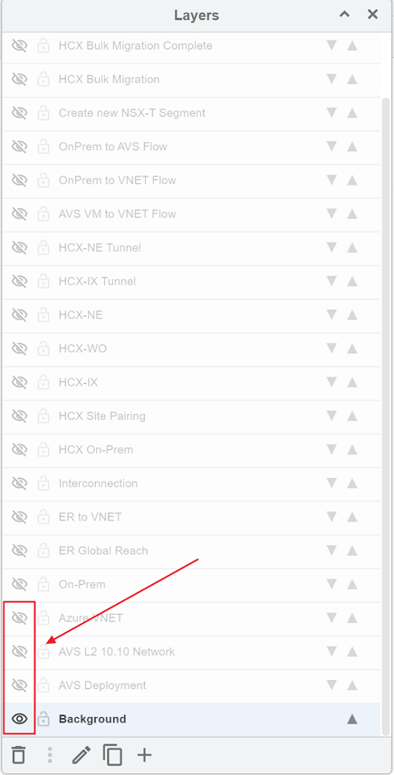

# Suggested Scripts for Build-Out of draw.io hcx-options diagram

Feel free to download the draw.io diagram [here](./diagrams/hcx-options.drawio).

In the diagram there are 4 options (tabs):

1. Re-IP
2. Duplicate Networks
3. Network Extension wo/MON (without)
4. Network Extension w/MON (with)

Ensure you have layers view enabled in draw.io by clicking **View->Layers** from the menu bar.

As shown in the above picture, you can see an *eye* either turned on or off. Clicking a turned off eye will enable that specific layer. Clicking a turned on eye icon will remove the layer from showing. Start with **Background** turned on.

## Option 1: Re-IP Steps

|**Step**|**Layer**|**ON/OFF**|**Notes**|
|--------|---------|----------|---------|
|1|AVS Deployment|**ON**|Here you have the opportunity to explain the components that get deployed once AVS is deployed.|
|2|AVS L2 10.10 Network|**ON**|Explain an L2 network is created in NSX-T and a VM connected to it.|
|3|Azure VNET|**ON**|Customer's Azure VNET which AVS will connect to.|
|4|On-Prem|**ON**|Customer's on-prem environment, with ER connected to their Azure VNET.|
|5|ER Global Reach|**ON**|Explain ER Global Reach connection from AVS.|
|6|ER to VNET|**ON**|Explain ER to VNET connection from AVS.|
|7|Interconnection|**ON**|Explain this is only there to show the interconnectivity between on-prem and AVS and to use the space to make the diagram look less busy and more readable.|
|8|HCX On-Prem|**ON**|Explain HCX Connector needs to be deployed on-premises.|
|9|HCX Site Pairing|**ON**|Explain the next step is to establish the HCX Site Pairing.|
|10|HCX-IX|**ON**|Next step is to deploy the HCX Service Mesh which will deploy the appliances in pairs, starting with the Interconnect appliance (IX).|
|11|HCX-WO|**ON**|HCX Wan Optimization (WO) appliance is next|
|12|HCX-NE|**ON**|HCX Network Extension(NE) also gets deployed with the Service Mesh|
|13|HCX-IX Tunnel|**ON**|IX Tunnel gets established between the two IX appliances once successfully deployed. This is the tunnel that manages the migration/replication traffic.|
|14|HCX-NE Tunnel|**ON**|NE Tunnel gets established between the two NE appliances once successfully deployed. This is the tunnel that manages the communication traffic for VMs on extended L2 networks.|
|15|AVS VM to VNET Flow|**ON**|Demonstrates the path the flow of communication utilizes between the VM in the AVS L2 network and the customer's Azure VNET.|
|16|AVS VM to VNET Flow|**OFF**|Demonstrates the path the flow of communication utilizes between the VM in the AVS L2 network and the customer's Azure VNET.|
|17|OnPrem to VNET Flow|**ON**|Demonstrates the path the flow of communication utilizes between an on-premises VM and a VM in the customer's Azure VNET.|
|18|OnPrem to VNET Flow|**OFF**|Demonstrates the path the flow of communication utilizes between an on-premises VM and a VM in the customer's Azure VNET.|
|19|OnPrem to AVS Flow|**ON**|Demonstrates the path the flow of communication utilizes between an on-premises VM and a VM in AVS.|
|20|OnPrem to AVS Flow|**OFF**|Demonstrates the path the flow of communication utilizes between an on-premises VM and a VM in AVS.|
|21|Create new NSX-T Segment|**ON**|Demonstrates the creation of an NSX-T Network Segment in AVS with a CIDR different from any Network on-premises or in Azure.|
|22|HCX Bulk Migration|**ON**|Initiate Bulk Migration of on-premises VMs.|
|23|HCX Bulk Migration Complete|**ON**|Migration of VMs completes.|
|24|HCX Bulk Migration|**OFF**|Initiate Bulk Migration of on-premises VMs. Turn off to demonstrate completion of migration.|
|25|Retire L2 OnPrem Segment|**ON**|This will mimic the on-premises network being removed/retired.|
|26|New Flow-Migrated VMs|**ON**|This will show the path the flow of communication utilizes for the newly migrated and re-IP'ed VMs in AVS back to on-premises VMs|

## Option 2: Duplicate Networks

|**Step**|**Layer**|**ON/OFF**|**Notes**|
|--------|---------|----------|---------|
|1|AVS Deployment|**ON**|Here you have the opportunity to explain the components that get deployed once AVS is deployed.|
|2|AVS L2 10.10 Network|**ON**|Explain an L2 network is created in NSX-T and a VM connected to it.|
|3|Azure VNET|**ON**|Customer's Azure VNET which AVS will connect to.|
|4|On-Prem|**ON**|Customer's on-prem environment, with ER connected to their Azure VNET.|
|5|ER Global Reach|**ON**|Explain ER Global Reach connection from AVS.|
|6|ER to VNET|**ON**|Explain ER to VNET connection from AVS.|
|7|Interconnection|**ON**|Explain this is only there to show the interconnectivity between on-prem and AVS and to use the space to make the diagram look less busy and more readable.|
|8|HCX On-Prem|**ON**|Explain HCX Connector needs to be deployed on-premises.|
|9|HCX Site Pairing|**ON**|Explain the next step is to establish the HCX Site Pairing.|
|10|HCX-IX|**ON**|Next step is to deploy the HCX Service Mesh which will deploy the appliances in pairs, starting with the Interconnect appliance (IX).|
|11|HCX-WO|**ON**|HCX Wan Optimization (WO) appliance is next|
|12|HCX-NE|**ON**|HCX Network Extension(NE) also gets deployed with the Service Mesh|
|13|HCX-IX Tunnel|**ON**|IX Tunnel gets established between the two IX appliances once successfully deployed. This is the tunnel that manages the migration/replication traffic.|
|14|HCX-NE Tunnel|**ON**|NE Tunnel gets established between the two NE appliances once successfully deployed. This is the tunnel that manages the communication traffic for VMs on extended L2 networks.|
|15|AVS VM to VNET Flow|**ON**|Demonstrates the path the flow of communication utilizes between the VM in the AVS L2 network and the customer's Azure VNET.|
|16|AVS VM to VNET Flow|**OFF**|Demonstrates the path the flow of communication utilizes between the VM in the AVS L2 network and the customer's Azure VNET.|
|17|OnPrem to VNET Flow|**ON**|Demonstrates the path the flow of communication utilizes between an on-premises VM and a VM in the customer's Azure VNET.|
|18|OnPrem to VNET Flow|**OFF**|Demonstrates the path the flow of communication utilizes between an on-premises VM and a VM in the customer's Azure VNET.|
|19|OnPrem to AVS Flow|**ON**|Demonstrates the path the flow of communication utilizes between an on-premises VM and a VM in AVS.|
|20|OnPrem to AVS Flow|**OFF**|Demonstrates the path the flow of communication utilizes between an on-premises VM and a VM in AVS.|
|21|Create new disconnected NSX-T Segment|**ON**|Demonstrates the creation of a disconnected NSX-T Network Segment in AVS with the same CIDR as the network on-premises being recreated.|
|22|HCX Bulk Migration|**ON**|Initiate Bulk Migration of on-premises VMs.|
|23|HCX Bulk Migration Complete|**ON**|Migration of VMs completes.|
|24|HCX Bulk Migration|**OFF**|Initiate Bulk Migration of on-premises VMs. Turn off to demonstrate completion of migration.|
|25|Retire L2 OnPrem Segment|**ON**|This will mimic the on-premises network being removed/retired.|
|26|Connect Segment to T1|**ON**|This will connect the previously created disconnected NSX-T Segment to the T1.|
|27|Update newly advertised BGP route|**ON**|Newly duplicated network will advertise via BGP the new route, it must be updated.|
|28|New Flow-Migrated VMs to Source|**ON**|This will show the path the flow of communication utilizes for the newly migrated VMs in the duplicated network on the AVS side back to on-premises VMs|
|29|AVS to AVS Flow|**ON**|This will show the path the flow of communication utilizes for the newly migrated VMs in the duplicated network on the AVS side back to another VM in a different network on the AVS side.|

## Option 3: Network Extension without MON

|**Step**|**Layer**|**ON/OFF**|**Notes**|
|--------|---------|----------|---------|
|1|AVS Deployment|**ON**|Here you have the opportunity to explain the components that get deployed once AVS is deployed.|
|2|AVS L2 10.10 Network|**ON**|Explain an L2 network is created in NSX-T and a VM connected to it.|
|3|Azure VNET|**ON**|Customer's Azure VNET which AVS will connect to.|
|4|On-Prem|**ON**|Customer's on-prem environment, with ER connected to their Azure VNET.|
|5|ER Global Reach|**ON**|Explain ER Global Reach connection from AVS.|
|6|ER to VNET|**ON**|Explain ER to VNET connection from AVS.|
|7|Interconnection|**ON**|Explain this is only there to show the interconnectivity between on-prem and AVS and to use the space to make the diagram look less busy and more readable.|
|8|HCX On-Prem|**ON**|Explain HCX Connector needs to be deployed on-premises.|
|9|HCX Site Pairing|**ON**|Explain the next step is to establish the HCX Site Pairing.|
|10|HCX-IX|**ON**|Next step is to deploy the HCX Service Mesh which will deploy the appliances in pairs, starting with the Interconnect appliance (IX).|
|11|HCX-WO|**ON**|HCX Wan Optimization (WO) appliance is next|
|12|HCX-NE|**ON**|HCX Network Extension(NE) also gets deployed with the Service Mesh|
|13|HCX-IX Tunnel|**ON**|IX Tunnel gets established between the two IX appliances once successfully deployed. This is the tunnel that manages the migration/replication traffic.|
|14|HCX-NE Tunnel|**ON**|NE Tunnel gets established between the two NE appliances once successfully deployed. This is the tunnel that manages the communication traffic for VMs on extended L2 networks.|
|15|Extend L2 Network to AVS|**ON**|In this step we extend the on-premises network with HCX to AVS.|
|16|HCX vMotion or RAV Migration|**ON**|Demonstrates the initialization of the VMs migrations.|
|17|Migration Complete|**ON**|Demonstrates the completed migration of VMs.|
|18|HCX vMotion or RAV Migration|**OFF**|Demonstrates the initialization of the VMs migrations.|
|19|L2 Flow OnPrem|**ON**|Demonstrates the communication flow between the migrated VMs and on-premises for the migrated VMs.|
|20|L2 Flow OnPrem|**OFF**|Demonstrates the communication flow between the migrated VMs and on-premises for the migrated VMs.|
|21|L2 Flow AVS|**ON**|Demonstrates the communication flow between the migrated VMs and the AVS VMs on a non-stretched network.|
|22|L2 Flow AVS|**OFF**|Demonstrates the communication flow between the migrated VMs and the AVS VMs on a non-stretched network.|
|23|Un-Stretch L2 Network|**ON**|Demonstrates the process of un-stretching the L2 network from on-premises.|
|24|Extend L2 Network to AVS|**OFF**|In this step we extend the on-premises network with HCX to AVS.|
|25|Retire L2 OnPrem Segment|**ON**|Demonstrates the retirement of the original L2 network stretched to AVS.|
|26|Update newly advertised BGP Routes|**ON**|Newly un-stretched network will advertise via BGP the new route, it must be updated.|
|27|New Flow-Migrated VMs to Source|**ON**|This will show the path the flow of communication utilizes for the newly migrated VMs in the un-stretched network on the AVS side back to an on-premises VM.|
|28|AVS to AVS Flow|**ON**|This will show the path the flow of communication utilizes for the newly migrated VMs in the un-stretched network on the AVS side back to another VM in a different network on the AVS side.|

## Option 4: Network Extension with MON

|**Step**|**Layer**|**ON/OFF**|**Notes**|
|--------|---------|----------|---------|
|1|AVS Deployment|**ON**|Here you have the opportunity to explain the components that get deployed once AVS is deployed.|
|2|AVS L2 10.10 Network|**ON**|Explain an L2 network is created in NSX-T and a VM connected to it.|
|3|Azure VNET|**ON**|Customer's Azure VNET which AVS will connect to.|
|4|On-Prem|**ON**|Customer's on-prem environment, with ER connected to their Azure VNET.|
|5|ER Global Reach|**ON**|Explain ER Global Reach connection from AVS.|
|6|ER to VNET|**ON**|Explain ER to VNET connection from AVS.|
|7|Interconnection|**ON**|Explain this is only there to show the interconnectivity between on-prem and AVS and to use the space to make the diagram look less busy and more readable.|
|8|HCX On-Prem|**ON**|Explain HCX Connector needs to be deployed on-premises.|
|9|HCX Site Pairing|**ON**|Explain the next step is to establish the HCX Site Pairing.|
|10|HCX-IX|**ON**|Next step is to deploy the HCX Service Mesh which will deploy the appliances in pairs, starting with the Interconnect appliance (IX).|
|11|HCX-WO|**ON**|HCX Wan Optimization (WO) appliance is next|
|12|HCX-NE|**ON**|HCX Network Extension(NE) also gets deployed with the Service Mesh|
|13|HCX-IX Tunnel|**ON**|IX Tunnel gets established between the two IX appliances once successfully deployed. This is the tunnel that manages the migration/replication traffic.|
|14|HCX-NE Tunnel|**ON**|NE Tunnel gets established between the two NE appliances once successfully deployed. This is the tunnel that manages the communication traffic for VMs on extended L2 networks.|
|15|Extend L2 Network to AVS|**ON**|In this step we extend the on-premises network with HCX to AVS.|
|16|HCX vMotion or RAV Migration|**ON**|Demonstrates the initialization of the VMs migrations.|
|17|Migration Complete|**ON**|Demonstrates the completed migration of VMs.|
|18|HCX vMotion or RAV Migration|**OFF**|Demonstrates the initialization of the VMs migrations.|
|19|L2 Flow OnPrem|**ON**|Demonstrates the communication flow between the migrated VMs and on-premises for the migrated VMs over the stretched network.|
|20|L2 Flow OnPrem|**OFF**|Demonstrates the communication flow between the migrated VMs and on-premises for the migrated VMs over the stretched network.|
|21|L2 Flow AVS w/o MON|**ON**|Demonstrates the communication flow between the migrated VMs and the AVS VMs over a stretched network without MON.|
|22|L2 Flow AVS w/o MON|**OFF**|Demonstrates the communication flow between the migrated VMs and the AVS VMs over a stretched network without MON.|
|23|L2 Flow VNET wo/MON|**ON**|Demonstrates the communication flow between the migrated VMs and the VNET VMs on a stretched network without MON.|
|24|L2 Flow VNET wo/MON|**OFF**|Demonstrates the communication flow between the migrated VMs and the VNET VMs on a stretched network without MON.|
|25|MON enabled|**ON**|Here MON is enabled on the L2 stretched network from the Source Site.|
|26|/32 Route Filter|**ON**|It's recommended to filter newly established /32 routes being advertised by NSX-T T1 on-premises, this will avoid asymmetrical routing.|
|27|L2 Flow AVS w/MON|**ON**|Demonstrates the communication flow between the migrated VMs and the AVS VM over the stretched network with MON enabled.|
|28|L2 Flow AVS w/MON|**OFF**|Demonstrates the communication flow between the migrated VMs and the AVS VM over the stretched network with MON enabled.|
|29|L2 Flow VNET w/MON|**ON**|Demonstrates the communication flow between the migrated VMs and the VNET VMs over the stretched network with MON enabled.|
|30|L2 Flow VNET w/MON|**OFF**|Demonstrates the communication flow between the migrated VMs and the VNET VMs over the stretched network with MON enabled.|
|31|**OPTIONAL** Un-Stretch L2 Network-Optional|**ON**|Demonstrates the process of un-stretching the L2 network from on-premises.|
|32|**OPTIONAL** Extend L2 Network to AVS|**OFF**|In this step we extend the on-premises network with HCX to AVS.|
|33|**OPTIONAL** Retire L2 OnPrem Segment-Optional|**ON**|Demonstrates the retirement of the original L2 network stretched to AVS.|
|34|**OPTIONAL** New Flow-Migrated VMs to Source-Optional|**ON**|This will show the path the flow of communication utilizes for the newly migrated VMs in the un-stretched network on the AVS side back to an on-premises VM.|
|35|**OPTIONAL** New Flow-Migrated VMs to Source-Optional|**OFF**|This will show the path the flow of communication utilizes for the newly migrated VMs in the un-stretched network on the AVS side back to an on-premises VM.|
|36|**OPTIONAL** AVS to AVS New Flow-Optional|**ON**|This will show the path the flow of communication utilizes for the newly migrated VMs in the un-stretched network on the AVS side back to another VM in a different network on the AVS side.|
