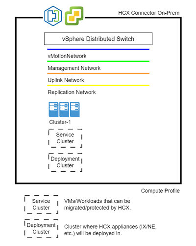
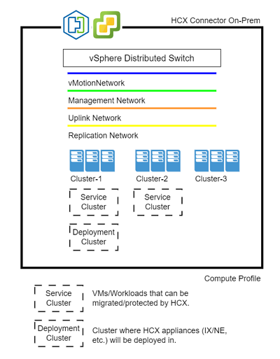
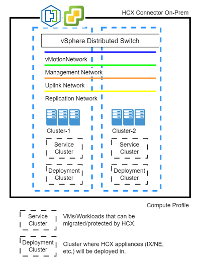

# VMware HCX Service Mesh

A VMware HCX Service Mesh is a configuration of VMware HCX services for a source and a destination site. It specifies a local and remote Compute Profile pair. When a Service Mesh is created, the VMware HCX Service appliances are deployed in pairs on both the source and destination sites and are automatically configured by VMware HCX to create the secure optimized transport fabric. The Service Mesh must be kept updated between the pair in the event changes occur in the Compute Profiles, Network Profiles, or the Service Mesh itself after initial deployment of the Service Mesh.

VMware HCX Service Mesh is the mechanism used to activate the different VMware HCX services like VMware HCX Migration, Disaster Recovery, Network Extension, and WAN Optimization.

The addition of a Service Mesh within VMware HCX initiates the deployment of VMware HCX virtual appliances on both sites. An Interconnect Service Mesh is always created (initiated) at the source site.

More information can be found in VMware's Official Documentation, [Creating a Service Mesh.](https://docs.vmware.com/en/VMware-HCX/4.3/hcx-user-guide/GUID-46AED982-8ED2-4CB1-807E-FEFD18FAC0DD.html)

## Compute Profiles

A compute profile contains the compute, storage, and network settings that HCX uses to deploy the interconnected dedicated virtual appliances when a Service Mesh is added.

For more information on VMware HCX Compute Profiles and its creation, please refer to [VMware Documentation.](https://docs.vmware.com/en/VMware-HCX/4.2/hcx-user-guide/GUID-BBAC979E-8899-45AD-9E01-98A132CE146E.html#:~:text=A%20Compute%20Profile%20contains%20the%20compute%2C%20storage%2C%20and,virtual%20appliances%20when%20a%20Service%20Mesh%20is%20added.)

When creating a Compute Profile, customers will need to define Deployment Cluster and Service Cluster(s).

### Deployment Cluster

The Deployment Cluster (Cluster, Resource Pool, Datastore) is the cluster where the appliances will be installed.

> **NOTE:** Ensure that all hosts/clusters can talk to the resources you've selected like Datastores for example. Otherwise, you run the chance of a specific host/cluster not being able to reach a certain resource like a network or datastore where the VMware HCX Appliances will be placed by the Service Mesh creation.

### Service Cluster

The Service Cluster is the cluster where VMware HCX will be able to service for migration, replication, protection. In other words, if VMs exist in different clusters, the clusters where the VMs the customer would like to migrate live, they need to be defined as Service Clusters.

### Other Important Considerations for Compute Profiles

When creating a Compute Profile within VMware HCX, customers will need to define the following:

- **Compute Profile Name**
- **VMware HCX Services Desired**
- **Service Resources** - Same as Service Clusters above.
- **Deployment Resources** - Same as Deployment Cluster above.
    - *Datastore* - Ensure to select the best performing Datastore in the customer on-premises environment.
    - *Folder* - Optional selection.
    - *Interconnect Appliance Reservation Settings* - Only adjust/select if customer would like to reserve the resources for the appliances.
- **Network Profiles** - More information below.
    - *Management Network Profile* - Management network segment or port group on-prem where VMware HCX appliances will be placed.
    > Preferably should be the same network used for management components like vCenter Server.
    - *Uplink Network Profile* - If a separate network/port group exists in the customer's environment for uplink purposes, specify here. Otherwise, the management network profile can serve as the uplink and there would be no need to create a separate uplink network profile.
    - *vMotion Network Profile* - Network/port group used on-premises for vMotion.
    > Ensure it's not a VMKernel port group, if it is, VMware HCX will accept it but vMotions can fail as it needs a VM Port Group to function properly.
    - *vSphere Replication Network Profile* - If a separate network/port group is used for replication traffic, specify it here. Otherwise, the management network profile can also serve as the replication network profile and there would be no need to create a separate replication network profile.
- **Network Containers** - Also knows as vSphere Distributed Switches. Select the Switch(s) the customer would like to make eligible for Network Extensions.

### Possible Scenarios for Compute Profiles

> These diagrams can be accessed here (Use "Save Link As" to download and save diagram): [VMware HCX Compute Profile.](./diagrams/computeprofile1.drawio)

VMware HCX has a 1-1 relationship with vCenter Server on-premises, meaning, if you have 2 vCenter Servers, each managing a separate cluster or set of clusters let's say in 2 different cities, then VMware HCX Connector will need to be installed in each vCenter Server, each vCenter Server will have at least 1 Compute Profile, at least 1 Service Mesh, and each will have at least its own set of Interconnect Appliances deployed with their Service Mesh.

There are other scenarios however where customers might have multiple clusters in a single vCenter Server with one or multiple clusters being managed. Some of these clusters might be in separate physical locations, each location with its own connectivity into Azure, and in situations like this, multiple Compute Profiles should be leveraged in order to take advantage of the separate connectivity into Azure.

#### Scenario 1: Single vCenter Server, Single vSphere Cluster

In this scenario, the on-premises vCenter Server manages a single cluster, which for purposes of the VMware HCX Compute Profile, becomes both the Service Cluster as well as the Deployment Cluster.

### Scenario 2: Single vCenter Server, 2 or more vSphere Clusters

In this scenario, the on-premises vCenter Server manages 3 clusters (could be 2 or more), which for purposes of the VMware HCX Compute Profile, Cluster-1 becomes not only the Deployment Cluster but also a Service Cluster. Cluster-2 becomes a Service Cluster only, and Cluster-3 is neither, meaning any VMs residing in Cluster-3, HCX will not have access to migrate or protect.

### Scenario 3: Single vCenter Server, vSphere Clusters in different locations

In this scenario, the on-premises vCenter Server manages 2 Clusters. Each cluster resides in different locations (possibly different cities). Each location has their own independent connectivity into Azure. The recommendation here would be to have a Compute Profile for each Cluster as depicted in the image. This will allow the migration and protection traffic VMware HCX sends to its peers in Azure VMware Solution more efficient by establishing connections using their respective connectivity into Azure.

## Service Mesh Creation

Adding a Service Mesh initiates the deployment of the VMware HCX Interconnect appliances on both sides (Source and Destination). The creation of the Service Mesh should always occur at the Source site.

For more information on creation of a Service Mesh, visit VMware's Official Documentation, [Creating a Service Mesh.](https://docs.vmware.com/en/VMware-HCX/4.3/hcx-user-guide/GUID-46AED982-8ED2-4CB1-807E-FEFD18FAC0DD.html)

> **IMPORTANT** - Ensure port UDP 4500 is open between your on-premises VMware HCX Connector **Uplink Network Profile** and the Azure VMware Solution HCX Cloud **Uplink Network Profile** addresses.

During the creation of the Service Mesh the following needs to be selected:

- **Source Site**
- **Destination Site**
- **Compute Profiles** - For each site.
- **VMware HCX Services**
- **Source Site Uplink Network Profile**
- **Destination Site Uplink Network Profile**
- **Network Extension Appliance Scale Out** - Depending on the customer setup and need to extend networks, the following applies:
    - One appliance per Network Container (vDS).
    - One appliance can support up to 8 network extensions. If the plan is to extend more than 8, additional appliances will be needed even when only one vDS exists on-premises.
- **Traffic Engineering** - Depending if the customer is using the Enterprise version the following can be enabled:
    - *Application Path Resiliency* - VMware HCX Service Mesh can build multiple transport tunnels to establish path diversity to the target, and intelligently directs HCX service traffic using the optimal path for performance and resiliency.
    - *WAN Optimization Configuration* - Here a customer can configure the maximum aggregate uplink bandwidth that will be consumed for migrations across all the uplinks.
