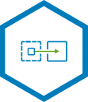

# VMware HCX Components

## VMware HCX Connector & VMware HCX Cloud Manager

More information can be found in VMware's Official Documentation for [VMware HCX Connector and VMware HCX Cloud Installations](https://docs.vmware.com/en/VMware-HCX/4.6/hcx-getting-started/GUID-B1023D31-0458-433B-9ABB-62E8BDD3FEC2.html).

In an VMware HCX site-to-site architecture, there is notion of an VMware HCX source and a VMware HCX destination environment. This is true also for Azure VMware Solution to Azure VMware Solution deployments as well. Depending on the architecture and environment VMware HCX is being deployed in, there may be a specific installer: VMware HCX Connector or VMware HCX Cloud.

VMware HCX Connector is always deployed as the source. VMware HCX Cloud is typically deployed as the destination, but it can be used as the source in Azure VMware Solution to Azure VMware Solution deployments. In Azure VMware Solution, Microsoft deploys VMware HCX Cloud through the Add-Ons tab in the Azure Portal Azure VMware Solution Private Cloud blade. Customer is responsible for deploying VMware HCX Connector on-premises.

Microsoft deploys VMware HCX Cloud in the management zone within Azure VMware Solution. Both VMware HCX Cloud and VMware HCX Connector are a one-to-one relationship to a vCenter Server environment.

## VMware HCX-IX - Interconnect Appliance

The VMware HCX-IX service appliance provides replication and vMotion-based migration capabilities to Azure VMware Solution, providing strong encryption, traffic engineering, and virtual machine mobility.

This appliance includes the deployment of the Mobility Agent service that appears as a host object in vCenter Server. The Mobility Agent is the mechanism that VMware HCX uses to perform vMotion, Cold, and Replication Assisted vMotion (RAV) migrations to a destination site.

## VMware HCX-WO - WAN Optimization Appliance

The VMware HCX WAN Optimization service improves performance characteristics of the private lines or Internet paths by applying WAN Optimization techniques like data de-duplication and line conditioning.

## VMware HCX-NE - Network Extension Appliance

The VMware HCX Network Extension service provides layer 2 connectivity between sites. VMware HCX Network Extension provides the ability to keep the same IP and MAC addresses during virtual machine migrations. When the Network Extension service is enabled on a Service Mesh, a pair of virtual appliances will be deployed: one in the source and one in the destination site (Azure VMware Solution).

## VMware HCX-SGW - Sentinel Gateway Appliance

VMware HCX Enterprise also includes a service called OS Assisted Migration (OSAM). With OSAM you can migrate guest (non-vSphere) virtual machines from an on-premises data center to Azure VMware Solution. The OSAM service has several components: the VMware HCX Sentinel software that is installed on each virtual machine to be migrated, a Sentinel Gateway (SGW) appliance for connecting and forwarding guest workloads in the source environment, and a Sentinel Data Receiver (SDR) in the destination (AVS) environment.

## VMware HCX-SDR - Sentinel Data Receiver Appliance

The VMware HCX Sentinel Data Receiver (SDR) appliance works with the VMware HCX Sentinel Gateway appliance to receive, manage, and monitor data replication operations at the destination environment.
