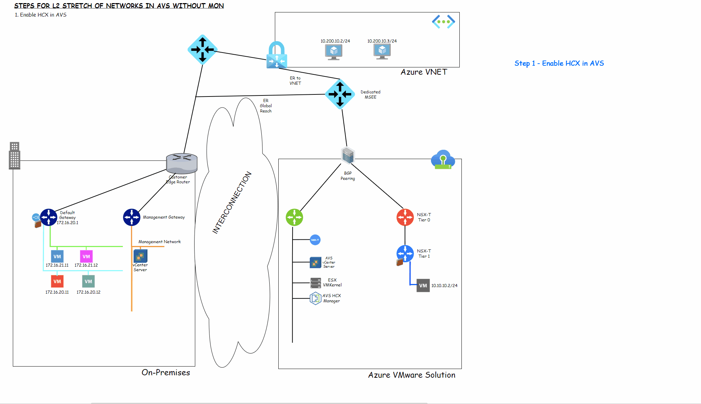
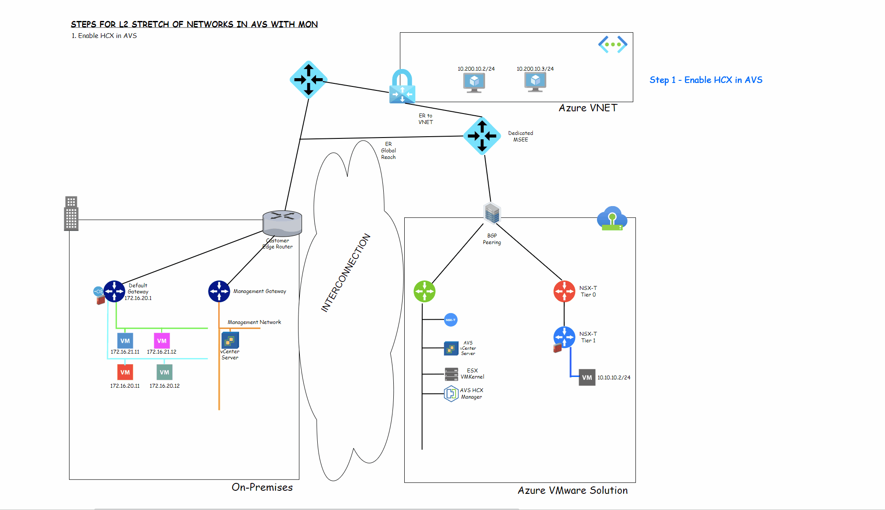

# Network Extension Considerations

## Workload IP Considerations/Options

Common services such as DNS, DHCP, Active Directory (Authentication), Firewalls, Load Balancers and others should be planned for and architected prior to the migration of any VM(s).

Application dependency mappings assessment are also strongly encouraged to be performed prior to migrating workloads with HCX to AVS. This will allow for the creation of migration waves or groups and also minimize potential latency due to traffic communicating back through an ExpressRoute or VPN connection.

### Option 1: Re-IP Migrated Workloads

Feel free to download the draw.io diagram (Save Link As) [here](./diagrams/hcx-reIP.drawio).

Customers can opt for a Re-IP strategy when migrating workloads to Azure VMware Solution with HCX. As VMs migrate to AVS with HCX, they will adopt a brand new IP address once migrated to Azure VMware Solution. This is ideal to organize or cleanup a network infrastructure that has become unmanageable for on-premises data centers and also offers a chance to document from a clean slate of IP schemes for migrated workloads.

HCX Bulk Migration allows you to specify a new IP address for the migrated VM. This is done through the IP Customization feature of HCX. When changing Guest OS information, HCX does not store the original settings. All values must be specified in the wizard, even those that must remain unchanged. Values will be cleared on the migrated virtual machine for fields left empty if IP Customization is configured.

IP Customization is a feature of HCX that allows you to customize the IP address of a migrated virtual machine. This is useful when you want to change the IP address of a virtual machine after it has been migrated to Azure VMware Solution.

With a Re-IP option, customers will need to pre-stage the new network segments in NSX-T on the AVS side. For example:

| Old Network Segment On-Premises | New Network Segment in AVS NSX-T|
|-------------|--------------|
|172.16.20.0/24|10.10.20.0/24|

When selecting this option, once a VM has been migrated, routing from the new network segment will be handled by NSX-T locally on the AVS side. A new network segment will be advertised via BGP back to on-premises and native Azure as well. Updating DNS configuration for migrated VMs utilizing this approach is also critical.

This approach requires an outage for the VM being migrated. Bulk Migration does the equivalent of a reboot when a VM is migrated to Azure VMware Solution. Reboot times might vary depending on different factors like VM size so customers must plan accordingly and preferably utilize some pre-defined outage window for the migration. Switchover of the migrated VM can be scheduled via HCX Bulk Migration option.

Once and if the old network segment on-premises is evacuated, customer should decomission this old network segment.

#### Steps to follow with Re-IP of workloads to AVS

1. Deploy Azure VMware Solution (AVS) with HCX enabled, or enable HCX after deployment.
2. Deploy and activate HCX Connector on-premises or source site.
3. Create HCX Site Pairing.
4. Deploy HCX Service Mesh.
5. Create new NSX-T Network Segment in AVS to replace existing network segment on source site.
6. Migrate workloads to new AVS Network Segment.
7. Retire old network segment from source site.
8. Accept new AVS network segment advertised via BGP.

### Option 2: Duplicating Existing Network Segments

Feel free to download the draw.io diagram (Save Link As) [here](./diagrams/hcx-duplicateNetworks.drawio).

> Keep in mind that this option should only be used when an on-premises network segment will be fully evacuated and decommissioned after it is evacuated.

When given the option to not change IP addresses for their VMs as they migrate them to Azure VMware Solution, most customers will select to not change IPs. Not changing IP addresses when migrating VMs with HCX however may require the stretch of Layer-2 networks (which HCX supports) which may add additional complexity to the migration and day-2 operations processes, or perhaps, the customer's on-premises environment simply cannot support doing layer-2 stretch of networks because most of their networks on-premises leverage Virtual Standard Switches (vSS) which cannot be supported by HCX to extend networks to Azure VMware Solution.

The solution for this scenario would be to duplicate existing network IP schemes used on-premises on NSX-T in Azure VMware Solution.

Duplicating a network from on-premises in NSX-T allows customers to migrate VMs without the requirement of changing their IP address or performing a layer-2 network extension.

First, customers will need to pre-stage a network segment in NSX-T in a **Disconnected** state, meaning not attached to any NSX-T T1 router to avoid this network segment from being advertised via BGP back to on-premises and create IP conflicts with existing network segments on-premises.

Once the disconnected network is pre-staged on the AVS NSX-T side, customers can start the migration process utilizing HCX Bulk Migration. Same considerations for Bulk Migrations apply like IP Customization, Switchover scheduled windows, Migration Groups or Waves.

After all workloads are migrated off the on-premises original network segment, the following steps should be followed:

1. Decommission (retire) on-premises network segment and default gateway.
2. Connect pre-staged NSX-T network segment to AVS NSX-T T1 router. This will immediately advertise the previously disconnected network segment through BGP back to the customer's on-premises environment.

This approach like Option 1, will require an outage so please plan accordingly.

#### Steps to follow for Duplication of Networks in AVS

1. Deploy Azure VMware Solution (AVS) with HCX enabled, or enable HCX after deployment.
2. Deploy and activate HCX Connector on-premises or source site.
3. Create HCX Site Pairing.
4. Deploy HCX Service Mesh.
5. Create new disconnected NSX-T Network Segment in AVS to replace existing network segment on source site with same CIDR space as source network.
6. Migrate workloads to new disconnected AVS Network Segment.
7. Retire old network segment from source site.
8. Connect NSX-T duplicate segment to T1 router.
9. Accept new AVS network segment advertised via BGP.

### Option 3: Extending Layer 2 Networks with HCX

Feel free to download the draw.io diagram (Save Link As) [here](./diagrams/hcx-ne-woMON.drawio).

HCX Network Extension is a service of VMware HCX that provides a secure Layer 2 extension capability (VLAN, VXLAN, and Geneve) for vSphere or 3rd party distributed switches and allows the virtual machines to retain IP/MAC address during migration.  HCX Network Extension can be used to create layer-two networks at the destination HCX site (Azure VMware Solution) and bridge the remote network to the source network over a multi-gigabit-capable link. The new stretched network is automatically bridged with the network at the source (on-premises) HCX data center.

Important facts about extending Layer-2 Networks with HCX to Azure VMware Solution:

- VMware NSX is not required on-premises to extend layer 2 networks.
- VLANS and overlay networks can be extended via layer 2 with HCX.
- vSphere vDS (Virtual Distributed Switch) is required for layer 2 extensions.
- vSphere vSS (Virtual Standard Switches) is not supported for layer 2 extensions with HCX.
- By default, when extending a Layer 2 network with HCX, the default gateway for this L2 network remains on-premises including things like common services (DNS, Firewalls, etc.).
- Traffic will always be sent to its default gateway (hairpinned) back to on-premises for any layer 3 connectivity between workloads on extended networks, on-premises, and/or in non-stretched networks on AVS, as well as Azure VNETs.
- This approach does not require an outage as migrations can be done via vMotion, Replication Assisted vMotion (RAV), which will not interfere with the operation of the VM(s). Bulk Migration and Cold Migration can also be used to migrate to extended networks, just keep in mind these methods require downtime for the VM to be migrated.
- Once an on-premises network segment is fully evacuated, customers can choose to un-stretch a layer 2 network segment with an option to transfer the duties of the default gateway to the NSX-T T1 router on the AVS side. Once the gateway duties are fully migrated, NSX-T will do routing locally through the T1.
- Mobility Optimized Networking (MON) can be enabled on extended layer 2 networks via HCX to avoid traffic being hairpinned back to the on-premises default gateway. MON injects /32 routes to route traffic locally on AVS (See Option 4).

#### Steps to follow for L2 Stretch of Networks to AVS without MON

1. Deploy Azure VMware Solution (AVS) with HCX enabled, or enable HCX after deployment.
2. Deploy and activate HCX Connector on-premises or source site.
3. Create HCX Site Pairing.
4. Deploy HCX Service Mesh.
5. Extend L2 Network from Source Site to AVS.
6. Migrate workloads to new L2 Stretched AVS Network Segment. (vMotion, RAV, Bulk/Cold Migration).
7. Un-Stretch L2 Network from Source Site and Transfer Default Gateway capabilities to T1.
8. Retire old network segment from source site.

> **IMPORTANT**
>
> If the purpose is to keep a permanent (or long term) stretch of an L2 network from the Source Site to AVS, customers should consider and follow the recommendations for deploying the HCX Network Extension (NE) appliances in a High Availability setup. More information can be found in VMware's documentation: [Understanding Network Extension High Availability](https://docs.vmware.com/en/VMware-HCX/4.6/hcx-user-guide/GUID-E1353511-697A-44B0-82A0-852DB55F97D7.html#:~:text=Network%20Extension%20High%20Availability%20protects%20against%20one%20Network,service.%20Network%20Extension%20HA%20operates%20in%20Active%2FStandby%20mode.).

### Option 4: L2 Extensions with Mobility Optimized Networking (MON)

Feel free to download the draw.io diagram (Save Link As) [here](./diagrams/hcx-ne-MON.drawio).

Mobility Optimized Networking (MON) is an Enterprise capability of the HCX Network Extension feature. MON enabled network extensions improve traffic flows for migrated virtual machines by enabling selective cloud routing (within the destination environment), avoiding a long round trip network path via the source default gateway. The HCX Mobility Optimized Networking (MON) feature routes network traffic based on locality of the source and destination virtual machines. MON operation requires specific configuration of the HCX Network Extension parameters and the network environment between the source and the destination sites.

It's important to note that HCX MON will not always solve all customer issues regarding traffic hairpinning back to a default gateway on-premises. It often requires additional manual configuration and maintenance as well as a full understanding of VM dependencies in order for MON to work as anticipated.

If the goal is to evacuate a data center on-premises, the focus should simply be on getting VMs as quick as possible to Azure VMware Solution either by Re-IP'ing VMs migrated, Duplicating Existing Networks, or simply cutting over the default gateways of networks that were stretched via L2 (See Options 1, 2, and 3).

If the use case for a customer is to have a layer 2 extension in perpetuity, or for an extended period of time, then MON is a good option to enable. For this use case also customers would need to consider Network Extension High Availability (HA). This capability protects against one Network Extension appliance failure in a HA group. Network Extension HA operates without preemption, with no automatic failback of an appliance pair to the Active role. The HCX Network Extension service provides layer 2 connectivity between sites. Network Extension HA protects extended networks from a Network Extension appliance failure at either the source or remote site.

##### Prerequisites for Mobility Optimized Networking (MON) setup

1. **Network Traffic Expectations** - Make sure customer has clear understanding of traffic patterns within customer's network.
    - Will this create asymmetrical traffic?
2. **Stateful Firewalls** - Determine if they exist in potential HCX MON paths, this includes traffic within AVS, back to on-premises, and to Native Azure VNETs.
3. **Unicast Reverse Path Forwarding (uRPF)** - uRPF is a security feature in VMware NSX-T that prevents IP packets from being passed to your router with forged source IP addresses. It helps to avoid spoofed source IP address attacks in which packets are sent with random source IP addresses. Packets will be rejected if the routing table interfaces are different. It is set to *strict* by default.
4. **Policy Routes** - Should be emptied out to avoid asymmetrical paths while enabling MON. This will force HCX to default to the local NSX-T T1 gateway first.

##### How to enable HCX MON

MON can be enabled either at the time an L2 extension is being created with HCX or after. If MON is enabled *after* the L2 extension is created, HCX MON will need to be manually enabled per VM on that L2 extended network.

If MON is enabled at the time the L2 extension is created, MON will either be enabled or disabled on each VM migrated, based on the migration types used for those VMs:

- **Bulk Migration** - MON *automatically* enabled by default on each VM.
- **vMotion** - MON needs to be *manually* enabled per VM.
- **RAV Migration** - MON needs to be *manually* enabled per VM.

> **IMPORTANT**: If customers deploy a Network Virtual Appliance with a T1 gateway deployed with it, MON is not supported by Microsoft support.

#### Steps to follow for L2 Stretch of Networks in AVS with MON

1. Deploy Azure VMware Solution (AVS) with HCX enabled, or enable HCX after deployment.
2. Deploy and activate HCX Connector on-premises or source site.
3. Create HCX Site Pairing.
4. Deploy HCX Service Mesh.
5. Extend L2 Network from Source Site to AVS (MON could be enabled at time of stretch of L2 network).
6. Migrate workloads to new L2 Stretched AVS Network Segment. (vMotion, RAV, Bulk/Cold Migration).
7. Enable MON if applicable.
8. Add Route Filter On-Premises for /32 Routes advertisements.
