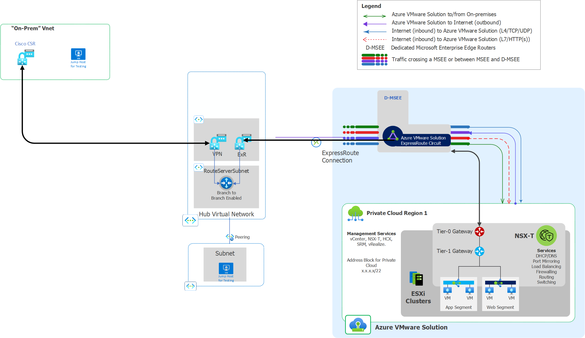

# Implement AVS with new VPN hub/spoke with 3rd Party NVA

## Table of contents

- [Sample Details](#sample-details)
- [Sample Implementation - Manual Steps](#sample-implementation-with-manual-steps)
- [Sample Implementation - Automation Options](#automation-implementation)
- [Appendix](#appendix)

## Sample Details

### Overview
This sample deploys a lab configuration for testing AVS VPN hub spoke scenarios.  It creates a new VPN hub/spoke, a new AVS private cloud, and a simulated on-premises Vnet with a Cisco CSR acting as a VPN gateway. It builds the connectivity between the three components and creates jumpservers for testing connectivity between them.  

### Naming

Resource naming is configured by using local variables at the top of the root module.  Each name is configured to use a static prefix value that is provided via an input variable and a randomly generated 4 character suffix for uniqueness. It is expected that many customers will find this naming to be inconsistent with their unique corporate naming conventions, so all the names are maintained in the locals for simplicity in modifying the naming during deployment. 

### Internet Ingress/Egress
This sample doesn't currently enable internet egress/ingress as no force tunneling is configured for the on-prem VPN. If internet ingress/egress is needed for AVS as part of the lab, then a feature toggling the AVS internet connectivity option on will need to be added.

### Assumptions

- The Cisco CSR is running under a trial license, which is temporary and throttled.  This is only intended for validating AVS connectivity configurations and should not be used without a license or used for load-testing if used for other uses.

[(Back to top)](#table-of-contents)

## Automation implementation

This sample is a root module that calls a number of child modules included in the modules and scenarios subdirectories of the terraform directory.  This root module inputs the deployed values directly in the submodule calls, so to change the deployment behavior, modify the values directly in the main.tf file. This module also includes a sample providers file that can be modified to fit your specific environment.

To deploy this module, ensure you have a deployment machine that meets the pre-requisites for Azure Deployments with terraform. Clone this repo to a local directory on the deployment machine.  Update the main.tf variable values and make any updates to the providers sample file backend block and remove the .sample extension.

Execute the terraform init/plan/apply workflow to execute the deployment.

[(Back to top)](#table-of-contents)

## Appendix

[(Back to top)](#table-of-contents)