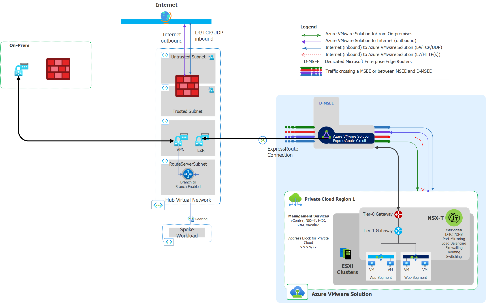

# Implement AVS with new VPN hub/spoke with 3rd Party NVA

## Table of contents

- [Implement AVS with new VPN hub/spoke with 3rd Party NVA](#implement-avs-with-new-vpn-hubspoke-with-3rd-party-nva)
  - [Table of contents](#table-of-contents)
  - [Scenario Details](#scenario-details)
    - [Overview](#overview)
    - [Naming](#naming)
    - [Internet Ingress/Egress](#internet-ingressegress)
    - [Network Inspection](#network-inspection)
    - [Assumptions](#assumptions)
  - [Scenario implementation with manual steps](#scenario-implementation-with-manual-steps)
  - [Automation implementation](#automation-implementation)
  - [Appendix](#appendix)
    - [On-Prem VPN without BGP capability](#on-prem-vpn-without-bgp-capability)

## Scenario Details

### Overview
This scenario is meant for customers who want to implement a greenfield AVS environment using a VPN to make the hybrid connection. The solution implements a new hub/spoke topology with VPN and ExpressRoute gateways and one or more hub subnets for Azure workloads. This configuration allows for inclusion of custom subnets for adding your choice of 3rd party NVAs in the hub, but does not deploy the Firewall resources. AVS Landing Zone concepts can be explored in more detail via the [official documentation page](https://docs.microsoft.com/en-us/azure/cloud-adoption-framework/scenarios/azure-vmware/ready). 

A spoke subnet with a Jumpbox VM and Azure Bastion is included in this deployment for initial configuration and troubleshooting.  If you determine that these aren't desired or needed in your deployment, you can remove the last module in main.tf and leave the defaults for the input values. The initial random password is stored as a secret in the key vault deployed in the jumpbox resource group. An initial access policy is created for the deployment user, but any additional users will need to first update the key vault access policy prior to being able to access the secret.

### Naming

Resource naming is configured by using local variables at the top of the root module.  Each name is configured to use a static prefix value that is provided via an input variable and a randomly generated 4 character suffix for uniqueness. It is expected that many customers will find this naming to be inconsistent with their unique corporate naming conventions, so all the names are maintained in the locals for simplicity in modifying the naming during deployment. 

### Internet Ingress/Egress
Internet ingress and egress to AVS and Azure VMs will be enabled through one or more public IPs attached to the 3rd party firewall NVA in the hub. On-premises ingress/egress is expected to use existing internet routing configurations and would not send internet traffic via the VPN. (Although this can be permitted by removing any route filters for 0/0 routes on-prem.) If the firewall is excluded, internet Internet and Egress can be enabled using the managed VWAN resource options included with the AVS private cloud.   

### Network Inspection
The solution enables network inspection with the 3rd party NVA on the following flows: 

Source                    | Azure VMWare Solution | Internet | On-Premises | Spoke Vnets 
---                       | :---:                 | :---:    | :---:       | :---:
**Azure VMWare Solution** | N/A                   | Yes      | No          | Yes 
**Internet**              | Yes                   | N/A      | N/A         | Yes 
**On-Premises**           | No                    | N/A      | N/A         | Yes 
**Spoke Vnets**           | Yes                   | Yes      | Yes         | Yes

### Assumptions

- Any AVS guest-to-guest inspection will occur in the private cloud using NSX-T's firewall capability 
- Traffic inspection between on-premises sites will be managed by existing equipment and configurations
- If subnet to subnet traffic inspection is required then UDRs will need to be configured for the traffic sources.

[(Back to top)](#table-of-contents)

## Scenario implementation with manual steps
The steps described below are an outline for deploying this scenario manually. If you wish to use the accompanying automation, then skip to the automation guidance below the manual workflow.

These steps represent deploying a configuration using the portal and vcenter.

- Create the required **resource groups** in the target subscription
    - Private Cloud - used to deploy the private cloud and any associated resources
    - Networking  - Used to deploy the hub resources
    - Jump/Bastion - Used to deploy the jump host and bastion related resources
- Deploy the **AVS private cloud**
    - Create a private cloud with an initial management cluster
    - Do not enable the internet access toggle as this will be managed in the secure hub
    - Upon deployment completion, create an initial expressroute authorization key for attaching to the Hub ExpressRoute Gateway
- Create a new **Hub and Spoke network** 
    - Deploy hub **Virtual Network**
        - Include Subnets for:
            - **GatewaySubnet**
            - **AzureRouteServer**
            - **Firewall NVA subnets**
    - Deploy a **VPN** Virtual Network Gateway in the Hub VNet
        - ASN **65515**
        - **Active/Active**
    - Deploy an **ExpressRoute** Virtual Network Gateway in the Hub VNet
    - Deploy a **Route Server** instance in the Hub Vnet
        - Ensure **Branch-to-Branch** is enabled
    - Configure the AVS **expressRoute connection** using the authorization key created previously 
- Create **Service Health Alerts** for the AVS SLA related items
    Name    | Description | Metric | SplitDimension | Threshold | Severity 
    ---     | :---:       | :---:  | :---:          | :---:     | :---:
    **CPU**     | CPU Usage per Cluster | EffectiveCpuAverage | clustername | 80 | 2
    **Memory**  | Memory Usage per Cluster | UsageAverage     | clustername | 80 | 2 
    **Storage** | Storage Usage per Datastore | DiskUsedPercentage | dsname | 70 | 2 
    **StorageCritical** | Storage Usage per Datastore| DiskUsedPercentage | dsname | 75 | 0 

- Create the JumpBox/Bastion Spoke and Services
    - Create the **Jumpbox VNET** with the following subnets 
        - For simplicity consider allocating a /24 and splitting it into 4 /26 ranges.
        - **jumpbox** subnet(/29 should be sufficient)
        - **AzureBastionSubnet** subnet (requires minimum of /26 with this exact naming)
    - Create the **Bastion** and **Bastion Public IP**
        - A Basic sku Bastion should be sufficient for basic testing. If keeping this configuration, consider using the Standard sku
        - Standard Public IP sku
        - Static Public IP
    - Create a keyvault for storing the jumpbox VM password as a secret
        - Create the **Keyvault** resource
        - Create an **Access policy** for anyone needing access
        - Create a **secret value** with the password
    - Create the **Jumpbox VM**
        - No public IP attached 
        - Only deploy an NSG if required
        - If an NSG is deployed, ensure the firewall allows testing traffic
- Test Jump Server access to the Vcenter to validate Azure Services connectivity
    - Confirm that the **VCenter** comes up in a browser and logins succeed
        - Vcenter login information is found on the **Identity** menu item of the private cloud SDDC
    - Confirm that the jumpserver can access the internet
    - Review firewall logs to validate traffic is crossing the firewall
- Configure the AVS guest network elements 
    - Configure a new DHCP server
    - Create a new segment and link to the DHCP server
    - Create a DNS scope on the AVS private cloud for any custom DNS required for LDAP configuration
- Deploy a test VM into AVS 
- Connect the Remote VPN 
    - Create a **Local Gateway** for both tunnels
        - Configure the **Link** BGP details 
    - Create two vpn gateway connections 
        - link to the two Local Gateways created previously
        - Ensure BGP is enabled on the Connection link
- Create the on-prem connections on the **existing on-prem firewall or router**
    - Ensure the redundant tunnels are created to each azure VPN node
    - Validate the BGP configuration
- Test the connectivity
    - Validate the VPN is showing connected on each side of the tunnel
    - From an On-prem system ensure that it can connect to the AVS VM and Jump VM
    - Ensure the AVS and Jump VMs can reach the on-premises VMs
    - Check the firewall logs to ensure traffic is seen on the firewall for each test

[(Back to top)](#table-of-contents)
## Automation implementation

This scenario is organized using a root module included in this folder, and a number of child modules included in the modules subdirectory of the terraform directory of this repo.  This root module includes a tfvars sample file that contains an example set of input values. This module also includes a sample providers file that can be modified to fit your specific environment.

To deploy this module, ensure you have a deployment machine that meets the pre-requisites for Azure Deployments with terraform. Clone this repo to a local directory on the deployment machine.  Update the providers and tfvars sample files and remove the .sample extension.

Execute the terraform init/plan/apply workflow to execute the deployment.

[(Back to top)](#table-of-contents)

## Appendix

There are several variations of this implementation that can use the general framework of the implementation instructions, but with the following modifications.

### On-Prem VPN without BGP capability

In some cases the existing on-premise VPN device may not be able to do BGP.  In this case, the routes can be published statically and the VPN gateway will share the routes with the AVS and the other hub spokes.  Modify these instructions by configuring the Azure VPN connections and the on-prem VPN connections to not use BGP when sharing routing information.

[(Back to top)](#table-of-contents)