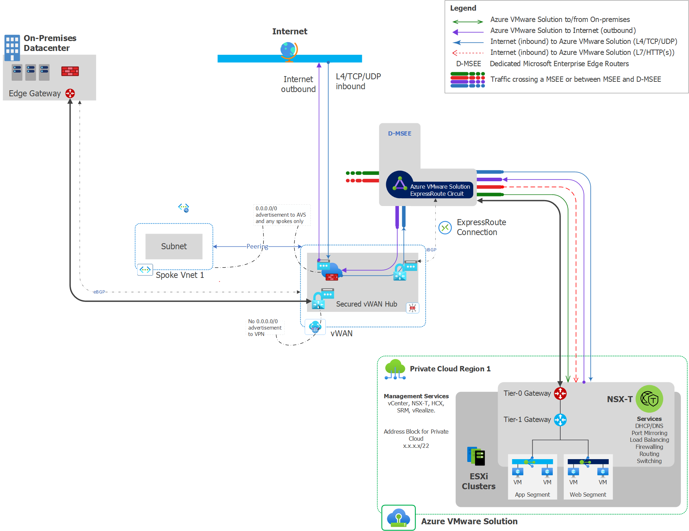

# Implement AVS with new Secure VWAN Hub and VPN hybrid connectivity

## Table of contents

- [Scenario Details](#scenario-details)
- [Scenario Implementation - Manual Steps](#scenario-implementation-with-manual-steps)
- [Scenario Implementation - Automation Options](#automation-implementation)
- [Appendix](#appendix)

## Scenario Details

### Overview
This scenario is meant for new Greenfield customers who want to implement a greenfield AVS environment using VPN to make the hybrid connection. The solution implements a new Secure VWAN hub with VPN and ExpressRoute gateways and Azure Firewall. 

This scenario also deploys a temporary spoke Vnet with a bastion and jump host.  These resources can be used for initial setup and testing and then be removed if there are prohibitions against allowing remote virtual machine access from the internet.

### Internet Ingress/Egress
Internet ingress and egress to AVS and Azure VM's will be enabled through one or more public IPs attached to the Azure Firewall in the secure hub. On-premises ingress/egress is expected to use existing routing configurations and not migrate to the VWAN hub.  <TODO: Add SNAT language?>

### Network Inspection
The solution configures network inspection with the Azure Firewall on the following flows:

Source                    | Azure VMWare Solution | Internet | On-Premises | Spoke Vnets 
---                       | :---:                 | :---:    | :---:       | :---:
**Azure VMWare Solution** | Yes                   | Yes      | Yes         | Yes 
**Internet**              | Yes                   | N/A      | Yes         | Yes 
**On-Premises**           | Yes                   | N/A      | N/A         | Yes 
**Spoke Vnets**           | Yes                   | Yes      | Yes         | Yes

### Assumptions

- Any AVS guest-to-guest inspection will occur in the private cloud using NSX-T's firewall capability 
- Traffic inspection between on-premises sites will be managed by existing equipment and configurations
- If subnet to subnet traffic inspection is required then UDR's will need to be configured on each subnet. <TODO: confirm this statement>

[(Back to top)](#table-of-contents)

## Scenario implementation with manual steps
The steps described below are an outline for deploying this scenario manually. If you wish to use the accompanying automation, then skip to the automation guidance below the manual workflow.

These steps represent deploying a configuration using the portal and vcenter.

- Create the required **resource groups** in the target subscription
    - Private Cloud - used to deploy the private cloud and any associated resources
    - Networking  - Used to deploy the firewall, VWAN, and VWAN hub resources
    - Jump/Bastion - Used to deploy the jump host and bastion related resources
- Deploy the **AVS private cloud**
    - Create a private cloud with an initial management cluster
    - Do not enable the internet access toggle as this will be managed in the secure hub
    - Upon deployment completion, create an initial expressroute authorization key for attaching to the VWAN hub
- Create a new **VWAN** resource
    - This is only required if an existing VWAN resource does not already exist
- Create an **Azure Firewall** and **Log Analytics** workspace
    - Create a Log Analytics workspace if one doesn't already exist for the firewall logs 
    - Create the Azure Firewall to use **Azure Firewall Policies**
    - The standard sku can be used unless premium features are required in the environment
    - Enable the **DNS proxy** to allow for future DNS configurations
    - Configure the firewall Diags to go the log analytics workspace
- Create an initial **Firewall Policy** for internet access
    - Create new **network rule collection** for testing
    - Create a new **network rule** in the rule collection 
        - Source = AVS Address Space, JumpServer Address space
        - Target = *
        - Ports  = 80, 443, 53, 123
        - Protocols = TCP, UDP
- Create a new **VWAN virtual hub** using the VWAN created previously
    - Ensure **Branch-to-Branch** is enabled
    - Deploy an **ExpressRoute gateway** in the hub
    - Deploy a **VPN gateway** in the hub
    - Configure the AVS **expressRoute connection** using the authorization key created previously with the **internet security** toggle enabled
    - Add a route to the default route table with **0.0.0.0/0** pointing to the resource id of the **azure firewall**
- Create **Service Health Alerts** for the AVS SLA related items
    Name    | Description | Metric | SplitDimension | Threshold | Severity 
    ---     | :---:       | :---:  | :---:          | :---:     | :---:
    **CPU**     | CPU Usage per Cluster | EffectiveCpuAverage | clustername | 80 | 2
    **Memory**  | Memory Usage per Cluster | UsageAverage     | clustername | 80 | 2 
    **Storage** | Storage Usage per Datastore | DiskUsedPercentage | dsname | 70 | 2 
    **StorageCritical** | Storage Usage per Datastore| DiskUsedPercentage | dsname | 75 | 0 

- Create the JumpBox/Bastion Spoke and Services
    - Create the **Jumpbox VNET** with the following subnets 
        - For simplicity consider allocating a /24 and splitting it into 4 /26 ranges.
        - **jumpbox** subnet(/29 should be sufficient)
        - **AzureBastionSubnet** subnet (requires minimum of /26 with this exact naming)
    - Create the **Bastion** and **Bastion Public IP**
        - A Basic sku Bastion should be sufficient for basic testing. If keeping this configuration, consider using the Standard sku
        - Standard Public IP sku
        - Static Public IP
    - Create a keyvault for storing the jumpbox VM password as a secret
        - Create the **Keyvault** resource
        - Create an **Access policy** for anyone needing access
        - Create a **secret value** with the password
    - Create the **Jumpbox VM**
        - No public IP attached 
        - Only deploy an NSG if required
        - If an NSG is deployed, ensure the firewall allows testing traffic
- Test Jump Server connectivity
    - Confirm that the **VCenter** comes up in a browser and logins succeed
        - Vcenter login information is found on the **Identity** menu item of the private cloud SDDC
    - Confirm that the jumpserver can access the internet
    - Review firewall logs to validate traffic is crossing the firewall
- Configure the AVS guest network elements 
    - Configure a new DHCP server
    - Create a new segment and link to the DHCP server
    - Create a DNS scope on the AVS private cloud for any custom DNS required for LDAP configuration
- Deploy a test VM into AVS 
    - <TODO: determine guest configuration and testing >
- Connect the Remote VPN within VWAN
    - Create a **VWAN site** for both tunnels
        - Configure the **Link** BGP details 
    - Create two VWAN vpn gateway connections 
        - link to the two sites created previously
        - Ensure internet security enabled is set to false
        - Ensure BGP is enabled on the Connection link
        - <TODO: Confirm whether we need two links per connection>
- Create the on-prem connections on the **existing on-prem firewall or router**
    - Ensure the redundant tunnels are create to each VPN site
    - Validate the BGP configuration
- Test the connectivity
    - Validate the VPN is showing connected on each side of the tunnel
    - From an On-prem system ensure that it can connect to the AVS VM and Jump VM
    - Ensure the AVS and Jump VM's can reach the on-premises VM's
    - Check the firewall logs to ensure traffic is seen on the firewall for each test

[(Back to top)](#table-of-contents)
## Automation implementation

Multiple automation options exist for deploying this scenario into Azure. Please use the links below to access the desired automation solution.
Solution | Code and Guidance
---                       | :---:  
**Azure ARM templates**   | <TODO: Insert link here>
**Bicep template**        | <TODO: Insert link here>
**Terraform**             | <TODO: Insert link here>
**Powershell**            | <TODO: Insert link here>
**AZ CLI**                | <TODO: Insert link here>

[(Back to top)](#table-of-contents)

## Appendix

There are several variations of this implementation that can use the general framework of the implementation instructions, but with the following modifications.

### On-Prem VPN without BGP capability

In some cases the existing on-premise VPN device may not be able to do BGP.  In this case, the routes can be published statically and the VWAN VPN gateway will share the routes with the AVS and the other VWAN spokes.  Modify these instructions by configuring the VWAN VPN connections and the on-prem VPN connections to not use BGP when sharing routing information.

### Use of an existing VWAN or VWAN hub 

In some cases it may be desired to connect to an existing VWAN and/or VWAN hub.  In those cases, modify the instructions to use the existing resources and make any necessary configuration changes on the existing hub.  (i.e. create new VPN and/or ExpressRoute gateways) Connection guidance for the connections should be the same in these cases.

### Use of an existing Log Analytics workspace

This solution assumes the creation of a new firewall with an associated log analytics workspace. If a previous workspace exists it is possible to use that workspace for the firewall logs and diagnostics.

[(Back to top)](#table-of-contents)