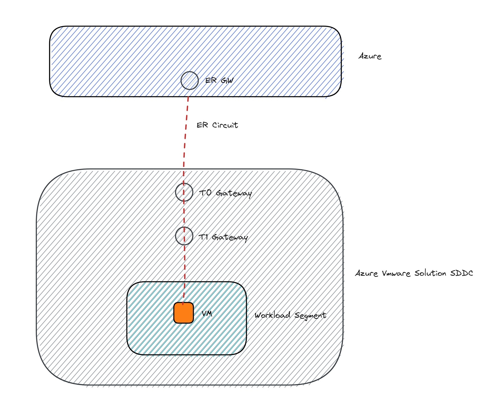

# Create a sample Linux VM with networking in Azure VMware Solution SDDC
This project is to POC a sample Linux virtual machine on Azure VMware Solution SDDC. Once you have created SDDC on Azure using ALZ-Accelarator or Azure portal, the next step is to configure basic networking. This terraform script does the networking bootstrapping for you. Post that it creates a linux VM using VMware provided OVA(PhotonOS)
## Here are the tasks it does:
1. Create DHCP Profile
2. Create NSX-T T1 Gateway
3. Create workload segment
4. Create PhotonOS Linux VM

## Prerequisites
1. Install terraform 1.3 or above
2. Linux VM to run the script. This linux VM should have connectivity to your vSphere and NSX-T environment.
3. AVS SDDC

## Topology Diagram

## Usage
1. Copy sample.tfvars.bck to variables.tfvar. You can also use terraform.lup01.tfvars as a starting point for populating your tfvars.
```dotnetcli
cp sample.tfvars.bck variables.tfvars
```
2. Replace sample values in variables.tfvars with your environment values
3. Initialize terraform
```dotnetcli
terraform init
```
4. Validate and plan terraform deployment
```dotnetcli
terraform validate
terraform plan
```
5. Deploy using terraform
```dotnetcli
terraform apply --auto-approve
```
6. Cleanup
```dotnetcli
terraform destroy
```

## Misc
### Alias
```dotnetcli
alias td='terraform destroy'
alias ti='terraform init'
alias tp='terraform plan'
alias ts='terraform show'
alias tv='terraform validate'
alias td='terraform destroy'
```
### Debug Terraform
```dotnetcli
export TF_LOG="DEBUG"
export TF_LOG="ERROR"
```

