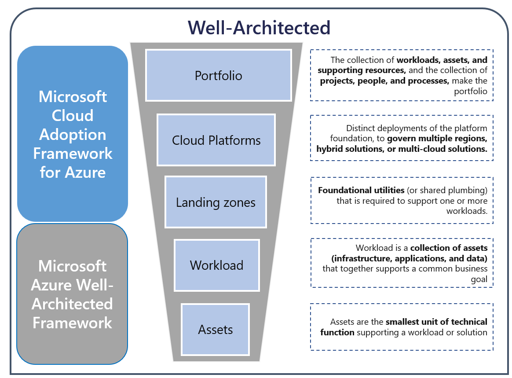

# Align Azure VMware Solution with the Cloud Adoption Framework 
A solid foundation should be established before a workload can land in the Azure VMware Solution. Aligning an AVS design with the Cloud Adoption Framework (CAF) provides a well-structured approach to adopting AVS with the broader Azure environment for 
successful cloud adoption. 

Key Benefits include

- **Accelerated Adoption** when deploying cloud services in a streamlined way 
- **Consistency** across the organization by applying operational standards across the entire cloud ecosystem
- **Risk Mitigation** by identifying risks early in the cloud adoption journey and implementing mitigation strategies
- **Best practices** to make the most of AVS features and capabilities
- **Adaptability and flexibility** enabling the AVS environment to accommodate future growth

## Difference between CAF and WAF
The difference between Cloud Adoption and Well-architected frameworks is the scope. CAF focuses on best practices and methodologies for adopting cloud services from the lens of the cloud footprint's entire portfolio including the business, people, governance, management, and security. 

Well-architected focuses on efficiently managing the workloads and their assets in a secure, high-performing, and resilient way. 

 

## What is an Azure Landing Zone 

Before a workload can land in AVS, a foundation must be established. While an AVS environment can be deployed independently of an Azure Landing Zone, there are many instances where AVS will either integrate into one existing landing zone or with a newly built one that supports workloads in  cloud. 

An Azure Landing Zone can significantly improve  standardized, consistent approaches to managing workloads, networking, security, and governance across the entire cloud platform. 

**IMPORTANT** - AVS has specific considerations and requirements, especially around integration with Azure services. Both the AVS Landing Zone Accelerator and the Well-architected Guidance for AVS aim to highlight the necessary customizations
while still incorporating CAF perspectives for a holistic approach to cloud readiness. 

## Platform Responsibilities 

The AVS platform team is responsible for ensuring the infrastructure is ready for application teams to build. Some common tasks include

- Requesting Capacity: A platform team must ensure the AVS SDDC activation has taken place, specifying the regions, nodes, and network settings.  From there, the platform team allocates compute, resource pools, vSan storage, and clustering.
- RPO/RTO: Make sure there is a strategy and infrastructure in place to meet SLAs
- Ensure secure access to on-prem, Azure, and the internet. This includes routing, firewall entries, and managing centralized network appliances
- Azure Integrations such as DNS, Backup, Monitoring and Log Analytics, Azure AD, and Key Vaults 

## Shared Responsibilities 
While an application and Platform Landing Zone team have distinct responsibilities, both often will work closely to ensure the availability and recoverability, coordinating to align for the overall success of the workloads running in AVS, 

### Backup and Disaster Recovery

### DNS 

### Key Management 

## Next Steps 
