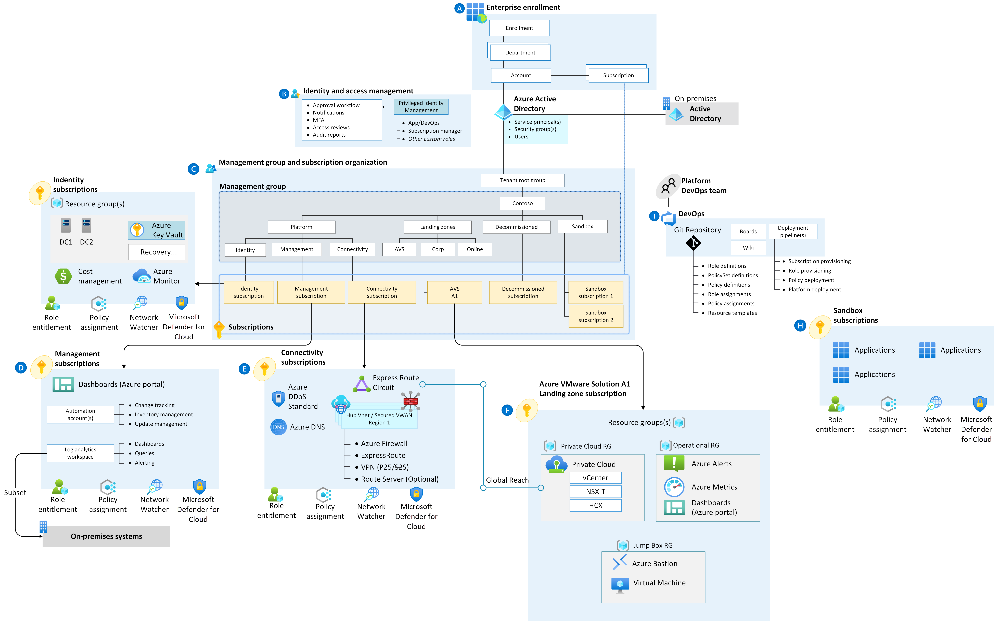

# Align Azure VMware Solution with the Cloud Adoption Framework 
A solid foundation should be established before a workload can land in the Azure VMware Solution. Aligning an AVS design with the Cloud Adoption Framework (CAF) provides a well-structured approach to adopting AVS with the broader Azure environment for 
successful cloud adoption. 

Key Benefits include:

- **Accelerated Adoption** when deploying cloud services in a streamlined way 
- **Consistency** across the organization by applying operational standards across the entire cloud ecosystem
- **Risk Mitigation** by identifying risks early in the cloud adoption journey and implementing mitigation strategies
- **Best practices** to make the most of AVS features and capabilities
- **Adaptability and flexibility** enabling the AVS environment to accommodate future growth

## Difference between CAF and WAF
The difference between Cloud Adoption and Well-architected frameworks is the scope. CAF focuses on best practices and methodologies for adopting cloud services from the lens of the cloud footprint's entire portfolio including the business, people, governance, management, and security. 

Well-architected focuses on efficiently managing the workloads and their assets in a secure, high-performing, and resilient way. 

 

## What is an Azure Landing Zone 

Before a workload can land in AVS, a foundation must be established. While an AVS environment can be deployed independently of an Azure Landing Zone, there are many instances where AVS will either integrate into one existing landing zone or with a newly built one that supports workloads in  the cloud. 

An Azure Landing Zone can significantly improve  standardized, consistent approaches to managing workloads, networking, security, and governance across the entire cloud platform. 

**IMPORTANT** - AVS has specific considerations and requirements, especially around integration with Azure services. Both the AVS Landing Zone Accelerator and the Well-architected Guidance for AVS aim to highlight the necessary customizations
while still incorporating CAF perspectives for a holistic approach to cloud readiness. 

 

## Platform Responsibilities 

The AVS platform team ensures the infrastructure is ready for application teams to build. Some common tasks include:

- **Requesting Capacity** ensuring the AVS SDDC activation has occurred, specifying the regions, nodes, and network settings.  From there, the platform team allocates compute, resource pools, vSan storage, and clustering.
- **Design to meet RPO/RTO** strategizing and building infrastructure to meet SLAs.
- **Secure and Optimize Connectivity** to on-prem, Azure, and the internet. This includes routing, firewall entries, and managing centralized network appliances.
- **Manage Azure Integrations** such as DNS, Backup, Monitoring, Log Analytics, Azure AD, and Key Vaults 

## Shared Responsibilities 
While an application and Platform Landing Zone team have distinct responsibilities, both often will work closely to ensure the availability and recoverability, coordinating to align for the overall success of the workloads running in AVS. 

### Backup and Disaster Recovery

Both application and platform teams have roles in backup and disaster recovery. The AVS platform team sets up infrastructure-level backups and replication for virtual machines and AVS components while the AVS application team is responsible for application-level backups and data recovery procedures. Depending on the organization, some operations will be shared responsibilities. Some examples below include:

#### Platform Backup and Disaster Recovery Responsibilities
- **Infrastructure Backups:** Implement backups for AVS components, virtual machines, and core infrastructure
- **Configuration VM Image backups:** - quickly recover infrastructure from formats such as VMDK's in the event of a failure
- **Disaster Recovery planning:** Define mechanisms for site failover, data replication, and maintaining RPO/RTO for the AVS infrastructure 

#### Application Backup and Disaster Recovery Responsibilities
- **Data backup:** application-specific data and databases to a storage location using an agent-based, VMware Compatible backup solution
- **Application Configurations:** App configs, settings, and libraries that the app needs operate
- **Data restore and Recovery:** Restoring application data from backup periodically, ensuring the application returns to a functional state in real-world scenarios

### DNS 

The DNS configuration in AVS involves mapping hostnames to IP addresses for establishing connectivity between virtual machines and services within  AVS and the broader network. DNS responsibilities may be divided by

#### Platform DNS Responsibilities
- Spinning up virtual machines as domain controllers
- Creating Private DNS zones
- Domain Name Management
- Reverse DNS Lookup configuration 

#### Application DNS Responsibilities
- Hostname configuration
- Application Time-To-Live (TTL) Management
- Internal DNS Resolution
- DNS monitoring to receive up-down alerts affecting the application

### Key Management 

There are distinct differences between the application and platform team's key and password management responsibilities to ensure the security and access control of the applications running in AVS.

#### **Platform Key and Password Management**
- **Infrastructure Key Management:** Management of encryption key and infrastructure level data such as encrypted disks and virtual machine templates
- **Infrastructure Credentials:** Manage AVS administrative credentials for AVS components like vCenter and ESXi hosts
- Platform Access Control: Define user roles and permissions in the AVS environment
- Setting up Key Vault: Create the instance, configure policies to protect the vault, manage infrastructure and platform secrets, and manage encryption/decryption operations

#### **Application Key and Password Management**
- Manage application-specific credentials and keys such as for accessing APIs, databases, and secrets
- Implement regular password rotation and credential expiry policies to prevent unauthorized access
- Ensure application credentials are stored securely and not hardcoded in the app code or config files
- Define access policies for key vaults specific to the application or services that require access to those secrets

## Next Steps 

These design principles are incorporated into our comprehensive guidance across specific design domains. Each design domain offers focused guidance, enabling you to quickly access the information you need for enhanced productivity within minimal time. Consider the headings as your navigational tool, guiding you toward the relevant direction for networking, core infrastructure, the application platform, monitoring, and operational procedures.

Let's first take a look at the infrastructure components.

> [!div class="nextstepaction"]
> [Infrastructure](./infrastructure.md)
