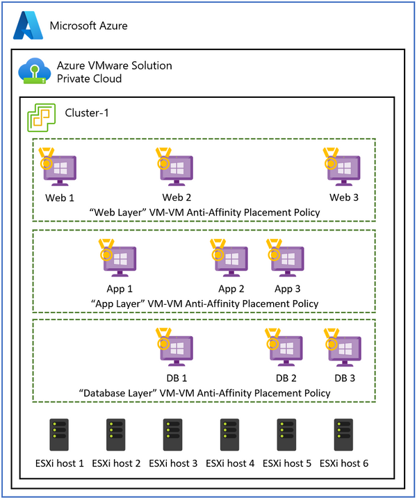
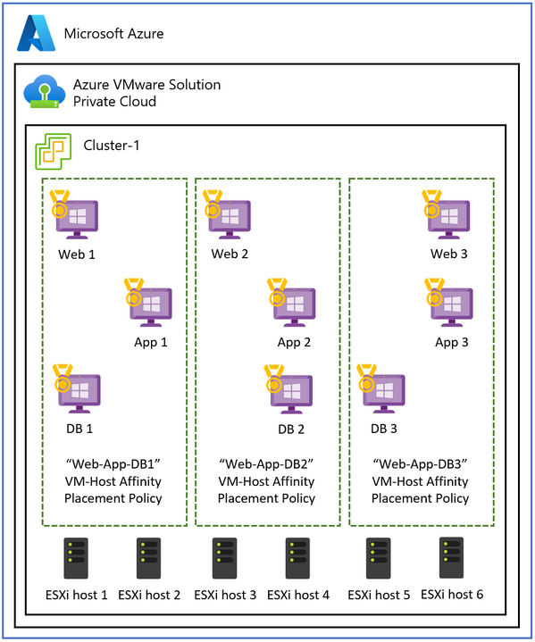
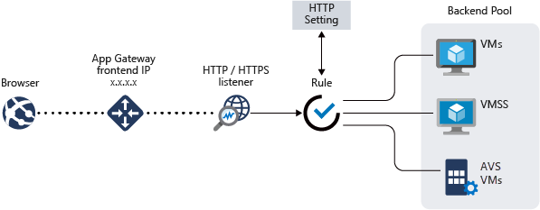
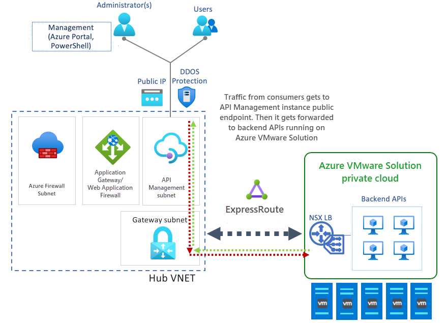
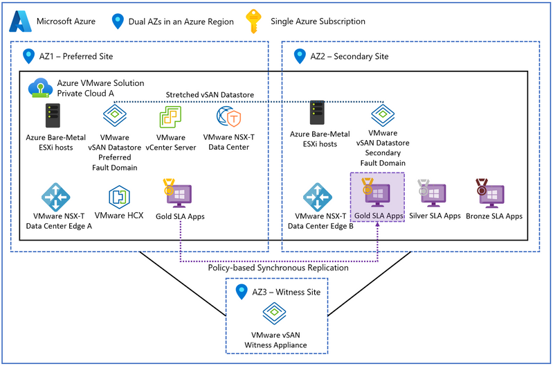

# Design Well-Architected Applications for Azure VMware Solution 

This section refers to specific tasks and responsibilities to deploy, configure and maintain applications hosted in the AVS environment. An application owner is an individual or team responsible for various aspects related to the deployment, configuration  monitoring, and maintenance of applications inside the AVS environment. 

Key objectives of a well-architected application include:
- **Designing for Scale** - Gracefully handle higher user demands and concurrent transactions without degradation or service interruption 
- **Performance** - Deliver fast, low latency response times and efficiently manage resource utilization 
- **Reliability and Resiliency** - Design redundant, fault-tolerant patterns to ensure the application remains responsive and recovers quickly from failures

This section's guide aims to provide developers, architects, and application owners with AVS-specific best practices to build robust, secure, scalable, and maintainable applications throughout their lifecycle. 

## Scalability and Efficient Resource Distribution 

This section covers the effective allocation and utilization of computing resources, including CPU, memory, storage, and network, across VMs and workloads within the AVS private cloud. It also explores the implementation of responsive scaling techniques, dynamically adapting resource provisioning to accommodate fluctuations in demand. The primary objective is to achieve optimal resource utilization, mitigating underutilization and overprovisioning that may result in inefficiencies and escalated expenses.

### Fault Domains 

Fault Domains in AVS represent logical groupings of resources within a stretched cluster that share a common physical fault domain. These fault domains help define different failure scenarios, and organizing resources into fault domains ensures that critical components of the application are spread across multiple failure domains.

By placing VMs and other resources into separate Fault Domains, the application team can ensure that the application remains available even during a data center or infrastructure failure. For example, by separating VMs into different Fault Domains across geographically distributed data centers, the application can remain operational if one data center experiences a complete failure.

Application teams should consider defining VM-VM affinity and anti-affinity rules based on the Fault Domains. VM-VM affinity rules can place critical VMs in the same Fault Domain to ensure they are not spread across multiple data centers. On the other hand, anti-affinity rules can prevent related VMs from being placed together within the same Fault Domain, ensuring redundancy.

### Colocate Application Interdependencies with VM-VM Anti-Affinity 

The use case for VM-VM anti-affinity policies (e.g., in a three-tier app) in AVS revolves around enhancing the application tiers' high availability, fault tolerance, and resiliency by ensuring they are spread across different hosts within the AVS private cloud.

You create a distributed, fault-tolerant architecture using VM-VM anti-affinity policies across three tiers. This setup improves the availability of the entire application and helps ensure that a failure of a single host does not disrupt the entire tier or the entire application. 

For example, in the front-end web tier that serves user requests, you can apply VM-VM anti-affinity policies to spread the web servers across different physical hosts to improve high availability and fault tolerance. The same goes for protecting the business layer at the application servers and enhancing the data resiliency at the database layer. 

As an illustration, VM-VM anti-affinity policies can be implemented within the user-facing front-end web tier to distribute the web servers across diverse physical hosts, enhancing high availability and fault tolerance. Similarly, anti-affinity measures can be applied to safeguard the application servers in the business layer and bolster the data resiliency within the database layer.

 

### Recommendations
- Map interdependencies, communication, and usage patterns of VMs to ensure that proximity is a requirement
- Identify if VM-VM affinity helps meet performance metrics or SLAs 
- Design for high availability by implementing VM anti-affinity policies to protect against host failures and distribute the application across multiple hosts
- Avoid overprovisioning by distributing the workload across smaller VMs rather than a few large VMs. 
- Regularly monitor, review, and fine-tune affinity policies to identify potential resource contention and adapt over time as needed

### Assessment Questions

- Due application tiers require proximity to ensure data sharing, and is it designed to distribute across a set of hosts?

### Performance Isolation with VM-Host Affinity 

Some workloads running virtual machines in different application tiers may perform better when co-located. This use case often occurs when applications require
- **Performance Isolation and System Specifications** for resource-intensive, high-performance compute workloads
or mapping a VM to a specific set of cores to maintain license compliance (e.g., Windows and SQL Server Licensing)
- **Regulatory Compliance and Data Integrity** to ensure  VMs belonging to specific security domains or data classifications are confined to specific hosts or a subset of hosts within the cluster
- **Simplified Network Configuration** by having VMs on the same host, the network configuration between tiers is simplified, as they share the same network connectivity and do not require additional network hops.

If it is essential to maintain the co-location of application tiers, you may opt for **VM-Host** affinity policies to ensure their deployment on the same host and within the same availability zone.

 

**Note:** While the platform team is responsible for setting up VM placement, host affinity rules, and resource pooling, the application team should understand the application's performance requirements to make sure the application needs are being met. 

Application teams must conduct a comprehensive evaluation and meticulous planning regarding VM placement, as it can present potential challenges like resource imbalances and uneven workload distribution, leading to adverse effects on performance and resource optimization. Also, placing all the workloads in one availability zone may create a single point of failure in a disaster. Consider replicating this configuration across multiple availability zones to enhance data center resilience in the event of a loss.

### Recommendations 

- Carefully plan the use of VM-host affinity and consider alternative solutions when possible such as load balancing, resource pools in vSphere, distributed databases, containerization, and availability zones
- Regularly monitor resource utilization and performance to identify any imbalances or issues
- Opt for a VM placement strategy that is both balanced and flexible to maximize resource utilization while maintaining high availability and ensuring compliance with licensing requirements
- Test and validate your VM-host affinity configurations to ensure that they align with your application's specific requirements and that they do not negatively impact overall performance and resilience

### Assessment Questions
Do the application tiers or components require co-location hosts and segments or performance isolation from other workloads? 

### Distribute traffic with an Application or Network Load Balancer 

In addition to placement policies, Load balancing is a critical component of modern applications for ensuring efficient resource distribution, increased application availability, and optimal application performance while maintaining flexibility for workload scaling and management.

After deploying applications on virtual machines, consider using a load balancing tool such as an Azure Application Gateway to create backend pools. Azure Application Gateway is a managed web traffic load balancer and application delivery service that can manage and optimize incoming HTTP and HTTPS 
traffic to web applications. Application Gateway acts as an entry point for web traffic, enabling various functionalities such as SSL termination, URL-based routing, 
session affinity, and web application firewall (WAF) capabilities.

 

Once the backends are up and healthy in the backend pool, create listeners to specify the ports and routing rules for incoming requests. From there, you can create health probes to monitor the health of VMs and remove unhealthy backends from rotation. 

#### SSL Termination and Certificate Management

 Enforcement of SSL/TLS encryption for all communication between the application and users' browsers to protect session data from eavesdropping and man-in-the-middle attacks. For an application that requires SSL/TLS termination, configure the necessary SSL certificate in the Application Gateway to offload the SSL processing from the backend VMs.
 Once generated, SSL certificates should be placed and accessed from a secure place such as Azure Key Vault. Leverage Powershell, Azure CLI, or tools such as Azure automation for tasks such as updating and renewing certificates. 

#### API Management 

API management allows for the secure publishing of Internal and Externally deployed API endpoints. For example, a backend API living in AVS private cloud sits behind a load balancer or 
application gateway. Spinning up an API Management instance can manage the methods and behaviors of your API, such as applying security policies to enforce authentication and authorization. 
From there, API management can route API requests to your backend services through the application gateway.

#### Recommendations 

- Distribute traffic to your application endpoints with Application Gateway with AVS backends to enhance the security and performance of the AVS applications 
- Make that there is connectivity between the application gateway/load balancer subnet and backend segments where AVS is hosted
- Configure health proves to monitor the health of the backend instances
- Offload SSL/TLS termination at the Application Gateway to reduce processing overhead on the backend VMs
- Securely store SSL key vaults
- Streamline processes by automating tasks such as certificate updates and renewals. 

#### Assessment Questions 
- Do you have internal and external interfaces configured for workloads?
  
## Optimize applications for stretched clusters to strengthen BCDR readiness

Stretched clusters provide VMware Clusters with high availability and disaster recovery capabilities across multiple geographically distributed data centers enabling active-active architectures by having vSAN span two data centers with the third AZ mapping to a vSAN witness to serve as a quorum in the event of a split-brain scenario. 

 

Distributing the application across multiple AZs and regions ensures continuous availability even during a data center failure. Deploy the application tiers and data tiers across both data centers and ensure synchronous replication is occurring. 

### Fault Tolerance and Failure to Tolerate (FTT) Policies

The application's total usable capacity depends on several variables, such as RAID, Failures to Tolerate (FTT), and Failure To Tolerate (FTT) policies that control the number of failures a storage system can tolerate. Application teams need to determine the level of redundancy needed for the application. It is also important to note that higher FTT values increase storage overhead while improving data resiliency. 

#### Recommendations
- Deploy application across shared storage so that the VM data remains consistent across the stretched cluster and enable synchronous replication
- Enable Fault Domains to define how stretched clusters should respond in a failure scenario  
- Implement Automatic Failover and Failback if support to minimize manual intervention during failover and recovery events?

### Data Synchronization and Storage Policies:
Data synchronization methods are important for applications that rely on stateful data and databases to ensure consistency and availability during a disaster. This will provide high availability and fault tolerance for critical VMs running the application. 

By defining this storage policy, the application owner ensures that critical VMs running the application receive the required level of data redundancy and performance, and they are positioned to leverage the high availability capabilities of the stretched cluster in AVS. 

Example policies include:
- vSAN configuration: use VMware vSAN with a stretched cluster across AZ's
- Number of Failures to tolerate: Set the policy to tolerate at least one or more failures (e.g., "RAID-1")
- Performance: Performance-related settings for ensuring optimal IOPS and latency for critical VM's. 
- Affinity Rules: The application owner may set up affinity rules within the storage policy to ensure VMs or groups of VMs are placed in separate hosts or fault domains within the stretched cluster to maximize availability in case of a data center failure. 
- Backup and Replication: The storage policy might also specify integration with backup and replication solutions to ensure that VM data is regularly backed up and replicated to a secondary location for additional data protection.

#### Recommendation: 
 
- Define data storage policies in vSAN to specify the redundancy and performance required for different virtual machine disks.
- Configure applications to run in an active-active or active-passive configuration so critical application components can fail in the event of a data center failure. 
- Understand the applications' network requirements, as applications running across availability zones may incur higher latency than intra-AZ traffic. The application should be designed to tolerate this latency.
- Performance test placement policies to evaluate the impact on the application 

#### Assessment Question 
Are vSAN Storage RAID and FTT Policies in place? 
