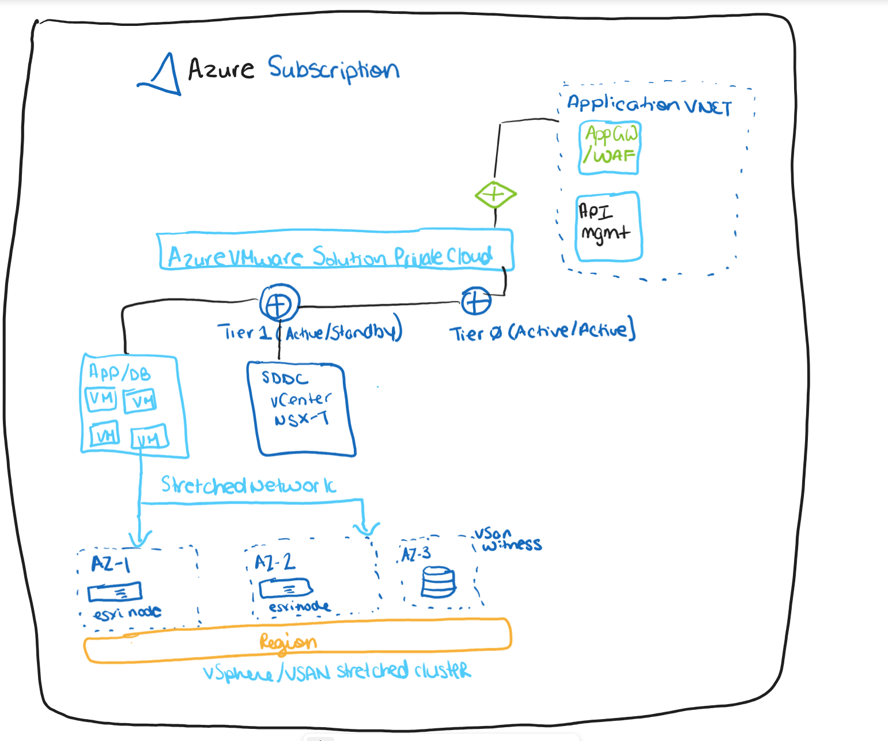
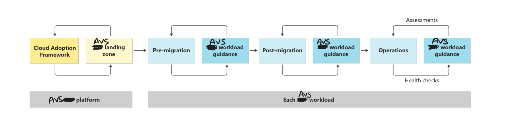

# Get Started with Well-Architected for the Azure VMware Solution workload

VMware is a leading virtualization and cloud computing software and services provider, and the Azure VMware solution allows the VMware hypervisor to run on Azure Dedicated Baremetal, which integrates with Azure native resources such as VMs, storage disks, and network resources. It can run OSs not natively supported on Azure, such as AIX, Unix, and Solaris. The Azure VMware Solution SDDC lets you use VMware proprietary management software like vSphere, HCX, and NSX-T. 

This guidance is for users leveraging, developing, and maintaining well-architected application workloads in the Azure VMware Solution SDDC. 

While technical implementation is key to building applications in AVS, it's also important for the business to understand the benefits of a well-architected application to allocate resources
effectively and understand the processes for maintaining business continuity. A well-architected application will also help end-users to have a consistent, reliable experience. 

The guidance is designed for one Azure VMware Solution workload at a time. You should use this guide whenever you want to optimize a specific application in AVS (e.g., a 3-tier app, virtual desktops ) for Azure or in Azure. 

 

Work through the guide as often as needed to derive the expected benefits. This guidance should be paired with Well-Architected Review assessments and health checks in operations. We address these tools in our guidance.

Before using this content, you should have an Azure VMware Solution platform landing zone in Azure. The platform landing zone provides shared services to one or more of your Azure VMware Solution workloads. If you don’t have a platform landing zone, use the Azure VMware Solution cloud adoption framework and deploy the Azure VMware Solution landing zone accelerator. The landing zone accelerator establishes the required foundation for your SAP workload.
 

For more information, see:

- [AVS landing zone accelerator](https://learn.microsoft.com/en-us/azure/cloud-adoption-framework/scenarios/azure-vmware/enterprise-scale-landing-zone) 
- [AVS cloud adoption framework](https://learn.microsoft.com/en-us/azure/cloud-adoption-framework/scenarios/azure-vmware/ready)

We invite you to explore Azure VMware workload design best practices and return to this content regularly throughout the lifecycle of your AVS workload. The content highlights critical focus areas and refers you to other documentation for deeper technical insight.

For more information, see:

- [AVS workload in Azure](https://learn.microsoft.com/en-us/azure/azure-vmware/introduction)
- [Horizon workload architectures](https://learn.microsoft.com/en-us/azure/azure-vmware/azure-vmware-solution-horizon)
- [Azure VMware Solution Architecture Designs](https://vmc.techzone.vmware.com/avs-architecture)

Since this tool leverages both VMware and Microsoft propriety services, the Well-Architected guidance has AVS-specific guidance on how to scale, maintain, and secure applications 
that is both performant and cost-effective. 

This will allow for application workloads that avoid unnecessary complexities, avoid unforeseen costs. 

The Well-architected pillars also aim to involve modularity, separation of roles, and a way to improve operational productivity. 

